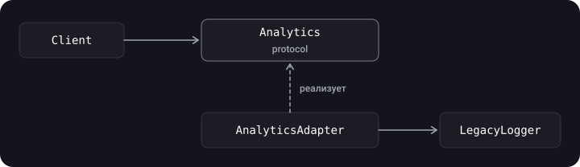

> **Что узнаешь**
>
> - как устроены пять структурных паттернов: Adapter, Facade, Decorator, Flyweight, Proxy;
> - чем Decorator отличается от Proxy (и от `extension`);
> - как обернуть сторонний код, спрятать сложную подсистему, добавить логирование, кэш и экономию памяти без переписывания существующих типов.

> **Нужно знать заранее**
>
> Главы [01](../paradigms/)–[04](../creational-patterns/): протоколы, OCP/DIP, композиция, порождающие паттерны. Базовый `async/await`.

## Аналогия: розетки и переходники

В путешествии у тебя европейская вилка, а розетка американская — берёшь **переходник** (Adapter). На стойке ресепшена тебе не нужно знать, как устроены уборка, кухня и склад: ты говоришь с администратором (**Facade**). Добавил к кофе молоко, потом сироп — каждое дополнение «оборачивает» напиток (**Decorator**). Банковская карта — это представитель твоего счёта (**Proxy**). А тысяча одинаковых иконок в игре хранится в памяти один раз (**Flyweight**).

Все эти паттерны про *композицию*: как собрать объекты в структуру, не меняя их код.

## Шаг 1. Adapter (адаптер)

**Идея.** Позволяет объектам с несовместимыми интерфейсами работать вместе. Адаптер оборачивает объект и «переводит» вызовы.



Пример: приложение работает с протоколом `Analytics`, а старая библиотека предлагает свой интерфейс.

```swift
// Что нужно нашему приложению
protocol Analytics {
    func track(event: String, parameters: [String: String])
}

// Чужой код, который мы менять не можем
final class LegacyLogger {
    func write(line: String) { print(line) }
}

// Адаптер
final class LegacyLoggerAdapter: Analytics {
    private let logger: LegacyLogger
    init(logger: LegacyLogger) { self.logger = logger }

    func track(event: String, parameters: [String: String]) {
        let params = parameters.map { "\($0.key)=\($0.value)" }.sorted().joined(separator: ",")
        logger.write(line: "[\(event)] \(params)")
    }
}

let analytics: Analytics = LegacyLoggerAdapter(logger: LegacyLogger())
analytics.track(event: "open_screen", parameters: ["name": "Home"])
```

| Плюсы | Минусы |
| --- | --- |
| Скрывает от клиента детали преобразования интерфейсов; сторонняя библиотека подключается в одном месте (удобно менять). | Появляются дополнительные типы. |

> Адаптер — основной способ применять DIP к сторонним библиотекам: приложение зависит от *твоего* протокола, а библиотека прячется за адаптером.

> **Адаптер через `extension`**. Если тип уже есть и нужно только привести его к нужному протоколу, адаптером может служить само расширение: `extension ViewController: GreetingProtocol { func sayHello() { /* … */ } }`. Плюс — не нужен отдельный класс-обёртка; минус — смотритель тип по-прежнему непосредственно знает о протоколе, и это не подходит для чужого кода с другими именами методов, где нужен полноценный переводчик, как `LegacyLoggerAdapter` выше.

## Шаг 2. Facade (фасад)

**Идея.** Единый простой интерфейс к сложной подсистеме. Клиент не знает о внутренних компонентах и порядке их вызова.

```swift
struct Inventory { func reserve(_ item: String) -> Bool { true } }
struct Payment   { func charge(_ amount: Double) -> Bool { true } }
struct Shipping  { func schedule(_ item: String) { print("Доставка: \(item)") } }

final class OrderFacade {
    private let inventory = Inventory()
    private let payment = Payment()
    private let shipping = Shipping()

    func placeOrder(item: String, price: Double) -> Bool {
        guard inventory.reserve(item) else { return false }
        guard payment.charge(price) else { return false }
        shipping.schedule(item)
        return true
    }
}

let ok = OrderFacade().placeOrder(item: "Книга", price: 500)
```

Клиенту достаточно `placeOrder`, а три подсистемы и порядок их вызова скрыты. Фасад не запрещает обратиться к подсистемам напрямую — он лишь упрощает типовой сценарий.

> **Не путай Adapter и Facade.** Адаптер *приводит один интерфейс к другому*, чтобы код мог работать с чужим типом. Фасад *упрощает* интерфейс к целому набору типов и обычно вводит новый.

> В iOS фасадами по сути являются `URLSession` (за ним — сокеты, TLS, кэш), `Core Data`-стек `NSPersistentContainer`, `AVPlayer`. Твои сервисные слои (`UserRepository`, `OrderService`) — тоже фасады.

> **Фасад для настройки сервисов**. Типичный пример — единая точка, где клиент получает готовые сервисы, не зная как они собираются: `protocol ServicesFacade { func configureAuthService() -> AuthService; func configureUserInfoService() -> UserInfoService }`. Клиент вызывает один метод, а цепочка зависимостей (сеть, токены, хранилище) скрыта внутри фасада. Похожее есть и в DI-контейнерах (глава [07](../di-ioc/)).

## Шаг 3. Decorator (декоратор)

**Идея.** Динамически добавляет объекту новые обязанности. Гибкая альтернатива наследованию для расширения функциональности.

**Проблемы наследования, которые решает декоратор:**

- оно **статично** — поведение существующего объекта не поменять, приходится создавать объект другого подкласса;
- нельзя унаследовать поведение нескольких классов — приходится плодить подклассы-комбинации (`LoggingRetryingCachingClient`…).

Декоратор основан на композиции: объект содержит ссылку на другой объект **того же протокола**, делегирует ему работу и добавляет своё поведение до или после.


```swift
import Foundation

protocol Networking {
    func load(_ url: URL) async throws -> Data
}

struct URLSessionNetworking: Networking {
    func load(_ url: URL) async throws -> Data {
        try await URLSession.shared.data(from: url).0
    }
}

struct LoggingNetworking: Networking {
    let base: any Networking

    func load(_ url: URL) async throws -> Data {
        print("→ \(url)")
        let data = try await base.load(url)
        print("← \(data.count) байт")
        return data
    }
}

struct RetryingNetworking: Networking {
    let base: any Networking
    let attempts: Int

    func load(_ url: URL) async throws -> Data {
        var lastError: Error = URLError(.unknown)
        for _ in 0..<max(attempts, 1) {
            do { return try await base.load(url) }
            catch { lastError = error }
        }
        throw lastError
    }
}

// Собираем нужную комбинацию, не создавая новых подклассов
let network: any Networking = LoggingNetworking(
    base: RetryingNetworking(base: URLSessionNetworking(), attempts: 3)
)
```

Каждый декоратор можно включать и выключать независимо, а порядок оборачивания задаёт поведение (логирование снаружи ретраев покажет одну запись, внутри — по одной на каждую попытку).

> **Два кейса**.
>
> *Интерфейс:* в UIKit-ките есть primary-кнопка, но на одних экранах к ней нужен красный индикатор, на других — текст ошибки, а на третьих — и то, и другое. Вместо четырёх подклассов кнопки делают два независимых декоратора («индикатор», «ошибка») и комбинируют нужные (в SwiftUI это цепочка модификаторов).
>
> *Сетевой слой:* сначала нужно логирование запросов, потом — логирование в Firebase, потом — статистика по времени; каждая новая требование — новая обёртка вокруг `Networking`, без правки самого сетевого класса (это пример выше).

> **Кейс про кэш**.
>
> Команда делала онлайн-приложение, а заказчик попросил кэшировать данные: если кэш есть — вернуть его, иначе запросить с сервера и записать в кэш. В исходниках это решено именно **декоратором**, а не наследованием: `CachedRepository` оборачивает `Repository`, а затем поверх него добавляют ещё один слой — сброс кэша через 30 секунд. Ниже — исправленная версия. Ту же идею можно назвать и кэширующим Proxy (см. Шаг 5): структура одинакова, разница в намерении — здесь мы *добавляем обязанность*, а не контролируем доступ.

```swift
import Foundation

protocol Repository {
    func fetchData(completion: @escaping ([String]) -> Void)
}

// Слой 1: кэш
final class CachedRepository: Repository {
    private let repository: Repository
    private let cache = NSCache<NSString, NSArray>()
    private let key: NSString = "repository_data"

    init(repository: Repository) { self.repository = repository }

    func fetchData(completion: @escaping ([String]) -> Void) {
        if let cached = cache.object(forKey: key) as? [String] {
            completion(cached)
            return
        }
        repository.fetchData { [weak self] data in
            self?.cache.setObject(data as NSArray, forKey: self?.key ?? "repository_data")
            completion(data)
        }
    }
}

// Слой 2: устаревание кэша (TTL) — тоже декоратор над Repository
final class ExpiringRepository: Repository {
    private let repository: Repository
    private let ttl: TimeInterval
    private var lastFetch: Date?
    private var cached: [String]?

    init(repository: Repository, ttl: TimeInterval = 30) {
        self.repository = repository
        self.ttl = ttl
    }

    func fetchData(completion: @escaping ([String]) -> Void) {
        if let cached, let lastFetch, Date().timeIntervalSince(lastFetch) < ttl {
            completion(cached)
            return
        }
        repository.fetchData { [weak self] data in
            self?.cached = data
            self?.lastFetch = Date()
            completion(data)
        }
    }
}
```

> В Foundation/SwiftUI под словом «декоратор» часто имеют в виду модификаторы `View` (`.padding()`, `.background()`): каждый оборачивает вью и возвращает новую — это тот же принцип цепочки обёрток. Не путай с *property wrappers* и *Python-декораторами* — это другие вещи.

## Шаг 4. Flyweight (легковес)

**Идея.** Экономит память, разделяя **общее неизменяемое состояние** между множеством объектов. Вместо тысячи копий одинаковых данных — один общий объект, а индивидуальное (изменяемое) состояние передаётся снаружи.

Опознать легковес можно по создающему методу, который **возвращает закэшированные объекты** вместо создания новых. Если проблемы с памятью нет, то и легковес, скорее всего, не нужен.

Пример: в тексте на 10 000 символов у большинства одинаковые шрифт, размер и цвет.

```swift
// Неизменяемое общее (внутреннее) состояние
struct TextStyle: Hashable {
    let font: String
    let size: Int
    let color: String
}

final class TextAttributes {
    let style: TextStyle
    init(style: TextStyle) { self.style = style }

    // Внешнее состояние (сам текст) приходит параметром
    func display(_ text: String) {
        print("'\(text)' — \(style.font), \(style.size), \(style.color)")
    }
}

final class TextAttributesFactory {
    private var cache: [TextStyle: TextAttributes] = [:]

    func attributes(font: String, size: Int, color: String) -> TextAttributes {
        let style = TextStyle(font: font, size: size, color: color)
        if let cached = cache[style] { return cached }   // переиспользуем
        let created = TextAttributes(style: style)
        cache[style] = created
        return created
    }
}

let factory = TextAttributesFactory()
let a = factory.attributes(font: "Arial", size: 12, color: "Black")
let b = factory.attributes(font: "Arial", size: 12, color: "Black")
print(a === b)   // true — один и тот же объект
a.display("Привет")
b.display("Flyweight")
```

> В iOS этот принцип ты видишь в кэше `UIImage(named:)`, в `NSCache`, в переиспользовании шрифтов (`UIFont`) и в *интернировании* строк. В Swift неизменяемые value types и так копируются лениво (copy-on-write), поэтому Flyweight чаще нужен для *классов и тяжёлых ресурсов*.

## Шаг 5. Proxy (заместитель)

**Идея.** Объект-прослойка между клиентом и реальным объектом. Реализует **тот же интерфейс**, поэтому клиент не замечает подмены; получает вызов, делает своё (контроль доступа, кэш, лог, ленивая инициализация) и передаёт вызов дальше.


**Пример 1. Замер времени выполнения.**

```swift
import Foundation

protocol ExampleProtocol {
    func performAction()
}

struct ExampleService: ExampleProtocol {
    func performAction() { /* тяжёлая работа */ }
}

struct ProfilingExampleService: ExampleProtocol {
    private let service: ExampleProtocol

    init(service: ExampleProtocol) { self.service = service }

    func performAction() {
        let start = Date()
        service.performAction()
        print("Time elapsed: \(Date().timeIntervalSince(start))")
    }
}

let service: ExampleProtocol = ExampleService()
let profiled: ExampleProtocol = ProfilingExampleService(service: service)
profiled.performAction()
```

**Пример 2. Кэширующий заместитель.** Вместо кэша «задач скачивания» из исходной заметки покажем кэш результатов — так виден смысл паттерна:

```swift
import Foundation

protocol ImageLoading {
    func data(for url: URL) async throws -> Data
}

struct RemoteImageLoader: ImageLoading {
    func data(for url: URL) async throws -> Data {
        try await URLSession.shared.data(from: url).0
    }
}

actor CachingImageLoader: ImageLoading {
    private let real: any ImageLoading
    private var cache: [URL: Data] = [:]

    init(real: any ImageLoading) { self.real = real }

    func data(for url: URL) async throws -> Data {
        if let cached = cache[url] { return cached }   // не ходим в сеть повторно
        let loaded = try await real.data(for: url)
        cache[url] = loaded
        return loaded
    }
}

let loader: any ImageLoading = CachingImageLoader(real: RemoteImageLoader())
```

`actor` защищает словарь от гонок; на `await` возможна *реентерабельность* — два одновременных запроса одного URL оба уйдут в сеть. Чтобы этого избежать, в кэше хранят `Task`, а не готовые данные.

### Виды заместителей

| Вид | Что делает | Пример |
| --- | --- | --- |
| Виртуальный | Откладывает создание тяжёлого объекта до первого обращения | Ленивая загрузка картинки, `lazy var` |
| Защищающий | Проверяет права доступа | Обёртка над сервисом, требующая авторизации |
| Кэширующий | Запоминает результаты | Пример выше |
| Удалённый | Представляет объект из другого процесса или с сервера | Клиент XPC/API как локальный объект |

### Decorator против Proxy

Структура у них почти одинакова: обёртка с тем же протоколом. Различаются **намерением**:

|  | Decorator | Proxy |
| --- | --- | --- |
| Цель | Добавить обязанности | Контролировать доступ к объекту |
| Кто создаёт вложенный объект | Клиент передаёт его снаружи | Часто сам заместитель (управляет жизненным циклом) |
| Комбинируется | Цепочкой из многих | Обычно один |

> **Задачи-кейсы**.
>
> в UIKit есть primary-кнопка, а на части экранов к ней добавляют красный индикатор, на других — текст ошибки, а где-то и то и другое; вместо четырёх подклассов кнопку оборачивают в декораторы «индикатор» и «ошибка», которые комбинируются.
>
> есть неизменяемый сетевой слой, к которому по очереди просят «прикрутить» логирование, затем логирование в Firebase, затем отправку статистики времени запросов — каждое пожелание становится отдельным декоратором над тем же протоколом, а сам сетевой слой не трогают (спойлер источника: оба кейса решаются одним паттерном, Decorator).
>
> схема «есть кэш и он актуален? да → вернуть кэш, нет → запросить с сервера и записать в кэш» — это заместитель с тем же интерфейсом, что и репозиторий (Proxy/Decorator), см. разбор выше.

## Типичные ошибки

- **Адаптер, который тащит за собой типы чужой библиотеки** в сигнатуры твоего протокола — тогда библиотека всё равно просачивается в код.
- **«Божественный» Facade**, в который сложили всю логику приложения.
- **Декоратор, меняющий контракт** базового протокола — нарушает LSP.
- **Изменяемое состояние во Flyweight** — общий объект меняется у всех.
- **Прокси, который изменяет семантику** (например, кэш возвращает устаревшие данные без ведома клиента).
- **`static` кэш без синхронизации** — гонки потоков.

## Шпаргалка

- **Adapter** — переходник между несовместимыми интерфейсами.
- **Facade** — один простой вход в сложную подсистему.
- **Decorator** — добавить поведение обёрткой, комбинируя цепочки.
- **Flyweight** — общее неизменяемое состояние в одном экземпляре.
- **Proxy** — заместитель, контролирующий доступ к реальному объекту.

## Вопросы для самопроверки

<details>
<summary>1. Чем Adapter отличается от Facade?</summary>

Adapter приводит один интерфейс к другому, Facade упрощает доступ к набору классов, вводя новый интерфейс.

</details>

<details>
<summary>2. Почему Decorator лучше наследования для комбинирования поведений?</summary>

Комбинацию можно собрать в рантайме из обёрток, не создавая подкласс на каждое сочетание.

</details>

<details>
<summary>3. Чем extension отличается от Decorator?</summary>

`extension` статически добавляет методы типу (без хранимых свойств и замены поведения), Decorator оборачивает конкретный объект и меняет поведение в рантайме.

</details>

<details>
<summary>4. Почему разделяемый объект Flyweight должен быть неизменяемым?</summary>

Он используется многими клиентами; изменение через одну ссылку повлияло бы на все.

</details>

<details>
<summary>5. Чем Proxy отличается от Decorator?</summary>

Целью: Proxy контролирует доступ (ленивость, права, кэш), Decorator добавляет обязанности.

</details>

## Источники

- [Extensions — The Swift Programming Language](https://docs.swift.org/swift-book/documentation/the-swift-programming-language/extensions/)
- [Concurrency (actors) — The Swift Programming Language](https://docs.swift.org/swift-book/documentation/the-swift-programming-language/concurrency/)
- [Паттерны проектирования — Refactoring.Guru](https://refactoring.guru/ru/design-patterns)
