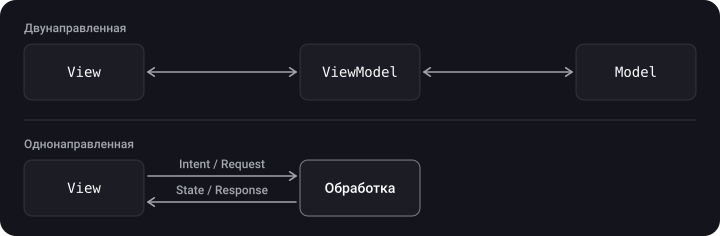
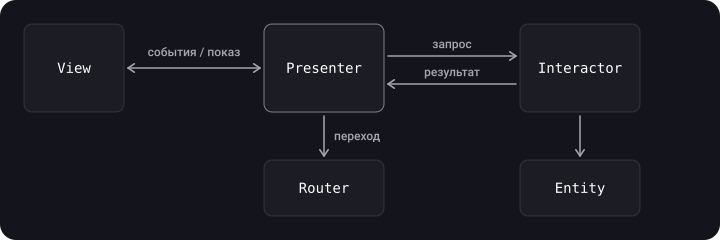
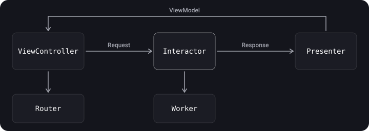
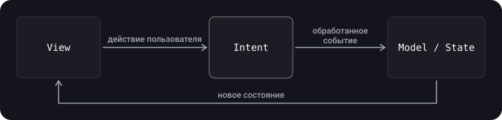

> **Что узнаешь**
>
> - как устроены VIPER, Clean Swift (VIP) и MVI и чем однонаправленные архитектуры отличаются от двунаправленных;
> - какие роли у Interactor, Presenter, Router, Entity, Worker;
> - как собрать модуль MVI в SwiftUI на современном стеке;
> - когда какую архитектуру выбирать: сводная таблица.

> **Нужно знать заранее**
>
> Глава [08](../mvc-mvp-mvvm/) (MVC/MVP/MVVM), глава [07](../di-ioc/) (DI), протоколы и `weak`.

## Аналогия: конвейер против «все со всеми»

В MVC/MVVM участники общаются в обе стороны, как сотрудники в open space: кто угодно может зайти к кому угодно. В **VIPER/Clean Swift** и **MVI** — конвейер: заказ идёт по цепочке в одном направлении, и на каждом участке ясно, за что отвечает работник. Конвейер длиннее, зато в нём проще найти, где «застряла» деталь.

## Шаг 1. Двунаправленные и однонаправленные архитектуры

- **Двунаправленные** (MVC, MVP, MVVM, MVVM+Coordinator): слои обмениваются данными и вверх, и вниз.
- **Однонаправленные** (VIP из Clean Swift, MVI, Redux/TCA): данные движутся по кругу в одну сторону: событие → обработка → состояние → отображение.



Оговорка: даже VIP и VIPER не чисто однонаправленные — Router и рабочие модули связываются с циклом в обе стороны.

## Шаг 2. VIPER

VIPER — расшифровывается как **V**iew, **I**nteractor, **P**resenter, **E**ntity, **R**outing (иногда *Router*). Это попытка применить SRP «на максимум»: у каждой роли одна ответственность, поэтому компонентов много.

| Компонент | Ответственность |
| --- | --- |
| **View** | Показывает то, что скажет Presenter; передаёт ему ввод пользователя |
| **Interactor** | Сценарий использования (бизнес-логика): получает данные, применяет правила |
| **Presenter** | Логика отображения: готовит данные для View, реагирует на ввод |
| **Entity** | Простые модели предметной области |
| **Router** | Навигация между экранами и сборка модулей |



**Чем VIPER отличается от MV(X)** (дополнено, из слайдов): логика из Model (работа с данными) переезжает в **Interactor**, а сами Entity становятся «глупыми» структурами данных; обязанности по представлению UI из Controller/Presenter/ViewModel переходят в **Presenter**, но без возможности менять данные; навигация вынесена в **Router**.

Модуль на примере списка пользователей:

```swift
import UIKit

// Entity
struct User { let id: Int; let name: String }

// Контракты
protocol UserListViewProtocol: AnyObject {
    func show(users: [String])
    func showError(_ message: String)
}
protocol UserListPresenterProtocol: AnyObject {
    func viewDidLoad()
    func didSelectUser(at index: Int)
}
protocol UserListInteractorInput: AnyObject { func loadUsers() }
protocol UserListInteractorOutput: AnyObject {
    func didLoad(_ users: [User])
    func didFail(_ error: Error)
}
protocol UserListRouterProtocol: AnyObject { func openDetails(for user: User) }

// Interactor — бизнес-логика
final class UserListInteractor: UserListInteractorInput {
    weak var output: UserListInteractorOutput?

    func loadUsers() {
        output?.didLoad([User(id: 1, name: "Аня"), User(id: 2, name: "Борис")])
    }
}

// Presenter — логика отображения
final class UserListPresenter: UserListPresenterProtocol, UserListInteractorOutput {
    private weak var view: UserListViewProtocol?
    private let interactor: UserListInteractorInput
    private let router: UserListRouterProtocol
    private var users: [User] = []

    init(view: UserListViewProtocol,
         interactor: UserListInteractorInput,
         router: UserListRouterProtocol) {
        self.view = view
        self.interactor = interactor
        self.router = router
    }

    func viewDidLoad() { interactor.loadUsers() }
    func didSelectUser(at index: Int) { router.openDetails(for: users[index]) }

    func didLoad(_ users: [User]) {
        self.users = users
        view?.show(users: users.map(\.name))
    }
    func didFail(_ error: Error) { view?.showError("Не удалось загрузить") }
}

// Router — навигация
final class UserListRouter: UserListRouterProtocol {
    weak var viewController: UIViewController?
    func openDetails(for user: User) { /* push экрана деталей */ }
}

// View
final class UserListViewController: UIViewController, UserListViewProtocol {
    var presenter: UserListPresenterProtocol!

    override func viewDidLoad() {
        super.viewDidLoad()
        presenter.viewDidLoad()
    }
    func show(users: [String]) { /* обновить таблицу */ }
    func showError(_ message: String) { /* показать alert */ }
}

// Сборка модуля
enum UserListBuilder {
    static func build() -> UIViewController {
        let view = UserListViewController()
        let interactor = UserListInteractor()
        let router = UserListRouter()
        let presenter = UserListPresenter(view: view, interactor: interactor, router: router)

        view.presenter = presenter
        interactor.output = presenter
        router.viewController = view
        return view
    }
}
```

> Смотри на ссылки: View → Presenter — сильная, Presenter → View — `weak`; Interactor → Presenter (`output`) — `weak`; Router → ViewController — `weak`. Иначе получится цикл.

**Плюсы:** предельно чёткое разделение, каждую часть можно тестировать отдельно, удобно большим командам. **Минусы:** очень много шаблонного кода (5+ файлов на экран), высокая стоимость входа; для небольших приложений избыточен (KISS).

## Шаг 3. Clean Swift (VIP)

Альтернатива VIPER, тоже перенос идей Clean Architecture на iOS. Главное отличие: **`UIViewController` остаётся в центре** (парадигма UIKit не ломается), а модуль — тройка **View–Interactor–Presenter**, связанная **однонаправленным циклом** и обменивающаяся специальными структурами данных: `Request → Response → ViewModel`.



| Компонент | Задача |
| --- | --- |
| ViewController | Только UI; отправляет Request, отображает ViewModel |
| Interactor | Логика приложения |
| Presenter | Адаптирует данные для вывода (Response → ViewModel) |
| Worker | Работа с хранилищами данных, сетью |
| Router | Навигация и передача данных между модулями |

```swift
import UIKit

enum Greeting {
    enum Show {
        struct Request {}
        struct Response { let name: String }
        struct ViewModel { let text: String }
    }
}

protocol GreetingBusinessLogic { func showGreeting(request: Greeting.Show.Request) }
protocol GreetingPresentationLogic { func presentGreeting(response: Greeting.Show.Response) }
protocol GreetingDisplayLogic: AnyObject { func displayGreeting(viewModel: Greeting.Show.ViewModel) }

final class GreetingInteractor: GreetingBusinessLogic {
    var presenter: GreetingPresentationLogic?          // сильная: Interactor владеет Presenter

    func showGreeting(request: Greeting.Show.Request) {
        presenter?.presentGreeting(response: .init(name: "Tom"))
    }
}

final class GreetingPresenter: GreetingPresentationLogic {
    weak var viewController: GreetingDisplayLogic?     // weak: замыкаем цикл

    func presentGreeting(response: Greeting.Show.Response) {
        viewController?.displayGreeting(viewModel: .init(text: "Hello \(response.name)"))
    }
}

final class GreetingViewController: UIViewController, GreetingDisplayLogic {
    var interactor: GreetingBusinessLogic?             // сильная: VC владеет Interactor
    private let label = UILabel()

    override func viewDidLoad() {
        super.viewDidLoad()
        interactor?.showGreeting(request: .init())
    }
    func displayGreeting(viewModel: Greeting.Show.ViewModel) {
        label.text = viewModel.text
    }
}
```

**Цепочка владения:** ViewController → Interactor → Presenter ⇢ (weak) ViewController — цикла нет.

**Отличие от VIPER:** в VIPER Presenter — центр, через который идут все связи; в Clean Swift поток замкнут кольцом, а данные между слоями — типизированные структуры.

**Plus/minus Clean Swift** (дополнено, из слайдов): плюсы — однонаправленный поток, легкая тестируемость (хорошее разделение задач и обмен протоколами), модульность, проще отладка фич; минусы — boilerplate, много файлов и протоколов на одну сцену, долгое ревью.

**С Coordinator** (дополнено): часто Router заменяют на Coordinator — тогда о переходе сообщает не ViewController, а Interactor (решение «куда идти» принимается в логике, навигация — у координатора); подробно про Coordinator — в главе [10](../router-coordinator/).

## Шаг 4. MVI (Model–View–Intent)

Первым паттерн описал JavaScript-разработчик Андре Штальц. Идея — строго **однонаправленный поток**:

- **Intent** — ждёт событий пользователя и обрабатывает их;
- **Model** — принимает обработанные события и формирует новое **состояние (state)**;
- **View** — ждёт изменений состояния и просто отображает его.



**Ключевая идея:** у экрана **одно состояние**, а View — функция от него: `View = f(State)`. Изменить состояние можно только через Intent.

### Современный пример: счётчик

```swift
import SwiftUI
import Observation

// Состояние экрана — единственный источник правды
struct CounterState: Equatable {
    var count = 0
}

// Все возможные события
enum CounterIntent {
    case increment
    case decrement
    case reset
}

// Чистая функция: (состояние, событие) -> новое состояние. Легко тестируется без UI.
func reduce(_ state: CounterState, _ intent: CounterIntent) -> CounterState {
    var new = state
    switch intent {
    case .increment: new.count += 1
    case .decrement: new.count -= 1
    case .reset:     new.count = 0
    }
    return new
}

@MainActor @Observable
final class CounterStore {
    private(set) var state = CounterState()

    func send(_ intent: CounterIntent) {
        state = reduce(state, intent)
    }
}

struct CounterView: View {
    @State private var store = CounterStore()

    var body: some View {
        VStack(spacing: 16) {
            Text("\(store.state.count)").font(.largeTitle)
            HStack {
                Button("−") { store.send(.decrement) }
                Button("+") { store.send(.increment) }
                Button("Сброс") { store.send(.reset) }
            }
        }
    }
}
```

Тест — обычная проверка чистой функции:

```swift
import XCTest

final class CounterReducerTests: XCTestCase {
    func test_increment_addsOne() {
        XCTAssertEqual(reduce(CounterState(count: 1), .increment).count, 2)
    }
}
```

### Как выглядит MVI из исходных заметок

В исходном примере (Home-модуль) сделана более «тяжёлая» версия: универсальный `MVIContainer<Intent, Model>` объединяет Intent и Model и пересылает `objectWillChange` из модели во View; `HomeIntent` принимает действия и вызывает методы модели через протокол `HomeModelActionsProtocol`, `HomeModel` хранит `@Published` состояние, а `HomeAssembler` собирает модуль. Идея та же, но форма — на `ObservableObject` и Combine.

### Два состояния экрана и побочные эффекты

Обычно в состоянии хранят и «в процессе загрузки», и ошибку:

```swift
enum LoadState<Value> {
    case idle
    case loading
    case loaded(Value)
    case failed(String)
}
```

Сеть и другие побочные эффекты запускают в обработчике Intent (`Task { … }`), а результат возвращают в хранилище **новым Intent** (`.loaded(items)`), чтобы поток оставался однонаправленным.

**Плюсы MVI:** предсказуемость (состояние меняется в одном месте), лёгкая отладка (можно логировать поток Intent), отличная тестируемость. **Минусы:** много шаблонного кода для простых экранов, для сложного состояния нужна дисциплина, состояние может «раздуться».

## Шаг 5. TCA — краткий обзор

**The Composable Architecture (TCA)** от Point-Free — библиотека, развивающая тот же принцип в промышленном виде (близка к Redux): **State**, **Action** (аналог Intent), **Reducer** (функция изменения состояния), **Store** (хранилище) и **Effect** (побочные эффекты, описанные декларативно), плюс встроенный механизм внедрения зависимостей и удобные средства тестирования. Хорошо подходит SwiftUI и большим командам, но добавляет внешнюю зависимость и заметную кривую обучения. Описание и актуальный API смотри в документации проекта — он менялся между версиями.

## Шаг 6. Как выбрать

| Архитектура | Когда подходит | Цена |
| --- | --- | --- |
| MVC | Прототипы, простые экраны | Massive View Controller |
| MVP | UIKit, нужна высокая тестируемость | Много кода и ручной связи |
| MVVM | SwiftUI, реактивный UIKit; выбор по умолчанию | Нужен биндинг; ViewModel может раздуться |
| VIPER | Большие команды, долгие проекты, строгие роли | 5+ файлов на экран, много шаблонов |
| Clean Swift (VIP) | UIKit-проекты с чистой архитектурой без слома привычного `UIViewController` | Много структур Request/Response/ViewModel |
| MVI / TCA | SwiftUI со сложным состоянием, нужна предсказуемость и трассировка | Дисциплина, шаблоны; для TCA — внешняя библиотека |

> Начинай с самого простого, что даёт нужную тестируемость. Усложняй архитектуру, когда появилась реальная боль (раздутый контроллер, запутанное состояние, большая команда), а не «на будущее» (YAGNI).

## Типичные ошибки

- **VIPER для экрана «О приложении»** — 5 файлов ради одного текста.
- **Сильные обратные ссылки** (Presenter → View, Interactor → Presenter) — retain cycle.
- **Бизнес-логика в Presenter** (VIPER/VIP): её место в Interactor.
- **`ForEach(0..<count)` для изменяемых данных.**
- **Побочные эффекты прямо в View** вместо обработчика Intent — поток перестаёт быть однонаправленным.
- **Смешивать несколько источников состояния** на одном экране в MVI.

## Шпаргалка

- VIPER: View–Interactor–Presenter–Entity–Router; максимум SRP и максимум файлов.
- Clean Swift: кольцо VC → Interactor → Presenter → VC с Request/Response/ViewModel; UIViewController остаётся в центре.
- MVI: Intent → State → View; `View = f(State)`; изменения только через чистую функцию.
- TCA — промышленная реализация той же идеи.
- Выбор: минимально достаточная архитектура.

## Вопросы для самопроверки

<details>
<summary>1. Чем однонаправленная архитектура отличается от двунаправленной?</summary>

В однонаправленной данные идут по кругу в одну сторону (событие → состояние → View), слои не «дёргают» друг друга в обе стороны.

</details>

<details>
<summary>2. Кто в VIPER отвечает за навигацию, а кто за бизнес-логику?</summary>

Навигация — Router; бизнес-логика — Interactor. Presenter отвечает за подготовку данных для отображения.

</details>

<details>
<summary>3. Чем Clean Swift отличается от VIPER?</summary>

В Clean Swift `UIViewController` остаётся в центре, а поток данных замкнут кольцом с типизированными Request/Response/ViewModel.

</details>

<details>
<summary>4. Что значит «View = f(State)» в MVI?</summary>

Отображение целиком определяется текущим состоянием; изменять состояние можно только через Intent.

</details>

<details>
<summary>5. Почему нельзя писать ForEach(0..&lt;items.count) для меняющегося списка?</summary>

SwiftUI допускает `Range<Int>` только для постоянного диапазона; для динамических данных нужны `Identifiable` элементы.

</details>

## Источники

- [ForEach — Apple Developer Documentation](https://developer.apple.com/documentation/swiftui/foreach)
- [Observation — Apple Developer Documentation](https://developer.apple.com/documentation/observation)
- [The Composable Architecture — Point-Free (GitHub)](https://github.com/pointfreeco/swift-composable-architecture)
- [Clean Swift](https://clean-swift.com)
- [Архитектурные паттерны в iOS — Badoo, Habr](https://habr.com/ru/companies/badoo/articles/281162/)
