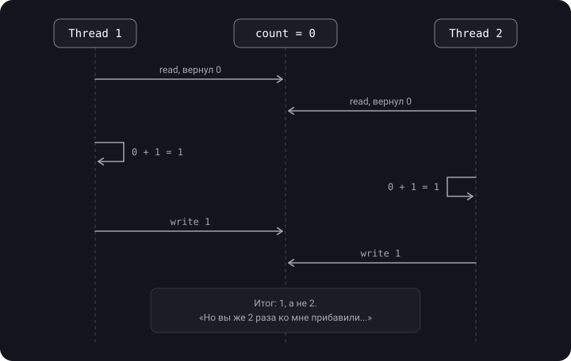
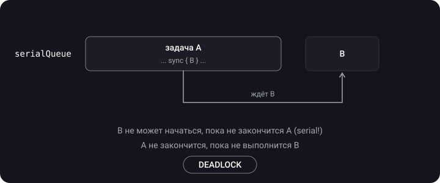

> **Что узнаешь**
>
> - Data race и race condition — в чём разница и почему `+=` не безопасен
> - Deadlock и livelock — как возникают и как их избежать
> - Priority inversion и starvation — ошибки управления потоками
> - Thread explosion и actor reentrancy
> - Как находить такие баги с помощью Thread Sanitizer

> **Нужно знать заранее:** туторы [01](../concurrency-basics/)–[02](../gcd/): потоки, очереди, sync/async, QoS. NSLock и семафор встретятся в примерах — их достаточно понимать как «замок», подробно они разобраны в [туторе 04](../thread-safety-synchronization/).

## Аналогия: хаос на кухне

- **Data race** — два повара одновременно солят одну кастрюлю, не глядя друг на друга. Итог непредсказуем.
- **Race condition** — повар ставит тарелку на раздачу, а официант уже унёс пустую: всё зависит от того, кто успел первым.
- **Deadlock** — один повар держит нож и ждёт доску, другой держит доску и ждёт нож. Оба стоят вечно.
- **Livelock** — два вежливых повара в узком проходе бесконечно уступают друг другу дорогу: «нет, ты иди» — «нет, ты». Оба двигаются, но никто не проходит.
- **Priority inversion** — шеф (высокий приоритет) ждёт, пока стажёр (низкий) вернёт единственную сковороду.
- **Starvation** — повар целый день стоит в очереди за плитой, потому что его всё время обгоняют другие.
- **Thread explosion** — на кухню наняли 100 поваров, и теперь они только толкаются.

## Карта проблем


> Логика карты: **race condition** заставляет нас обращаться к механизмам синхронизации → вместе с синхронизацией приходят **deadlock, livelock и падение производительности** → а неумелое управление потоками добавляет **priority inversion и starvation**.

## Шаг 1. Data race

> **Data race** — разные потоки обращаются к одной и той же ячейке памяти **без синхронизации**, и хотя бы один из них **пишет**. Это следствие отсутствия защиты критической секции; может привести к разрушению данных и крашу.

**Пример 1.** Счётчик:

```swift
var result = 0
for _ in 0..<1000 {
    DispatchQueue.global().async {
        result += 1          // читаем и пишем из разных потоков
    }
}
print(result)   // что угодно, но не обязательно 1000
```

**Почему `+=` опасен?** Это не одна операция, а три: прочитать → прибавить → записать (read-modify-write). Если два потока прочитают одно и то же значение, одно из прибавлений потеряется:



**Пример 2.** Запись в фоне + чтение на главном:

```swift
private var name = ""

func updateName() {
    DispatchQueue.global().async {
        self.name.append("test")   // запись в фоновом потоке
    }
    print(self.name)               // чтение на главном — одновременно
}
```

**Пример 3.** Два поля, которые должны меняться вместе:

```swift
final class Name {
    private(set) var firstName: String = ""
    private(set) var lastName: String  = ""

    func setFullName(firstName: String, lastName: String) {
        self.firstName = firstName
        self.lastName = lastName
    }
}
```

Что будет, если два потока вызовут `setFullName` одновременно?

```text
Thread 1: setFullName("Bruno", "Rocha")
Thread 2: setFullName("Onurb", "Ahcor")
Thread 1: firstName = "Bruno"
Thread 2: firstName = "Onurb"
Thread 2: lastName  = "Ahcor"
Thread 1: lastName  = "Rocha"

Итог: "Onurb Rocha" — такого имени никто не ставил
```

**Как исправить data race:**

- последовательная очередь;
- DispatchBarrier с параллельной очередью;
- NSLock и другие блокировки;
- атомарные операции (выполняются целиком либо не выполняются вовсе);
- `actor` в Swift Concurrency.

```swift
let serialQueue = DispatchQueue(label: "counter")
var result = 0
for _ in 0..<1000 {
    serialQueue.async { result += 1 }   // все записи идут по одной
}
serialQueue.sync { print(result) }       // 1000
```

## Шаг 2. Race condition

> **Race condition (состояние гонки)** — ошибка проектирования, при которой результат зависит от **порядка или времени** выполнения частей кода. Ожидаемый порядок операций становится непредсказуемым, и страдает закладываемая логика.

Такие баги очень сложно отлаживать: проблема возникает случайно, и подобрать шаги для воспроизведения практически невозможно.

**Пример 1.** Банковский счёт («проверил — потом сделал», check-then-act):

```swift
var balance = 100

func withdraw(amount: Int) {
    if balance >= amount {                    // проверка
        Thread.sleep(forTimeInterval: 0.1)    // имитация работы
        balance -= amount                     // действие
    }
}

concurrentQueue.async { withdraw(amount: 80) }
concurrentQueue.async { withdraw(amount: 90) }
// Оба прошли проверку (100 >= 80 и 100 >= 90) → balance = -70
```

**Пример 2.** Токен авторизации:

```swift
func retrieveToken(completion: @escaping (Result<AccessToken, Error>) -> Void) {
    if let token = token, token.isValid {
        completion(.success(token))
        return
    }
    loader.load { [weak self] result in
        if case let .success(token) = result {
            self?.token = token
        }
        completion(result)
    }
}
// Два параллельных вызова увидят «токена нет» и сделают ДВА запроса.
// Исправление — хранить очередь ожидающих completion и делать один запрос.
```

**Пример 3**: два счёта по 100 долларов, со счёта А на Б переводят 50 и 70. При race condition неизвестно, какая транзакция пройдёт первой, а вторая не пройдёт из-за нехватки средств.

> **Race condition НЕ решается только защитой критической секции.** Это ошибка логики. Можно защитить каждое чтение и каждую запись баланса замком — и всё равно уйти в минус, если «проверить» и «списать» не объединены в одну атомарную операцию. Другой пример: если корректность не зависит от порядка, можно взять `Set` вместо массива; если нужен упорядоченный массив — порядок нужно явно прописать в логике.

**Как исправить race condition:** атомарные операции (проверка + действие в одной критической секции), последовательные очереди, NSLock, actor, и главное — **исправить порядок вызовов** в логике.

```swift
let lock = NSLock()
func withdraw(amount: Int) -> Bool {
    lock.lock(); defer { lock.unlock() }
    guard balance >= amount else { return false }   // проверка и действие —
    balance -= amount                               // в одной критической секции
    return true
}
```

|  | Data race | Race condition |
| --- | --- | --- |
| Суть | Одновременный несинхронизированный доступ к памяти, хотя бы одна запись | Результат зависит от порядка событий |
| Уровень | Память, низкий уровень | Логика приложения |
| Последствия | Испорченные данные, краш | Неверный результат при «корректных» данных |
| Исправляется замком? | Да | Не всегда — нужно пересмотреть логику |
| Ловит Thread Sanitizer? | Да | Обычно нет |

## Шаг 3. Deadlock (взаимная блокировка)

> **Deadlock** — два или более потока бесконечно ждут ресурсы, занятые друг другом. Первое действие не может закончиться, потому что ждёт второе, а второе — потому что ждёт первое.

Взаимная блокировка возможна только при **вложенном (зависимом) доступе** к ресурсам. Приложение зависает, и система может его убить (watchdog).

**Сценарий:** задачи А (низкий приоритет) и Б (высокий), ресурсы X и Y.


**Пример 1.** Два замка в противоположном порядке:

```swift
let lock1 = NSLock()
let lock2 = NSLock()

let thread1 = Thread {
    lock1.lock()
    lock2.lock()                       // ждёт lock2, который держит thread2
    print("Это не выполнится")
    lock2.unlock(); lock1.unlock()
}
let thread2 = Thread {
    lock2.lock()
    lock1.lock()                       // ждёт lock1, который держит thread1
    print("Это не выполнится")
    lock1.unlock(); lock2.unlock()
}
thread1.start()
thread2.start()
// Исправление: оба потока захватывают замки в ОДНОМ порядке: lock1 → lock2
```

**Пример 2.** `sync` на ту же serial-очередь:

```swift
let serialQueue = DispatchQueue(label: "queue")
serialQueue.async {
    serialQueue.sync {                 // ждём задачу, которая стоит ЗА нами в этой же очереди
        print("Это не выполнится")
    }
    print("Это не выполнится")
}
// Исправление: внутренний вызов делаем async — оба print выполнятся
```



**Пример 3.** Главная очередь — тот же случай:

```swift
override func viewDidLoad() {        // мы уже на main
    super.viewDidLoad()
    DispatchQueue.main.sync {        // ДЕДЛОК
        // ...
    }
}

DispatchQueue.main.async {
    DispatchQueue.main.sync { }      // тоже дедлок
}
```

**Пример 4.** Дважды `lock()` на одном потоке с обычным `NSLock` — тоже дедлок. Для рекурсивного захвата нужен `NSRecursiveLock` ([тутор 04](../thread-safety-synchronization/)).

**Пример 5.** Цикл в зависимостях операций: Op2 ждёт Op5, Op5 ждёт Op3, Op3 ждёт Op2 ([тутор 05](../operation-queue/)).

**Четыре условия дедлока (условия Коффмана).** Дедлок возможен, только если выполняются все четыре; чтобы его исключить, достаточно сломать любое:

1. Взаимное исключение — ресурсом может владеть только один.
2. Удержание и ожидание — держу один ресурс и жду другой.
3. Нет принудительного отбора — ресурс нельзя отнять.
4. Циклическое ожидание — A ждёт B, B ждёт A.

**Как избежать deadlock:**

- не использовать `sync` в GCD без необходимости, никогда — `main.sync` с главного потока;
- контролировать парность `lock` / `unlock` (удобно через `defer`);
- захватывать ресурсы во всех ветках в **строго одинаковом порядке**;
- избегать вложенных блокировок; не проектировать сложно там, где можно просто;
- тайм-ауты: `lock(before:)`, `wait(timeout:)`.

## Шаг 4. Livelock

> **Livelock** — два или более потока не могут выполнять полезную работу из-за борьбы за общий ресурс. От дедлока отличается тем, что потоки не просто ждут, а **активно и безуспешно пытаются** выйти из ступора (поэтому live, а не dead). Часто это процессы, которые всё время уступают друг другу.

Пример: два «вежливых» потока, которые при конфликте отпускают свой замок и пробуют снова — синхронно, снова и снова:

```swift
func politeWorker(first: NSLock, second: NSLock) {
    while true {
        first.lock()
        if second.try() {              // попытались взять второй замок
            doWork()
            second.unlock(); first.unlock()
            return
        }
        first.unlock()                 // «нет, ты работай» — уступили и сразу повторили
    }
}
// thread A: politeWorker(first: lockX, second: lockY)
// thread B: politeWorker(first: lockY, second: lockX)
// Исправление: единый порядок захвата или случайная задержка перед повтором
```

## Шаг 5. Priority inversion (инверсия приоритетов)

> **Priority inversion** — поток с низким приоритетом удерживает ресурс, который нужен потоку с высоким приоритетом. В итоге высокоприоритетная задача ждёт низкоприоритетную, и её скорость становится равна (или ниже) скорости низкоприоритетной.


По шагам: **T1** — Low блокирует ресурс; **T2** — High вытесняет Low; **T3** — High пытается взять ресурс, он занят → High ждёт, Low продолжает; **T4** — Low освобождает ресурс, High сразу выполняется. Промежуток T3–T4 — и есть инверсия. Хуже всего, когда в этот момент приходит задача **среднего** приоритета и вытесняет Low: тогда High ждёт ещё и Medium.

```swift
let highPriority = DispatchQueue.global(qos: .userInitiated)
let lowPriority = DispatchQueue.global(qos: .utility)
let lock = NSLock()

lowPriority.async {
    lock.lock()
    Thread.sleep(forTimeInterval: 2)       // долго держим замок
    print("Низкоприоритетная задача")
    lock.unlock()
}
highPriority.async {
    lock.lock()                            // вынуждена ждать low
    print("Высокоприоритетная задача")
    lock.unlock()
}
```

**Как снизить риск:**

- минимизировать время захвата ресурсов (в критической секции — только то, что действительно нужно);
- не делить один ресурс между задачами с сильно разным QoS;
- использовать примитивы с **передачей приоритета владельцу** (priority donation): серийные очереди с `sync`, `os_unfair_lock`, `pthread_mutex` с атрибутом `PTHREAD_PRIO_INHERIT` (по умолчанию `PTHREAD_PRIO_NONE`), actor. У `DispatchSemaphore` владельца нет, поэтому система не может поднять приоритет тому, кто его «держит», — это классический источник инверсий.

## Шаг 6. Starvation, resource contention и fairness

> **Starvation (голодание)** — поток не может получить ресурс и безуспешно пытается снова и снова, потому что ресурс постоянно достаётся другим. «Да сколько можно уже! Я изголодался по работе, отдайте блокировку!» — «Выполняем задачу 100 из 500…»

Типичные причины:

- **Приоритеты.** Постоянный поток высокоприоритетных задач не даёт выполниться `.background`-задачам.
- **Несправедливые замки.** `os_unfair_lock` по определению не гарантирует очередность: поток, который только что отпустил замок, может тут же снова его захватить.
- **Читатели и писатели.** Если чтения идут непрерывно, запись может никогда не дождаться «окна» (поэтому barrier в GCD ставят на запись: задачи, отправленные после него, не начнутся до его завершения, и новые читатели не обгоняют писателя).
- **Долгое удержание.** Один поток держит замок, пока обрабатывает 500 элементов подряд.

Как бороться: дробить долгую работу и отпускать замок между порциями; барьер для записи; справедливые (FIFO) механизмы — serial-очередь, `NSCondition` с очередью ожидающих; адекватный QoS.

**Resource contention (конкуренция за ресурс)** — несколько потоков пытаются получить один ресурс, время его получения растёт, производительность падает (плата за синхронизацию).

**Non-deterministic and fairness** — нельзя предполагать, когда и в каком порядке поток получит ресурс. Некоторые примитивы синхронизации обеспечивают справедливость — гарантируют доступ всем ожидающим с учётом порядка.

## Шаг 7. Thread explosion (взрыв потоков)

> **Thread explosion** — создаётся очень большое количество потоков. Приложение замедляется (context switch — дорогая операция), растёт память, можно упереться в лимит потоков GCD и поймать дедлок или краш.

**Как это происходит.** Если помещать в очереди много **потокоблокирующих** задач (`sleep`, замки, `sync`, синхронный I/O), GCD видит, что потоки пула заблокированы, а задачи в очереди есть, — и создаёт новые потоки.

```swift
func gcdThreadPoolTest() {
    for i in 1...100 {
        DispatchQueue.global(qos: .default).async {
            for n in 1...10000 { _ = i * n }
            sleep(2)                          // блокируем поток → GCD создаёт новый
            for n in 1...10000 { _ = i * n }
        }
    }
}
```

```swift
// Пример: 50 000 задач, каждая ждёт serial-очередь
func calculateValues() {
    let group = DispatchGroup()
    for _ in 0..<50000 {
        group.enter()
        concurrentQueue.async { [weak self] in
            guard let self else { return }
            let value = self.calculateValue()
            self.saveValue(value) { group.leave() }
        }
    }
    group.notify(queue: .main) { print("Completed") }
}

func saveValue(_ value: Int, completion: @escaping () -> Void) {
    serialQueue.async { [weak self] in
        self?.store.saveValue(value)
        completion()
    }
}
```

**Как избежать:**

- `maxConcurrentOperationCount` в OperationQueue;
- ограничение семафором (`DispatchSemaphore(value: N)`);
- Swift Concurrency: кооперативный пул не создаёт потоков больше, чем ядер ([тутор 06](../swift-concurrency/));
- не блокировать потоки внутри задач; делать меньше крупных задач вместо миллиона мелких; `concurrentPerform` для циклов.

## Шаг 8. Actor reentrancy (коротко)

Actor защищает от data race, но **не** от race condition. На каждом `await` метод актора может приостановиться, и в это время в актор «войдёт» другой вызов:

```swift
actor Account {
    var balance = 0

    func withdraw(amount: Int) async throws {
        guard balance >= amount else { throw AccountError.noMoney }
        try await logWithdrawing(amount)   // ← точка приостановки: другой withdraw успеет пройти guard
        balance -= amount                  // ← баланс мог уже измениться
    }
}
// Исправление: менять состояние ДО await или перепроверять условия ПОСЛЕ него
```

Подробно — в [туторе 06](../swift-concurrency/).

## Шаг 9. Инструменты: Thread Sanitizer

**Thread Sanitizer (TSan)** находит data race во время выполнения и показывает, какие потоки и в каких строках конфликтуют.

1. Product → Scheme → **Edit Scheme…**
2. Run → вкладка **Diagnostics**.
3. Поставить галочку **Thread Sanitizer**. Рядом — **Main Thread Checker** (ловит работу с UI не с главного потока) и **Thread Performance Checker** (ловит, в том числе, инверсии приоритетов).
4. Запустить и пройти подозрительный сценарий.

> Общие рекомендации: включайте Thread Sanitizer и **не усложняйте многопоточный код**. Следите за Energy Impact в Xcode — «Very High» часто означает livelock или взрыв потоков. Проблемы многопоточности возможны в **любом** инструменте: GCD, Operation, async/await.

## Сводная таблица

| Проблема | Симптом | Причина | Решение |
| --- | --- | --- | --- |
| Data race | Случайные неверные значения, краши EXC_BAD_ACCESS | Несинхронизированная запись из разных потоков | Serial queue, lock, barrier, actor |
| Race condition | Логика ломается «иногда» | Зависимость от порядка событий, check-then-act | Атомарные операции, пересмотр логики и порядка |
| Deadlock | Приложение зависло, CPU ≈ 0 | Циклическое ожидание, sync на текущую serial-очередь | Нет sync, единый порядок замков, тайм-ауты |
| Livelock | Нет прогресса, CPU высокий | Потоки синхронно уступают друг другу | Единый порядок, случайная задержка (backoff) |
| Priority inversion | Важная задача тормозит | Low держит ресурс, нужный High | Короткие критические секции, примитивы с владельцем |
| Starvation | Одна задача никогда не выполняется | Несправедливое распределение ресурса | Справедливые очереди, дробление работы, barrier |
| Thread explosion | Сотни потоков, тормоза, память | Блокирующие задачи в concurrent-очередях | Лимит параллельности, Swift Concurrency |
| Actor reentrancy | Инвариант актора нарушен после await | Повторное вхождение во время приостановки | Менять состояние до await, перепроверять после |

## Типичные ошибки

- Думать, что если баг не воспроизводится — его нет. Гонки проявляются редко и случайно.
- Защитить геттер и сеттер по отдельности и считать, что `+=` теперь безопасен ([тутор 04](../thread-safety-synchronization/)).
- Захватывать замки в разном порядке в разных местах кода.
- Делать сетевые запросы или `sleep` внутри критической секции.
- Полагать, что actor решает все проблемы — он убирает data race, но не race condition.

## Шпаргалка

```text
Data race        = одна память, разные потоки, без синхронизации, хотя бы 1 запись
Race condition   = результат зависит от порядка (логика)
Deadlock         = A ждёт B, B ждёт A (спят)
Livelock         = A и B уступают друг другу (работают вхолостую)
Priority inv.    = High ждёт Low, который держит ресурс
Starvation       = поток никогда не получает ресурс
Thread explosion = блокирующие задачи → GCD плодит потоки

НИКОГДА: DispatchQueue.main.sync { } с главного потока
ВСЕГДА: одинаковый порядок захвата замков, defer { unlock() }
ДИАГНОСТИКА: Edit Scheme → Run → Diagnostics → Thread Sanitizer
```

## Вопросы для самопроверки

<details>
<summary>1. Назови основные проблемы многопоточности.</summary>

Data race, race condition, deadlock, livelock, priority inversion, starvation, thread explosion. Классическая тройка на собеседовании — race condition, priority inversion, deadlock.

</details>

<details>
<summary>2. В чём разница между data race и race condition?</summary>

Data race — низкоуровневый одновременный доступ к памяти без синхронизации (хотя бы одна запись), лечится замком/очередью/актором. Race condition — логическая ошибка: результат зависит от порядка событий; может возникнуть даже без data race.

</details>

<details>
<summary>3. Почему count += 1 из разных потоков теряет инкременты?</summary>

Это три операции (чтение, сложение, запись). Два потока могут прочитать одинаковое старое значение и оба записать «старое + 1».

</details>

<details>
<summary>4. Почему serialQueue.sync изнутри задачи этой же очереди — дедлок?</summary>

Serial-очередь не начнёт новую задачу, пока не закончится текущая. А текущая синхронно ждёт новую. Каждая ждёт другую.

</details>

<details>
<summary>5. Чем livelock отличается от deadlock?</summary>

При deadlock потоки спят в ожидании друг друга и не тратят CPU. При livelock потоки активны, меняют состояние, тратят CPU, но полезной работы не делают.

</details>

<details>
<summary>6. Что такое priority inversion и как её смягчить?</summary>

Высокоприоритетная задача ждёт ресурс, который держит низкоприоритетная. Смягчить: короткие критические секции, не делить ресурсы между разными QoS, использовать примитивы с владельцем (система поднимет ему приоритет), а не семафор.

</details>

<details>
<summary>7. Отчего возникает thread explosion?</summary>

Когда в concurrent-очереди много задач, которые блокируют свой поток (sleep, lock, sync, semaphore.wait): GCD создаёт новые потоки, чтобы продолжать работу.

</details>

<details>
<summary>8. Защищает ли actor от race condition?</summary>

Нет. Actor исключает data race, но из-за reentrancy на каждом `await` состояние может измениться другим вызовом.

</details>

## Источники

- [iOS Interview — проблемы многопоточности](https://ios-interview.ru/multithreading-problems/)
- [Что такое состояние гонки (race condition)](https://apptractor.ru/info/articles/chto-takoe-sostoyanie-gonki-race-condition.html)
- [Сложные вопросы по iOS и простые ответы на них — Mad Brains Техно](https://youtu.be/pWXgH-GbRSU?t=1715)
- [Основы многопоточности в iOS — Mad Brains Техно](https://youtu.be/JgUBBoRydoE?list=PLw6SJ6q6-1YowmlGVks5a088XrSbihJu-&t=1896)
