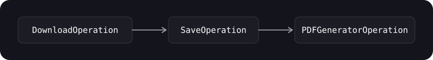
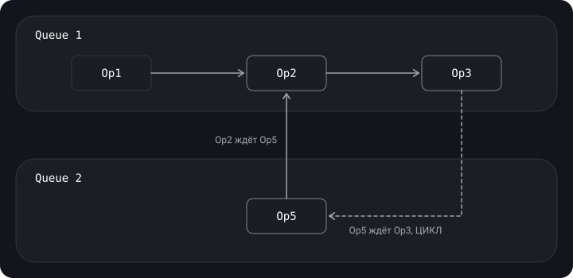

> **Что узнаешь**
>
> - Что такое Operation и чем она лучше простого замыкания в GCD
> - BlockOperation и OperationQueue: добавление, ограничение параллельности, приостановка
> - Состояния и жизненный цикл операции
> - Зависимости и как не зайти в дедлок
> - Отмена операций
> - Свои синхронные и асинхронные операции (KVO)

> **Нужно знать заранее:** [тутор 02](../gcd/) (GCD, очереди, QoS), [тутор 03](../concurrency-problems/) (deadlock), [тутор 04](../thread-safety-synchronization/) (синхронизация — пригодится для своих операций).

## Аналогия: технологические карты ресторана

В GCD ты кладёшь на ленту бумажки с коротким заказом. В OperationQueue каждый заказ — **технологическая карта** со статусом («ждёт», «готовится», «готово», «отменено»), отметкой «начинать только после соуса» (зависимость) и кнопкой «отменить». Менеджер смены (OperationQueue) следит, чтобы одновременно работали не больше N поваров, и может разом отменить все заказы столика, если гости ушли.

## Шаг 1. Что такое Operation

> **Operation (NSOperation)** — задача-объект, которая выполняется в OperationQueue. Это абстракция над GCD, более высокоуровневый и объектно-ориентированный способ управлять выполнением задач.

- `Operation` — **абстрактный класс**, напрямую не используется. Выполняет одну задачу.
- Готовые подклассы от системы: `BlockOperation` и `NSInvocationOperation` (последний доступен только в Objective-C).
- Можно написать свой подкласс — Custom Operation с полным контролем.
- Операцию можно запустить **вручную** или добавить в **OperationQueue**.

**Что даёт Operation поверх GCD:**

- **Зависимости (dependencies)** — операция не начнётся, пока не завершатся те, от которых она зависит.
- **Простая отмена** — одной операции или всех сразу. Пример: пользователь открыл экран, мы начали загрузку, пользователь ушёл — отменяем.
- **Состояния** и KVO — легко отслеживать, что происходит с каждой задачей.
- **Лимит параллельности** (как семафор), пауза и возобновление очереди.
- **Приоритеты** внутри очереди (`queuePriority`) и QoS.

> Проблемы многопоточности (deadlock, livelock, priority inversion, race condition) возможны и с операциями — Operation не защищает от них автоматически.

## Шаг 2. Первая операция: BlockOperation

`BlockOperation` — когда нет смысла писать свой подкласс, достаточно замыкания.

```swift
let blockOperation = BlockOperation {
    print("Executing!")
}

let queue = OperationQueue()
queue.addOperation(blockOperation)

// Можно добавить код в очередь напрямую — она сама создаст BlockOperation
queue.addOperation {
    print("Executing!")
}
```

**Как именно запускается операция:**

- `operation.start()` — запускает операцию **в текущем потоке** и синхронно (если это main — то на main).
- `queue.addOperation(op)` — операция выполняется на отдельном потоке при первой возможности.
- OperationQueue аналогична DispatchQueue, но может работать как с потоками напрямую, так и через GCD. Операции запускаются через Dispatch на отдельных потоках; если задан `underlyingQueue`, они идут на эту очередь, иначе выбор за системой.

**Несколько блоков в одной операции.** Блоки внутри BlockOperation выполняются **параллельно**, а сама операция считается завершённой, когда закончились все. Дополнительные замыкания добавляются через `addExecutionBlock`:

```swift
let operation = BlockOperation {
    checker.check { _ in }
}

let checkerOperation = BlockOperation()
for checker in checkers {
    checkerOperation.addExecutionBlock {
        checker.check { _ in }       // все блоки — параллельно
    }
}
checkerOperation.completionBlock = {
    print("Все проверки завершены")
}
```

Чтобы блоки шли последовательно — либо разные операции с зависимостями, либо serial-очередь (`maxConcurrentOperationCount = 1`).

## Шаг 3. OperationQueue

> **OperationQueue** — та же очередь, только высокоуровневая и ООП-шная. Умеет отменять, учитывать зависимости и ограничивать число одновременных операций. После добавления операция выполняется до завершения или отмены и автоматически удаляется из очереди.

**Три способа добавить задание:** одна Operation, замыкание, массив Operation.

```swift
let firstOperation = BlockOperation { print("First operation") }
let secondOperation = BlockOperation { print("Second operation") }
secondOperation.addDependency(firstOperation)          // second — только после first

let queue = OperationQueue()
queue.addOperations([firstOperation, secondOperation], waitUntilFinished: false)

let thirdOperation = BlockOperation { print("Third operation") }
thirdOperation.cancel()                                  // отмена

// Ограничение максимального числа одновременно выполняемых операций
queue.maxConcurrentOperationCount = 2
```

**API OperationQueue (со слайда):**

```swift
class OperationQueue: NSObject, ProgressReporting {
    unowned(unsafe) var underlyingQueue: DispatchQueue?
    var progress: Progress { get }
    var maxConcurrentOperationCount: Int
    var isSuspended: Bool
    var name: String?
    var qualityOfService: QualityOfService

    func addOperation(_ op: Operation)
    func addOperations(_ ops: [Operation], waitUntilFinished wait: Bool)
    func addOperation(_ block: @escaping @Sendable () -> Void)
    func addBarrierBlock(_ barrier: @escaping @Sendable () -> Void)
    func cancelAllOperations()
    func waitUntilAllOperationsAreFinished()
}
```

| Свойство / метод | Что делает |
| --- | --- |
| `maxConcurrentOperationCount` | Максимум одновременных операций. `1` → очередь становится последовательной |
| `isSuspended` | Приостановка: новые операции не стартуют (уже запущенные дорабатывают) |
| `qualityOfService` | QoS по умолчанию для операций очереди |
| `underlyingQueue` | DispatchQueue, на которой реально выполняются операции. **Не указывайте главную очередь** (для main есть `OperationQueue.main`) |
| `waitUntilAllOperationsAreFinished()` | Блокирует текущий поток до завершения всех. Не вызывайте на main! |
| `cancelAllOperations()` | Отменить всё, что в очереди |
| `addBarrierBlock` | Барьер: выполнится после всех предыдущих операций, последующие ждут его |

## Шаг 4. Состояния и жизненный цикл

**Состояния операции:**

- **pending** — добавлена, ждёт (например, зависимостей);
- **ready** — готова к запуску;
- **executing** — выполняется;
- **finished** — завершена;
- **cancelled** — отменена.


На языке свойств: `isReady → isExecuting → isFinished` или `isExecuting → isCancelled → isFinished`.

| Свойство | Смысл | Когда переопределять |
| --- | --- | --- |
| `isReady` | `true`, когда все зависимые операции выполнены | Редко: если готовность зависит не только от зависимостей |
| `isExecuting` | Операция выполняется прямо сейчас | Если переопределяете `start()` — обязательно, с KVO |
| `isFinished` | Завершена успешно или отменена. Пока `false` — операция висит в очереди | Если переопределяете `start()` — обязательно, с KVO |
| `isCancelled` | Запрос на отмену отправлен | Не переопределяют — но реакцию на отмену реализуете вы |

> **Операция одноразовая.** Если она в состоянии finished или cancelled, запустить её повторно нельзя — создавайте новую. OperationQueue автоматически удаляет операцию, когда та становится finished (и после выполнения, и после отмены).

**API Operation (со слайда):**

```swift
open class Operation: NSObject {
    open var name: String?
    open var isCancelled: Bool { get }
    open var isExecuting: Bool { get }
    open var isFinished: Bool { get }
    open var isConcurrent: Bool { get }      // устарело, см. isAsynchronous
    open var isAsynchronous: Bool { get }
    open var isReady: Bool { get }
    open var queuePriority: Operation.QueuePriority
    open var dependencies: [Operation] { get }
    open var qualityOfService: QualityOfService
    open var completionBlock: (() -> Void)?

    open func start()
    open func main()
    open func cancel()
    open func addDependency(_ op: Operation)
    open func removeDependency(_ op: Operation)
    open func waitUntilFinished()
}
```

## Шаг 5. Зависимости

Зависимость гарантирует, что зависимая операция **не начнётся**, пока не завершится необходимая. Зависимости работают даже между операциями в **разных** очередях.

Пример: сначала импорт данных, потом выгрузка.

```swift
let fileURL = URL(fileURLWithPath: "..")
let contentImportOperation = ContentImportOperation(itemProvider: NSItemProvider(contentsOf: fileURL)!)
contentImportOperation.completionBlock = {
    print("Importing completed!")
}

let contentUploadOperation = UploadContentOperation()
contentUploadOperation.addDependency(contentImportOperation)
contentUploadOperation.completionBlock = {
    print("Uploading completed!")
}

queue.addOperations([contentImportOperation, contentUploadOperation], waitUntilFinished: true)

// Prints:
// Importing content..
// Importing completed!
// Uploading content..
// Uploading completed!
```

Цепочка «скачать → сохранить → сгенерировать PDF»: с операциями код плоский, с GCD — «пирамида смерти»:

```swift
// Operations
let downloadOp = DownloadOperation(url: url)
let saverOp = SaveOperation()
let pdfGeneratorOp = PDFGeneratorOperation()
saverOp.addDependency(downloadOp)
pdfGeneratorOp.addDependency(saverOp)
queue.addOperations([downloadOp, saverOp, pdfGeneratorOp], waitUntilFinished: false)

// Удалить зависимость
pdfGeneratorOp.removeDependency(saverOp)

// GCD — то же самое через вложенные колбэки
network.onDownloaded { data in
    saver.onSave(data) { file in
        pdfGenerator.onGenerate(file) { pdf in
            // ...
        }
    }
}
```



Один из способов передать данные — в начале своей работы прочитать результат из зависимости:

```swift
final class DownloadOperation: Operation {
    private(set) var data: Data?
    override func main() {
        guard !isCancelled else { return }
        data = try? Data(contentsOf: url)
    }
}

final class SaveOperation: Operation {
    override func main() {
        guard !isCancelled else { return }
        let input = dependencies
            .compactMap { $0 as? DownloadOperation }
            .first?.data                        // забираем результат сами
        save(input)
    }
}
```

### Как проверить граф зависимостей на deadlock

Зависимости образуют граф. Пока в нём нет циклов — всё хорошо. **Цикл в графе зависимостей = deadlock**: ни одна операция из цикла никогда не станет ready.



- Queue1: Op1 → Op2 → Op3 — дедлока нет.
- Добавили Op5 (Queue2) → Op2 — дедлока нет.
- Добавили Op3 → Op5: теперь Op2 ждёт Op5, Op5 ждёт Op3, Op3 ждёт Op2 — **цикл, deadlock**.

## Шаг 6. Отмена

`cancel()` не «убивает» операцию — он лишь выставляет `isCancelled = true`. Если операция ещё не началась, очередь её не запустит. Если уже идёт — она должна сама проверять флаг и выходить.

| Свойство | До cancel() | После cancel() и выхода |
| --- | --- | --- |
| `isCancelled` | false | true |
| `isExecuting` | true | false |
| `isFinished` | false | true |

```swift
queue.cancelAllOperations()      // отменить всё, например в deinit экрана
```

## Шаг 7. Своя синхронная операция

Подкласс нужен для сложной или переиспользуемой работы. Шаги (cookbook):

1. Наследуемся от `Operation`.
2. В `init()` передаём нужные данные.
3. Переопределяем `main()` — там весь код.
4. В `main()` проверяем отмену: `guard !isCancelled else { return }` — в начале и перед каждым долгим шагом.
5. Не забываем синхронизировать доступ к данным операции.

```swift
final class ImageFilterOperation: Operation {
    private let input: UIImage
    private(set) var output: UIImage?

    init(image: UIImage) {
        self.input = image
        super.init()
    }

    override func main() {
        guard !isCancelled else { return }
        let blurred = applyBlur(to: input)
        guard !isCancelled else { return }       // проверяем снова после долгого шага
        output = applyVignette(to: blurred)
    }
}
```

Когда `main()` вернул управление, операция автоматически становится finished. Поэтому в `main()` **нельзя** запускать асинхронную работу с колбэком — операция завершится раньше, чем придёт ответ.

## Шаг 8. Своя асинхронная операция

Для сети и другой работы с колбэками операция должна сама сообщить, когда закончилась. Cookbook:

- как минимум переопределить `start()`;
- переопределить `isAsynchronous`, `isExecuting`, `isFinished` (и учитывать `isCancelled`);
- отправлять **KVO-нотификации** при смене состояния — именно по ним OperationQueue узнаёт, что операция завершилась.


Базовый класс, который можно переиспользовать:

```swift
class AsyncOperation: Operation {
    private enum State: String {
        case ready, executing, finished
        var keyPath: String { "is" + rawValue.capitalized }   // isReady, isExecuting, isFinished
    }

    private let lock = NSLock()
    private var _state = State.ready
    private var state: State {
        get { lock.withLock { _state } }
        set {
            let old = state
            willChangeValue(forKey: old.keyPath)
            willChangeValue(forKey: newValue.keyPath)
            lock.withLock { _state = newValue }
            didChangeValue(forKey: newValue.keyPath)
            didChangeValue(forKey: old.keyPath)
        }
    }

    override var isAsynchronous: Bool { true }
    override var isReady: Bool { super.isReady && state == .ready }
    override var isExecuting: Bool { state == .executing }
    override var isFinished: Bool { state == .finished }

    override func start() {
        guard !isCancelled else { state = .finished; return }
        state = .executing
        main()                       // наследник запускает асинхронную работу
    }

    func finish() { state = .finished }   // вызывать из колбэка
}

final class LoadUserOperation: AsyncOperation {
    private(set) var user: User?
    override func main() {
        api.loadUser { [weak self] result in
            self?.user = try? result.get()
            self?.finish()           // без этого операция висит в очереди вечно
        }
    }
}
```

**Жизненный цикл sync vs async** (со слайда):


> Работа с операциями удобнее работы с потоками, **но**: правильно реализовать асинхронную операцию непросто — надо управлять состоянием, поддерживать отмену и синхронизировать доступ. Да и вообще есть GCD (а сегодня — ещё и Swift Concurrency).

## Шаг 9. Когда что выбирать

| Задача | GCD | OperationQueue |
| --- | --- | --- |
| Одна фоновая задача + возврат на main | да, проще | Можно, но избыточно |
| Цепочка зависимых шагов | Вложенные колбэки | да — `addDependency` |
| Отмена всего при уходе с экрана | По одному WorkItem | да — `cancelAllOperations()` |
| Не больше N загрузок одновременно | Семафор | да — `maxConcurrentOperationCount` |
| Пауза очереди | `suspend()` / `resume()` у DispatchQueue | да — `isSuspended` |
| Наблюдение за состоянием | Нет | да — KVO, `progress` |

## Типичные ошибки

- Запускать асинхронную работу в `main()` обычной (синхронной) операции — операция станет finished до ответа, зависимые стартуют рано.
- В асинхронной операции забыть KVO или вызов `finish()` → операция висит вечно.
- Не проверять `isCancelled` — `cancel()` ничего не остановит.
- Циклические зависимости → deadlock.
- Пытаться перезапустить уже выполненную операцию.
- `waitUntilFinished` / `waitUntilAllOperationsAreFinished` / `addOperations(…, waitUntilFinished: true)` на главном потоке.
- `underlyingQueue = .main` у своей очереди.
- Обновление UI в `completionBlock` — он вызывается на фоновом потоке; нужен `OperationQueue.main.addOperation { }` или `DispatchQueue.main.async`.

## Шпаргалка

```swift
let queue = OperationQueue()
queue.maxConcurrentOperationCount = 3        // 1 = serial
queue.qualityOfService = .userInitiated

let a = BlockOperation { }                   // блоки внутри — параллельно
a.addExecutionBlock { }
a.completionBlock = { }                      // на фоновом потоке!

let b = MyOperation()
b.addDependency(a)                           // b после a (порядок, НЕ передача данных)
queue.addOperations([a, b], waitUntilFinished: false)
queue.addOperation { }                       // замыкание
queue.addBarrierBlock { }

b.cancel(); queue.cancelAllOperations()
queue.isSuspended = true

// Sync-подкласс: override main() + guard !isCancelled
// Async-подкласс: override start, isAsynchronous, isExecuting, isFinished + KVO
// Цикл в зависимостях = deadlock
```

## Вопросы для самопроверки

<details>
<summary>1. Чем Operation отличается от замыкания в DispatchQueue?</summary>

Operation — объект с состоянием (ready/executing/finished/cancelled), поддержкой KVO, зависимостями, отменой и приоритетом. Замыкание в GCD — просто код без состояния (частично это компенсирует DispatchWorkItem).

</details>

<details>
<summary>2. Что произойдёт при вызове operation.start() вручную?</summary>

Операция выполнится синхронно в текущем потоке. Если она ещё не ready (зависимости не выполнены), будет исключение.

</details>

<details>
<summary>3. Что делает cancel()?</summary>

Ставит `isCancelled = true`. Если операция ещё не началась, она не выполнит работу и станет finished. Если уже выполняется — должна сама проверить флаг и завершиться.

</details>

<details>
<summary>4. Что нужно переопределить для синхронной и для асинхронной операции?</summary>

Синхронная — только `main()`. Асинхронная — `start()`, `isAsynchronous`, `isExecuting`, `isFinished`, и отправлять KVO-уведомления при смене состояния.

</details>

<details>
<summary>5. Передаёт ли зависимость данные между операциями?</summary>

Нет, только гарантирует порядок. Данные передают вручную: через свойства зависимых операций (`dependencies`), общий объект-контейнер или операцию-адаптер.

</details>

<details>
<summary>6. Как превратить OperationQueue в последовательную?</summary>

`maxConcurrentOperationCount = 1`.

</details>

<details>
<summary>7. Как понять, что зависимости приведут к дедлоку?</summary>

Нарисовать граф зависимостей: если в нём есть цикл (A ждёт B, B ждёт … A), операции из цикла никогда не станут ready.

</details>

## Источники

- [Concurrency в Swift 3 и 4. Operation и OperationQueue](https://habr.com/ru/articles/335756/)
- [Про многопоточность 3. Operation](https://habr.com/ru/articles/755762/)
- [Сложные вопросы по iOS и простые ответы на них — Mad Brains Техно](https://youtu.be/pWXgH-GbRSU?t=3520)
