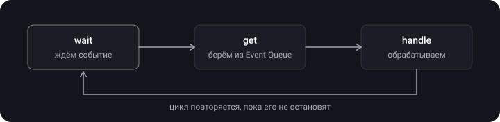
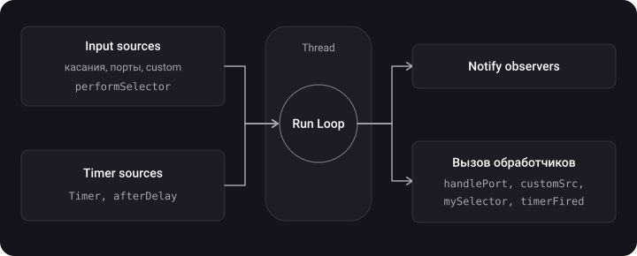
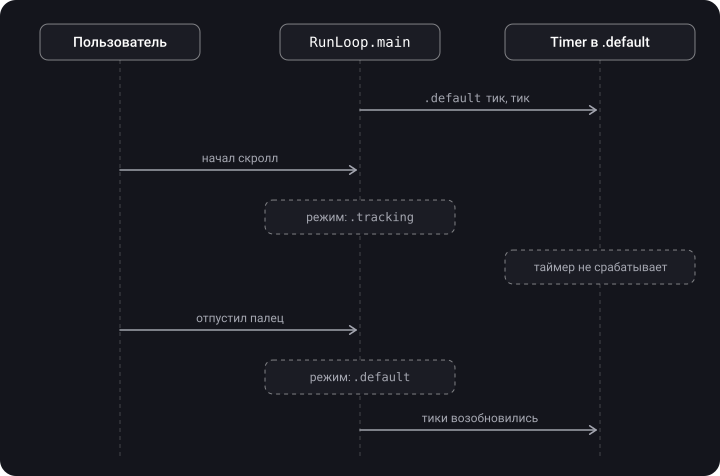

> **Что узнаешь**
>
> - Что такое Event Loop и чем RunLoop его «умнее»
> - Источники событий: input sources и timer sources
> - Режимы: default, tracking, common — и почему таймер замирает при скролле
> - RunLoop и потоки: таймер в своём потоке
> - Жизненный цикл RunLoop и observers

> **Нужно знать заранее:** [тутор 01](../concurrency-basics/) (потоки, главный поток, Thread), [тутор 02](../gcd/) (DispatchQueue.main).

## Аналогия: дежурный официант

Официант (поток) не бегает по залу бесконечно — он **сидит и дремлет**, пока ничего не происходит. Звякнул колокольчик гостя (input source) или сработал будильник «отнести счёт через 10 минут» (timer source) — он просыпается, обслуживает и снова садится. Этот цикл «ждать → проснуться → обслужить → уснуть» и есть RunLoop.

**Режимы** — как табличка на двери: в режиме «банкет» (tracking — пользователь скроллит) официант реагирует только на гостей банкета и игнорирует обычные будильники — если будильник не помечен «для всех режимов» (common).

## Шаг 1. Паттерн Event Loop

В основе RunLoop лежит паттерн **Event Loop**:

1. **wait** — ждём событие;
2. **get** — достаём его из очереди событий (Event Queue);
3. **handle** — обрабатываем.

Цикл крутится, пока его явно не остановят (мы или iOS). Упрощённо:

```swift
while running {
    let event = waitForNextEvent()   // поток спит, пока нет событий
    handle(event)
}
```



## Шаг 2. RunLoop — «умный» Event Loop

> **Run Loop** — цикл получения и обработки событий в конкретном потоке; бесконечный цикл для обработки и координации всех входящих событий. Это объект, который управляет событиями и сообщениями, обрабатывает их и предоставляет функцию точки входа для выполнения логики события.

**Задача RunLoop** — загружать поток, когда есть работа, и усыплять его в остальное время, чтобы не тратить ресурсы. По сути он делает две вещи: ждёт, пока что-то произойдёт, и отправляет сообщение получателю.

RunLoop позволяет:

- принимать ввод, не прерывая программу;
- решать, когда обрабатывать события;
- разделять вызовы по категориям и режимам;
- экономить время процессора (и батарею).

**Чем RunLoop умнее простого Event Loop:** он делит события на **категории** (источники) и **режимы**, умеет правильно спать и просыпаться и уведомляет наблюдателей о своих этапах.

## Шаг 3. Источники событий

Два типа источников (run loop sources):

- **Input Sources** — внешние события: касания, свайпы, клавиатура, мышь, порты (Mach ports), кастомные источники для передачи данных. Вызовы `perform(_:on:with:waitUntilDone:)` / `performSelector` тоже работают через RunLoop.
- **Timer Sources** — отложенные действия: `Timer` (NSTimer), `perform(_:with:afterDelay:)`. Таймеры работают поверх RunLoop.

Плюс **observers** — подписчики на этапы цикла (шаг 8).



Задачи `DispatchQueue.main.async` тоже выполняются в рамках `RunLoop.main`: главная очередь GCD подключена к главному RunLoop как источник и обслуживается на каждой итерации. Именно поэтому асинхронный код на главном потоке не блокирует интерфейс.

## Шаг 4. Одна итерация цикла

После входа в RunLoop поток пребывает в цикле **приём сообщения → ожидание → обработка → спячка до следующего сообщения → приём сообщения**, пока цикл не завершится (например, придёт сообщение о завершении или истечёт тайм-аут).

Подробнее, с уведомлениями наблюдателей:


## Шаг 5. Режимы (RunLoop Modes)

Режим — это «настройка фильтра»: какие источники и таймеры RunLoop обслуживает в текущей итерации. Источник, добавленный в один режим, в другом режиме просто не слышен.

| Режим | Когда активен | Что обрабатывает |
| --- | --- | --- |
| `.default` | Основной, автоматически при запуске, когда пользователь ничего не трогает | Таймеры, performSelector, afterDelay и большинство источников ввода |
| `.tracking` | Пользователь взаимодействует с экраном: скролл UIScrollView / UICollectionView, трекинг жеста | UI-события. Таймеры из `.default` **не срабатывают** |
| `.common` | Не самостоятельный режим, а **группа**: `.default` • `.tracking` (и другие помеченные как common) | Источник, добавленный в `.common`, работает и в покое, и во время скролла |

**Классическая проблема:** таймер обратного отсчёта в ячейке замирает, пока пользователь скроллит список. При начале взаимодействия RunLoop переходит из `.default` в `.tracking`, а `Timer.scheduledTimer` добавляет таймер только в `.default`.



**Решение** — добавить таймер в `.common`:

```swift
// На главном потоке: scheduledTimer + добавить в .common
let timer = Timer.scheduledTimer(withTimeInterval: 3.0, repeats: true) { timer in
    print("Timer fired")
}
RunLoop.main.add(timer, forMode: .common)

// Или создать без автодобавления и добавить сразу в .common
let timer2 = Timer(timeInterval: 3.0, repeats: true) { _ in print("tick") }
RunLoop.main.add(timer2, forMode: .common)
```

## Шаг 6. RunLoop и потоки

- У каждого потока **может быть** свой ассоциированный RunLoop, но **по умолчанию он не запущен** (создаётся лениво при первом обращении к `RunLoop.current`).
- Для **главного потока** RunLoop создаёт и запускает `UIApplication` автоматически — это `RunLoop.main`.
- Для созданных вами потоков RunLoop нужно **запускать и конфигурировать самостоятельно**.
- Без RunLoop поток просто выполняет свой блок, заканчивает работу и отзывается системой (reclaim).

**Таймер в своём потоке** — нужно вручную запустить `RunLoop.current.run()`:

```swift
let thread = Thread {
    let runLoop = RunLoop.current
    let timer = Timer(timeInterval: 3.0, repeats: true) { timer in
        print("Timer fired")
    }
    runLoop.add(timer, forMode: .common)
    runLoop.run()              // без этого поток завершится и таймер не сработает
}
thread.start()
```

**Почему не `scheduledTimer` в кастомных потоках:** `scheduledTimer` автоматически добавляется в режим `.default` текущего RunLoop, но **не запускает** его. В кастомном потоке такой таймер может не сработать вообще. Лучше создать `Timer(timeInterval:repeats:)` и явно добавить его в нужный режим.


## Шаг 7. Жизненный цикл RunLoop

- `RunLoop.main` **не уничтожается** до закрытия приложения.
- Если задач нет, RunLoop переводит поток в **sleep** (снижение нагрузки на CPU) и **просыпается** при новом событии.
- Кастомные потоки и их RunLoop освобождаются, когда завершено выполнение всех задач в блоке Thread. При этом `run()` без источников выходит сразу, а с источниками — крутится, пока их не уберут (или не истечёт `run(until:)`).


## Шаг 8. Observers

Через `CFRunLoopObserver` можно подписаться на этапы цикла:

| Activity | Когда |
| --- | --- |
| `entry` | Вход в RunLoop |
| `beforeTimers` | Перед обработкой таймеров |
| `beforeSources` | Перед обработкой Input Sources |
| `beforeWaiting` | Перед сном |
| `afterWaiting` | После пробуждения |
| `exit` | Выход из RunLoop |

Полезно для отслеживания производительности и логирования. Например, если между `afterWaiting` и следующим `beforeWaiting` прошло больше 16 мс, на главном потоке была слишком долгая работа — и пропущен кадр (так устроены многие детекторы фризов).

```swift
let observer = CFRunLoopObserverCreateWithHandler(
    nil,
    CFRunLoopActivity.beforeWaiting.rawValue,   // на какой этап подписываемся
    true,                                        // repeats
    0                                            // order
) { _, activity in
    print("RunLoop готовится уснуть...")
}
CFRunLoopAddObserver(CFRunLoopGetMain(), observer, .commonModes)
```

## Шаг 9. Таймеры не точные

Таймер срабатывает не в точное время, а тогда, когда RunLoop дойдёт до обработки таймеров. В заметках отмечена проблема таймеров «со срабатыванием не вовремя»: если таймер добавлен, когда текущая итерация уже идёт, он будет обработан только на следующей. Кроме того: если главный поток занят долгой задачей, все таймеры ждут; пропущенные срабатывания повторяющегося таймера не накапливаются; система может сдвигать срабатывание в пределах `tolerance` ради экономии энергии. Для анимаций берите `CADisplayLink`, для фоновых таймеров — `DispatchSourceTimer`.

## Summary

- Все задачи `DispatchQueue.main.async` выполняются в рамках `RunLoop.main`.
- Благодаря RunLoop асинхронный код на главном потоке не блокирует интерфейс.
- Используйте `.common`, чтобы таймер не останавливался при взаимодействии с UI.
- В своих потоках RunLoop нужно запускать вручную.

## Типичные ошибки

- `Timer.scheduledTimer` на main без `.common` → таймер замирает при скролле.
- `Timer.scheduledTimer` внутри `DispatchQueue.global().async` или кастомного `Thread` без `run()` → таймер никогда не сработает (у потоков GCD нет запущенного RunLoop).
- `RunLoop.current.run()` без условия выхода в потоке из пула GCD → поток пула занят навсегда.
- Забыть `invalidate()` — `Timer` сильно удерживает target/замыкание, RunLoop удерживает таймер → утечка и «вечный» таймер.
- Долгая работа на main → RunLoop не доходит до таймеров и отрисовки → фризы.

## Шпаргалка

```swift
// Цикл: wait → get → handle → sleep → …
// Источники: Input (касания, порты, performSelector) + Timer (Timer, afterDelay)
// Режимы: .default | .tracking (скролл) | .common = default + tracking

RunLoop.main            // у main запущен автоматически
RunLoop.current         // у своего потока — создаётся лениво, НЕ запущен

// Таймер, не замирающий при скролле
let t = Timer(timeInterval: 1, repeats: true) { _ in }
RunLoop.main.add(t, forMode: .common)

// Таймер в своём потоке
Thread { RunLoop.current.add(t, forMode: .common); RunLoop.current.run() }.start()

// Observer
CFRunLoopAddObserver(CFRunLoopGetMain(), observer, .commonModes)
// этапы: entry, beforeTimers, beforeSources, beforeWaiting, afterWaiting, exit
```

## Вопросы для самопроверки

<details>
<summary>1. Что такое RunLoop и зачем он нужен?</summary>

Цикл получения и обработки событий в конкретном потоке. Он слушает input- и timer-источники, усыпляет поток, когда работы нет, и будит, когда она появляется. Без него поток выполнил бы свой код и завершился.

</details>

<details>
<summary>2. Чем RunLoop отличается от простого Event Loop?</summary>

Он делит события на категории (input sources, timer sources) и режимы, обслуживает только источники текущего режима, умеет спать и просыпаться и уведомляет наблюдателей о своих этапах.

</details>

<details>
<summary>3. Почему таймер останавливается при скролле и как это исправить?</summary>

`scheduledTimer` добавляется в режим `.default`. Во время скролла RunLoop переходит в `.tracking`, где этот таймер не обслуживается. Исправление: `RunLoop.main.add(timer, forMode: .common)`.

</details>

<details>
<summary>4. Есть ли RunLoop у каждого потока?</summary>

У каждого потока может быть свой RunLoop, но он создаётся лениво и не запущен. Автоматически запущен только RunLoop главного потока (его запускает UIApplication).

</details>

<details>
<summary>5. Как сделать таймер в своём потоке?</summary>

Создать `Timer(timeInterval:repeats:)`, добавить его в `RunLoop.current` в нужном режиме (обычно `.common`) и вызвать `RunLoop.current.run()`. Либо взять `DispatchSourceTimer`, которому RunLoop не нужен.

</details>

<details>
<summary>6. Что такое .common режим?</summary>

Не самостоятельный режим, а группа «общих» режимов (по умолчанию `.default` и `.tracking`). Источник, добавленный в `.common`, обслуживается во всех режимах группы.

</details>

<details>
<summary>7. Как связаны DispatchQueue.main и RunLoop.main?</summary>

Задачи `DispatchQueue.main.async` выполняются в рамках итераций `RunLoop.main`: главная очередь будит главный RunLoop и обслуживается им. Поэтому асинхронный код на main не блокирует UI, но долгая задача в ней задержит всё остальное.

</details>

<details>
<summary>8. Для чего нужны RunLoop observers?</summary>

Чтобы подписаться на этапы цикла (entry, beforeTimers, beforeSources, beforeWaiting, afterWaiting, exit) — для логирования, измерения производительности, детектирования фризов, выполнения работы «перед сном».

</details>

## Источники

- [iOS Run Loop: Что? Когда? Зачем?](https://habr.com/ru/companies/otus/articles/590319/)
- [RunLoop на главном потоке — Антон Сергеев](https://www.youtube.com/watch?v=wA_392H7JeU)
- [Руслан Прокофьев об NSRunLoop, CocoaHeads Moscow](https://www.youtube.com/watch?v=GfpZ1fBHvxg)
- [Сложные вопросы по iOS и простые ответы на них — Mad Brains Техно](https://youtu.be/pWXgH-GbRSU?t=555)
- [Крутим Runloop. Как устроена лента ВКонтакте — Александр Терентьев](https://www.youtube.com/watch?v=fXCfvYZIrrE)
