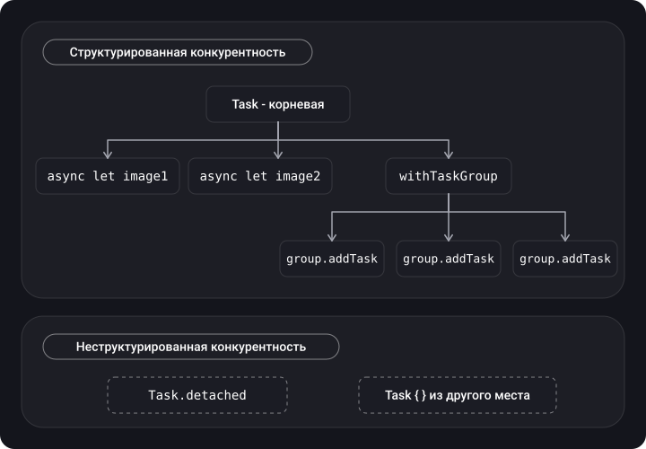
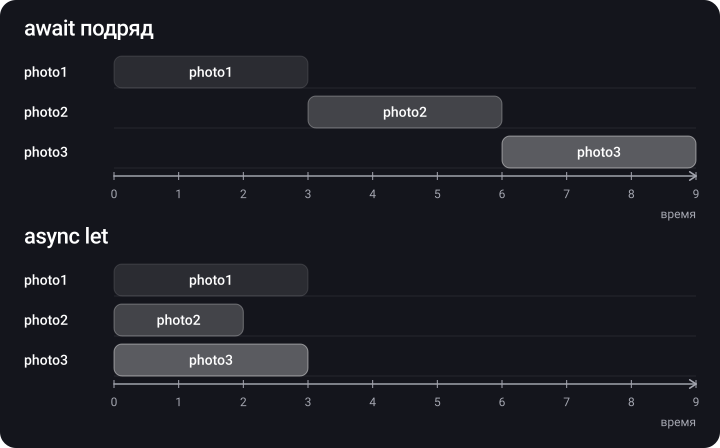

> **Что узнаешь**
>
> - Зачем появился Swift Concurrency и какие проблемы GCD он решает
> - async/await, точки приостановки, continuation и кооперативный пул потоков
> - Task, приоритеты, Task.detached, структурированная и неструктурированная конкурентность
> - Параллельность: async let и TaskGroup
> - Отмена, асинхронные свойства, continuations для старого кода
> - Actors, @MainActor и actor reentrancy

> **Нужно знать заранее:** туторы [01](../concurrency-basics/)–[04](../thread-safety-synchronization/). Особенно важны: главный поток, колбэки в GCD, thread explosion, deadlock, data race.

## Аналогия: повар не стоит над кастрюлей

В GCD с `sync`/блокировками повар поставил воду на огонь и **стоит рядом**, пока она не закипит — и кухне приходится нанимать ещё поваров (thread explosion). В Swift Concurrency повар говорит «**await** закипания», клеит на кастрюлю стикер с тем, на чём остановился (**continuation**), и идёт делать другое блюдо. Когда вода закипела, рецепт доготавливает **любой свободный повар**, прочитав стикер. Поваров ровно столько, сколько плит (ядер), и никто не простаивает.

**Actor** — отдельный цех со своим холодильником: заказы туда передают через окошко, и внутри всегда работает один человек.

## Шаг 1. Зачем нужен Swift Concurrency

**Swift Concurrency** — технология Apple, представленная в Swift 5.5. Она позволяет писать многопоточный код с лучшей производительностью и меньшим числом ошибок:

- **Синтаксис async/await** — асинхронный код выглядит и читается как синхронный, оставаясь неблокирующим.
- **Обработка ошибок** — обычные `throws` / `try` / `do-catch` вместо `Result` в каждом колбэке.
- **Новая модель** абстрагирует от потоков и очередей: вместо DispatchQueue — примитивы **Task** и **Actor**, а потоками управляет **Cooperative Thread Pool**.

**Проблемы GCD, которые решает SC**, делятся на две группы.

**1) Читаемость.** Pyramid of doom — сильная вложенность колбэков:

```swift
func fetchUserData(for id: String, completion: @escaping ((User) -> Void)) {
    loadUserDataFromNetwork(for: id) { user in
        saveToCoreData(user: user) { savedUser in
            completion(savedUser)
        }
    }
}
```

С обработкой ошибок становится ещё хуже — и легко забыть вызвать `completion` в одной из веток:

```swift
func fetchUserDataWithError(for id: String, completion: @escaping ((Result<User, Error>) -> Void)) {
    loadUserFromNetworkWithError(for: id) { result in
        do {
            saveUserToCoreDataWithError(data: try result.get()) { savedResult in
                guard let savedUser = try? savedResult.get() else { return }   // ← completion не вызван!
                completion(.success(savedUser))
            }
        } catch {
            // completion(.failure(error))  ← легко забыть
        }
    }
}
```

**2) Технические проблемы:** thread explosion, deadlock (`DispatchQueue.main.sync` в `viewDidLoad`), race condition (два `async` в concurrent-очереди делают `array.append`). Все они подробно разобраны в [туторе 03](../concurrency-problems/). В SC их тоже можно создать, но инструмент сильно усложняет их допущение.

**Чем async/await лучше GCD (коротко):** нет callback hell, нет взрыва потоков, лучшая структурированность, проверки компилятора.

## Шаг 2. async и await

- **async** — атрибут функции: «я выполняю асинхронную работу и могу приостанавливаться».
- **await** — ключевое слово при вызове async-функции: «здесь можем приостановиться и дождаться результата или ошибки». Они всегда ходят парой: «Await ждёт обратного вызова от своего приятеля async».

**Было (колбэк):**

```swift
enum DownloadError: Error {
    case badImage
    case unknown
}

typealias Completion = (Result<Response, DownloadError>) -> Void

func saveChanges(completion: Completion) {
    Thread.sleep(forTimeInterval: 2)                 // имитация сложной задачи
    let randomNumber = Int.random(in: 0..<2)
    if randomNumber == 0 {
        completion(.failure(.unknown))
        return
    }
    completion(.success(Response(id: 100)))
}

saveChanges { result in
    switch result {
    case .success(let response): print(response)
    case .failure(let error):    print(error)
    }
}
```

**Стало (async/await):**

1. Помечаем функцию `async` (после списка параметров).
2. Если функция бросает ошибку — сразу за `async` ставим `throws`.
3. Вызываем из синхронного кода через `Task`.

```swift
func saveChanges() async throws -> Response {
    try await Task.sleep(for: .seconds(2))           // не блокирует поток (см. примечание)
    if Int.random(in: 0..<2) == 0 {
        throw DownloadError.unknown
    }
    return Response(id: 100)
}

func someSyncFunction() {
    Task(priority: .medium) {
        do {
            let result = try await saveChanges()
            print(result.id)
        } catch let error as DownloadError {
            // Handle Download Error
        } catch {
            // Handle some other type of error
        }
    }
}
```

**Сравнение — загрузка фото:**

**Swift Concurrency**

```swift
func loadPhotos() async throws -> [Photo] {
    let (data, _) = try await URLSession.shared.data(from: url)
    return try JSONDecoder().decode([Photo].self, from: data)
}

// вызов
let photos = try await loadPhotos()
show(photos)
```

**GCD**

```swift
func loadPhotos(completion: @escaping (Result<[Photo], Error>) -> Void) {
    URLSession.shared.dataTask(with: url) { data, response, error in
        guard let data = data,
              let photos = try? JSONDecoder().decode([Photo].self, from: data) else {
            completion(.failure(ServiceError.loadingError))
            return
        }
        completion(.success(photos))
    }.resume()
}

// вызов
loadPhotos { [weak self] result in
    if case let .success(photos) = result {
        DispatchQueue.main.async { self?.show(photos) }
    }
}
```

## Шаг 3. Что происходит на await: приостановка и continuation

Каждый `await` — **точка приостановки (suspension point)**. В этот момент функция может отдать поток, и он **не блокируется**, а продолжает выполнять другую работу.

- **Continuation** — легковесный объект, в котором хранится состояние приостановленной функции («где остановились и что было в локальных переменных»). Создаётся для каждой выполняемой задачи.
- Переключение между continuation — это вызов функции, а не context switch потоков; поэтому это дёшево.
- После `await` выполнение **может продолжиться на другом потоке** (если код не привязан к актору, например к `@MainActor`).


## Шаг 4. Cooperative thread pool

> **Cooperative thread pool** — пул потоков Swift Concurrency. В системе сразу создаётся фиксированное количество потоков (соразмерное количеству ядер), по которым распределяются задачи.

- Для задач с одинаковым приоритетом количество потоков **не может превышать количество ядер** → thread explosion невозможен.
- **Main thread не входит в пул.**
- В **симуляторе** пул искусственно ограничен — для исследования поведения нужно реальное устройство.
- Пул «кооперативный»: он рассчитывает, что задачи **не блокируют** потоки, а добровольно уступают их на `await`.


> Внутри async-кода **нельзя** использовать блокирующие примитивы: `semaphore.wait()`, `group.wait()`, `Thread.sleep`, долгие замки, `DispatchQueue.sync` на долгую работу. Потоков в пуле мало, и один заблокированный поток — это заметная доля всей производительности; в худшем случае — дедлок.

## Шаг 5. Task

> **Task** — асинхронная задача, новый асинхронный контекст для выполнения кода. Именно через Task мы попадаем из синхронного кода (обработчика кнопки, `viewDidLoad`) в асинхронный.

```swift
// Создать задачу и дождаться её результата
let task = Task(priority: .background) {
    await store.save(value)
}
await task.value

// Отделённая (detached) задача и её отмена
let detachedTask = Task.detached(priority: .background) {
    await self.store.save(value)
}
detachedTask.cancel()
```

**Параллельные независимые задачи** — просто несколько Task:

```swift
Task(priority: .medium) { let result1 = await asyncFunction1() }
Task(priority: .medium) { let result2 = await asyncFunction2() }
Task(priority: .medium) { let result3 = await asyncFunction3() }
```

**Приоритеты (`TaskPriority`):** `high`, `medium`, `low`, `userInitiated`, `utility`, `background`.

Их соответствие QoS: `high` = `userInitiated`, `medium` ≈ `default`, `low` = `utility`, `background` = `background`. Task, созданная без приоритета, наследует приоритет (и актор) текущего контекста.

### Структурированная и неструктурированная конкурентность

- **Structured Concurrency** — есть **иерархия** задач: дочерние задачи (`async let`, `TaskGroup`) живут не дольше родителя, наследуют приоритет и отмену. Родитель не завершится, пока не завершатся дети.
- **Unstructured** — задачи отдельные, не связаны с родителем: `Task { }` (наследует контекст, но живёт сама по себе) и `Task.detached { }` (не наследует ничего).



**Detached Tasks** — пример неструктурированных задач с максимальной гибкостью. Их время жизни не привязано к исходной области, приоритет задаётся явно. Пример: скачали картинку и вернули её вызывающей стороне, а сохранение в кэш продолжается в фоне в совсем другом контексте:

```swift
Task(priority: .userInitiated) {
    let networkOperation = NetworkOperation()
    print("About to download image")
    let image = try await networkOperation.downloadImage(with: 1)
    print("Image downloaded")

    print("Starting detached task in the background")
    Task.detached(priority: .background) {
        // Locally store the downloaded image in the cache
    }

    print("Image size is")
    print(image.size)
}
```

## Шаг 6. async let — параллельно и с результатом

`await` ждёт завершения работы, чтобы мы могли прочитать результат, а `async let` — **не ждёт**: запускает работу и идёт дальше. Дождаться можно позже через `await`, когда значение действительно нужно.

**Последовательно** (3 с + 3 с + 3 с)

```swift
let firstPhoto = await downloadPhoto(named: "photo1")
let secondPhoto = await downloadPhoto(named: "photo2")
let thirdPhoto = await downloadPhoto(named: "photo3")
let photos = [firstPhoto, secondPhoto, thirdPhoto]
show(photos)
```

**Параллельно** (max из трёх)

```swift
async let firstPhoto = downloadPhoto(named: "photo1")
async let secondPhoto = downloadPhoto(named: "photo2")
async let thirdPhoto = downloadPhoto(named: "photo3")
let photos = await [firstPhoto, secondPhoto, thirdPhoto]
show(photos)
```



Время параллельного варианта равно времени **самой длинной** задачи. Пример из заметок — загрузка 3 изображений по id:

```swift
func downloadImageWithImageId(imageId: Int) async throws -> UIImage {
    let imageUrl = URL(string: "https://imageserver.com/\(imageId)")!
    let imageRequest = URLRequest(url: imageUrl)
    let (data, response) = try await URLSession.shared.data(for: imageRequest)

    if let httpResponse = response as? HTTPURLResponse, httpResponse.statusCode != 200 {
        throw DownloadError.invalidStatusCode
    }
    guard let image = UIImage(data: data) else {
        throw DownloadError.badImage
    }
    return image
}

Task(priority: .medium) {
    do {
        async let image_1 = try downloadImageWithImageId(imageId: 1)   // запустили и пошли дальше
        async let image_2 = try downloadImageWithImageId(imageId: 2)
        async let image_3 = try downloadImageWithImageId(imageId: 3)

        let images = try await [image_1, image_2, image_3]            // дождались всех сразу
        // Display images
    } catch {
        // Handle Error
    }
}
```

## Шаг 7. TaskGroup — динамическое число параллельных задач

`async let` удобен, когда число задач известно на этапе написания кода. Если задач N и N известно только в рантайме — **Task Group** (группа параллельно выполняющихся задач):

```swift
let calculatedValues = await withTaskGroup(of: Int.self) { group in
    for _ in 0..<numberOfValues {
        group.addTask {
            return await self.calculator.calculateValue()
        }
    }

    var result = [Int]()
    for await value in group {        // результаты приходят в порядке ЗАВЕРШЕНИЯ
        result.append(value)
    }
    return result
}
```

|  | async let | TaskGroup |
| --- | --- | --- |
| Число задач | Фиксировано в коде | Динамическое (цикл) |
| Типы результатов | Могут быть разными | Один тип `of:` |
| Порядок результатов | Как объявлены | По мере завершения |
| Отмена остальных | При ошибке/выходе из области | `group.cancelAll()`, или автоматически при throw в throwing-группе |
| Аналог в GCD | — | DispatchGroup, но с результатами и отменой |

## Шаг 8. Отмена

Когда продолжать задачу больше не имеет смысла, её можно отменить — и **все дочерние задачи тоже будут отменены**. Отмена кооперативная: она лишь ставит флаг, а код сам должен его проверять (системные API вроде `URLSession` и `Task.sleep` делают это сами).

```swift
final class ImageViewModel {
    private var task: Task<Void, Never>?

    func load() {
        task = Task(priority: .background) {
            let networkService = NetworkOperation()
            let image = try? await networkService.downloadImage(with: 1)
            // ...
        }
    }

    deinit {
        task?.cancel()          // отменяем при уничтожении объекта
    }
}

// Проверка отмены внутри долгой работы
func processAll(_ items: [Item]) async throws {
    for item in items {
        try Task.checkCancellation()          // бросит CancellationError
        // или: if Task.isCancelled { return }
        await process(item)
    }
}
```

## Шаг 9. Асинхронные свойства

Асинхронными могут быть не только методы, но и **read-only свойства** (вычисляемые, только `get`). Если свойство может бросить ошибку — добавляем `throws` после `async` и вызываем через `try await`.

```swift
extension UIImage {
    var processedImage: UIImage {
        get async throws {
            let processId = 100
            return try await self.getProcessedImage(id: processId)
        }
    }

    func getProcessedImage(id: Int) async throws -> UIImage {
        // Heavy Operation; throw an error if operation encounters exception
        return self
    }
}

let originalImage = UIImage(named: "Flower")
let processedImage = try await originalImage?.processedImage
```

## Шаг 10. Continuations — мост между колбэками и async

Для конвертации старого кода с колбэками в async используются:

- `withCheckedContinuation` / `withCheckedThrowingContinuation` — с проверками в рантайме;
- `withUnsafeContinuation` / `withUnsafeThrowingContinuation` — без проверок, чуть быстрее.

**Главное правило: `resume` нужно вызвать ровно 1 раз.** Ни разу — задача зависнет навсегда (checked-версия напишет предупреждение в консоль). Дважды — краш (checked) или неопределённое поведение (unsafe).

```swift
func getMessages() async -> [Message] {
    await withCheckedContinuation { continuation in
        service.fetchMessages { messages in
            continuation.resume(returning: messages)
        }
    }
}

// С ошибками
func loadUser(id: String) async throws -> User {
    try await withCheckedThrowingContinuation { continuation in
        api.loadUser(id: id) { result in
            continuation.resume(with: result)      // Result<User, Error> → вернёт значение или бросит
        }
    }
}
```

## Шаг 11. Actors

> **Actor** — ссылочный тип, который защищает своё состояние: в каждый момент с ним работает только одна задача (изоляция актора). Компилятор запрещает обращаться к его свойствам и методам снаружи без `await`, и таким образом **исключает data race на этапе компиляции**.

```swift
actor ImageCache {
    private var storage: [URL: UIImage] = [:]

    func image(for url: URL) -> UIImage? {        // внутри — обычный синхронный код
        storage[url]
    }

    func insert(_ image: UIImage, for url: URL) {
        storage[url] = image
    }

    nonisolated let name = "cache"                  // неизменяемое — можно читать без await
}

let cache = ImageCache()
await cache.insert(image, for: url)                 // снаружи — только через await
let cached = await cache.image(for: url)
```

**@MainActor** — глобальный актор главного потока. Помеченный им код всегда выполняется на main — замена `DispatchQueue.main.async`:

```swift
@MainActor
final class PhotosViewModel: ObservableObject {
    @Published var photos: [Photo] = []

    func load() async {
        do {
            photos = try await service.loadPhotos()   // сеть — в фоне, присваивание — на main
        } catch { }
    }
}

// Точечно:
await MainActor.run { label.text = "Готово" }
```

**Actor reentrancy.** На каждом `await` внутри актора его метод приостанавливается, и в актор может «войти» другой вызов. Это предотвращает дедлоки, но может дать **race condition**:

```swift
actor Account {
    var balance = 0

    func withdraw(amount: Int) async throws {
        guard balance >= amount else { throw AccountError.noMoney }
        try await logWithdrawing(amount)    // ← тут другой withdraw может пройти тот же guard
        balance -= amount                   // ← и баланс уйдёт в минус
    }
}

// Исправление: сначала меняем состояние, потом await
func withdrawFixed(amount: Int) async throws {
    guard balance >= amount else { throw AccountError.noMoney }
    balance -= amount                       // синхронно, без точек приостановки
    try await logWithdrawing(amount)
}
```


**Sendable** — протокол-метка типов, которые безопасно передавать между задачами и акторами (значения-структуры, неизменяемые классы, акторы). В Swift 6 со строгой проверкой concurrency компилятор не даст передать между потоками не-Sendable состояние.

## GCD vs Swift Concurrency

| Аспект | GCD | Swift Concurrency |
| --- | --- | --- |
| Единица работы | Замыкание / DispatchWorkItem в очереди | Task, async-функция |
| Потоки | Пул может расти (thread explosion) | Кооперативный пул ≈ числу ядер |
| Ожидание | Блокирует поток (sync, wait) | Приостанавливает задачу, поток свободен |
| Ошибки | `Result` в колбэке | `throws` / `try` / `catch` |
| Отмена | Вручную, по одному WorkItem | Иерархическая: отмена родителя отменяет детей |
| Защита данных | Очереди, замки — на совести разработчика | Actor + Sendable, проверки компилятора |
| Возврат на UI | `DispatchQueue.main.async` | `@MainActor`, `MainActor.run` |
| Группа задач | DispatchGroup | async let, TaskGroup |

> Проблемы многопоточности (deadlock, livelock, priority inversion, race condition) возможны и с async/await. Инструмент снижает их вероятность, но не отменяет необходимость думать о порядке и состоянии.

## Типичные ошибки

- `Thread.sleep`, `semaphore.wait()`, `group.wait()` внутри async-кода — блокировка кооперативного пула.
- Думать, что после `await` мы остались на том же потоке (без `@MainActor` это не гарантировано).
- Обновлять UI из `Task.detached` или из кода без `@MainActor`.
- Использовать `Task.detached` «на всякий случай» — теряются приоритет, актор и автоотмена.
- Забыть вызвать `resume` в одной из веток continuation или вызвать дважды.
- Не хранить ссылку на Task и не отменять её при уходе с экрана (в SwiftUI удобен `.task { }` — отменяется сам).
- Проверять условие в акторе до `await` и полагаться на него после (reentrancy).
- Запускать последовательные `await` там, где задачи независимы и могли бы идти через `async let`.

## Шпаргалка

```swift
func load() async throws -> Data                  // объявление
let data = try await load()                       // вызов (точка приостановки)

Task { await work() }                             // из sync-кода, наследует контекст
Task.detached(priority: .background) { }          // без наследования
let t = Task { try await load() }; t.cancel(); let v = try await t.value

async let a = f(); async let b = g()              // параллельно, N известно
let (x, y) = try await (a, b)

await withTaskGroup(of: T.self) { group in        // параллельно, N динамическое
    group.addTask { }; for await v in group { }
}

try Task.checkCancellation(); if Task.isCancelled { }

var value: T { get async throws { } }             // асинхронное свойство

await withCheckedContinuation { c in api { c.resume(returning: $0) } }   // resume РОВНО 1 раз

actor Store { }                 @MainActor class VM { }      await MainActor.run { }
```

## Вопросы для самопроверки

<details>
<summary>1. Для чего нужен Swift Concurrency?</summary>

Структурированный параллелизм облегчает чтение, отслеживание и понимание асинхронного кода (со Swift 5.5). Плюс технические выгоды: кооперативный пул без взрыва потоков, иерархическая отмена, акторы и проверки компилятора против data race.

</details>

<details>
<summary>2. Что такое async/await?</summary>

`async` помечает функцию, которая может приостанавливаться. `await` позволяет дождаться результата (или ошибки) асинхронной функции и передать его дальше, не блокируя поток. Так код лучше отражает намерение и порядок выполнения.

</details>

<details>
<summary>3. Какие проблемы решает async/await и чем он лучше GCD?</summary>

Делает асинхронный код читаемым — он выглядит как синхронный, оставаясь неблокирующим. По сравнению с GCD: нет callback hell, нет взрыва потоков, лучшая структурированность и обработка ошибок.

</details>

<details>
<summary>4. Что такое Task?</summary>

Новый асинхронный контекст для выполнения кода. В Task оборачивают асинхронную работу, чтобы запустить её из синхронного кода или выполнять несколько задач одновременно. У задачи есть приоритет, результат (`value`) и отмена.

</details>

<details>
<summary>5. Что такое async let и чем он отличается от await?</summary>

`await` ждёт завершения работы прямо сейчас. `async let` запускает дочернюю задачу и позволяет идти дальше; результат забирают позже через `await`. Используйте `await`, когда значение нужно сразу, и `async let` — для независимых задач, которые можно выполнить параллельно.

</details>

<details>
<summary>6. Какие приоритеты бывают у Task?</summary>

`high`, `medium`, `low`, `userInitiated`, `utility`, `background`. `high` совпадает с `userInitiated`, `low` — с `utility`.

</details>

<details>
<summary>7. Чем Task отличается от Task.detached?</summary>

`Task { }` наследует контекст: актор (например, @MainActor), приоритет, task-local значения. `Task.detached` полностью независим и ничего не наследует. Обе — неструктурированные (не отменяются автоматически с родителем).

</details>

<details>
<summary>8. Что такое cooperative thread pool и почему в нём нельзя блокировать потоки?</summary>

Пул потоков Swift Concurrency с числом потоков не больше числа ядер (main в него не входит). Задачи должны уступать поток на `await`. Если заблокировать поток (sleep, semaphore), новый не создастся — упадёт производительность, возможен дедлок.

</details>

<details>
<summary>9. Как превратить функцию с колбэком в async и какое главное правило?</summary>

Через `withCheckedContinuation` / `withCheckedThrowingContinuation` (или unsafe-варианты). `resume` нужно вызвать ровно один раз в каждой ветке.

</details>

<details>
<summary>10. Как отменять асинхронные операции?</summary>

Хранить ссылку на Task и вызвать `cancel()` (например, в `deinit`) — все дочерние задачи тоже отменятся. Внутри долгой работы проверять `Task.isCancelled` или вызывать `try Task.checkCancellation()`.

</details>

<details>
<summary>11. Защищает ли actor от всех проблем с состоянием?</summary>

От data race — да. От race condition — нет: из-за reentrancy на каждом `await` другой вызов может изменить состояние актора. Меняйте состояние до `await` и перепроверяйте условия после.

</details>

## Источники

- [Чертовски понятный Swift Concurrency](https://fuckingapproachableswiftconcurrency.com/ru/)
- [async/await в Swift с примерами](https://sparrowcode.io/ru/tutorials/async-await)
- [What is Structured Concurrency?](https://www.avanderlee.com/swift/what-is-structured-concurrency/)
- [Structured Concurrency (VK)](https://vk.com/@studyswift-async-await-ili-structured-concurrency)
- [Введение — Structured Concurrency не магия](https://proekt-swiftui.github.io/sc-book/)
- [Swift async/await. Чем он лучше GCD?](https://habr.com/ru/articles/727788/)
- [Swift async/await на примерах](https://habr.com/ru/articles/728732/)
- [Task и structured concurrency в swift](https://habr.com/ru/articles/762148/)
- [Swift TaskGroup на примерах](https://habr.com/ru/articles/792444/)
- [Swift concurrency. Executors, Actors и их связь с потоками](https://habr.com/ru/articles/887240/)
- [Async / Await in Swift](https://habr.com/ru/articles/746892/)
- [Swift Concurrency Instrument: чем он полезен iOS-разработчику](https://habr.com/ru/companies/surfstudio/articles/737578/)
- [async let vs Task group](https://habr.com/ru/companies/otus/articles/928172/)
- [Укрощаем асинхронный код с помощью async/await](https://habr.com/ru/companies/hh/articles/904506/)
- [Behind the scenes of async functions](https://vbat.dev/behind-the-scenes-of-async-functions)
- [Task.sleep() vs. Task.yield(): The differences explained](https://www.avanderlee.com/concurrency/task-sleep-vs-yield-differences/)
- Видео: [Устройство Swift Concurrency — Александр Андрюхин](https://www.youtube.com/watch?v=RlBkXywtGww&ab_channel=Podlodka%D0%A1rew), [От GCD до Modern Swift Concurrency — Анна Жаркова](https://www.youtube.com/watch?v=7xACoHojvXA&list=PLNSmyatBJig4EAjHqJ7TvqEngaGJ3Lflk&index=2&pp=iAQB), [Илья Чикмарев — async/await в Swift](https://www.youtube.com/watch?v=F02-k1X_Rok), [Кирилл Володин — О дивный новый мир со Swift Concurrency](https://www.youtube.com/watch?v=A-GQB8wVK78), [Structured Concurrency. Best Practice](https://www.youtube.com/watch?v=WyVK0DFgZDw), [Василий Усов — А так ли нужна Swift Modern Concurrency?](https://www.youtube.com/watch?v=DIDoHx6KP50&pp=2AYP), [Grand Central Dispatch и Structured Concurrency](https://www.youtube.com/watch?v=5AKHv9QZnp8), [Андрей Антропов — Новинки асинхронности в Swift 5.5](https://www.youtube.com/watch?v=8Z93U97gsvA&list=PLw6SJ6q6-1YowmlGVks5a088XrSbihJu-&index=6)
