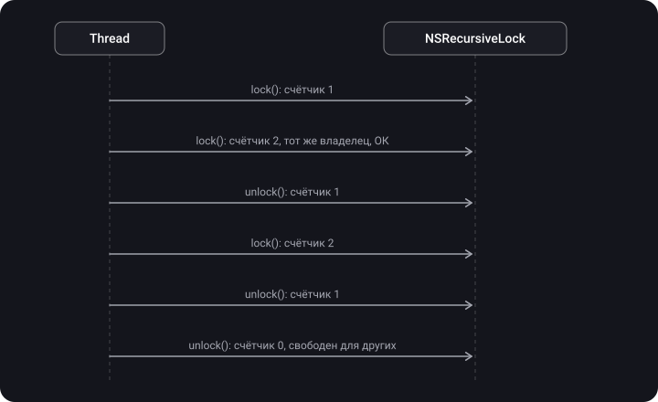
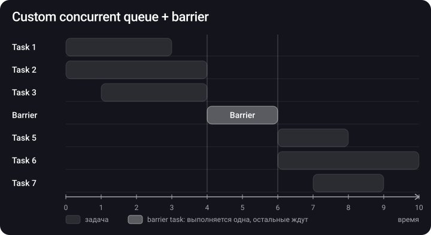
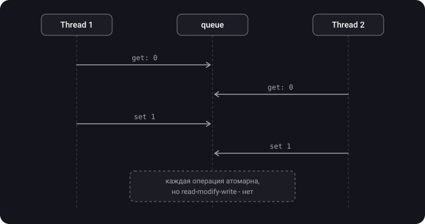

> **Что узнаешь**
>
> - Что такое потокобезопасность и критическая секция
> - Инструменты: serial queue, mutex (pthread, os_unfair_lock, NSLock, NSRecursiveLock), DispatchSemaphore, barrier, actor
> - Чем семафор отличается от мьютекса
> - Что такое атомарность и как правильно написать свою атомарную обёртку
> - Какой инструмент выбрать в конкретной ситуации

> **Нужно знать заранее:** туторы [02](../gcd/) (очереди, sync/async) и [03](../concurrency-problems/) (data race, race condition, deadlock).

## Аналогия: одна разделочная доска

- **Mutex / Lock** — на доску вешают табличку «занято». Снять её может только тот, кто повесил.
- **Recursive lock** — тот же повар может повесить табличку ещё раз, не дожидаясь самого себя, но снять должен столько же раз.
- **Семафор** — у входа лежат N жетонов. Взял жетон — заходишь; жетонов нет — ждёшь. Вернуть жетон может кто угодно.
- **Serial queue** — к доске приставлен один повар, все остальные отдают ему заказы на нарезку.
- **Barrier** — много людей могут одновременно **смотреть** на доску, но когда кто-то собирается на ней **резать**, всех просят отойти.
- **Actor** — доска стоит в отдельной комнате со своим поваром, заказы передают через окошко, и следит за этим компилятор.

## Шаг 1. Что такое потокобезопасность

> **Потокобезопасность** — способность системы работать корректно, когда несколько потоков пытаются использовать её одновременно.

**Критическая секция** — участок кода, который работает с общим состоянием и должен выполняться не более чем одним потоком одновременно. Все инструменты ниже — разные способы защитить критическую секцию.

Исходная проблема (из [тутора 03](../concurrency-problems/)): `setFullName("Bruno", "Rocha")` и `setFullName("Onurb", "Ahcor")` из двух потоков дают `"Onurb Rocha"`. Ниже будем чинить это разными способами.


## Шаг 2. Serial DispatchQueue — самый простой способ

Последовательная очередь гарантирует, что одновременно выполняется только одна задача. Значит, если все обращения к состоянию идут через неё, гонки нет.

```swift
final class Name {
    private let queue = DispatchQueue(label: "com.example.name")
    private var _firstName = ""
    private var _lastName = ""

    var fullName: String {
        queue.sync { "\(_firstName) \(_lastName)" }      // чтение — sync, нужен результат
    }

    func setFullName(firstName: String, lastName: String) {
        queue.async {                                   // запись — можно async
            self._firstName = firstName
            self._lastName = lastName                   // оба поля — в одной задаче
        }
    }
}
```

Плюсы: просто и надёжно, нет риска забыть `unlock`. Минусы: медленнее замков; `sync` изнутри этой же очереди → deadlock.

## Шаг 3. Mutex — взаимное исключение

> **Mutex (mutual exclusion)** — примитив синхронизации, который исключает одновременный доступ из разных потоков к одному ресурсу: в критическую секцию пускается **только один** поток. У мьютекса есть **владелец**: разблокировать его может только тот поток, который заблокировал.


В iOS есть несколько реализаций — от самой низкоуровневой к удобной.

### 3.1. POSIX mutex (pthread_mutex_t)

Самый низкоуровневый мьютекс; подходит, когда код должен работать на разных ОС. В заметках приведён пример на C:

```c
pthread_mutex_t mutex = PTHREAD_MUTEX_INITIALIZER;
pthread_mutex_lock(&mutex);
// Do Stuff
pthread_mutex_unlock(&mutex);
```

На Swift и с рекурсивным типом (один поток может захватить несколько раз):

```swift
var mutex = pthread_mutex_t()
var mutexAttributes = pthread_mutexattr_t()          // атрибуты мьютекса
pthread_mutexattr_init(&mutexAttributes)
pthread_mutexattr_settype(&mutexAttributes, PTHREAD_MUTEX_RECURSIVE)   // рекурсивный тип
pthread_mutex_init(&mutex, &mutexAttributes)

func doSomething1() {
    pthread_mutex_lock(&mutex)
    doSomething2()                  // тот же поток берёт мьютекс повторно — ОК для RECURSIVE
    pthread_mutex_unlock(&mutex)
}

func doSomething2() {
    pthread_mutex_lock(&mutex)
    print("Hello World!")
    pthread_mutex_unlock(&mutex)
}
```

### 3.2. os_unfair_lock — самый быстрый

`os_unfair_lock` — самая быстрая блокировка в iOS. Если нужно просто защитить короткую критическую секцию, она сделает это с максимальной производительностью. «Unfair» — потому что не гарантирует очередность ожидающих (см. starvation в [туторе 03](../concurrency-problems/)). Важно: в Swift его нельзя хранить как обычное свойство — нужен стабильный адрес в памяти, поэтому оборачиваем в класс с указателем:

```swift
final class UnfairLock {
    private var _lock: UnsafeMutablePointer<os_unfair_lock>

    init() {
        _lock = UnsafeMutablePointer<os_unfair_lock>.allocate(capacity: 1)
        _lock.initialize(to: os_unfair_lock())
    }

    deinit {
        _lock.deallocate()
    }

    func locked<ReturnValue>(_ f: () throws -> ReturnValue) rethrows -> ReturnValue {
        os_unfair_lock_lock(_lock)
        defer { os_unfair_lock_unlock(_lock) }
        return try f()
    }
}

let lock = UnfairLock()
lock.locked {
    // Critical region
}
```

С iOS 16 есть готовая безопасная обёртка `OSAllocatedUnfairLock` (модуль `os`), а с iOS 18 — `Mutex` из модуля `Synchronization`:

```swift
import os
let counter = OSAllocatedUnfairLock(initialState: 0)
counter.withLock { $0 += 1 }
```

### 3.3. NSLock

`NSLock` — реализация базового мьютекса из Foundation, объектная абстракция над `pthread_mutex`. Почему выбирают его, а не `os_unfair_lock`:

1. Им можно пользоваться напрямую, без самописной обёртки.
2. Есть дополнительные возможности — например, **тайм-аут** `lock(before:)`.

```swift
let lock = NSLock()

// Вариант 1: вручную
lock.lock()
doSomething()
lock.unlock()

// Вариант 2: withLock — unlock вызовется сам
lock.withLock {
    doSomething()
}
```

Пример:

```swift
let lock = NSLock()
private var logs: [String] = []

func lockExample() {
    lock.lock()
    logs.append("new event")     // защищённый доступ к общему массиву
    lock.unlock()
}
```

Тайм-аут — страховка от дедлока:

```swift
let nslock = NSLock()

func synchronize(action: () -> Void) {
    if nslock.lock(before: Date().addingTimeInterval(5)) {
        action()
        nslock.unlock()
    } else {
        print("Took too long to lock, did we deadlock?")
        reportPotentialDeadlock()   // non-fatal в крэш-репортер
        action()                    // продолжаем и надеемся, что сессия не сломается
    }
}
```

> **Правила NSLock:**
>
> - `unlock()` нужно вызывать **из того же потока**, на котором вызвали `lock()`. На практике это не всегда легко, особенно с зависимыми ресурсами и вложенными обращениями.
> - Повторный `lock()` на том же потоке → **deadlock**.
> - Берите `defer { lock.unlock() }` или `withLock`, чтобы не забыть отпустить замок при `return` или `throw`.

Пример:

```swift
var result = 0
let lock = NSLock()
let group = DispatchGroup()

for _ in 0..<1000 {
    DispatchQueue.global().async(group: group) {
        lock.lock()
        result += 1
        lock.unlock()
    }
}
group.wait()                            // дождаться всех задач
print(result)                           // 1000
```

### 3.4. NSRecursiveLock

`NSRecursiveLock` — это `NSLock`, который позволяет **одному и тому же потоку** захватывать блокировку несколько раз. Он считает, сколько раз был захвачен, и столько же раз его нужно отпустить, прежде чем другой поток сможет его получить.

```swift
let recursiveLock = NSRecursiveLock()

func synchronize(action: () -> Void) {
    recursiveLock.lock()
    action()
    recursiveLock.unlock()
}

func logEntered() { synchronize { print("Entered!") } }
func logExited()  { synchronize { print("Exited!") } }

func logLifecycle() {
    synchronize {
        logEntered()          // второй lock() на том же потоке
        print("Running!")
        logExited()           // и ещё один
    }
}

logLifecycle()   // No crash! С обычным NSLock был бы deadlock
```



Есть и другие замки Foundation: `NSCondition` (замок + ожидание условия `wait()` / `signal()`), `NSConditionLock`.

## Шаг 4. DispatchSemaphore

> **Semaphore** — позволяет задать **максимальное количество потоков**, которые одновременно могут обращаться к ресурсу. Если лимит достигнут — блокирует поток, пока место не освободится.

- В инициализатор передаётся целое число — сколько потоков могут работать параллельно.
- `wait()` **уменьшает** счётчик; если он стал меньше нуля — поток засыпает.
- `signal()` **увеличивает** счётчик и будит один из ожидающих потоков.
- Семафор, в отличие от NSLock, **может быть разблокирован из любого потока**.
- Семафор со значением 1 работает как мьютекс (двоичный семафор).

```swift
import Dispatch

let semaphore = DispatchSemaphore(value: 1)    // одно место → работает как мьютекс
var resourceCounter = 0                        // общий ресурс

func taskOne() {
    semaphore.wait()                           // занять место
    for _ in 1...5 {
        resourceCounter += 1
        print("Task One: \(resourceCounter)")
    }
    semaphore.signal()                         // освободить место
}

func taskTwo() {
    semaphore.wait()
    for _ in 1...5 {
        resourceCounter -= 1
        print("Task Two: \(resourceCounter)")
    }
    semaphore.signal()
}

let concurrentQueue = DispatchQueue(label: "com.exp.conQueue", attributes: .concurrent)
concurrentQueue.async { taskOne() }
concurrentQueue.async { taskTwo() }
// Сначала все 5 строк одной задачи, потом все 5 другой — без перемешивания
```

Пример с собеседования «Что такое семафор/mutex?» — задачи разной длины на concurrent-очереди выполняются по одной:

```swift
var sleepTaskArray = [UInt32]()
sleepTaskArray.append(3)
sleepTaskArray.append(7)
sleepTaskArray.append(15)

let semaphore = DispatchSemaphore(value: 1)
let queue = DispatchQueue(label: "queue", attributes: .concurrent)

for taskItem in sleepTaskArray {
    queue.async {
        semaphore.wait()
        for i in 1...taskItem {
            sleep(1)
            print("TaskItem: \(taskItem), i: \(i)")
        }
        semaphore.signal()
    }
}
// С value: 1 — задачи идут строго по одной. С value: 2 — по две одновременно.
```

Типичное практическое применение — не больше 3 загрузок одновременно:

```swift
let limiter = DispatchSemaphore(value: 3)
let downloadQueue = DispatchQueue(label: "downloads", attributes: .concurrent)

for url in urls {
    downloadQueue.async {
        limiter.wait()                      // 4-я задача ждёт, пока освободится место
        defer { limiter.signal() }
        download(url)
    }
}
```

### Семафор vs мьютекс

| Параметр | Семафор | Мьютекс |
| --- | --- | --- |
| Механизм | Сигнальный | Запирающий (блокирующий) |
| Что это | Целочисленный счётчик | Объект-замок |
| Операции | `wait()` / `signal()` | `lock()` / `unlock()` |
| Сколько потоков внутри | До N одновременно | Ровно один; много потоков могут пройти, но не одновременно |
| Владелец | Нет: значение может изменить любой поток | Есть: разблокирует только тот, кто заблокировал |
| Когда ресурс занят | Поток ждёт, пока счётчик не станет больше 0 | Поток ставится в очередь и ждёт разблокировки |
| Виды | Счётный и двоичный | Подтипов нет (есть рекурсивная вариация) |
| Передача приоритета | Нет — риск priority inversion | Да (os_unfair_lock, pthread_mutex) |

## Шаг 5. Dispatch Barrier — много читателей, один писатель

> **Dispatch Barrier** — механизм синхронизации задач в параллельной очереди. Пока выполняется барьерная задача (обычно запись), никакие другие задачи в этой очереди не выполняются: параллельная очередь на время становится последовательной.

Как работает:

1. Очередь откладывает барьерную задачу (и все, что пришли после неё), пока не завершатся все ранее отправленные задачи.
2. Затем выполняет барьерную задачу **в одиночку**.
3. После её завершения возвращается к обычному параллельному режиму.



**Паттерн reader-writer** — чтения параллельно, запись эксклюзивно:

```swift
private let concurrentQueue = DispatchQueue(label: "com.app.name", attributes: .concurrent)
private var _name: String = ""

var name: String {
    get {
        concurrentQueue.sync { _name }                     // много чтений одновременно
    }
    set {
        concurrentQueue.async(flags: .barrier) {           // запись — в одиночку
            self._name = newValue
        }
    }
}
```

Пример с выводом:

```swift
private let concurrentQueue = DispatchQueue(label: "com.gcd.dispatchBarrier", attributes: .concurrent)

for value in 1...5 {
    concurrentQueue.async { print("async \(value)") }
}
for value in 6...10 {
    concurrentQueue.async(flags: .barrier) { print("barrier \(value)") }
}
for value in 11...15 {
    concurrentQueue.async { print("sync \(value)") }
}
// async 1…5   — между собой в любом порядке
// barrier 6, 7, 8, 9, 10 — строго по одному и по порядку
// sync 11…15  — только после всех барьеров, между собой в любом порядке
```

## Шаг 6. Actor

Swift Concurrency вводит понятие актора, который инкапсулирует данные и поведение. Только одна задача одновременно получает доступ к его свойствам и методам — и это проверяет **компилятор**.

```swift
actor Counter {
    private var value = 0

    func increment() {
        value += 1               // внутри актора — безопасно
    }
}

let counter = Counter()
await counter.increment()        // снаружи — только через await
```

Подробно (reentrancy, `@MainActor`, Sendable) — в [туторе 06](../swift-concurrency/).

## Шаг 7. Атомарность

> **Атомарная операция** — операция, которая либо выполняется целиком, либо не выполняется вовсе; операция, которая не может быть частично выполнена. Операция над общей памятью атомарна, если для других потоков она завершается в один шаг: ни один поток не может увидеть её «наполовину завершённой».

**Частый вопрос на собеседовании:** что не так с этой атомарной обёрткой?

```swift
final class Atomic<Value> {
    private let queue = DispatchQueue(label: "com.test.atomic")
    private var value: Value

    init(_ value: Value) { self.value = value }

    var wrappedValue: Value {
        get { queue.sync { value } }
        set { queue.sync { value = newValue } }
    }
}
```

По отдельности геттер и сеттер безопасны. Но `atomic.wrappedValue += 1` — это **два** отдельных захода в очередь: сначала `get`, потом `set`. Между ними другой поток успеет сделать свой `get` — и гонка вернулась.



**Решение** — отдельный метод мутации, который выполняет чтение и запись внутри **одного** замыкания:

```swift
final class Atomic<A> {
    private let queue = DispatchQueue(label: "Atomic serial queue")
    private var _value: A

    init(_ value: A) {
        self._value = value
    }

    var value: A {
        get { return queue.sync { self._value } }
    }

    func mutate(_ transform: (inout A) -> ()) {
        queue.sync {
            transform(&self._value)          // чтение + изменение + запись — один шаг
        }
    }
}

let counter = Atomic(0)
counter.mutate { $0 += 1 }                   // безопасно
```

Пример из исходников Alamofire — общий протокол для любого замка с методом `around`:

```swift
private protocol Lock {
    func lock()
    func unlock()
}

extension Lock {
    /// Executes a closure returning a value while acquiring the lock.
    func around<T>(_ closure: () -> T) -> T {
        lock(); defer { unlock() }
        return closure()
    }

    /// Execute a closure while acquiring the lock.
    func around(_ closure: () -> Void) {
        lock(); defer { unlock() }
        closure()
    }
}
```

Property wrapper на NSLock:

```swift
@propertyWrapper
public struct SynchronizedLock<Value> {
    private var value: Value
    private var lock = NSLock()

    public var wrappedValue: Value {
        get { lock.synchronized { value } }
        set { lock.synchronized { value = newValue } }
    }

    public init(wrappedValue value: Value) {
        self.value = value
    }
}

private extension NSLock {
    @discardableResult
    func synchronized<T>(_ block: () -> T) -> T {
        lock()
        defer { unlock() }
        return block()
    }
}
```

> У `SynchronizedLock` **та же ловушка**, что и у первой версии `Atomic`: `@SynchronizedLock var count = 0; count += 1` — это get + set, и гонка остаётся. Для составных операций нужен метод вроде `mutate` / `withLock`.

## Сравнение инструментов

| Инструмент | Скорость | Рекурсия | Владелец / unlock из другого потока | Особенности |
| --- | --- | --- | --- | --- |
| serial DispatchQueue | Средняя | Нет (sync внутри = deadlock) | — | Просто, можно async-запись |
| os_unfair_lock | Самая высокая | Нет | Есть владелец, только тот же поток | Нужна обёртка с указателем; unfair |
| pthread_mutex | Высокая | Опционально (RECURSIVE) | Есть владелец | C API, кроссплатформенный |
| NSLock | Высокая | Нет | Есть владелец | Тайм-аут `lock(before:)`, `withLock` |
| NSRecursiveLock | Чуть ниже NSLock | Да | Есть владелец | unlock столько же раз, сколько lock |
| DispatchSemaphore | Высокая | Нет | Нет владельца, signal из любого потока | Лимит N; риск priority inversion |
| Barrier | Высокая на чтении | — | — | Только custom concurrent queue |
| actor | Высокая | Вызовы внутри актора — без await | — | Проверка компилятором; reentrancy |

## Типичные ошибки

- Забыть `unlock()` на одной из веток (`return`, `throw`) → вечная блокировка. Лечится `defer`.
- `unlock()` на другом потоке, чем `lock()`.
- Повторный `lock()` обычного NSLock на том же потоке → deadlock.
- Хранить `os_unfair_lock` как обычное `var` свойство и передавать `&lock` — адрес не гарантирован стабильным.
- `.barrier` на `DispatchQueue.global()` — барьера нет.
- `semaphore.wait()` на главном потоке или внутри Swift Concurrency (блокирует поток кооперативного пула).
- Защитить get/set по отдельности и считать, что `+=` атомарен.
- Долгая работа (сеть, диск) внутри критической секции.

## Шпаргалка

```swift
// Serial queue
queue.sync { read }            queue.async { write }

// NSLock
lock.lock(); defer { lock.unlock() }
lock.withLock { ... }
lock.lock(before: Date() + 5)  // тайм-аут

// Рекурсия → NSRecursiveLock / PTHREAD_MUTEX_RECURSIVE

// Semaphore: wait = -1 (занять), signal = +1 (освободить)
let s = DispatchSemaphore(value: 3); s.wait(); defer { s.signal() }

// Barrier (только custom concurrent!)
q.sync { read }                q.async(flags: .barrier) { write }

// Actor
actor Store { var items: [Item] = [] }     await store.add(item)

// Атомарная мутация
atomic.mutate { $0 += 1 }       // НЕ atomic.value += 1
```

## Вопросы для самопроверки

<details>
<summary>1. Чем отличается семафор от мьютекса?</summary>

Семафор — сигнальный механизм на основе счётчика: пускает до N потоков, не имеет владельца, `signal()` можно вызвать из любого потока; бывает счётным и двоичным. Мьютекс — запирающий механизм: ровно один поток в критической секции, есть владелец, разблокирует только тот, кто заблокировал.

</details>

<details>
<summary>2. Что такое атомарность?</summary>

Операция над общей памятью атомарна, если она завершается в один шаг относительно других потоков: никто не может увидеть её наполовину выполненной. Атомарная загрузка гарантирует, что переменная будет прочитана целиком в один момент; неатомарные операции такой гарантии не дают.

</details>

<details>
<summary>3. Для чего нужен NSRecursiveLock?</summary>

Его используют, когда один и тот же поток должен захватить блокировку несколько раз (рекурсия, вложенные вызовы методов с одним замком). Он считает захваты, и другой поток сможет его взять только после стольких же `unlock()`. Обычный NSLock в такой ситуации даст deadlock.

</details>

<details>
<summary>4. Что не так с Atomic, у которого get и set обёрнуты в queue.sync?</summary>

Операция `+=` выполняется как два независимых захода (get, затем set), и между ними другой поток может вклиниться. Нужен метод `mutate { $0 += 1 }`, который делает read-modify-write внутри одного `sync`.

</details>

<details>
<summary>5. Почему barrier не работает на DispatchQueue.global()?</summary>

Глобальные очереди общие для всего приложения и системы; если бы барьер работал на них, одна задача могла бы остановить чужую работу. Поэтому флаг там игнорируется — нужна собственная concurrent-очередь.

</details>

<details>
<summary>6. Чем wait() отличается от signal() у семафора?</summary>

`wait()` уменьшает счётчик и, если мест нет, усыпляет поток. `signal()` увеличивает счётчик и будит одного из ожидающих.

</details>

<details>
<summary>7. Какой инструмент выбрать для кэша, из которого часто читают и редко пишут?</summary>

Concurrent-очередь + barrier (reader-writer): чтения идут параллельно через `sync`, запись — эксклюзивно через `async(flags: .barrier)`. В новом коде на Swift Concurrency — actor.

</details>

## Источники

- [Мьютексы и захват замыканиями в Swift](https://habr.com/ru/companies/nix/articles/336260/)
- [Лайв-кодинг: Семафоры, мьютексы, локи — Алексей Щукин](https://www.youtube.com/watch?v=Jk7srtw8iIE&list=PLNSmyatBJig7GmFpPEr9oBiFSBai7V3dC&index=2&pp=iAQB)
- [Сложные вопросы по iOS и простые ответы на них — Mad Brains Техно](https://youtu.be/pWXgH-GbRSU?t=2225)
- [Основы многопоточности в iOS — Mad Brains Техно](https://www.youtube.com/watch?v=JgUBBoRydoE&list=PLw6SJ6q6-1YowmlGVks5a088XrSbihJu-&index=39)
- [Swift. Способы реализации потокобезопасных операций](https://www.youtube.com/watch?v=GDQjylf5Uho)
