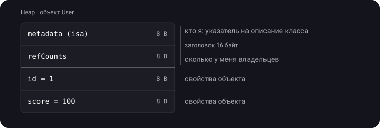
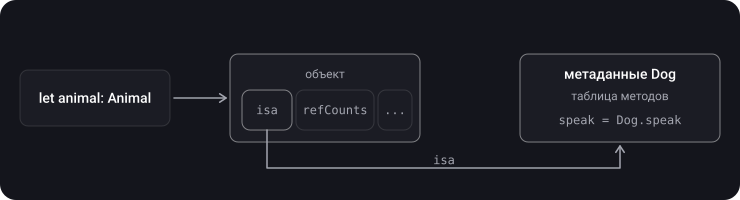
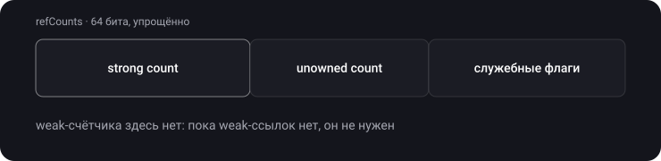
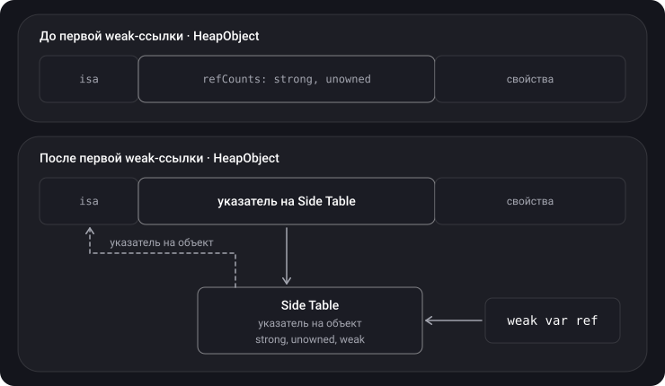
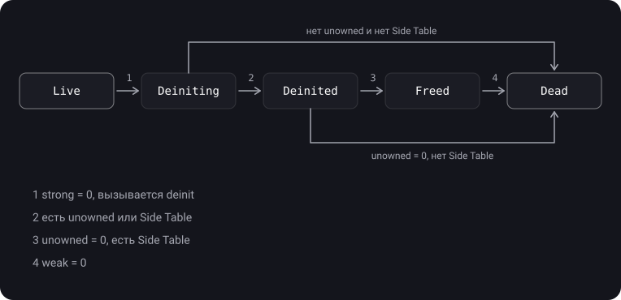

> **Что узнаешь**
>
> - Как объект класса выглядит в памяти изнутри (HeapObject)
> - Что такое isa pointer и зачем он нужен
> - Где лежат счётчики strong, unowned и weak
> - Что такое Side Table и почему weak-ссылки стоят дороже
> - Через какие состояния проходит объект от создания до полного освобождения

> **Нужно знать заранее:** [тема 05](../mrc-to-arc/) — счётчик ссылок и ARC; [тема 06](../reference-types-retain-cycle/) — strong, weak, unowned.

> **Уровень: продвинутый.** Для собеседования обычно достаточно шагов 1–4 и жизненного цикла в общих чертах. Детали реализации рантайма спрятаны в раскрывающиеся блоки «Для продвинутых».

## Аналогия: паспорт и переезд

**Объект — жилец с паспортом.** Первая строка паспорта — «кто я» (тип объекта). Вторая — «сколько у меня владельцев» (счётчик ссылок). Дальше — личные данные (свойства).

**Side Table — карточка в картотеке консьержа.** Пока жильцу никто не пишет «до востребования» (нет weak-ссылок), карточка не нужна. Как только появляется первый такой адресат, консьерж заводит карточку, а в паспорте вместо счётчика пишет номер карточки.

**Жизненный цикл — переезд:**

- **Live** — живёшь в квартире.
- **Deiniting** — собираешь вещи (выполняется `deinit`).
- **Deinited** — вещи вывезены, но у кого-то остались ключи (unowned-ссылки). Квартиру нельзя сдать новым жильцам, пока ключи не вернут.
- **Freed** — квартиру сдали. Но у консьержа ещё лежит записка «здесь больше не живёт» для тех, кто придёт по старому адресу (weak-ссылки получат `nil`).
- **Dead** — записку выбросили. От жильца не осталось ничего.

## Шаг 1. HeapObject — как объект выглядит в памяти

> **HeapObject** — внутреннее представление любого объекта класса в рантайме Swift. В коде ты его не видишь: компилятор прячет его за `class`.

```swift
final class User {
    var id: Int = 1
    var score: Int = 100
}
```



Первые 16 байт — **заголовок**, одинаковый у всех объектов. Дальше — свойства.

<details>
<summary>Сколько памяти займёт пустой класс final class Empty {}?</summary>

Минимум 16 байт — только заголовок: указатель на метаданные и счётчики. Свойств нет, но заголовок есть у любого объекта. Поэтому много мелких объектов в куче обходятся дороже, чем кажется.

</details>

## Шаг 2. isa pointer

> **isa pointer** («is a» — «является») — первое поле объекта, указатель на метаданные его класса. Название пришло из Objective-C.

Зачем он нужен:

- **Понять тип во время работы.** `animal is Dog` и `type(of: animal)` работают через него.
- **Полиморфизм.** Переменная типа `Animal` хранит `Dog`. Вызов `animal.speak()` идёт через isa к метаданным `Dog` и находит переопределённую версию метода.



## Шаг 3. Где лежат счётчики: обычный случай

У объекта на самом деле **три** счётчика: strong, unowned и weak. Пока weak-ссылок нет, strong и unowned помещаются в одно 64-битное поле `refCounts` прямо в заголовке. Места под weak-счётчик нет вовсе — он не нужен.



## Шаг 4. Side Table — когда появляется weak

> **Side Table** — отдельная структура в куче, куда переезжают **все** счётчики объекта, как только на него появляется первая weak-ссылка.

Зачем так сложно? У большинства объектов weak-ссылок не бывает никогда. Резервировать под weak-счётчик место в каждом объекте — расточительно. Поэтому место выделяется отдельно и только когда нужно.



Важная деталь: **weak-ссылка указывает на Side Table, а не на сам объект.** Благодаря этому объект можно полностью освободить, даже пока weak-ссылки ещё существуют: Side Table остаётся и отвечает им «объекта больше нет» → `nil`.

> **Главное:** вот почему `weak` дороже `unowned`. Первая weak-ссылка создаёт Side Table — отдельное выделение памяти в куче, а все операции со счётчиками начинают идти через лишний переход по указателю.

<details>
<summary>Для продвинутых: HeapObjectSideTableEntry, WeakReference и swift_weakLoadStrong</summary>

Side Table в исходниках рантайма (C++):

```cpp
class HeapObjectSideTableEntry {
  std::atomic<HeapObject*> object;   // указатель на исходный объект
  SideTableRefCounts refCounts;      // strong, unowned, weak + флаги
};
```

Когда Side Table создана, в поле `refCounts` объекта записывается указатель на неё (сдвинутый на 3 бита), а флаг `UseSlowRC` говорит рантайму: «за счётчиками иди в Side Table».

Каждая weak-переменная — это структура `WeakReference`, которая хранит указатель на Side Table. Чтение weak-переменной вызывает `swift_weakLoadStrong`: функция проверяет, жив ли объект; если жив — делает временный `retain` и возвращает объект, если нет — возвращает `nil`.

</details>

## Шаг 5. Жизненный цикл объекта

Объект не исчезает одним махом. Он проходит до пяти состояний:



| Состояние | Что происходит | Память объекта | Side Table |
| --- | --- | --- | --- |
| Live | Объект работает | занята | есть, если были weak |
| Deiniting | Выполняется `deinit`; weak уже возвращают `nil` | занята | как было |
| Deinited | `deinit` закончен, но остались unowned-ссылки | **всё ещё занята** | как было |
| Freed | Память объекта освобождена, остались weak-ссылки | свободна | **всё ещё жива** |
| Dead | Ничего не осталось | свободна | свободна |

> Посмотри на состояние **Deinited**: unowned-ссылки не дают освободить **память объекта**, хотя сам объект уже «мёртв». Именно поэтому `unowned` может надёжно крашнуть приложение при обращении: память ещё не отдана под что-то другое, и рантайм видит пометку «объект деинициализирован». А weak-ссылки держат только маленькую Side Table.

<details>
<summary>На объект остались одна unowned- и одна weak-ссылка. Strong-ссылок больше нет. Какой путь пройдёт объект?</summary>

Live → Deiniting (`deinit`) → Deinited (unowned держит память объекта) → когда unowned-ссылка исчезнет: Freed (память объекта освобождена, Side Table жива ради weak) → когда исчезнет weak-ссылка: Dead.

</details>

## Шаг 6. Историческая справка

До Swift 4 weak-ссылка указывала прямо на объект. Из-за этого после `deinit` память объекта нельзя было освободить, пока существовали weak-ссылки: объект превращался в «зомби», занимающего память. Были и проблемы с потокобезопасностью weak-ссылок. Side Table решила обе проблемы: weak-ссылки держат только её, а объект освобождается сразу.

## Типичные ошибки

- «Счётчик всегда лежит в заголовке». Только пока нет weak-ссылок; потом — в Side Table.
- «Weak указывает на объект». Weak указывает на Side Table.
- Путать Deinited и Dead: после `deinit` память объекта может ещё жить из-за unowned-ссылок.
- «isa — отдельная от HeapObject сущность». Это первое поле заголовка объекта.

## Шпаргалка

```text
HeapObject = [ isa (8) | refCounts (8) | свойства... ]  — заголовок 16 байт
isa        = указатель на метаданные класса → тип, полиморфизм
refCounts  = strong + unowned в одном 64-битном поле (пока нет weak)

Первая weak-ссылка → создаётся Side Table
  в заголовке вместо счётчиков — указатель на Side Table
  в Side Table — strong, unowned, weak
  weak-переменные указывают на Side Table, не на объект

Жизненный цикл:
  Live → Deiniting (strong = 0, deinit)
       → Dead      (нет unowned, нет Side Table)
       → Deinited  (unowned держит память объекта)
           → Freed (память объекта свободна, Side Table жива ради weak)
               → Dead (weak = 0)
```

## Вопросы для самопроверки

<details>
<summary>1. Что лежит в заголовке любого объекта класса?</summary>

Указатель на метаданные типа (isa) и поле счётчиков ссылок — по 8 байт на 64-битной платформе.

</details>

<details>
<summary>2. Зачем нужен isa pointer?</summary>

Чтобы во время работы знать настоящий тип объекта: для проверок типа и для вызова правильной переопределённой реализации метода.

</details>

<details>
<summary>3. Когда создаётся Side Table и что в ней хранится?</summary>

При первой weak-ссылке на объект. В ней указатель на объект и все счётчики: strong, unowned и weak.

</details>

<details>
<summary>4. На что указывает weak-ссылка и почему это важно?</summary>

На Side Table. Благодаря этому память объекта можно освободить, даже пока weak-ссылки существуют: Side Table останется и вернёт им `nil`.

</details>

<details>
<summary>5. Почему weak дороже unowned?</summary>

Первая weak-ссылка требует выделить в куче Side Table, а все операции со счётчиками идут через дополнительный указатель.

</details>

<details>
<summary>6. Почему обращение к unowned после освобождения объекта даёт предсказуемый краш, а не мусор?</summary>

Пока есть unowned-ссылки, память объекта не освобождается (состояние Deinited). Рантайм видит, что объект уже деинициализирован, и останавливает программу контролируемой ошибкой.

</details>

## Источники

- [HeapObject](https://github.com/apple/swift/blob/main/stdlib/public/runtime/HeapObject.cpp)
- [RefCount.h — описание состояний объекта](https://github.com/apple/swift/blob/main/stdlib/public/SwiftShims/swift/shims/RefCount.h)
- [WeakReference](https://github.com/apple/swift/blob/9a5bb49067e21d33c73b32843dcc95f8a88d7a9d/stdlib/public/runtime/WeakReference.h#L156)
- [swift_weakLoadStrong](https://github.com/apple/swift/blob/c39901d7fb34debbaf51d225b01f2869cd0b101f/stdlib/public/runtime/HeapObject.cpp#L909)
- [swift_deallocObject](https://github.com/apple/swift/blob/c39901d7fb34debbaf51d225b01f2869cd0b101f/stdlib/public/runtime/HeapObject.cpp#L888)
