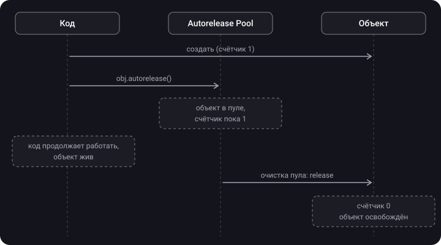

> **Что узнаешь**
>
> - Что такое `autorelease` и зачем он появился
> - Как работает autorelease pool и когда он очищается
> - Когда в Swift-коде нужен явный `autoreleasepool { }`
> - Как он меняет график потребления памяти

> **Нужно знать заранее:** [тема 05](../mrc-to-arc/) — MRC, `retain` / `release`, ARC.

## Аналогия: мусорная корзина в офисе

Ты не бегаешь к уличному контейнеру с каждой скомканной бумажкой. Бросаешь её в корзину под столом, а уборщик вечером выносит всё разом.

- **`release`** — сразу отнёс бумажку на улицу.
- **`autorelease`** — бросил в корзину: выбросят, но позже.
- **Autorelease pool** — сама корзина.
- **Конец цикла событий (run loop)** — вечерняя уборка.
- **`autoreleasepool { }` внутри цикла** — ты печатаешь 1000 черновиков за вечер. Корзина переполнится задолго до уборки, поэтому выносишь её после каждой пачки.

## Шаг 1. Проблема, которую решает autorelease

В MRC у каждого объекта должен быть владелец, который вызовет `release`. А если функция создаёт объект и **возвращает** его?

```objective-c
- (NSString *)makeGreeting {
    NSString *s = [[NSString alloc] initWithFormat:@"Привет"]; // счётчик 1, владелец — мы
    return s;   // ??? кто вызовет release?
}
```

- Сделать `release` перед `return` — объект удалится раньше, чем его получит вызывающий код.
- Не делать — утечка, если вызывающий забудет про `release`.

Решение — **отложенный release**:

```objective-c
- (NSString *)makeGreeting {
    NSString *s = [[NSString alloc] initWithFormat:@"Привет"];
    return [s autorelease];   // «выбросить позже»: объект доживёт до вызывающего кода
}
```

> **`autorelease`** — пометить объект для отложенного `release`. Счётчик уменьшается не сейчас, а когда очистится autorelease pool.

Отсюда классическое правило Objective-C: методы, чьё имя начинается на `alloc`, `new`, `copy`, `mutableCopy`, возвращают объект, которым ты **владеешь** (нужен `release`). Все остальные — например `[NSString stringWithFormat:]` — возвращают объект через `autorelease`: владеть им не нужно, он сам уйдёт при очистке пула.

## Шаг 2. Autorelease pool

> **Autorelease pool** — хранилище объектов, которым отправили `autorelease`. При очистке пул отправляет `release` каждому из них.



**Когда пул очищается:**

- на главном потоке — в конце каждой итерации run loop (UIKit оборачивает каждую итерацию в свой пул);
- в конце блока `autoreleasepool { }`;
- в Objective-C вручную — вызовом `drain` у `NSAutoreleasePool` (старый стиль) или по закрывающей скобке `@autoreleasepool { }`.

У очередей GCD есть параметр `autoreleaseFrequency`. Со значением `.workItem` очередь оборачивает каждую задачу в свой пул:

```swift
let queue = DispatchQueue(label: "com.app.images", autoreleaseFrequency: .workItem)
```

## Шаг 3. Нужно ли это в Swift?

Чистые Swift-объекты через autorelease pool не проходят — ARC отпускает их сразу при выходе из области видимости. Пул важен, когда код **вызывает Objective-C API**: UIKit, Foundation, Core Graphics и т.д. Они могут возвращать autorelease-объекты, и те копятся в пуле до его очистки.

> **Главное:** в обычном коде `autoreleasepool` писать не нужно. Он нужен в одном типичном сценарии — **цикл, который создаёт много тяжёлых временных объектов через Objective-C API**.

## Шаг 4. Главный сценарий: тяжёлый цикл

```swift
func processImages(paths: [String]) {
    for path in paths {                                   // 1000 файлов
        autoreleasepool {
            guard let image = UIImage(contentsOfFile: path) else { return }
            let thumbnail = makeThumbnail(from: image)
            save(thumbnail)
        }   // ← пул очищается здесь, на каждой итерации
    }
}
```

<details>
<summary>Что будет без autoreleasepool внутри цикла?</summary>

Временные объекты всех 1000 итераций накопятся в пуле текущей итерации run loop. Цикл `for` целиком выполняется в одной итерации run loop, поэтому пул очистится только после его окончания. Пик памяти = сумма временных объектов всех итераций.

</details>

**Как это выглядит на графике памяти:**


## Шаг 5. Цена

Создание и очистка пула — не бесплатные операции. Оборачивать каждую итерацию каждого цикла «на всякий случай» не нужно: выигрыш заметен только там, где на итерации создаются тяжёлые временные объекты.

Если итераций много, а объекты лёгкие, можно очищать пул раз в N итераций — например, обработать файлы пачками по 50 и оборачивать в `autoreleasepool` каждую пачку.

## Типичные ошибки

- `autoreleasepool` в каждом цикле подряд → накладные расходы без пользы.
- Путать `autorelease` и `release`: `autorelease` **не** уменьшает счётчик сразу, объект живёт до очистки пула.
- Ждать экономии памяти от `autoreleasepool` с `UIImage(named:)` — картинки остаются в системном кэше.
- Ставить `autoreleasepool` в чистом Swift-коде без Objective-C API — объекты и так освобождаются сразу.

## Шпаргалка

```text
release        = −1 сейчас
autorelease    = −1 потом, при очистке пула
Пул очищается  = конец итерации run loop (main) / конец autoreleasepool { } / drain
Objective-C    = alloc/new/copy/mutableCopy → ты владеешь; остальное → autorelease

Swift: нужен только в циклах с тяжёлыми временными объектами из Objective-C API
       for x in items { autoreleasepool { ...тяжёлое... } }
       GCD: DispatchQueue(label:, autoreleaseFrequency: .workItem)
Не злоупотреблять: у пула есть цена
```

## Вопросы для самопроверки

<details>
<summary>1. Чем autorelease отличается от release?</summary>

`release` уменьшает счётчик сразу. `autorelease` откладывает это до очистки autorelease pool — до тех пор объект жив.

</details>

<details>
<summary>2. Зачем вообще появился autorelease?</summary>

Чтобы метод мог вернуть созданный объект: сразу отпустить его нельзя (удалится раньше, чем его получат), а не отпускать — утечка. Отложенный `release` решает обе проблемы.

</details>

<details>
<summary>3. Когда очищается autorelease pool на главном потоке?</summary>

В конце каждой итерации run loop.

</details>

<details>
<summary>4. Когда в Swift-коде нужен явный autoreleasepool?</summary>

В циклах, где на каждой итерации создаются тяжёлые временные объекты через Objective-C API (картинки, `Data`, объекты Foundation), чтобы не накапливать их до конца всего цикла.

</details>

<details>
<summary>5. Почему autoreleasepool не поможет с UIImage(named:)?</summary>

`UIImage(named:)` складывает изображения в системный кэш. Их держит кэш, а не пул, поэтому очистка пула их не освободит.

</details>

## Источники

- [Управление памятью в Swift](https://swiftme.ru/upravlenie-pamyatyu-v-swift-8281/#autoreleasepool)
- [Сложные вопросы по iOS и простые ответы на них - Mad Brains Техно](https://youtu.be/pWXgH-GbRSU?t=1258)
- [Управление памятью в Swift - Mad Brains Техно 1.08.19](https://youtu.be/NF19v4Ef6KA?list=PLw6SJ6q6-1YowmlGVks5a088XrSbihJu-&t=1751)
- [Swift: ARC и управление памятью](https://habr.com/ru/articles/451130/)
