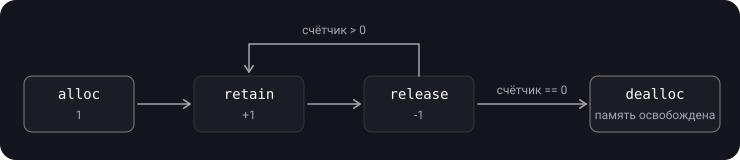
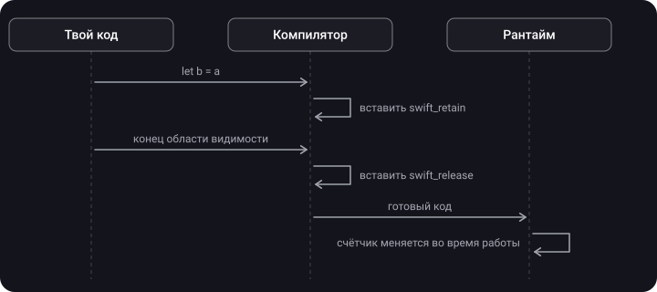

> **Что узнаешь**
>
> - Зачем объекту в куче счётчик ссылок
> - Как управляли памятью вручную (MRC) и какие ошибки это порождало
> - Что именно ARC делает за тебя и на каком этапе
> - Где физически хранится счётчик ссылок
> - Чем ARC отличается от сборщика мусора

> **Нужно знать заранее:** темы [01](../memory-segments-memorylayout/)–[03](../value-reference-copying/) — объекты классов живут в куче, в переменной лежит только ссылка.

## Аналогия: свет в переговорке

Объект — переговорная комната. Свет в ней горит, пока внутри есть хоть один человек. Последний вышедший выключает свет — объект освобождается.

- **Счётчик ссылок** — табло над дверью: сколько людей внутри.
- **MRC** — каждый сам отмечается в журнале на входе и выходе. Забыл отметиться при выходе — табло никогда не покажет 0, свет горит вечно (утечка). Отметился на выходе дважды — табло покажет 0, пока внутри ещё люди, и свет погаснет у них на глазах (краш).
- **ARC** — турникет на двери. Он сам считает вход и выход, человек ничего не делает.

## Шаг 1. Зачем вообще считать ссылки

Объект класса лежит в куче и не исчезает при выходе из функции ([тема 01](../memory-segments-memorylayout/)). Значит, кто-то должен решить, **когда** его удалить:

- удалить слишком рано → кто-то обратится к освобождённой памяти → краш;
- не удалить вовсе → память никогда не вернётся → утечка.

Решение Apple: у каждого объекта есть **счётчик ссылок** — сколько сильных ссылок на него сейчас существует. Стал 0 — объект никому не нужен, можно удалять.

## Шаг 2. MRC — ручной подсчёт

> **MRC (Manual Reference Counting)** — подход Objective-C до 2011 года: разработчик сам увеличивал и уменьшал счётчик вызовами методов.

- **`alloc`** — создаёт объект, счётчик = 1.
- **`retain`** — +1: «мне тоже нужен этот объект».
- **`release`** — −1: «мне он больше не нужен».
- **`dealloc`** — вызывается автоматически, когда счётчик стал 0: память освобождается.

```objective-c
MyObject *obj = [[MyObject alloc] init]; // 1
[obj retain];                             // 2
[obj release];                            // 1
[obj release];                            // 0 → dealloc
```



**Главное правило MRC:** на каждый `alloc` / `retain` — ровно один `release`.

<details>
<summary>Найди ошибку</summary>

```objective-c
- (void)showName {
    NSString *name = [[NSString alloc] initWithFormat:@"User %d", 42]; // 1
    self.label.text = name;   // label сам сделал retain → 2, а потом отпустит сам
}
```

Нет `[name release]` в конце метода. `alloc` дал +1, а парного `release` нет — после того как label отпустит строку, счётчик останется 1 навсегда. Утечка.

</details>

Ошибки MRC:

- забыл `release` → **утечка**;
- лишний `release` → объект удалён, пока им пользуются → **краш**;
- два объекта сделали `retain` друг на друга → **retain cycle** ([тема 06](../reference-types-retain-cycle/)).

## Шаг 3. ARC — автоматический подсчёт

> **ARC (Automatic Reference Counting)** — компилятор сам расставляет `retain` и `release` в код. Правила те же, что в MRC, но их выполняет компилятор, а не человек.

Ты пишешь:

```swift
func example() {
    let a = Person(name: "Аня")
    let b = a
    print(b.name)
}
```

Компилятор превращает это примерно в:

```swift
func example() {
    let a = Person(name: "Аня")   // выделение, счётчик 1
    let b = a
    swift_retain(b)               // 2
    print(b.name)
    swift_release(b)              // 1
    swift_release(a)              // 0 → deinit, память освобождена
}
```

(Оптимизатор часто убирает лишние пары `retain`/`release`, если видит, что они ничего не меняют.)



> **Решение** о том, где будут `retain` и `release`, принимается **при компиляции**. А сам **подсчёт** — реальное изменение числа — происходит **во время работы** приложения. На собеседованиях это любят уточнять.

## Шаг 4. С чем работает ARC

ARC считает ссылки на **экземпляры классов**, а также на замыкания и акторы — всё это reference-типы.

Структуры и перечисления — value-типы: у них нет «владельцев», каждая переменная хранит свою копию, считать нечего.

## Шаг 5. Где хранится счётчик

Отдельной области памяти для счётчиков нет. Счётчик лежит **в заголовке самого объекта**, рядом с указателем на его тип:


Раз объект в куче — и счётчик в куче. Как устроено это битовое поле и что происходит при появлении weak-ссылок — [тема 07](../arc-internals/).

## Шаг 6. ARC vs сборщик мусора

|  | ARC (Swift, Objective-C) | Garbage Collector (Java, C#, Go) |
| --- | --- | --- |
| Когда освобождается объект | Сразу, как счётчик стал 0 | Когда-нибудь, во время сборки мусора |
| Паузы в работе приложения | Нет | Возможны |
| Циклы ссылок | Не находит — утечка, решает разработчик | Находит и собирает сам |
| Стоимость | retain/release на каждую операцию со ссылкой | Периодическое сканирование памяти |

> **Главное:** ARC детерминирован — ты точно знаешь, что `deinit` вызовется в момент, когда уйдёт последняя strong-ссылка. Плата за это — циклы ссылок приходится разрывать самому ([тема 06](../reference-types-retain-cycle/)).

## Шаг 7. Как подсмотреть счётчик (только для отладки)

```swift
let user = User()
print(CFGetRetainCount(user))   // число может оказаться больше ожидаемого
```

Значение часто больше «интуитивного»: временные ссылки добавляют сам вызов функции и оптимизации компилятора. Для логики приложения на это число полагаться нельзя.

## Шаг 8. Нюансы

- При многопоточной работе объект удаляется в том потоке, где случился последний `release`. Поэтому `deinit` может выполниться не на главном потоке.
- Операции со счётчиком атомарны: `retain`/`release` из разных потоков не ломают счётчик. Но это не делает потокобезопасными **свойства** объекта.

## Типичные ошибки

- «ARC — это сборщик мусора». Нет: ARC не сканирует память, он вставляет `retain`/`release` при компиляции.
- «ARC работает со структурами». Нет: только с reference-типами.
- «ARC сам разорвёт цикл». Не разорвёт — нужны `weak` / `unowned`.
- Полагаться на значение счётчика в коде.

## Шпаргалка

```text
Счётчик ссылок = сколько strong-ссылок на объект. 0 → deinit + освобождение

MRC: alloc (=1), retain (+1), release (−1), dealloc (при 0)
     забыл release → утечка;  лишний release → краш

ARC: компилятор сам вставляет swift_retain / swift_release
     решение — при компиляции, подсчёт — во время работы
     только для reference-типов (class, closure, actor)

Счётчик хранится в заголовке объекта (в куче), битовое поле
ARC ≠ GC: освобождает сразу, без пауз, но циклы не находит
Отладка: CFGetRetainCount(obj) — не для логики
```

## Вопросы для самопроверки

<details>
<summary>1. Назови четыре операции MRC.</summary>

`alloc` — создать объект, счётчик 1; `retain` — +1; `release` — −1; `dealloc` — освободить память, когда счётчик стал 0.

</details>

<details>
<summary>2. Когда ARC вставляет retain/release и когда они выполняются?</summary>

Вставляет компилятор при сборке. Выполняются во время работы приложения.

</details>

<details>
<summary>3. Работает ли ARC со структурами?</summary>

Нет. У value-типов нет общих владельцев — считать нечего. Если значение попало в кучу, счётчик есть у служебной коробки, а не у самой структуры.

</details>

<details>
<summary>4. Где хранится счётчик ссылок?</summary>

В заголовке самого объекта, рядом с указателем на тип. Это битовое поле.

</details>

<details>
<summary>5. Чем ARC отличается от сборщика мусора?</summary>

ARC освобождает объект сразу, как только счётчик стал 0, без пауз; но не умеет находить циклы. GC освобождает объекты периодически и циклы находит сам.

</details>

<details>
<summary>6. На каком потоке вызовется deinit?</summary>

На том, где была отпущена последняя strong-ссылка. Это не обязательно главный поток.

</details>

## Источники

- [Управление памятью в Swift](https://swiftme.ru/upravlenie-pamyatyu-v-swift-8281/#refcounting)
- [С чего все началось? (MRC)](https://iosdeeptech.github.io/ios_deep_tech/Swift/ARC/Junior/1.%20%D0%A1%20%D1%87%D0%B5%D0%B3%D0%BE%20%D0%B2%D1%81%D0%B5%20%D0%BD%D0%B0%D1%87%D0%B0%D0%BB%D0%BE%D1%81%D1%8C%3F%20%28MRC%29/)
- [Как устроен счетчик ссылок в Swift](https://habr.com/ru/companies/vivid_money/articles/592599/)
- [Swift: ARC и управление памятью](https://habr.com/ru/articles/451130/)
- [Что нужно знать об ARC](https://habr.com/ru/articles/209288/)
- [Automatic Reference Counting: часть 1](https://habr.com/ru/articles/129874/)
- [Память в Swift от 0 до 1](https://habr.com/ru/companies/hh/articles/546856/)
- [Управление памятью в Swift](https://habr.com/ru/articles/592385/)
- [Память в Swift (куча, стек, ARC)](https://habr.com/ru/companies/otus/articles/649329/)
- [Вопросы с собеседований: Что такое ARC (Automatic Reference Counting)](https://apptractor.ru/info/techhype/arc.html)
- [Основы Swift программирования: 14.1. Основы ARC](https://www.youtube.com/watch?v=fYjpXUGND9w)
- [№5635 - Все что нужно знать об ARC в Swift](https://www.youtube.com/watch?v=x0KWpxRrk8c)
