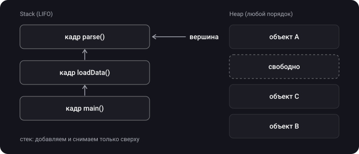
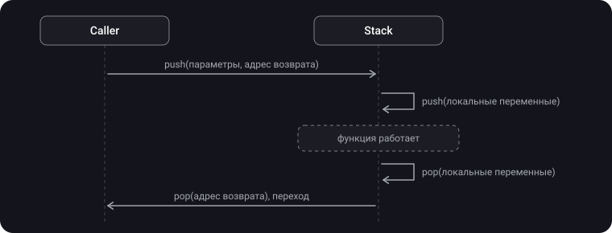
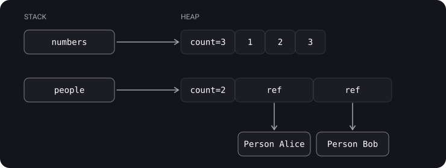

> **Что узнаешь**
>
> - Как устроен стек и почему он такой быстрый
> - Как устроена куча и почему она медленнее
> - Кто и когда освобождает память в стеке и в куче
> - Почему у массива «шапка» может быть в стеке, а элементы — в куче
> - Откуда берётся stack overflow

> **Нужно знать заранее:** [тема 01](../memory-segments-memorylayout/) — четыре области памяти, кадр стека, «ссылка в стеке, объект в куче».

## Аналогия: стопка тарелок и склад

- **Стек** — стопка тарелок. Новую ставишь сверху, берёшь тоже только сверху. Ничего не нужно искать: верх всегда один. Вынуть тарелку из середины нельзя.
- **Куча** — большой склад с кладовщиком. Приходишь: «мне полку на 3 метра». Кладовщик ищет свободное место подходящего размера, записывает в журнал, что полка занята. Когда вещь больше не нужна, полку освобождают и вычёркивают из журнала. Со временем свободные места становятся «дырявыми» — много мелких промежутков между занятыми полками (фрагментация).

## Шаг 1. Стек — LIFO

> **Стек** — область памяти потока, где данные кладутся и снимаются строго с одного конца: **последним пришёл — первым вышел** (LIFO, Last In, First Out).



## Шаг 2. Как работает стек при вызове функции

1. **Вызов** — в стек кладутся параметры и адрес возврата (куда вернуться после функции).
2. **Работа** — функция кладёт в стек свои локальные переменные.
3. **Завершение** — локальные переменные снимаются, результат сохраняется.
4. **Возврат** — из стека берётся адрес возврата, выполнение переходит туда.
5. Параметры тоже снимаются со стека.



**Почему стек такой быстрый?** Всё, что нужно процессору, — один регистр `sp` (stack pointer), указывающий на вершину. Выделить 16 байт — значит просто сдвинуть его:

```text
; ARM64 (iPhone)
sub sp, sp, #16   ; зарезервировали 16 байт под локальные переменные
...
add sp, sp, #16   ; освободили — вернули указатель на место
```

Никакого поиска, никакого журнала. Выделение и освобождение — одна арифметическая операция.

## Шаг 3. Как работает куча

> **Куча** — общая для всех потоков область, из которой можно в любой момент запросить блок произвольного размера и освободить его в любом порядке.

Что происходит, когда ты пишешь `let user = User()`:

1. Аллокатор (`malloc`) ищет свободный блок подходящего размера.
2. Отмечает его как занятый в своих служебных структурах («журнал кладовщика»).
3. Возвращает адрес блока — он и попадает в переменную `user` в стеке.
4. Когда на объект не остаётся strong-ссылок, ARC вызывает освобождение, и блок возвращается аллокатору.

Отсюда цена кучи: поиск места, учёт занятых блоков, потокобезопасность аллокатора (куча общая для всех потоков) и фрагментация.

## Шаг 4. Stack vs Heap

| Критерий | Stack | Heap |
| --- | --- | --- |
| Сколько на приложение | Один на каждый поток | Одна на всё приложение |
| Что хранит | Локальные value-типы с известным размером, ссылки | Объекты классов; value-типы в особых случаях ([тема 04](../value-types-on-heap-existential/)) |
| Порядок освобождения | Строго LIFO | Любой |
| Кто освобождает | Автоматически при выходе из функции | ARC, когда счётчик ссылок стал 0 |
| Скорость | Очень быстро: сдвиг указателя | Медленнее: поиск места, учёт блоков, синхронизация |
| Размер | Маленький и фиксированный | Растёт по мере необходимости |
| Потокобезопасность | Свой у каждого потока — гонок нет | Общая — доступ из разных потоков нужно синхронизировать |

## Шаг 5. Массив: шапка в стеке, элементы в куче

`Array` — value-тип, но количество элементов заранее неизвестно. Поэтому массив устроен в две части:

```swift
class Person {
    let name: String
    init(name: String) { self.name = name }
}

let numbers = [1, 2, 3]
let people = [Person(name: "Alice"), Person(name: "Bob")]
```



- Переменная массива — маленькая «шапка» (по сути указатель на буфер). Она может жить в стеке.
- Сами элементы лежат в куче, в одном непрерывном буфере.
- Если элементы — value-типы (`Int`), они лежат прямо в буфере.
- Если элементы — классы, в буфере лежат **ссылки**, а сами объекты — отдельно в куче.

> **Главное:** «value → стек, reference → куча» — полезное правило для старта, но не закон. Массив, строка и словарь — value-типы, чьи данные живут в куче.

## Шаг 6. Stack overflow

Стек маленький и не растёт бесконечно. Если функция вызывает сама себя без условия выхода, кадры копятся, пока место не кончится:

```swift
func countDown(_ n: Int) {
    countDown(n - 1)   // нет условия остановки
}
countDown(10)          // 💥 EXC_BAD_ACCESS — переполнение стека
```

Размер стека задаётся при создании потока. На iOS у главного потока — 1 МБ, у дополнительных — 512 КБ по умолчанию (у `Thread` можно поменять через свойство `stackSize` до запуска).

## Шаг 7. Нюансы

- `indirect enum` (рекурсивный enum) хранит свои случаи в куче: компилятор не может заранее знать его размер.
- Классическая схема «куча и стек растут навстречу друг другу» — удобная модель. В реальной системе у каждого потока свой отдельный стек, так что на схеме «одна куча и один стек» показан один поток.

## Типичные ошибки

- «Куча медленнее, потому что это куча». Нет — потому что нужно искать место, вести учёт и синхронизировать доступ между потоками.
- «Value-тип всегда в стеке». Элементы массива, строки, словаря — в куче.
- «Стек один на приложение». Стек — на поток.
- Глубокая рекурсия без условия выхода → stack overflow.

## Шпаргалка

```text
Stack  = LIFO, свой у каждого потока, выделение = сдвиг sp
         освобождается сам при выходе из функции
         маленький: main 1 МБ, другие потоки 512 КБ (iOS)
Heap   = общая, блоки любого размера в любом порядке
         выделяет malloc, объекты классов освобождает ARC
         медленнее: поиск места + учёт + синхронизация + фрагментация

Array/String/Dictionary = шапка может быть в стеке, данные — в куче
[ClassType]             = в буфере ссылки, объекты отдельно в куче
Бесконечная рекурсия    = stack overflow
```

## Вопросы для самопроверки

<details>
<summary>1. По какому принципу организован стек?</summary>

LIFO — последним пришёл, первым вышел.

</details>

<details>
<summary>2. Что кладётся в стек при вызове функции?</summary>

Параметры и адрес возврата, затем — локальные переменные функции.

</details>

<details>
<summary>3. Почему выделение памяти в куче дороже, чем в стеке?</summary>

В стеке это один сдвиг указателя. В куче аллокатор ищет свободный блок нужного размера, ведёт учёт занятых блоков и синхронизирует доступ, потому что куча общая для всех потоков.

</details>

<details>
<summary>4. Массив [Person], где Person — класс. Где что лежит?</summary>

Шапка массива (указатель на буфер) может быть в стеке. Буфер с элементами — в куче, в нём лежат ссылки. Сами объекты `Person` — тоже в куче, отдельно.

</details>

<details>
<summary>5. Что такое stack overflow и когда он возникает?</summary>

Переполнение стека: кадры функций заняли всё отведённое потоку место. Обычно из-за бесконечной или слишком глубокой рекурсии.

</details>

## Источники

- [A 03 Стэк и куча (Васюков А.В., 2019)](https://www.youtube.com/watch?v=O-TvywJfo1I)
- [Threading Programming Guide — Thread Costs (Apple)](https://developer.apple.com/library/archive/documentation/Cocoa/Conceptual/Multithreading/CreatingThreads/CreatingThreads.html)
