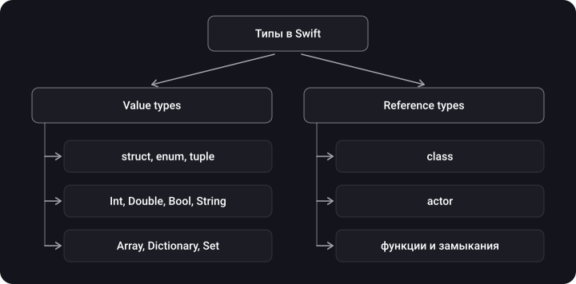
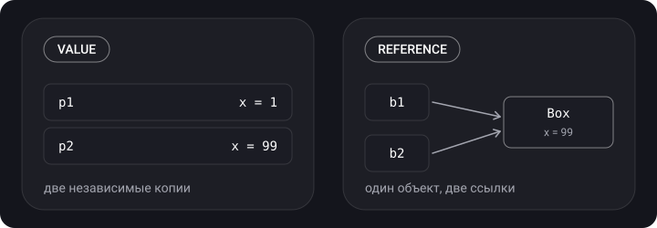
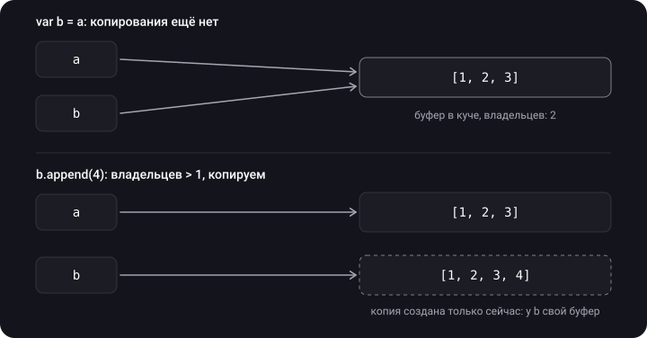

> **Что узнаешь**
>
> - Чем value type отличается от reference type и какие типы к чему относятся
> - Что происходит при присваивании и передаче в функцию
> - Как работают `inout` и `mutating`
> - Разницу между `==` и `===`
> - Как устроен Copy-on-Write и как написать его самому
> - Чем deep copy отличается от shallow copy

> **Нужно знать заранее:** темы [01](../memory-segments-memorylayout/)–[02](../stack-heap/) — стек, куча, «ссылка в стеке, объект в куче».

## Аналогия: ксерокопия и ссылка на документ

- **Value type** — ксерокопия. Дал коллеге копию договора, он что-то зачеркнул — твой экземпляр не изменился.
- **Reference type** — ссылка на общий Google-документ. Дал ссылку, коллега поправил текст — ты видишь правку, потому что документ один.
- **Copy-on-Write** — хитрый отдел документов. Выдаёт всем ссылку «только для чтения». Настоящую копию делает только тогда, когда кто-то берёт ручку, чтобы что-то исправить.

## Шаг 1. Два вида типов



> **Value type** — при присваивании или передаче копируется **значение**. У каждой переменной своя независимая копия.
>
> **Reference type** — копируется **ссылка**. Все переменные указывают на один и тот же объект.

```swift
struct Point { var x: Int }
var p1 = Point(x: 1)
var p2 = p1          // копия
p2.x = 99

class Box { var x = 1 }
let b1 = Box()
let b2 = b1          // та же ссылка
b2.x = 99
```

<details>
<summary>Чему равны p1.x и b1.x?</summary>

`p1.x == 1` — `p2` получил независимую копию. `b1.x == 99` — `b1` и `b2` указывают на один объект.

</details>



## Шаг 2. Передача в функцию

```swift
func resetValue(_ point: Point) {
    var copy = point
    copy.x = 0         // меняем только локальную копию
}

func resetReference(_ box: Box) {
    box.x = 0          // меняем общий объект
}
```

- Value type → функция получает **копию**. Снаружи ничего не меняется.
- Reference type → функция работает с **тем же объектом**. Изменения видны снаружи.

## Шаг 3. `inout` — «верни мне изменённое»

По умолчанию параметр-значение — константа-копия. `inout` позволяет функции изменить переменную вызывающего кода:

```swift
func double(_ value: inout Int) {
    value *= 2
}

var number = 21
double(&number)    // & — явный сигнал: переменную могут изменить
print(number)      // 42
```

**Как это работает:** модель — «скопировать внутрь, скопировать наружу» (copy-in copy-out). Значение передаётся в функцию, функция его меняет, и по завершении результат записывается обратно в исходную переменную. Компилятор обычно оптимизирует это до передачи адреса, но полагаться на это как на «передачу по ссылке» не стоит.

## Шаг 4. `mutating` — метод, который меняет структуру

```swift
struct Counter {
    var value = 0
    mutating func increment() {
        value += 1
    }
}

var counter = Counter()
counter.increment()      // ✅

let fixed = Counter()
fixed.increment()        // ❌ ошибка компиляции
```

Обычный метод структуры получает `self` как константу и менять его не может. `mutating`-метод получает `self` как `inout`-параметр: может менять поля и даже целиком присвоить `self = Counter()`. На `let`-константе такой метод вызвать нельзя — константу по определению менять запрещено.

## Шаг 5. `==` и `===`

- **`==`** — одинаковые ли **данные**? Работает для типов, реализующих `Equatable`.
- **`===`** — один и тот же ли это **объект** в памяти? Только для классов.

```swift
let a = Box(), b = Box()
a === b      // false — два разных объекта, даже если поля одинаковые
a === a      // true
```

## Шаг 6. Как выбрать value или reference

| Бери struct, если… | Бери class, если… |
| --- | --- |
| Важно, одинаковы ли данные (`==`) | Важно, тот ли это самый объект (`===`) |
| Копии должны жить независимо | Нужно общее изменяемое состояние |
| Модель данных: координата, настройки, ответ сервера | Сущность с идентичностью и жизненным циклом: сервис, контроллер, соединение |

**Про многопоточность.** Value-типы помогают избежать гонок: если каждый поток получил **свою копию**, делить нечего. Но это работает только при копировании. Одна и та же `var`-переменная, к которой два потока обращаются одновременно, — data race, даже если в ней лежит `Int` (см. [тутор «Многопоточность → 03»](../../concurrency/concurrency-problems/)).

## Шаг 7. Copy-on-Write

Для маленькой структуры полное копирование при каждом присваивании дёшево. А для массива на миллион элементов — дорого. Поэтому `Array`, `Dictionary`, `Set` и `String` используют **Copy-on-Write (CoW)**:

1. `var b = a` — реальной копии нет, оба указывают на один буфер в куче.
2. Пока никто не меняет данные, буфер общий.
3. Первая попытка изменить `b` → проверка «я единственный владелец буфера?» → нет → создаётся копия, и меняется уже она.



**Свой CoW.** Обёртка над классом + проверка `isKnownUniquelyReferenced`:

```swift
final class Storage<T> {
    var value: T
    init(_ value: T) { self.value = value }
}

struct CoWBox<T> {
    private var storage: Storage<T>

    init(_ value: T) { storage = Storage(value) }

    var value: T {
        get { storage.value }
        set {
            if isKnownUniquelyReferenced(&storage) {
                storage.value = newValue          // единственный владелец — меняем на месте
            } else {
                storage = Storage(newValue)        // есть другие владельцы — делаем копию
            }
        }
    }
}
```

- `Storage` — класс, поэтому несколько `CoWBox` могут делить один экземпляр.
- При записи `isKnownUniquelyReferenced` проверяет, есть ли у хранилища другие владельцы. Нет — меняем на месте, есть — создаём своё.

> **Главное:** CoW — не свойство всех структур. Твоя собственная `struct` копируется сразу при присваивании. Отложенное копирование есть только у стандартных коллекций и у типов, где ты сам написал CoW, как выше.

## Шаг 8. Deep copy и shallow copy

- **Shallow copy** — копируется только ссылка. «Копия» указывает на тот же объект.
- **Deep copy** — копируется всё содержимое, получается независимый объект.

```swift
class Engine { var power = 100 }
struct Car { var engine: Engine }

var car1 = Car(engine: Engine())
var car2 = car1           // структура скопирована…
car2.engine.power = 500   // …но engine — ссылка!
```

<details>
<summary>Чему равно car1.engine.power?</summary>

**500.** Копирование структуры копирует её поля. Поле `engine` — ссылка, поэтому скопировалась ссылка, и обе машины делят один двигатель. Это shallow copy внутри value-типа.

</details>

Глубокую копию класса автоматически не получить: реализуй `NSCopying` или напиши свой метод `copy()`, который создаёт новый экземпляр со скопированными полями.

## Шаг 9. Анонс темы 04

Reference-типы почти всегда живут в куче. Value-типы обычно — на стеке, но бывают исключения: значение, спрятанное за протоколом (`any Protocol`), захват переменной escaping-замыканием, поле внутри класса и другие. Разбор — в [теме 04](../value-types-on-heap-existential/).

## Типичные ошибки

- «Моя struct копируется лениво, как массив». Нет: CoW есть только у коллекций и там, где ты его написал.
- Путать `==` и `===`. Для структур `===` вообще не применим.
- Забыть `mutating` у метода, меняющего поля структуры.
- Считать, что копия структуры с классом внутри полностью независима.
- «Value-тип потокобезопасен». Безопасна копия, а не общая переменная.

## Шпаргалка

```text
Value     = struct, enum, tuple, Int, String, Array… → копируется значение
Reference = class, actor, замыкания                  → копируется ссылка

inout     = copy-in copy-out, вызов с &
mutating  = метод структуры получает self как inout; на let не вызвать
==        = равны ли данные;  === = тот ли же объект (только классы)

CoW       = Array/Dictionary/Set/String: копия при первой записи,
            если у буфера > 1 владельца (isKnownUniquelyReferenced)
Shallow   = скопирована ссылка;  Deep = скопировано всё содержимое
struct с class внутри → копия структуры делит объект класса
```

## Вопросы для самопроверки

<details>
<summary>1. Какие из типов value, а какие reference: struct, class, enum, closure, tuple, actor?</summary>

Value: struct, enum, tuple. Reference: class, closure, actor.

</details>

<details>
<summary>2. Функция изменила переданную ей структуру. Изменится ли оригинал?</summary>

Нет, если параметр не `inout`: функция работала с копией.

</details>

<details>
<summary>3. Когда у Array на самом деле происходит копирование?</summary>

При первой попытке изменить массив, у буфера которого больше одного владельца. Присваивание `let b = a` само по себе ничего не копирует.

</details>

<details>
<summary>4. Почему mutating-метод нельзя вызвать на let?</summary>

`mutating` меняет значение, а `let` — неизменяемая константа.

</details>

<details>
<summary>5. Структура содержит поле-класс. Что будет после var b = a и изменения этого объекта через b?</summary>

Изменение будет видно и через `a`: при копировании структуры скопировалась только ссылка на объект.

</details>

<details>
<summary>6. Чем shallow copy отличается от deep copy?</summary>

Shallow копирует ссылку — «копия» указывает на тот же объект. Deep копирует всё содержимое и создаёт независимый объект.

</details>

## Источники

- [Разница между типом значения и ссылочным типом в iOS Swift](https://russianblogs.com/article/7507894894/)
- [Урок 06. Типы значений и ссылочные типы](https://www.youtube.com/watch?v=YUh3vnzwXOs)
- [Управление памятью в Swift](https://swiftme.ru/upravlenie-pamyatyu-v-swift-8281/#usememory)
- [Value Types and Reference Types in Swift](https://www.vadimbulavin.com/value-types-and-reference-types-in-swift/)
- [Кирилл Аверьянов — Copy on Write в Swift](https://www.youtube.com/watch?v=66g_pD3s7TY&t=15s)
- [iOS Memory Management (Part 3): Reference and Value Type, Copy on Write, Стек и куча](https://youtu.be/w5GvKG9doTg?t=110)
- [Type Erasure (Стирание типов), Copy on write в Swift](https://www.youtube.com/watch?v=A9MYXaEBu_Y)
- [Copy-on-write](https://habr.com/ru/articles/673372/)
