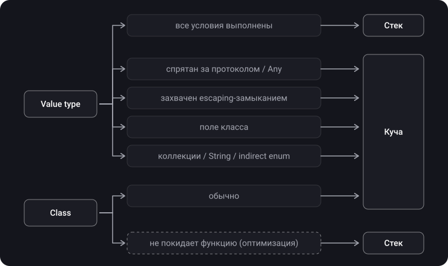
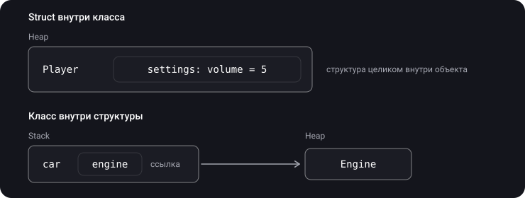
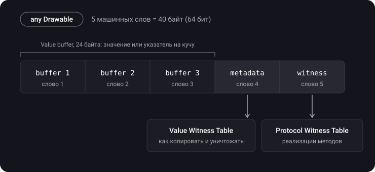

> **Что узнаешь**
>
> - Почему правило «value → стек, reference → куча» — только приближение
> - В каких случаях struct оказывается в куче
> - Как escaping-замыкание захватывает переменные и чем помогает capture list
> - Как устроен экзистенциальный контейнер и почему он весит 40 байт
> - Когда класс может оказаться на стеке

> **Нужно знать заранее:** темы [01](../memory-segments-memorylayout/)–[03](../value-reference-copying/) — стек и куча, value/reference типы, Copy-on-Write.

## Аналогия: ячейка камеры хранения

Стек — это личная полочка у тебя на столе: быстро, но место ограничено, а в конце дня (выход из функции) всё с неё выбрасывается.

Иногда вещь с полочки не годится:

- **Протокол** — тебе выдали стандартную ячейку фиксированного размера (3 слота). Маленькая вещь помещается внутрь. Большая — уходит на склад (в кучу), а в ячейке лежит квитанция.
- **Escaping-замыкание** — ты хочешь унести вещь с собой после окончания рабочего дня. Со стола её придётся переложить на склад, иначе её выбросят вместе со всем остальным.
- **Структура внутри класса** — вещь лежит в коробке, а коробка уже на складе. Значит, и вещь на складе.

## Шаг 1. Когда значение может жить на стеке

Компилятор кладёт значение на стек, если выполнены **все** условия:

1. Размер известен заранее.
2. Время жизни не выходит за рамки функции.
3. Значение не разделяется с кем-то ещё по ссылке.

Как только одно из условий ломается, данные переезжают в кучу. Посмотрим, где это происходит.



## Шаг 2. Случай 1 — значение за протоколом (или `Any`)

Переменная типа `any Drawable` может хранить любую структуру: 8 байт, 16 или 500. Компилятор не знает размер заранее, поэтому использует контейнер фиксированного размера — **экзистенциальный контейнер** (подробно в шаге 6):

- значение **до 24 байт** лежит прямо внутри контейнера;
- значение **больше 24 байт** уходит в кучу, в контейнере остаётся указатель.

```swift
protocol Drawable { func draw() }

struct Dot: Drawable {            // 16 байт — помещается
    var x, y: Double
    func draw() {}
}

struct Rect: Drawable {           // 32 байта — не помещается
    var x, y, width, height: Double
    func draw() {}
}

let a: any Drawable = Dot(x: 0, y: 0)                     // внутри контейнера
let b: any Drawable = Rect(x: 0, y: 0, width: 1, height: 1) // в куче
```

То же самое с `Any` и полями типа `Any` — это тоже экзистенциальный контейнер.

## Шаг 3. Случай 2 — escaping-замыкание

```swift
func makeCounter() -> () -> Int {
    var count = 0
    return {
        count += 1
        return count
    }
}

let counter = makeCounter()
counter()
counter()
```

<details>
<summary>Что вернёт второй вызов counter() и где живёт count?</summary>

**2.** Замыкание пережило функцию `makeCounter`, и `count` вместе с ним. Если бы `count` лежал в кадре стека, он исчез бы при выходе из функции. Поэтому компилятор кладёт его в «коробку» в куче, и замыкание держит ссылку на эту коробку.

</details>

**Как замыкание захватывает переменные:**

- **Без capture list** переменная захватывается **по ссылке**: замыкание видит её текущее значение и может её менять.
- **С capture list** `[x]` значение **копируется** в момент создания замыкания.

```swift
var x = 1
let byReference = { print(x) }
let byValue = { [x] in print(x) }
x = 2

byReference()   // 2 — видит текущее значение
byValue()       // 1 — копия, сделанная при создании
```

## Шаг 4. Случай 3 — struct внутри класса и наоборот

```swift
struct Settings { var volume = 5 }

final class Player {
    var settings = Settings()   // Settings лежит ВНУТРИ объекта Player → в куче
}

final class Engine {}
struct Car {
    let engine = Engine()       // в структуре лежит ссылка (8 байт), объект Engine — в куче
}
```



## Шаг 5. Случай 4 — данные переменного размера

Уже знакомо из [темы 02](../stack-heap/): у `Array`, `Dictionary`, `Set`, `String` сама переменная маленькая, а данные лежат в буфере в куче. Сюда же — `indirect enum`: его рекурсивные случаи хранятся в куче.

## Шаг 6. Экзистенциальный контейнер — устройство

> **Экзистенциальный контейнер** — обёртка фиксированного размера для значения, тип которого известен только через протокол (`any P`).



- **Value buffer (24 байта)** — само значение, если помещается, или указатель на коробку в куче.
- **Value Witness Table** — «инструкция по обращению» с типом. Содержит операции `allocate` (выделить память в куче, если значение не помещается в буфер), `copy`, `destruct`, `deallocate`.
- **Protocol Witness Table** — таблица, где для конкретного типа записано, какая функция реализует каждый метод протокола. Вызов `a.draw()` идёт через неё: «найди в таблице адрес `draw` и перейди туда».

Проверим размеры:

```swift
MemoryLayout<Dot>.size            // 16
MemoryLayout<Rect>.size           // 32
MemoryLayout<any Drawable>.size   // ?
```

<details>
<summary>Сколько байт займёт any Drawable и зависит ли это от того, что внутри?</summary>

**40 байт** на 64-битной платформе — и для `Dot`, и для `Rect`. Контейнер всегда одного размера, именно поэтому массив `[any Drawable]` может хранить вперемешку разные типы: каждый элемент — 40 байт.

</details>

**Цена контейнера:**

- возможное выделение памяти в куче для больших значений;
- косвенный вызов методов через Protocol Witness Table вместо прямого;
- копирование через Value Witness Table.

**Как избежать.** Если конкретный тип известен на этапе компиляции, используй дженерики или `some`:

```swift
func render(_ shape: any Drawable) { shape.draw() }   // контейнер, косвенный вызов
func render(_ shape: some Drawable) { shape.draw() }  // без контейнера, компилятор знает тип
```

## Шаг 7. Обратный случай — класс на стеке

Компилятор может разместить объект класса на стеке, если **доказал**, что ссылка на него никуда не уходит из функции (оптимизация stack promotion). Тогда не нужно ни выделение в куче, ни подсчёт ссылок.

> Это решение оптимизатора, а не гарантия языка. Писать код в расчёте на него не стоит — достаточно знать, что такое бывает.

## Шаг 8. Нюансы

- Где бы ни лежали данные, **семантика копирования** value-типа сохраняется: struct в куче всё равно ведёт себя как значение.
- Ключевое слово `any` (Swift 5.6+) просто делает экзистенциальный контейнер видимым в коде: `let x: Drawable` и `let x: any Drawable` — одно и то же.

## Типичные ошибки

- «Struct никогда не попадает в кучу». Попадает: за протоколом, в escaping-захвате, внутри класса.
- «Большая struct сама уходит в кучу». Размер сам по себе ни при чём — дело в упаковке.
- Путать контейнер (40 байт) со значением внутри него.
- Думать, что capture list работает «по ссылке». Наоборот: в capture list — копия.
- Писать `any Protocol` там, где подошли бы дженерики или `some`, и платить за контейнер без нужды.

## Шпаргалка

```text
Стек, если: размер известен + не живёт дольше функции + не разделяется

Value → куча, когда:
  any Protocol / Any, значение > 24 байт   → коробка в куче
  захват escaping-замыканием              → коробка в куче
  поле класса                             → внутри объекта в куче
  Array/String/Dictionary/Set, indirect   → данные в куче

Capture list:  [x] → копия при создании;  без списка → по ссылке
Экзистенциальный контейнер = 24 (буфер) + 8 (метаданные/VWT) + 8 (PWT) = 40 байт
some / generics → без контейнера;  any → контейнер
Class на стеке → только оптимизация (stack promotion)
```

## Вопросы для самопроверки

<details>
<summary>1. Назови три случая, когда struct окажется в куче.</summary>

Значение за протоколом или `Any`, если не помещается в 24 байта; переменная, захваченная escaping-замыканием; структура — поле класса. Ещё — данные коллекций и `String`.

</details>

<details>
<summary>2. Из чего состоит экзистенциальный контейнер и сколько он весит?</summary>

Value buffer на 3 слова (24 байта), указатель на метаданные типа с Value Witness Table (8 байт), указатель на Protocol Witness Table (8 байт). Итого 40 байт на 64-битной платформе.

</details>

<details>
<summary>3. Что выведет код ниже?</summary>

```swift
var name = "Анна"
let greet = { [name] in print(name) }
name = "Борис"
greet()
```

«Анна». Переменная из capture list скопирована в момент создания замыкания.

</details>

<details>
<summary>4. Чем some Drawable отличается от any Drawable с точки зрения памяти?</summary>

С `some` компилятор знает конкретный тип и работает с ним напрямую — без контейнера и косвенных вызовов. С `any` значение упаковывается в экзистенциальный контейнер.

</details>

<details>
<summary>5. Может ли объект класса оказаться на стеке?</summary>

Да, как оптимизация: если компилятор доказал, что ссылка не покидает функцию. Гарантией языка это не является.

</details>

## Источники

- [iOS Memory Management (Part 3): Reference and Value Type, Copy on Write, Стек и куча](https://youtu.be/w5GvKG9doTg?t=527)
- [Разбираемся с existential container в Swift](https://habr.com/ru/articles/949268/)
- [Swift. Ключевые слова any и some. Экзистенциальный контейнер.](https://www.youtube.com/watch?v=wlgDcPr7P3k&t=1s)
- [WWDC 2016 — Understanding Swift Performance](https://developer.apple.com/videos/play/wwdc2016/416/)
