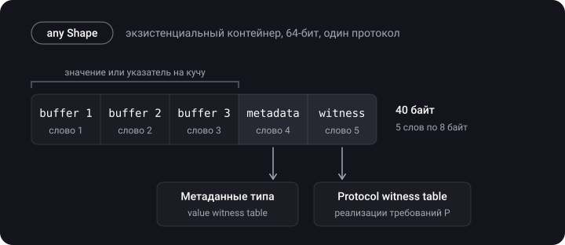

> **Что узнаешь**
>
> - Что такое дженерики, ограничения типов и `where`
> - Associated types: зачем они нужны и почему протокол с ними нельзя просто использовать как тип
> - Чем дженерик отличается от `Any`
> - Экзистенциальный тип `any P`: как он устроен в памяти (existential container)
> - Непрозрачный тип `some P` и чем он отличается от `any P`
> - Type erasure: зачем нужен и чем его заменяет `any` с primary associated types

> **Нужно знать заранее:** [тутор 07](../protocols-extensions-casting/) (протоколы, extension), [тутор 01](../structs-classes-enums/) (стек/куча).

## Аналогия: шаблон анкеты и запечатанный конверт

- **Дженерик** — бланк «Тип: ___». Каждый раз при использовании бланк заполняется конкретным типом, и правила проверяются сразу.
- **`any P`** — конверт с чёрным ящиком: внутри лежит «что-то, что умеет P», конкретный тип вскрывается только при работе (в рантайме).
- **`some P`** — запечатанный конверт: ты не знаешь, что внутри, но компилятор знает точно, и это всегда один и тот же тип.

## Шаг 1. Дженерики

> **Дженерик (generic)** — функция или тип, параметризованные типом. Один код работает с разными типами без дублирования, а типбезопасность проверяется на этапе компиляции.

`T` в угловых скобках — **параметр типа** (плейсхолдер). Имя любое и пишется с большой буквы: `T`, `Element`, `Key`/`Value`.

```swift
func swapValues<T>(_ a: inout T, _ b: inout T) {
    let temp = a
    a = b
    b = temp
}

var x = 1, y = 2
swapValues(&x, &y)            // x == 2, y == 1
var s1 = "a", s2 = "b"
swapValues(&s1, &s2)          // тот же код для String
```

**Дженерик-типы** — так устроены `Array<Element>`, `Dictionary<Key, Value>`, `Optional<Wrapped>`:

```swift
struct Stack<Element> {
    private var items: [Element] = []
    mutating func push(_ item: Element) { items.append(item) }
    mutating func pop() -> Element? { items.popLast() }
}

extension Stack {                          // extension уже знает про Element
    var top: Element? { items.last }
}

var stack = Stack<String>()
stack.push("uno"); stack.push("dos")
print(stack.top as Any)   // Optional("dos")
```

**Ограничения типов.** Сам по себе `T` ничего не умеет: нельзя сравнить два `T`. Чтобы сравнивать, нужно требовать `Equatable`:

```swift
func findIndex<T: Equatable>(of value: T, in array: [T]) -> Int? {
    for (index, item) in array.enumerated() where item == value {
        return index
    }
    return nil
}
```

Ключ `Dictionary<Key: Hashable, Value>` устроен именно так: без `Hashable` словарь не сможет найти ключ ([тутор 10](../collections-hashable-complexity/)). Ограничить можно протоколом или классом-предком: `<T: SomeProtocol>`, `<T: SomeClass>`.

> Дженерики — это **параметрический полиморфизм**: функция работает одинаково для любого типа, удовлетворяющего ограничениям. Если внутри ты пишешь `if T == String {...} else {...}`, смысл дженерика потерян — лучше обычная перегрузка или протокол.

**Специализация.** Компилятор может сделать для каждого используемого типа свою оптимизированную копию дженерика (specialization): вызовы становятся статическими и могут быть встроены. Если специализация невозможна (например, тип из другого модуля без `@inlinable`), код работает через метаданные типа и witness tables — медленнее.

## Шаг 2. Associated types

> **`associatedtype`** — плейсхолдер типа внутри протокола. Конкретный тип не указан, пока протокол не принят типом.

```swift
protocol Container {
    associatedtype Item
    mutating func append(_ item: Item)
    var count: Int { get }
    subscript(i: Int) -> Item { get }
}

struct IntStack: Container {
    private var items: [Int] = []
    mutating func push(_ x: Int) { items.append(x) }

    mutating func append(_ item: Int) { push(item) }   // Item выводится как Int
    var count: Int { items.count }
    subscript(i: Int) -> Int { items[i] }
}
```

Тип можно явно зафиксировать через `typealias Item = Int`, но обычно компилятор выводит его сам. Associated type можно ограничить: `associatedtype Item: Equatable`. Уточнения — через `where`:

```swift
func allItemsMatch<C1: Container, C2: Container>(_ a: C1, _ b: C2) -> Bool
    where C1.Item == C2.Item, C1.Item: Equatable {
    guard a.count == b.count else { return false }
    for i in 0..<a.count where a[i] != b[i] { return false }
    return true
}
```

Без `where` эта функция не скомпилируется: нельзя сравнить `a[i] != b[i]`, пока неизвестно, что это один тип и он `Equatable`. `where` также применяется в `extension Container where Item: Equatable` и в `associatedtype Iterator: IteratorProtocol where Iterator.Element == Element`.

## Шаг 3. Дженерик против Any

```swift
let anyArray: [Any] = [1, "hello", true]     // типы стёрты
let n = anyArray[0] as? Int                  // нужно приведение, ошибки — в рантайме

let ints: [Int] = [1, 2, 3]                  // Array<Int>: компилятор знает, что внутри
```

Дженерик сохраняет типы и проверяет их во время компиляции. `Any` стирает тип и переносит проверку в рантайм.

## Шаг 4. Экзистенциальный тип any P

```swift
protocol Shape { func area() -> Double }
struct Circle: Shape { var r: Double; func area() -> Double { .pi * r * r } }
struct Square: Shape { var side: Double; func area() -> Double { side * side } }

let shapes: [any Shape] = [Circle(r: 1), Square(side: 2)]   // разные типы в одном массиве
let total = shapes.reduce(0) { $0 + $1.area() }             // вызов — через witness table
```

Сколько места может занять значение произвольного типа? Неизвестно. Поэтому `any P` хранится в фиксированной обёртке — **экзистенциальном контейнере**.



**Следствия для собеседования:**

- массив `[any P]` хранит элементы фиксированного размера (40 байт на элемент), а не сами значения напрямую;
- маленькие значения (≤ 3 слов) лежат внутри, большие — в отдельном выделении на куче;
- вызов метода — динамический, через witness table ([тутор 09](../dispatch-objc-runtime/)), инлайнинг затруднён;
- протокол с `associatedtype` или `Self`-требованиями сам по себе как тип без `any` не используется: требуется `any Container` (Swift 5.7+) или дженерик-ограничение.

## Шаг 5. Непрозрачные типы some P

> **Непрозрачный тип (opaque type, Swift 5.1)** — `some P` в роли возвращаемого типа скрывает конкретный тип от вызывающего, но **сохраняет его идентичность** для компилятора. Функция всегда возвращает один и тот же конкретный тип.

```swift
func makeShape() -> some Shape { Circle(r: 5) }

let shape = makeShape()
print(shape.area())      // вызов статический: компилятор знает, что это Circle
```

Так устроен SwiftUI: `var body: some View` — вся иерархия `VStack<TupleView<(Text, Button<Text>)>>` скрыта, но компилятор её знает.

**На примере протокола с associated type:**

```swift
protocol Car {
    associatedtype Engine
    var engine: Engine { get }
    init(engine: Engine)
}

struct Ferrari: Car {
    enum Engine { case fuel, electric }
    var engine: Engine
}
struct Tesla: Car { var engine: String }

final class CarFactory {
    // ✅ один конкретный скрытый тип — вызывающий не знает, какой именно
    func makeGoodCar() -> some Car { Ferrari(engine: .electric) }

    // ✅ выбор типа — на стороне вызывающего
    func buildGoodCar<T: Car>(engine: T.Engine) -> T { T(engine: engine) }
}

let ferrari: Ferrari = CarFactory().buildGoodCar(engine: .fuel)
```

Если нужно вернуть **разные** типы в зависимости от условия, `some` не подходит, нужно `any`:

```swift
func makeRandomCar() -> any Car {                     // ок: в контейнере может лежать любой Car
    if Bool.random() { return Ferrari(engine: .fuel) }
    else { return Tesla(engine: "model-s") }
}

// func makeOpaqueRandomCar() -> some Car {          // ошибка: return statements должны иметь одинаковый тип
//     if Bool.random() { return Ferrari(engine: .fuel) }
//     else { return Tesla(engine: "model-s") }
// }
```

| Свойство | `some P` (opaque) | `any P` (existential) |
| --- | --- | --- |
| Конкретный тип | один, известен компилятору | любой, выясняется в рантайме |
| Разные типы в одном массиве | нельзя | можно |
| Диспетчеризация вызовов | статическая возможна, быстрее | через witness table, медленнее |
| Associated types / `Self` | работают без ограничений | нет доступа к ним без «раскрытия» типа |
| Два вызова функции — один тип | да | нет гарантии |
| Память | как у конкретного типа | фиксированный контейнер |

**Swift 5.7:** `some` можно писать и в параметрах — это сокращённая запись дженерика (SE-0341):

```swift
func printAll(_ items: some Sequence<Int>) {      // ≈ func printAll<S: Sequence>(_ items: S) where S.Element == Int
    for i in items { print(i) }
}
```

**Primary associated types (SE-0346).** Протокол может объявить основные associated types в угловых скобках: `protocol Sequence<Element>`. Тогда можно писать `any Collection<Int>` и `some Sequence<String>`.

## Шаг 6. Type erasure

> **Type erasure (стирание типов)** — техника, при которой конкретный тип прячется за обёрткой, чтобы работать со значениями разных типов одинаково через общий интерфейс.

Стандартные «стиратели»: `AnySequence`, `AnyCollection`, `AnyIterator`, `AnyHashable`, `AnyPublisher` (Combine), `AnyView` (SwiftUI).

Задача: есть протокол с двумя associated types, и класс, который должен хранить любую реализацию с заданными типами.

```swift
protocol ObjectSender {
    associatedtype ParamType
    associatedtype ResultType
    func send(_ param: ParamType) -> ResultType
}

class ObjectOneSenderImpl: ObjectSender {
    func send(_ param: Int) -> String { "\(param)" }
}
class ObjectTwoSenderImpl: ObjectSender {
    func send(_ param: String) -> Int { Int(param) ?? 0 }
}

// класс должен хранить такой протокол:
// class MetricaService { var mapper: ObjectSender }   // ошибка: нужно any ObjectSender, а типы не зафиксированы
```

**Решение 1 — классическая обёртка («древняя технология»):**

```swift
struct AnyObjectSender<P, R>: ObjectSender {
    private let sendClosure: (P) -> R

    init<S: ObjectSender>(_ sender: S) where S.ParamType == P, S.ResultType == R {
        self.sendClosure = sender.send       // замыкание — и есть «стёртый» тип
    }
    func send(_ param: P) -> R { sendClosure(param) }
}

final class MetricaService {
    var mapper: AnyObjectSender<Int, String>
    init(mapper: AnyObjectSender<Int, String>) { self.mapper = mapper }
}

let service = MetricaService(mapper: AnyObjectSender(ObjectOneSenderImpl()))
print(service.mapper.send(1))   // "1"
```

**Решение 2 — современное:** primary associated types + `any`. Ручная обёртка часто больше не нужна:

```swift
protocol Sender<Input, Output> {
    associatedtype Input
    associatedtype Output
    func send(_ input: Input) -> Output
}

struct IntToString: Sender {
    func send(_ input: Int) -> String { "\(input)" }
}

final class Metrica {
    var mapper: any Sender<Int, String>
    init(mapper: any Sender<Int, String>) { self.mapper = mapper }
}
```

## Типичные ошибки

- Путать `some` и `any`: ждать от `some` разных типов в разных ветках `return`.
- Использовать `[Any]` там, где можно дженерик или протокол: теряется типбезопасность.
- Надеяться, что `any P` бесплатен: это контейнер на 40 байт, динамическая диспетчеризация, возможные аллокации.
- Делать `if T == Int` внутри дженерика вместо ограничения протоколом.
- Забыть `where C1.Item == C2.Item` → нельзя сравнить элементы.
- Хранить `AnyView` там, где можно `some View` или `@ViewBuilder`: теряется информация для диффинга.

<details>
<summary>Каверзный вопрос: в чём отличие Generic от Any?</summary>

Дженерик — «один конкретный тип, выбранный в момент использования»: компилятор проверяет типы, нужных приведений нет, возможна специализация. `Any` — «любой тип в каждый момент»: тип стёрт, проверки и приведения уходят в рантайм.

</details>

## Шпаргалка

```swift
func f<T: Equatable>(_ a: T, _ b: T) -> Bool { a == b }
func g<C: Container>(_ c: C) where C.Item: Hashable { }
protocol P { associatedtype Item }

let x: any Shape = Circle(r: 1)          // existential (ящик, рантайм)
func h() -> some Shape { Circle(r: 1) }  // opaque (один тип, известен компилятору)
func k(_ s: some Sequence<Int>) { }      // сокращение дженерика

any Collection<Int>                      // primary associated type

// existential container (64-бит, 1 протокол) = 3 слова буфер + metadata + 1 witness table = 40 байт
```

## Вопросы для самопроверки

<details>
<summary>1. Чем Generic отличается от Any?</summary>

Generic сохраняет тип и проверяется на этапе компиляции; `Any` стирает тип, приведения делаются в рантайме.

</details>

<details>
<summary>2. Что такое associated type и зачем where?</summary>

Плейсхолдер типа внутри протокола. `where` уточняет требования: равенство типов, соответствие протоколу.

</details>

<details>
<summary>3. Сколько занимает existential container и из чего состоит?</summary>

Для протокола без классового ограничения на 64 битах — 5 слов (40 байт): буфер на 3 слова (значение или указатель на кучу), указатель на метаданные типа, указатель на protocol witness table (по одному на каждый протокол).

</details>

<details>
<summary>4. Чем some отличается от any?</summary>

`some` — один конкретный тип, скрытый от вызывающего, но известный компилятору; `any` — контейнер для любого соответствующего типа, выясняется в рантайме.

</details>

<details>
<summary>5. Разрешено ли вернуть из some-функции разные типы?</summary>

Нет: все `return` должны возвращать один тип. Нужно `any` или обёртка/enum.

</details>

<details>
<summary>6. Зачем нужен type erasure и что его заменяет сегодня?</summary>

Чтобы хранить протокол с associated types без указания конкретной реализации. Сегодня часто достаточно `any Protocol<Type>` с primary associated types.

</details>

<details>
<summary>7. Как строится обёртка-стиратель вручную?</summary>

Дженерик-структура, которая соблюдает протокол, хранит методы конкретной реализации в замыканиях и передаёт вызовы им.

</details>

## Источники

- [Generics — The Swift Programming Language](https://docs.swift.org/swift-book/documentation/the-swift-programming-language/generics/)
- [Opaque and Boxed Protocol Types — The Swift Programming Language](https://docs.swift.org/swift-book/documentation/the-swift-programming-language/opaquetypes/)
- [Type Layout (existential containers) — swiftlang/swift, docs/ABI](https://github.com/swiftlang/swift/blob/main/docs/ABI/TypeLayout.rst)
- [SE-0244: Opaque Result Types](https://github.com/swiftlang/swift-evolution/blob/main/proposals/0244-opaque-result-types.md)
- [SE-0335: Introduce existential any](https://github.com/swiftlang/swift-evolution/blob/main/proposals/0335-existential-any.md)
- [SE-0341: Opaque Parameter Declarations](https://github.com/swiftlang/swift-evolution/blob/main/proposals/0341-opaque-parameters.md)
- [SE-0346: Lightweight same-type requirements for primary associated types](https://github.com/swiftlang/swift-evolution/blob/main/proposals/0346-light-weight-same-type-syntax.md)
