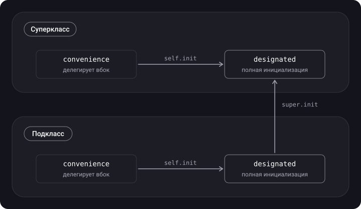

> **Что узнаешь**
>
> - Какие бывают инициализаторы: default, memberwise, designated, convenience, required, failable
> - Как устроена двухфазная инициализация и 4 проверки безопасности
> - Правила делегирования и наследования инициализаторов
> - `override`, `super`, `final`, `required`
> - 6 уровней доступа: `open`, `public`, `package`, `internal`, `fileprivate`, `private`

> **Нужно знать заранее:** [тутор 01](../structs-classes-enums/) — struct, class, `deinit`; [тутор 02](../properties-wrappers/) — свойства.

## Аналогия: сборка дома

Инициализация — это стройка.

- **Фаза 1** — возводишь коробку: каждый этаж (класс иерархии) получает свои стены и перекрытия. Жить в доме ещё нельзя.
- **Фаза 2** — отделка и мебель: теперь можно включать свет, вызывать методы и настраивать то, что уже построено.
- **Designated init** — главная бригада: полностью строит свой этаж и вызывает бригаду нижнего этажа.
- **Convenience init** — дизайнер с готовым проектом: сам ничего не строит, а заказывает бригаду по шаблону.

## Шаг 1. Виды инициализаторов

| Вид | Что делает |
| --- | --- |
| Default | `init()` создаётся автоматически, если у всех свойств есть значения по умолчанию и нет своих инициализаторов |
| Memberwise | для структур: `init(a:b:)` по всем хранимым свойствам |
| Designated | основной инициализатор класса: инициализирует все свои свойства и вызывает `super.init` |
| Convenience | вспомогательный: обязан вызвать другой инициализатор **того же класса** (`self.init`) |
| Failable (`init?`) | может вернуть `nil` |
| Required | обязателен в каждом подклассе |

```swift
class Animal {
    var numberOfLegs: Int

    init(numberOfLegs: Int) {                  // designated
        self.numberOfLegs = numberOfLegs
    }

    convenience init(type: String) {           // convenience
        let number = type == "bird" ? 2 : 4
        self.init(numberOfLegs: number)
    }
}

class Wolf: Animal {
    var hasFur: Bool

    init(hasFur: Bool) {                       // designated подкласса
        self.hasFur = hasFur                   // 1) свои свойства
        super.init(numberOfLegs: 4)            // 2) вверх по цепочке
    }
}
```

**Failable.** Пример: инициализатор, который проваливается на неверных данных.

```swift
struct PhoneNumber {
    let value: String
    init?(_ value: String) {
        guard value.count >= 11, value.allSatisfy(\.isNumber) else { return nil }
        self.value = value
    }
}
let ok = PhoneNumber("79991234567")   // PhoneNumber?
let bad = PhoneNumber("12")           // nil
```

**Required.** Подкласс обязан реализовать такой инициализатор; `override` в этом случае писать не нужно, а `required` — нужно.

```swift
class UserScreen {
    var title: String
    required init(title: String) { self.title = title }
}
class ProfileScreen: UserScreen {
    var backgroundColor: String
    init(backgroundColor: String) {
        self.backgroundColor = backgroundColor
        super.init(title: "Profile screen")
    }
    required init(title: String) {          // обязателен
        backgroundColor = "black"
        super.init(title: title)
    }
}
```

## Шаг 2. Двухфазная инициализация

> **Фаза 1** — каждое хранимое свойство каждого класса в иерархии получает начальное значение, идя снизу вверх по цепочке `super.init`. **Фаза 2** — идя обратно, каждый класс может настроить экземпляр: вызывать методы, менять унаследованные свойства, использовать `self`.

**4 проверки безопасности компилятора:**

1. Designated init обязан инициализировать **все свои** свойства до вызова `super.init`.
2. Унаследованное свойство можно менять только **после** `super.init`.
3. Convenience init должен вызвать другой init (`self.init`) **до** присвоения любых свойств.
4. Нельзя вызывать методы экземпляра, читать свойства и использовать `self` как значение до окончания фазы 1.

```swift
class Vehicle {
    var wheels: Int
    init(wheels: Int) { self.wheels = wheels }
}
class Bicycle: Vehicle {
    var hasBasket: Bool
    init(hasBasket: Bool) {
        self.hasBasket = hasBasket      // фаза 1: свои свойства
        super.init(wheels: 2)           // фаза 1 для родителя
        wheels = 2                      // фаза 2: уже можно менять унаследованное
    }
}
```

<details>
<summary>Почему нельзя вызвать метод до super.init?</summary>

Пока родительская часть не инициализирована, `self` не готов целиком. Метод мог бы прочитать неинициализированное свойство или вызвать переопределённый метод подкласса, который обращается к ещё не созданным полям. Двухфазность исключает такие ситуации на этапе компиляции.

</details>

## Шаг 3. Делегирование и наследование инициализаторов

**Правила делегирования:**

- designated init **вызывает вверх** (`super.init`), и только designated-инициализатор родителя;
- convenience init **вызывает вбок** (`self.init`) — в конечном счёте всегда приходит к designated;
- designated init **не** может вызывать `self.init` другого designated.



**Memberwise-инициализатор структуры.** Если объявить свой `init` внутри структуры, memberwise пропадёт. Свой `init` в `extension` оставляет оба:

```swift
struct User {
    var name: String
    var age: Int
}
extension User {
    init(name: String) { self.init(name: name, age: 0) }
}
let u1 = User(name: "Аня", age: 30)   // memberwise всё ещё доступен
let u2 = User(name: "Боря")
```

Memberwise-инициализатор по умолчанию имеет уровень `internal` (даже у `public` структуры): из другого модуля создать такую структуру без собственного `public init` нельзя.

**Делегирование в структурах** — просто `self.init(...)`, без деления на designated и convenience:

```swift
struct Device {
    let serialNumber: String
    init(serialNumber: String) { self.serialNumber = serialNumber }
    init(old: OldDevice) { self.init(serialNumber: old.serialNumber) }
}
struct OldDevice { let serialNumber: String }
```

## Шаг 4. override, super, final

- **`override`** — явно говорит, что ты переопределяешь член родителя; компилятор проверит, что такой член существует.
- **`super`** — доступ к реализации родителя из подкласса.
- **`final`** — запрещает переопределение метода, свойства, индекса; на класс — запрещает наследование.
- **`static`** у члена класса — это `class final`.

```swift
class Base {
    func greet() -> String { "base" }
    final func id() -> Int { 1 }      // нельзя переопределить
}
class Derived: Base {
    override func greet() -> String { super.greet() + " + derived" }
    // override func id() — ошибка компиляции
}
print(Derived().greet())   // base + derived
```

`final` ещё и ускоряет вызовы: компилятор может выбрать статическую диспетчеризацию ([тутор 09](../dispatch-objc-runtime/)).

## Шаг 5. Уровни доступа

| Уровень | Доступ | Наследовать / переопределять |
| --- | --- | --- |
| `open` | из любого модуля | везде, включая другие модули |
| `public` | из любого модуля | только внутри своего модуля |
| `package` | внутри одного пакета (SwiftPM) | внутри пакета |
| `internal` (по умолчанию) | внутри своего модуля | внутри модуля |
| `fileprivate` | внутри своего файла | — |
| `private` | внутри объявления и его расширений в том же файле | — |

```swift
public class Networking {
    public private(set) var requestCount = 0   // читать можно снаружи, писать нельзя
    fileprivate func log(_ s: String) { }
    private func secret() { }
}
```

- **`open`** работает только для классов и их членов. Именно он нужен фреймворку, чьи классы подклассируют клиенты.
- Сущность не может быть **более доступной**, чем типы, которые она использует: `public func f(_ x: InternalType)` — ошибка.
- `private(set)` — отдельный уровень для сеттера: читать шире, писать уже.
- `@testable import` позволяет тестам видеть `internal`.

## Типичные ошибки

- Вызвать метод или обратиться к `self` до `super.init`.
- Объявить `init` внутри структуры и потерять memberwise.
- Забыть `required` у переопределения `required init`.
- Ожидать, что convenience-инициализаторы наследуются при наличии собственного designated.
- Сделать публичный API с `public` вместо `open` и удивиться, что клиенты не могут подклассировать.
- Выставить `public` тип с `internal`-зависимостью.
- Забыть, что `private` не виден из другого файла даже для расширения.

<details>
<summary>Каверзный вопрос: сколько фаз у инициализации и зачем?</summary>

Две. Первая гарантирует, что все свойства всех классов иерархии получили значения, вторая позволяет безопасно использовать `self`. Это предотвращает доступ к неинициализированной памяти и случайное изменение значения другим инициализатором.

</details>

## Шпаргалка

```swift
init(...) { }                  // designated
convenience init(...) { self.init(...) }
init?(...) { return nil }      // failable
required init(...) { }         // обязателен в подклассах

// порядок в designated подкласса:
// 1) свои свойства  2) super.init(...)  3) остальное (фаза 2)

final class A { }              // нельзя наследовать
override func f() { super.f() }

// доступ: open > public > package > internal > fileprivate > private
public private(set) var x = 0
```

## Вопросы для самопроверки

<details>
<summary>1. Чем designated отличается от convenience?</summary>

Designated полностью инициализирует свои свойства и вызывает `super.init`. Convenience обязан вызвать другой инициализатор того же класса и в итоге дойти до designated.

</details>

<details>
<summary>2. Что такое двухфазная инициализация?</summary>

Фаза 1 — все свойства получают значения, от подкласса к родителю. Фаза 2 — настройка экземпляра, использование `self`, вызов методов.

</details>

<details>
<summary>3. Когда инициализаторы наследуются?</summary>

Если подкласс не объявляет собственных designated — наследует все designated родителя; если наследует или переопределяет все — получает и convenience.

</details>

<details>
<summary>4. Как сохранить memberwise-инициализатор при добавлении своего?</summary>

Объявить свой `init` в `extension`.

</details>

<details>
<summary>5. Чем open отличается от public?</summary>

Оба доступны из других модулей. `open` разрешает наследовать и переопределять вне модуля, `public` — нет.

</details>

<details>
<summary>6. Что даёт final?</summary>

Запрещает наследование и переопределение, а значит позволяет статическую диспетчеризацию.

</details>

<details>
<summary>7. Что делает private(set)?</summary>

Разрешает читать свойство шире, чем записывать: сеттер приватный.

</details>

## Источники

- [Initialization — The Swift Programming Language](https://docs.swift.org/swift-book/documentation/the-swift-programming-language/initialization/)
- [Inheritance — The Swift Programming Language](https://docs.swift.org/swift-book/documentation/the-swift-programming-language/inheritance/)
- [Access Control — The Swift Programming Language](https://docs.swift.org/swift-book/documentation/the-swift-programming-language/accesscontrol/)
- [SE-0386: New access modifier — package](https://github.com/swiftlang/swift-evolution/blob/main/proposals/0386-package-access-modifier.md)
