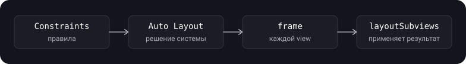

> **Что узнаешь**
>
> - Что такое Auto Layout и как из constraints получаются размер и положение view
> - Constraint как уравнение: атрибуты, отношения, множитель, константа, приоритет
> - Как создавать constraints: `NSLayoutConstraint`, `NSLayoutAnchor`, активация
> - Зачем `translatesAutoresizingMaskIntoConstraints = false`
> - `UILayoutGuide`, safe area, margins, `keyboardLayoutGuide`
> - Autoresizing mask: старый механизм и как он связан с Auto Layout
> - `UIStackView`, а также конфликты и неоднозначность constraints и как их чинить

> **Нужно знать заранее:** тутор [01](../uiview-window-coordinates/) — `UIView`, `frame` и `bounds`, points; тутор [03](../view-lifecycle/) — `layoutSubviews` и момент, когда геометрия финальная.

## Аналогия: расстановка мебели по правилам

Ты не говоришь грузчикам точные координаты каждого шкафа. Ты даёшь **правила**: «диван в 20 см от левой стены», «стол по центру», «шкаф не шире половины комнаты», «лампа по возможности у окна».

- **Constraint** — одно правило расстановки.
- **Auto Layout** — бригада, которая сама находит расстановку, удовлетворяющую всем правилам. Если комнату расширили или добавили шкаф, она пересчитывает всё сама.
- **Приоритет** — насколько правило обязательное. «Диван у стены» — обязательно, «лампа у окна» — желательно.
- **Конфликт** — правила противоречат друг другу («диван в 20 см от стены» и «в 50 см от той же стены»).
- **Неоднозначность** — правил мало, и расставить можно по-разному («диван слева», но не сказано, насколько далеко от пола).

## Шаг 1. Что такое Auto Layout

> **Auto Layout** — система компоновки интерфейса на основе ограничений (constraints). Она динамически вычисляет размер и положение всех view в иерархии по правилам, которые ты задаёшь, и пересчитывает их, когда что-то меняется.

- **Внешние изменения:** поворот экрана, разные размеры экранов, изменение размера окна (например, в Split View на iPad).
- **Внутренние изменения:** изменился контент (длиннее текст, другой язык, другой шрифт), view показали или скрыли.
- Главное преимущество: не нужно писать код, который вручную подгоняет интерфейс под каждый размер. Ты описываешь отношения между элементами, а положение вычисляет система.
- Constraint — это уравнение (или неравенство). Набор constraints образует систему уравнений и неравенств; если она решается однозначно, система точно знает положение и размер каждой view.



**Валидная раскладка** — набор constraints, у которого есть **ровно одно** решение (Apple называет её недвусмысленной и не конфликтующей). Два типа ошибок:

- **Неоднозначная (ambiguous)** — решений больше одного, правил не хватает.
- **Конфликтующая (conflicting)** — решений нет, правила противоречат друг другу.

## Шаг 2. Constraint как уравнение

Каждый constraint — линейное уравнение:

```text
item1.attribute1 = multiplier × item2.attribute2 + constant
```

Например: «ведущая грань второй кнопки на 8 points правее замыкающей грани первой»:

```text
button2.leading = 1.0 × button1.trailing + 8.0
```

- `attribute1` и `attribute2` — переменные, которые Auto Layout может менять при решении. Остальное задаёшь при создании constraint.
- Constraint — **не присваивание**. Auto Layout не просто копирует правую часть в левую: она может менять любой из атрибутов или оба, чтобы уравнение выполнялось.
- Поэтому части можно поменять местами, если инвертировать multiplier и constant. Эти два constraint эквивалентны: `button2.leading = 1.0 × button1.trailing + 8.0` и `button1.trailing = 1.0 × button2.leading - 8.0`.

**Из чего состоит constraint:**

| Часть | Смысл | Примеры |
| --- | --- | --- |
| **Атрибуты** | Какие свойства двух объектов связаны | `width`, `height`, `leading`, `trailing`, `left`, `right`, `top`, `bottom`, `centerX`, `centerY`, `firstBaseline`, `lastBaseline` |
| **Отношение (relation)** | Равно, больше или равно, меньше или равно | Позволяет задавать минимальные и максимальные размеры и отступы, а не только фиксированные |
| **Множитель (multiplier)** | Во сколько раз второй атрибут умножается | `width = 0.5 × superview.width` (половина ширины), соотношение сторон |
| **Константа (constant)** | Смещение, прибавляемое к второму атрибуту | Отступ в points |
| **Приоритет (priority)** | Насколько важно выполнить constraint | От 1 до 1000 |

**Приоритеты (по документации Apple):**

- Приоритеты — от 1 до 1000. Приоритет 1000 — **required** (обязательный), всё меньше 1000 — необязательное. **По умолчанию все constraints обязательные.**
- Сначала Auto Layout решает обязательные constraints, потом необязательные по убыванию приоритета. Если необязательный не удаётся выполнить, она подходит как можно ближе к нужному результату и идёт дальше.
- Константы приоритетов: `.required` (1000), `.defaultHigh` (750), `.defaultLow` (250). Они же — типичные значения для приоритетов content hugging и compression resistance (тутор [05](../autolayout-layout-pass/)).

<details>
<summary>Почему в Auto Layout используют leading и trailing, а не left и right?</summary>

`leading` и `trailing` учитывают направление письма: в языках слева направо (английский, русский) leading — это левая грань, а в языках справа налево (арабский, иврит) — правая. Интерфейс на `leading` и `trailing` автоматически зеркалируется при смене языка. `left` и `right` — абсолютные. Смешивать `leading`/`trailing` с `left`/`right` в одном constraint нельзя: компилятор это пропустит (оба — `NSLayoutXAxisAnchor`), а на запуске будет crash (это прямо сказано в документации Apple).

</details>

## Шаг 3. Как создать constraint: NSLayoutConstraint

> **`NSLayoutConstraint`** — класс, описывающий отношение между двумя объектами интерфейса, которое должна выполнить система раскладки. Constraints можно задать в Interface Builder или кодом.

Прямой способ — полный инициализатор:

```swift
let view1 = UIView()
let view2 = UIView()
view.addSubview(view1)
view.addSubview(view2)

view1.translatesAutoresizingMaskIntoConstraints = false   // см. шаг 4
view2.translatesAutoresizingMaskIntoConstraints = false

// view1.width = 1.0 × view2.width + 0
let widthConstraint = NSLayoutConstraint(item: view1,
                                         attribute: .width,
                                         relatedBy: .equal,
                                         toItem: view2,
                                         attribute: .width,
                                         multiplier: 1.0,
                                         constant: 0)

NSLayoutConstraint.activate([widthConstraint])
```

**Активация:**

- Созданный constraint сам по себе ничего не делает. Его нужно **активировать**: `constraint.isActive = true` или `NSLayoutConstraint.activate([...])`. Отключить: `isActive = false` или `NSLayoutConstraint.deactivate([...])`.
- `NSLayoutConstraint.activate([])` принимает массив: управлять группой constraints удобнее одним вызовом.
- После создания можно менять `constant` и `priority` (с оговоркой ниже). `firstItem`, `firstAttribute`, `relation`, `secondItem`, `secondAttribute` и `multiplier` — только для чтения; чтобы изменить их, нужен новый constraint.
- Активный и неактивный constraint можно переключать, чтобы динамически менять раскладку без пересоздания.
- Constraints можно создать и старым способом — через Visual Format Language (`NSLayoutConstraint.constraints(withVisualFormat:...)`), но якоря удобнее.

> На установленном (активном) constraint нельзя менять приоритет с **required на необязательный** и обратно: получишь runtime-ошибку вида «Mutating a priority from required to not on an installed constraint is not supported». Чтобы переключать, используй приоритет `999` вместо `1000` или пересоздай constraint.

## Шаг 4. translatesAutoresizingMaskIntoConstraints

Это свойство отвечает за то, как view попадает в Auto Layout.

> **`translatesAutoresizingMaskIntoConstraints`** — Boolean, определяющий, преобразуется ли autoresizing mask view в constraints Auto Layout.

- Если `true`, система создаёт набор constraints, которые повторяют поведение autoresizing mask view. Такие constraints **задают размер и положение** view, поэтому твои constraints на размер и позицию будут с ними конфликтовать.
- Чтобы Auto Layout сам вычислял размер и положение view, поставь `false` и задай однозначный, не конфликтующий набор constraints.
- **По умолчанию `true`** для view, которые ты создаёшь кодом. Если добавляешь view в Interface Builder, система ставит `false` сама.
- Ставь свойство у subview **из родителя или контроллера**, а не внутри самой view. Не ставь его на `self` внутри кода кастомной view: так родитель не сможет управлять её раскладкой.
- Не меняй значение для view, которыми управляют классы UIKit: `UITableViewCell`, `arrangedSubviews` у `UIStackView`, `view` у контроллера. Они раскладывают всё автоматически.

```swift
let label = UILabel()
label.translatesAutoresizingMaskIntoConstraints = false   // у subview, из контроллера
view.addSubview(label)

NSLayoutConstraint.activate([
    label.centerXAnchor.constraint(equalTo: view.centerXAnchor),
    label.centerYAnchor.constraint(equalTo: view.centerYAnchor)
])
```

> Самая частая ошибка новичка в Auto Layout из кода: забыть `translatesAutoresizingMaskIntoConstraints = false`. Тогда в консоль сыплются «Unable to simultaneously satisfy constraints», или view оказывается не там, где ты ожидаешь. Это стоит проверять первым.

## Шаг 5. NSLayoutAnchor — constraints без лишнего кода

> **`NSLayoutAnchor`** — фабрика для создания constraints в стиле fluent API. Вместо создания `NSLayoutConstraint` напрямую берёшь view (или `UILayoutGuide`), выбираешь её свойство-якорь (`leadingAnchor`, `topAnchor`, `widthAnchor` и т.д.) и вызываешь метод, который вернёт constraint.

**Преимущества** (по документации Apple): код чище, короче и читается легче; подклассы якорей дают проверку типов на этапе компиляции, что помогает не создавать невалидные constraints. Заодно нет строковых форматов (VFL), а значит и опечаток в них.

**Типы якорей.** Сам `NSLayoutAnchor` напрямую не используют, а берут один из подклассов:

| Тип | Для чего | Якоря |
| --- | --- | --- |
| `NSLayoutXAxisAnchor` | Горизонтальные constraints | `leadingAnchor`, `trailingAnchor`, `leftAnchor`, `rightAnchor`, `centerXAnchor` |
| `NSLayoutYAxisAnchor` | Вертикальные constraints | `topAnchor`, `bottomAnchor`, `centerYAnchor`, `firstBaselineAnchor`, `lastBaselineAnchor` |
| `NSLayoutDimension` | Размеры | `widthAnchor`, `heightAnchor` |

**Методы создания constraints:**

- `constraint(equalTo:)` и `constraint(equalTo:constant:)` — равенство;
- `constraint(greaterThanOrEqualTo:)` — больше или равно;
- `constraint(lessThanOrEqualTo:)` — меньше или равно.
- Для размеров: `constraint(equalToConstant:)`, `constraint(equalTo:multiplier:)` и аналоги для неравенств.
- Возвращённые constraints **нужно активировать** (`isActive = true` или `NSLayoutConstraint.activate`).

```swift
// Выровнять центры двух view
view1.centerXAnchor.constraint(equalTo: view2.centerXAnchor).isActive = true
view1.centerYAnchor.constraint(equalTo: view2.centerYAnchor).isActive = true

// Высота view = 100 points
view1.heightAnchor.constraint(equalToConstant: 100).isActive = true

// Ширина = 2 × высота (соотношение сторон 2:1)
view1.widthAnchor.constraint(equalTo: view1.heightAnchor, multiplier: 2.0).isActive = true
```

**Активируй группу одним вызовом** — это и короче, и удобнее для управления:

```swift
NSLayoutConstraint.activate([
    card.topAnchor.constraint(equalTo: view.safeAreaLayoutGuide.topAnchor, constant: 16),
    card.leadingAnchor.constraint(equalTo: view.leadingAnchor, constant: 16),
    card.trailingAnchor.constraint(equalTo: view.trailingAnchor, constant: -16),
    card.heightAnchor.constraint(equalToConstant: 120)
])
```

> Отступ справа и снизу задают **отрицательной** константой: `trailing = superview.trailing - 16`. Константа прибавляется ко второму атрибуту, а не «отодвигает от края».

Небольшой помощник, убирающий повторение «прибить к краям»:

```swift
extension UIView {
    func pinEdges(to other: UIView, insets: UIEdgeInsets = .zero) {
        translatesAutoresizingMaskIntoConstraints = false
        NSLayoutConstraint.activate([
            topAnchor.constraint(equalTo: other.topAnchor, constant: insets.top),
            leadingAnchor.constraint(equalTo: other.leadingAnchor, constant: insets.left),
            trailingAnchor.constraint(equalTo: other.trailingAnchor, constant: -insets.right),
            bottomAnchor.constraint(equalTo: other.bottomAnchor, constant: -insets.bottom)
        ])
    }
}
```

## Шаг 6. Layout guides: UILayoutGuide, safe area, margins, клавиатура

> **`UILayoutGuide`** — прямоугольная область, которая может взаимодействовать с Auto Layout. Она **не является view**: не входит в иерархию view, а просто задаёт прямоугольник в системе координат своей owning view.

**Зачем.** Раньше для пустых промежутков между view или для группировки элементов использовали «пустые view-заглушки» (placeholder views). У них есть цена: расходы на создание, лишняя нагрузка на каждую операцию по иерархии, а хуже всего — невидимая view может **перехватывать касания**, предназначенные другим. `UILayoutGuide` выполняет те же задачи безопаснее и дешевле.

**Как создать (по документации Apple):**

1. Создать `UILayoutGuide()`.
2. Добавить в view: `view.addLayoutGuide(_:)`.
3. Задать положение и размер через Auto Layout (у него есть те же якоря: `leadingAnchor`, `widthAnchor` и другие).

Пример — равные промежутки между тремя кнопками (два guide равной ширины):

```swift
let space1 = UILayoutGuide()
let space2 = UILayoutGuide()
view.addLayoutGuide(space1)
view.addLayoutGuide(space2)

saveButton.translatesAutoresizingMaskIntoConstraints = false
cancelButton.translatesAutoresizingMaskIntoConstraints = false
clearButton.translatesAutoresizingMaskIntoConstraints = false

NSLayoutConstraint.activate([
    space1.widthAnchor.constraint(equalTo: space2.widthAnchor),          // промежутки равны
    saveButton.trailingAnchor.constraint(equalTo: space1.leadingAnchor),
    cancelButton.leadingAnchor.constraint(equalTo: space1.trailingAnchor),
    cancelButton.trailingAnchor.constraint(equalTo: space2.leadingAnchor),
    clearButton.leadingAnchor.constraint(equalTo: space2.trailingAnchor),
    // вертикальное положение кнопок
    saveButton.centerYAnchor.constraint(equalTo: view.centerYAnchor),
    cancelButton.centerYAnchor.constraint(equalTo: view.centerYAnchor),
    clearButton.centerYAnchor.constraint(equalTo: view.centerYAnchor)
])
```

**Guide как контейнер** — можно «упаковать» группу view в невидимый прямоугольник и работать с ним как с одним целым, не добавляя лишнюю view:

```swift
let container = UILayoutGuide()
view.addLayoutGuide(container)

NSLayoutConstraint.activate([
    label.leadingAnchor.constraint(equalTo: container.leadingAnchor),
    textField.leadingAnchor.constraint(equalTo: label.trailingAnchor, constant: 8),
    textField.trailingAnchor.constraint(equalTo: container.trailingAnchor),
    textField.topAnchor.constraint(equalTo: container.topAnchor),
    textField.bottomAnchor.constraint(equalTo: container.bottomAnchor),
    label.firstBaselineAnchor.constraint(equalTo: textField.firstBaselineAnchor),
    // container целиком привязываем к layout margins
    container.leadingAnchor.constraint(equalTo: view.layoutMarginsGuide.leadingAnchor),
    container.trailingAnchor.constraint(equalTo: view.layoutMarginsGuide.trailingAnchor),
    container.topAnchor.constraint(equalTo: view.safeAreaLayoutGuide.topAnchor, constant: 20)
])
```

> Группировка через guide не меняет иерархию view: она влияет только на то, как Auto Layout работает с этими view. Для более сильной инкапсуляции есть контейнерные view и контейнерные view controllers. Кроме того, приоритеты необязательных constraints внутри guide всё равно сравниваются с приоритетами снаружи (Apple).

**Встроенные guides:**

| Guide | Что представляет | Замечание |
| --- | --- | --- |
| `safeAreaLayoutGuide` | Часть view, не закрытая навигационными барами, tab bar, toolbar и другими предками (вырез, индикатор Home) | iOS 11+. У корневой view учитывает статус-бар, видимые bars и `additionalSafeAreaInsets` контроллера. Пока view не на экране, грани равны границам view |
| `layoutMarginsGuide` | Область внутри layout margins view | У `UIView` нет якорей для margins, для них используют этот guide |
| `keyboardLayoutGuide` | Следит за положением клавиатуры в твоей раскладке | iOS 15+ |

```swift
// Привязать поле ввода к верху клавиатуры
NSLayoutConstraint.activate([
    inputBar.leadingAnchor.constraint(equalTo: view.leadingAnchor),
    inputBar.trailingAnchor.constraint(equalTo: view.trailingAnchor),
    inputBar.bottomAnchor.constraint(equalTo: view.keyboardLayoutGuide.topAnchor)
])
```

Без клавиатуры низ guide совпадает с низом safe area, с клавиатурой — поднимается вместе с ней, и `inputBar` едет следом без подписок на уведомления клавиатуры. Подробнее о клавиатуре — тутор [11](../layout-keyboard-animations/).

## Шаг 7. Autoresizing mask

> **Autoresizing mask** — старый механизм, который автоматически меняет размер и положение view при изменении размера её superview. Задаётся свойством `autoresizingMask` (тип `UIView.AutoresizingMask`), комбинацией опций.

По умолчанию маска пустая (`[]`): view **не меняется** при изменении размера родителя. Когда меняются bounds view, она автоматически изменяет свои subviews по маске каждой из них.

| Опция | Что даёт |
| --- | --- |
| `flexibleLeftMargin` | Левый отступ может меняться: расстояние от левого края view до левого края родителя |
| `flexibleRightMargin` | Правый отступ может меняться |
| `flexibleTopMargin` | Верхний отступ может меняться |
| `flexibleBottomMargin` | Нижний отступ может меняться |
| `flexibleWidth` | Ширина view может меняться вместе с шириной родителя |
| `flexibleHeight` | Высота view может меняться вместе с высотой родителя |

```swift
let myView = UIView()
myView.backgroundColor = .red
myView.frame = CGRect(x: 0, y: 0, width: 100, height: 100)
myView.autoresizingMask = [.flexibleBottomMargin, .flexibleRightMargin]
self.view.addSubview(myView)
```

**Как читать маску.** Опция означает «эта часть может меняться». У `myView` гибкие нижний и правый отступы, а размер и левый/верхний отступы фиксированы. Значит view «прибита» к верхнему левому углу: при росте родителя она остаётся в углу и сохраняет размер 100 × 100, а растёт только зазор справа и снизу.

- Если вдоль одной оси включено несколько опций, разница размеров распределяется **пропорционально** между гибкими частями: чем больше гибкая часть, тем больше она растёт. Например, `flexibleWidth` и `flexibleRightMargin` без `flexibleLeftMargin`: левый отступ фиксирован, ширина и правый отступ растут — view прижата влево.
- Типичная маска «растянуть на всё родительское пространство»: `[.flexibleWidth, .flexibleHeight]`.
- Если поведения маски не хватает, Apple предлагает сделать контейнерную view и переопределить в ней `layoutSubviews()`.

**Сравнение:**

| Критерий | Autoresizing mask | Auto Layout |
| --- | --- | --- |
| Связь с другими view | Только с родителем | С любыми view в иерархии |
| Возможности | Гибкие отступы и размеры относительно родителя | Неравенства, приоритеты, множители, guides |
| Учёт intrinsic size | Нет | Да (тутор [05](../autolayout-layout-pass/)) |
| Когда подходит | Простые случаи, `view.frame` вручную, старый код | Адаптивные интерфейсы, динамический контент |

## Шаг 8. UIStackView — раскладка без ручных constraints

**`UIStackView`** — view, которая раскладывает набор view в столбец или строку. Внутри она использует Auto Layout, а сама её позиция и (при желании) размер — на тебе.

- Раскладывает **`arrangedSubviews`** вдоль своей оси (`axis`) в порядке массива.
- **`axis`** — вертикальная или горизонтальная ось.
- **`distribution`** — как раскладываются arranged view **вдоль** оси.
- **`alignment`** — как они раскладываются **поперёк** оси.
- **`spacing`** — минимальный промежуток между view.
- `isLayoutMarginsRelativeArrangement` — раскладывать относительно layout margins, а не краёв.

```swift
let stack = UIStackView(arrangedSubviews: [avatarView, nameLabel, followButton])
stack.axis = .vertical
stack.alignment = .center
stack.spacing = 12
stack.translatesAutoresizingMaskIntoConstraints = false
view.addSubview(stack)

NSLayoutConstraint.activate([
    stack.topAnchor.constraint(equalTo: view.safeAreaLayoutGuide.topAnchor, constant: 24),
    stack.leadingAnchor.constraint(equalTo: view.leadingAnchor, constant: 16),
    stack.trailingAnchor.constraint(equalTo: view.trailingAnchor, constant: -16)
])
// высоту стека не задаём: она вычислится по содержимому
```

- Позицию стека нужно задать через Auto Layout: обычно достаточно прикрепить две соседние грани. Без дополнительных constraints размер считается по содержимому: вдоль оси — сумма размеров всех view плюс промежутки, поперёк — размер самой большой view.
- Для всех distribution, кроме `fillEqually`, размер вдоль оси считается по `intrinsicContentSize` arranged view (тутор [05](../autolayout-layout-pass/)).
- **`arrangedSubviews` всегда подмножество `subviews`.** Убрал view из `arrangedSubviews` — стек перестаёт управлять её положением, но она остаётся в иерархии и отображается. Чтобы убрать совсем, вызови `removeFromSuperview()`.
- Порядок `arrangedSubviews` — порядок в стеке, порядок `subviews` — z-order. Они независимы.
- **`isHidden = true` у arranged view** скрывает её и убирает из раскладки, остальные сдвигаются. Изменение можно анимировать в блоке `UIView.animate`.

```swift
UIView.animate(withDuration: 0.25) {
    self.errorLabel.isHidden = true          // стек пересчитает раскладку
}
```

> Не меняй `translatesAutoresizingMaskIntoConstraints` у arranged view: стек управляет ими сам (Apple). Добавляя constraints на view внутри стека, следи за конфликтами: как правило, безопасно ограничивать то измерение, по которому размер view сводится к её intrinsic content size.

## Шаг 9. Конфликты и неоднозначность

Две основные проблемы валидной раскладки (шаг 1):

| Проблема | Причина | Что видно | Как лечить |
| --- | --- | --- | --- |
| **Неоднозначность** | Правил не хватает: положение или размер определены не до конца | View оказывается «не там» или «прыгает»; в View Debugger есть предупреждения; `view.hasAmbiguousLayout` | Добавить недостающие constraints (обычно не хватает ширины, высоты или одной из координат) |
| **Конфликт** | Два и больше constraints противоречат друг другу | В консоли: «Unable to simultaneously satisfy constraints»; система сама ломает один из необязательных или лишних constraints | Убрать лишний, снизить приоритет одного до `999`, проверить `translatesAutoresizingMaskIntoConstraints` |

- В логе конфликта перечислены constraints; система выбирает, какой из них «сломать», чтобы продолжить работу.
- Чтобы читать лог было проще, давай constraints **идентификаторы**:

```swift
let height = header.heightAnchor.constraint(equalToConstant: 120)
height.identifier = "header.height"   // это имя появится в логе конфликта
height.isActive = true
```

- Расшифровать лог помогает сервис WTF Auto Layout (в заметках): он визуализирует конфликтующие constraints из лога.
- Найти проблемную view помогает View Debugger в Xcode (в заметках — статья, как найти view в View Debugger).

**Типичные причины конфликтов:**

- не отключён `translatesAutoresizingMaskIntoConstraints` (шаг 4);
- ширина или высота заданы и числом, и отношением к другим view, которое даёт иное значение;
- два обязательных constraints тянут view к разным позициям;
- constraints добавлены повторно при каждом вызове метода (например, в `layoutSubviews`) и копятся.

## Типичные ошибки

- Забыть `translatesAutoresizingMaskIntoConstraints = false` у view, созданной в коде.
- Создать constraint и не активировать его (`isActive = true` или `activate`).
- Активировать constraint до того, как обе view добавлены в общую иерархию: будет crash.
- Смешивать `leading`/`trailing` с `left`/`right` в одном constraint: crash на запуске.
- Задать константу отступа справа и снизу положительной: вместо отступа получится выход за край.
- Не задать размер или позицию по одной из осей: неоднозначная раскладка.
- Менять приоритет активного constraint с 1000 на меньше (и наоборот): runtime-ошибка.
- Добавлять constraints при каждом `layoutSubviews`/`updateConstraints`/показе экрана без удаления старых: constraints копятся и конфликтуют.
- Менять `translatesAutoresizingMaskIntoConstraints` у `arrangedSubviews`, ячейки или корневой view контроллера.
- Использовать пустую view-заглушку там, где достаточно `UILayoutGuide`.
- Называть `UIStackView` «примером Auto Layout»: это view, которая использует его.

<details>
<summary>Что будет, если поставить view frame вручную, когда у неё translatesAutoresizingMaskIntoConstraints = false и есть constraints?</summary>

При следующей раскладке Auto Layout вычислит frame заново по constraints и перезапишет значение. Поэтому либо constraints, либо ручной `frame` (обычно в `layoutSubviews`), но не одновременно для одной и той же view.

</details>

## Шпаргалка

```swift
// Уравнение: item1.attr1 = multiplier × item2.attr2 + constant
// Приоритет: 1...1000, по умолчанию 1000 (required); < 1000 необязательные

// Подготовка view
view.translatesAutoresizingMaskIntoConstraints = false   // у subview, из контроллера
parent.addSubview(view)                                  // до создания constraints

// Якоря
view.topAnchor.constraint(equalTo: other.bottomAnchor, constant: 8)
view.widthAnchor.constraint(equalToConstant: 100)
view.widthAnchor.constraint(equalTo: view.heightAnchor, multiplier: 2)
view.leadingAnchor.constraint(greaterThanOrEqualTo: other.trailingAnchor)
NSLayoutConstraint.activate([ ... ])       // isActive = true
NSLayoutConstraint.deactivate([ ... ])
c.constant = 20                            // можно менять; c.priority = .init(999)

// Guides
view.safeAreaLayoutGuide            // iOS 11+
view.layoutMarginsGuide
view.keyboardLayoutGuide            // iOS 15+
let g = UILayoutGuide(); view.addLayoutGuide(g)

// Autoresizing mask
view.autoresizingMask = [.flexibleWidth, .flexibleHeight]   // по умолчанию []

// Stack view
let s = UIStackView(arrangedSubviews: [a, b])
s.axis = .vertical; s.alignment = .center; s.spacing = 8

// Отладка
c.identifier = "header.height"
view.hasAmbiguousLayout
```

## Вопросы для самопроверки

<details>
<summary>1. Что такое constraint и как он записывается?</summary>

Линейное уравнение (или неравенство): `item1.attribute1 = multiplier × item2.attribute2 + constant`. Плюс приоритет (1–1000). Auto Layout не присваивает значение, а подбирает атрибуты так, чтобы все constraints выполнялись.

</details>

<details>
<summary>2. Чем неоднозначная раскладка отличается от конфликтующей?</summary>

Неоднозначная (ambiguous) — решений больше одного, правил не хватает. Конфликтующая (conflicting) — решений нет, правила противоречат друг другу. Валидная раскладка — ровно одно решение.

</details>

<details>
<summary>3. Зачем нужен translatesAutoresizingMaskIntoConstraints = false?</summary>

По умолчанию для view, созданных в коде, значение `true`: система создаёт constraints по autoresizing mask, которые задают размер и положение view. Твои constraints на размер и позицию будут конфликтовать с ними. Значение `false` отключает автоматическое создание. Ставят у subview из родителя или контроллера, не внутри самой view и не у view, которыми управляет UIKit.

</details>

<details>
<summary>4. Чем NSLayoutAnchor лучше NSLayoutConstraint напрямую?</summary>

Код короче и читается лучше; подклассы якорей (`NSLayoutXAxisAnchor`, `NSLayoutYAxisAnchor`, `NSLayoutDimension`) дают проверку типов на этапе компиляции. Но полностью невалидные constraints всё равно возможны, например смешение `leading` и `left` — crash на запуске.

</details>

<details>
<summary>5. Зачем UILayoutGuide, если можно использовать пустую view?</summary>

Гайд не входит в иерархию view, дешевле и не может перехватить касания, предназначенные другим view. Он решает те же задачи: пустые промежутки, центрирование группы элементов, инкапсуляция части раскладки.

</details>

<details>
<summary>6. Что такое autoresizing mask и как выглядит маска «растянуть на весь родитель»?</summary>

Старый механизм, меняющий размер и положение view при изменении размера superview. По умолчанию пустая. Растянуть на весь родитель: `[.flexibleWidth, .flexibleHeight]`. Система превращает маску в constraints, пока `translatesAutoresizingMaskIntoConstraints = true`.

</details>

<details>
<summary>7. Как привязать элемент к клавиатуре без уведомлений?</summary>

Через `view.keyboardLayoutGuide` (iOS 15+): привязать нижнюю грань элемента к `view.keyboardLayoutGuide.topAnchor`. Guide сам следует за клавиатурой.

</details>

## Источники

- [NSLayoutConstraint — Apple Developer Documentation](https://developer.apple.com/documentation/uikit/nslayoutconstraint)
- [NSLayoutAnchor — Apple Developer Documentation](https://developer.apple.com/documentation/uikit/nslayoutanchor)
- [UILayoutGuide — Apple Developer Documentation](https://developer.apple.com/documentation/uikit/uilayoutguide)
- [translatesAutoresizingMaskIntoConstraints — Apple Developer Documentation](https://developer.apple.com/documentation/uikit/uiview/translatesautoresizingmaskintoconstraints)
- [autoresizingMask — Apple Developer Documentation](https://developer.apple.com/documentation/uikit/uiview/autoresizingmask-swift.property)
- [safeAreaLayoutGuide — Apple Developer Documentation](https://developer.apple.com/documentation/uikit/uiview/safearealayoutguide)
- [keyboardLayoutGuide — Apple Developer Documentation](https://developer.apple.com/documentation/uikit/uiview/keyboardlayoutguide)
- [UIStackView — Apple Developer Documentation](https://developer.apple.com/documentation/uikit/uistackview)
- [Auto Layout Guide: Anatomy of a Constraint — Apple (архив)](https://developer.apple.com/library/archive/documentation/UserExperience/Conceptual/AutolayoutPG/AnatomyofaConstraint.html)
- [Основы Auto Layout — концепция, строение, применение — Habr](https://habr.com/ru/articles/312782/)
- [Auto Layout настройка кодом — Habr](https://habr.com/ru/articles/690940/)
- [Autolayout и его математическая составляющая — lexone.ru](https://www.lexone.ru/operating-systems/ios/math-of-autolayout.html)
- [iOS RSSchool 2021. Autolayout — YouTube](https://www.youtube.com/watch?v=lLusB0H3R7Q)
- [WTF Auto Layout — расшифровка логов конфликтов](https://www.wtfautolayout.com/?example=true)
- [Find A Problematic View In The View Debugger — dasdom.dev](https://dasdom.dev/find-a-view-in-view-debugger/)
- [Используем новый keyboardLayoutGuide — apptractor](https://apptractor.ru/info/articles/ispolzuem-novyy-keyboardlayoutguide-chtoby-spastis-ot-klaviatury.html?ysclid=m6ay01xtzi328363485)
