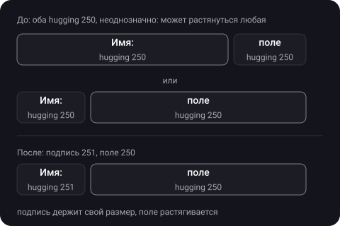
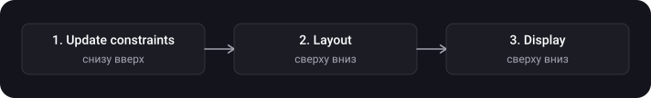
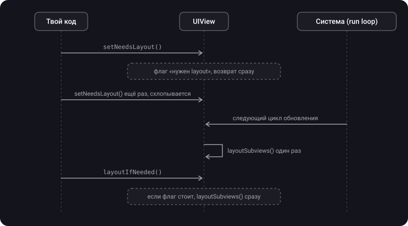

> **Что узнаешь**
>
> - Что такое `intrinsicContentSize` и где он есть, а где нет
> - Content hugging и compression resistance: кто уступает, когда view тесно или места слишком много
> - Цикл Auto Layout: update constraints → layout → display и порядок обхода иерархии
> - `updateConstraints()`, `layoutSubviews()`, `setNeedsLayout()`, `layoutIfNeeded()`: разница и когда что вызывать
> - Как правильно анимировать изменение constraints
> - Типовые задачи на приоритеты: два лейбла в строке, локализация, «не шире N»

> **Нужно знать заранее:** тутор [04](../autolayout-constraints/) — constraints, якоря, приоритеты constraints (1–1000); тутор [03](../view-lifecycle/) — когда вызывается `layoutSubviews`; тутор [02](../calayer-drawing/) — `draw(_:)`.

## Аналогия: view — это пружинка

Каждая view — пружинка с естественной длиной. Когда её растягивают или сжимают, она сопротивляется с определённой силой.

- **`intrinsicContentSize`** — естественная длина пружинки без давления.
- **Content hugging** — насколько сильно пружинка сопротивляется **растяжению** («не хочу быть длиннее»).
- **Compression resistance** — насколько сильно сопротивляется **сжатию** («не хочу быть короче»).
- Когда в одной строке стоят две пружинки одинаковой жёсткости и места больше или меньше, чем нужно, неясно, кто уступит. Тогда расстановка неоднозначна и нужно разнить жёсткость.

## Шаг 1. Intrinsic content size

> **`intrinsicContentSize`** — естественный размер view, учитывающий только свойства самой view. Это ширина и высота, которые view «хочет» иметь по своему содержимому, чтобы показать его целиком.

- У `UILabel` это размер текста выбранным шрифтом; у `UIButton` — заголовок с отступами; у `UIImageView` — размер картинки.
- Благодаря этому у view есть естественная ширина и высота, и мы не задаём их вручную. Для полной раскладки Auto Layout нужны x, y, width и height. Обычно хватает «кнопка на 20 points сверху и по центру по горизонтали»: размер кнопки Auto Layout возьмёт из её intrinsic size.
- У обычной `UIView` без содержимого естественного размера нет: для такого измерения используется `UIView.noIntrinsicMetric`. Такой view нужно задать размер constraints явно.

**Для своей view** с контентом, о котором система не знает, переопредели `intrinsicContentSize` и вызывай `invalidateIntrinsicContentSize()`, когда он меняется. Тогда система учтёт новый размер на следующем проходе layout.

```swift
final class TagView: UIView {
    var text = "" {
        didSet {
            label.text = text
            invalidateIntrinsicContentSize()     // размер по содержимому изменился
        }
    }

    private let label = UILabel()

    override init(frame: CGRect) {
        super.init(frame: frame)
        label.translatesAutoresizingMaskIntoConstraints = false
        addSubview(label)
        NSLayoutConstraint.activate([
            label.centerXAnchor.constraint(equalTo: centerXAnchor),
            label.centerYAnchor.constraint(equalTo: centerYAnchor)
        ])
    }

    required init?(coder: NSCoder) { fatalError("init(coder:) has not been implemented") }

    // текст плюс отступы; не зависит от frame view
    override var intrinsicContentSize: CGSize {
        let textSize = label.intrinsicContentSize
        return CGSize(width: textSize.width + 16, height: textSize.height + 8)
    }
}
```

> Intrinsic size **должен быть независим от frame view**: у системы нет способа динамически передать новую ширину по изменившейся высоте (Apple). Поэтому для многострочного текста ширину обычно задают constraints, а `UILabel` с `numberOfLines = 0` сам подберёт высоту под эту ширину.

## Шаг 2. Content Hugging и Compression Resistance

Когда constraints тянут view больше или меньше её intrinsic size, Auto Layout смотрит на два приоритета у каждой view (по каждой оси, горизонтальной и вертикальной):

> **Content hugging priority** — с каким приоритетом view сопротивляется **увеличению** сверх intrinsic size. Чем выше, тем сильнее view «обхватывает» своё содержимое и не хочет растягиваться.
>
> **Content compression resistance priority** — с каким приоритетом view сопротивляется **сжатию** ниже intrinsic size. Чем выше, тем сильнее view держится за свой размер и не хочет сужаться.

```swift
label.setContentHuggingPriority(.defaultHigh, for: .horizontal)                 // не растягиваться по ширине
label.setContentCompressionResistancePriority(.required, for: .horizontal)      // не сжиматься по ширине

let hugging = label.contentHuggingPriority(for: .horizontal)
let resistance = label.contentCompressionResistancePriority(for: .vertical)
```

| Приоритет | Что означает | Когда влияет |
| --- | --- | --- |
| **Hugging** выше | View не хочет быть больше своего содержимого | Constraints требуют большего размера, чем intrinsic (места много) |
| **Compression resistance** выше | View не хочет быть меньше своего содержимого | Constraints требуют меньшего размера, чем intrinsic (места мало) |

- Приоритеты у этих свойств такие же, как у constraints: от 1 до 1000 (`UILayoutPriority`).
- У стандартных элементов по умолчанию hugging обычно равен `defaultLow` (250), а compression resistance — `defaultHigh` (750). Именно так Apple описывает кнопку: `defaultLow` — уровень, с которым кнопка обхватывает содержимое по горизонтали, а `defaultHigh` — уровень, с которым она сопротивляется сжатию.
- Не переопределяй `contentCompressionResistancePriority(for:)` в подклассе: задай значения по умолчанию при создании view (типично `defaultLow` или `defaultHigh`) — рекомендация Apple.

**Пример 1: кто растягивается (hugging).** В строке две view: подпись «Имя:» и поле ввода. Ширина строки задана, и места больше, чем нужно обеим вместе. Кто-то должен растянуться.



```swift
nameLabel.setContentHuggingPriority(.defaultLow + 1, for: .horizontal)   // 251: подпись не растягивается
textField.setContentHuggingPriority(.defaultLow, for: .horizontal)       // 250: поле растягивается
```

Такой же приём рекомендует Apple в примере для stack view: у поля ввода hugging ниже, чем у подписи, и поле растягивается.

**Пример 2: кто сжимается (compression resistance).** Теперь места мало: подпись «Цена:» и длинное значение. Чтобы сократилось (или перенеслось) значение, а не подпись, у подписи compression resistance ставят выше:

```swift
titleLabel.setContentCompressionResistancePriority(.defaultHigh + 1, for: .horizontal)   // 751: подпись не сжимается
valueLabel.setContentCompressionResistancePriority(.defaultHigh, for: .horizontal)       // 750: значение сжимается
valueLabel.numberOfLines = 0                                                            // и переносится на новые строки
```

<details>
<summary>Почему если у обеих view одинаковый hugging и места много, раскладка неоднозначна?</summary>

Обе view одинаково сопротивляются растяжению, и у системы нет причины предпочесть одну другой: можно растянуть любую. Interface Builder покажет предупреждение «Content Priority Ambiguity». Решение — явно разнить приоритеты (251 и 250, как выше).

</details>

**Подсказка по запоминанию:**

| Ситуация | Что сделать |
| --- | --- |
| Места много, одна view должна растянуться | У той, которая **не** должна растягиваться, повысь hugging |
| Места мало, одна view должна сжаться | У той, которая **не** должна сжиматься, повысь compression resistance |
| Текст не должен обрезаться | Compression resistance `.required` (1000) у лейбла + не задавать жёсткую ширину |
| Две view с одинаковым приоритетом и неоднозначность | Разнести приоритеты на 1 (251 и 250, 751 и 750) |

## Шаг 3. Цикл Auto Layout: update → layout → display

Каждый кадр система проходит три фазы (по WWDC и статье objc.io), которые зависят друг от друга:



| Фаза | Направление обхода | Что происходит | Методы |
| --- | --- | --- | --- |
| **1. Update constraints** | Снизу вверх (от subview к superview) | У view можно обновить свои constraints перед layout; «проход измерения», подготавливающий данные для layout | `updateConstraints()`, `setNeedsUpdateConstraints()`, `updateConstraintsIfNeeded()` |
| **2. Layout** | Сверху вниз (от superview к subview) | Система копирует рассчитанные frame из движка Auto Layout в view | `layoutSubviews()`, `setNeedsLayout()`, `layoutIfNeeded()` |
| **3. Display (render)** | Сверху вниз | View рисует содержимое в слой. Эта фаза происходит всегда, даже если Auto Layout не используется | `draw(_:)`, `setNeedsDisplay()` (тутор [02](../calayer-drawing/)) |

- Каждая фаза зависит от предыдущей: display зависит от layout, layout — от update constraints. Поэтому display запустит layout, если он ожидается, а layout запустит update constraints, если в системе constraints есть неприменённые изменения (статья objc.io).
- Это **не односторонняя дорога**: раскладка — итеративный процесс, и layout может снова испачкать constraints. Поэтому важно не запускать обратные циклы (шаги 4 и 5).
- Вся эта тройка — часть render loop, который может бежать до 120 раз в секунду (WWDC 2018, High Performance Auto Layout).

## Шаг 4. updateConstraints

> **`updateConstraints()`** — метод, в котором view обновляет свои constraints. Система вызывает его перед layout, если ты пометил view через `setNeedsUpdateConstraints()`.

**Что говорит Apple:**

- Переопределять метод нужно **почти никогда**. Чаще чище и проще обновить constraint сразу после изменения, например прямо в action кнопки. Переопределяй, только если изменение «на месте» слишком медленно или view делает много излишних изменений.
- Реализация должна быть максимально эффективной: **не деактивируй все constraints и потом активируй нужные**. Отслеживай свои constraints, проверяй их при каждом проходе и меняй только то, что нужно.
- **Не вызывай `setNeedsUpdateConstraints()` внутри `updateConstraints()`**: это планирует ещё один проход и создаёт цикл обратной связи.
- **`super.updateConstraints()` — последним шагом** реализации.

```swift
final class CardView: UIView {
    var isCompact = false {
        didSet { setNeedsUpdateConstraints() }       // пометили: нужен вызов updateConstraints
    }

    // созданы один раз и другими не пересоздаются
    private var compactConstraints: [NSLayoutConstraint] = []
    private var regularConstraints: [NSLayoutConstraint] = []

    override func updateConstraints() {
        // меняем только нужный набор, не пересоздаём всё
        if isCompact {
            NSLayoutConstraint.deactivate(regularConstraints)
            NSLayoutConstraint.activate(compactConstraints)
        } else {
            NSLayoutConstraint.deactivate(compactConstraints)
            NSLayoutConstraint.activate(regularConstraints)
        }
        super.updateConstraints()                     // последним шагом
    }
}
```

> WWDC 2015 (Mysteries of Auto Layout) уточняет: изменение constraint внутри `updateConstraints` быстрее, чем в других местах, потому что движок обрабатывает все изменения этого прохода пакетом. Но правило Apple остаётся в силе: не переопределяй этот метод без реальной причины. Сначала измерь, потом оптимизируй.

## Шаг 5. layoutSubviews, setNeedsLayout, layoutIfNeeded

> **`layoutSubviews()`** — метод, внутри которого перерассчитываются размеры и позиции subviews. Реализация по умолчанию использует constraints для расчёта размера и позиции subviews.

- Переопределяй только если autoresizing и constraints не дают нужного поведения; тогда можно задавать `frame` subviews напрямую.
- **Никогда не вызывай его напрямую.** Чтобы потребовать layout: `setNeedsLayout()` (отложенно) или `layoutIfNeeded()` (немедленно).
- В переопределении вызывай `super.layoutSubviews()`.

**Три метода, которые легко путать:**

| Метод | Что делает | Когда вызывать |
| --- | --- | --- |
| `layoutSubviews()` | Сама раскладка: рассчёт frame subviews | **Не вызывать**; только переопределять для точной ручной настройки |
| `setNeedsLayout()` | Помечает layout как неактуальный; пересчёт в следующем цикле. Возвращается сразу | Когда нужно пересчитать layout позже, вместе с другими изменениями |
| `layoutIfNeeded()` | Если ожидаются обновления layout, выполняет их **сразу**, считая получателя корнем поддерева. Если ничего не ожидается, ничего не делает | Когда нужны актуальные frame прямо сейчас (перед анимацией, для замера) |



**`setNeedsLayout()`:**

- Вызывай на **главном потоке**, когда хочешь поменять раскладку subviews. Метод записывает запрос и сразу возвращает управление.
- Поскольку метод не запускает обновление немедленно, можно пометить много view до обновления любой из них: все обновления layout собираются в один цикл, что обычно лучше для производительности (Apple).

**`layoutIfNeeded()`:**

- Считает получателя корнем и раскладывает поддерево от него. Обычно его вызывают на view, содержащей все view, которым нужно обновиться (чаще всего — на корневой view контроллера).
- Если ожидаемых обновлений нет, метод завершается без изменения макета и без вызова layout-колбэков.
- Частые немедленные обновления интерфейса дороги: используй по необходимости.

```swift
override func layoutSubviews() {
    super.layoutSubviews()

    // ручная установка frame для subview: только когда constraints не подходят
    let padding: CGFloat = 10
    let width = bounds.width - 2 * padding
    previewView.frame = CGRect(x: padding, y: padding, width: width, height: 50)
}
```

## Шаг 6. Анимация изменения constraints

Изменения constraints можно анимировать (WWDC 2015). Схема: меняешь constraint — и **внутри анимационного блока** заставляешь систему применить layout. Тогда новые frame происходят плавно.

```swift
// Убедись, что нет накопленных неприменённых изменений — иначе они тоже будут анимироваться
view.layoutIfNeeded()

bottomConstraint.constant = 200              // 1) меняем constraint ДО блока

UIView.animate(withDuration: 0.3) {
    self.view.layoutIfNeeded()               // 2) layout внутри блока: изменения frame анимируются
}
```

- `layoutIfNeeded()` вызывай на **корневой view**, содержащей все изменяемые view: он перераскладывает поддерево от получателя.
- Первый вызов `view.layoutIfNeeded()` до изменения constraint сбрасывает уже ожидающие изменения: без него в анимацию попадут и несвязанные смещения, если layout ожидался раньше.

## Шаг 7. Размер по содержимому (self-sizing)

Чтобы узнать, какой размер view получится при своих constraints без показа на экране, есть `systemLayoutSizeFitting(_:)`:

```swift
// наименьший размер, удовлетворяющий constraints
let compact = cardView.systemLayoutSizeFitting(UIView.layoutFittingCompressedSize)

// с фиксированной шириной — высота по содержимому (например, для длинного текста)
let fitted = cardView.systemLayoutSizeFitting(
    CGSize(width: 320, height: UIView.layoutFittingCompressedSize.height),
    withHorizontalFittingPriority: .required,
    verticalFittingPriority: .fittingSizeLevel
)
```

- Это основа **self-sizing ячеек** в списках: ячейка сама получает высоту по constraints (тутор [08](../lists/)).
- `UILayoutPriority.fittingSizeLevel` — приоритет, с которым view хочет соответствовать целевому размеру в этом расчёте.

## Шаг 8. Типовые задачи на приоритеты

**«Ширина не больше 320, а по возможности 90% ширины экрана».** Обязательный constraint для ограничения и необязательный — для предпочтения:

```swift
let maxWidth = card.widthAnchor.constraint(lessThanOrEqualToConstant: 320)           // required
let preferred = card.widthAnchor.constraint(equalTo: view.widthAnchor, multiplier: 0.9)
preferred.priority = .defaultHigh                                                     // 750, необязательный
NSLayoutConstraint.activate([maxWidth, preferred])
```

На узком экране выигрывает «90%», на широком (iPad) — ограничение 320.

**«Два лейбла в строке».** Поле ввода растягивается (шаг 2): подписи — выше hugging. Длинное значение сжимается — у подписи выше compression resistance.

**«Локализация обрезает текст кнопки».** Не задавай кнопке жёсткую ширину; дай ей расти по intrinsic size, а её compression resistance сделай `.required` или выше, чем у соседних view.

**«Лейбл должен переноситься».** `numberOfLines = 0` и ограничение ширины constraints: высоту подберёт сам лейбл по своему intrinsic size.

## Типичные ошибки

- Путать hugging и compression resistance: hugging против растяжения, compression против сжатия.
- Оставить одинаковые приоритеты у двух соседних view: неоднозначная раскладка.
- Задать жёсткую ширину там, где нужен intrinsic size: локализация и Dynamic Type будут резать текст.
- Думать, что `intrinsicContentSize` — минимальный размер: это естественный размер.
- Делать intrinsic size зависящим от `frame` view.
- Не вызвать `invalidateIntrinsicContentSize()` после изменения содержимого в своей view.
- Вызывать `layoutSubviews()` напрямую вместо `setNeedsLayout()` или `layoutIfNeeded()`.
- Путать направления: update constraints — снизу вверх, layout — сверху вниз.
- Вызывать `setNeedsUpdateConstraints()` внутри `updateConstraints()`: цикл обратной связи.
- Деактивировать все constraints и создавать заново в `updateConstraints()`: нужно менять только то, что изменилось.
- Забыть `super.updateConstraints()` в конце реализации.
- Анимировать constraint, вызвав `layoutIfNeeded()` не на корневой view или не внутри блока `UIView.animate`.
- Менять constraint внутри блока анимации вместо того, чтобы менять его до блока, а layout — внутри.

<details>
<summary>Какую view сожмёт Auto Layout, если места мало и у всех view compression resistance равен?</summary>

Точно не сказать: раскладка неоднозначна, система выберет один из вариантов, и он может меняться от предупреждения к предупреждению. Всегда разни приоритеты у соседних view на одной оси.

</details>

## Шпаргалка

```swift
// Intrinsic size
override var intrinsicContentSize: CGSize { ... }     // естественный размер, не минимальный; не зависит от frame
invalidateIntrinsicContentSize()                        // содержимое изменилось
UIView.noIntrinsicMetric                                // нет естественного размера по оси

// Hugging / Compression (250 / 750 по умолчанию у стандартных элементов)
v.setContentHuggingPriority(.defaultHigh, for: .horizontal)                // не растягиваться
v.setContentCompressionResistancePriority(.required, for: .horizontal)     // не сжиматься
// соседние view на одной оси: разные приоритеты (251 и 250)

// Цикл: update constraints (снизу вверх) -> layout (сверху вниз) -> display (сверху вниз)
setNeedsUpdateConstraints()   // пометить
override func updateConstraints() { /* менять только нужное */ super.updateConstraints() }   // super последним
setNeedsLayout()             // отложенно, главный поток, схлопывается
layoutIfNeeded()            // сразу, если ожидается; корень — получатель
override func layoutSubviews() { super.layoutSubviews(); /* frame вручную */ }   // не вызывать напрямую

// Анимация constraint
view.layoutIfNeeded()
c.constant = 200
UIView.animate(withDuration: 0.3) { view.layoutIfNeeded() }

// Размер по constraints
v.systemLayoutSizeFitting(UIView.layoutFittingCompressedSize)

// «Не шире N, по возможности 90%»
widthAnchor.constraint(lessThanOrEqualToConstant: 320)                 // required
let p = widthAnchor.constraint(equalTo: view.widthAnchor, multiplier: 0.9); p.priority = .defaultHigh
```

## Вопросы для самопроверки

<details>
<summary>1. Что такое intrinsic content size? Это минимальный размер view?</summary>

Это естественный размер view по её содержимому (текст, картинка), независимый от frame. Не минимальный: view можно сжать ниже, просто система будет сопротивляться с приоритетом compression resistance. У обычной `UIView` его нет (`noIntrinsicMetric`).

</details>

<details>
<summary>2. Чем content hugging отличается от compression resistance?</summary>

Hugging — приоритет, с которым view сопротивляется растяжению сверх intrinsic size (места слишком много). Compression resistance — приоритет, с которым view сопротивляется сжатию ниже intrinsic size (места мало). Оба — по каждой оси, от 1 до 1000.

</details>

<details>
<summary>3. Два лейбла в строке: кто растянется, если приоритеты одинаковые?</summary>

Неоднозначно: система выберет один из вариантов. Чтобы задать поведение, у того, кто не должен растягиваться, повышают hugging (например до 251).

</details>

<details>
<summary>4. Какие фазы проходит view с Auto Layout и в каком направлении?</summary>

Update constraints (снизу вверх, от subview к superview), layout (сверху вниз), display (сверху вниз, всегда, даже без Auto Layout). Каждая фаза зависит от предыдущей.

</details>

<details>
<summary>5. Чем setNeedsLayout отличается от layoutIfNeeded?</summary>

`setNeedsLayout()` только помечает layout как неактуальный и возвращается сразу; пересчёт произойдёт в следующем цикле, несколько вызовов схлопываются. `layoutIfNeeded()` выполняет ожидающийся layout сразу для поддерева от получателя; если ничего не ожидается, ничего не делает.

</details>

<details>
<summary>6. Как анимировать изменение constraint?</summary>

Сначала `view.layoutIfNeeded()` для сброса накопленных изменений, затем меняем `constant` до блока, а внутри `UIView.animate` вызываем `view.layoutIfNeeded()` на корневой view.

</details>

<details>
<summary>7. Когда нужно переопределять updateConstraints(), и что в нём запрещено?</summary>

Почти никогда: обновлять constraint лучше сразу после изменения. Нужно, если изменение «на месте» слишком медленно или есть много излишних изменений. Нельзя вызывать `setNeedsUpdateConstraints()` внутри (цикл), не следует деактивировать все и создавать заново; `super.updateConstraints()` — последним шагом.

</details>

## Источники

- [intrinsicContentSize — Apple Developer Documentation](https://developer.apple.com/documentation/uikit/uiview/intrinsiccontentsize)
- [invalidateIntrinsicContentSize — Apple Developer Documentation](https://developer.apple.com/documentation/uikit/uiview/invalidateintrinsiccontentsize())
- [contentHuggingPriority — Apple Developer Documentation](https://developer.apple.com/documentation/uikit/uiview/contenthuggingpriority(for:))
- [contentCompressionResistancePriority — Apple Developer Documentation](https://developer.apple.com/documentation/uikit/uiview/contentcompressionresistancepriority(for:))
- [UILayoutPriority — Apple Developer Documentation](https://developer.apple.com/documentation/uikit/uilayoutpriority)
- [updateConstraints — Apple Developer Documentation](https://developer.apple.com/documentation/uikit/uiview/updateconstraints())
- [setNeedsLayout — Apple Developer Documentation](https://developer.apple.com/documentation/uikit/uiview/setneedslayout())
- [layoutIfNeeded — Apple Developer Documentation](https://developer.apple.com/documentation/uikit/uiview/layoutifneeded())
- [layoutSubviews — Apple Developer Documentation](https://developer.apple.com/documentation/uikit/uiview/layoutsubviews())
- [Mysteries of Auto Layout, Part 1 — WWDC15 (Apple)](https://developer.apple.com/videos/play/wwdc2015/218/)
- [Mysteries of Auto Layout, Part 2 — WWDC15 (Apple)](https://developer.apple.com/videos/play/wwdc2015/219/)
- [High Performance Auto Layout — WWDC18 (Apple)](https://developer.apple.com/videos/play/wwdc2018/220/)
- [Advanced Auto Layout Toolbox — objc.io](https://www.objc.io/issues/3-views/advanced-auto-layout-toolbox/)
- [UIView Auto Layout life cycle — vadimbulavin.com](https://www.vadimbulavin.com/view-auto-layout-life-cycle/)
- [Лучшие практики обновления вёрстки UIView — gist](https://gist.github.com/just-evseev/60ff3f4d10cd46c00bb4f0799d40fed1)
- [Compression Resistance and Hugging Priority \| SWIFT — YouTube](https://www.youtube.com/watch?v=QPETRhylwVw&list=PL6ZiiwR0cAz6zkjJyJLmc928zHUtgABuw&index=12)
- [Что такое intrinsic content size — YouTube](https://www.youtube.com/watch?v=QionbYwgIoA)
- [LayoutSubviews vs layoutIfNeeded — YouTube](https://www.youtube.com/watch?v=F4TCmHpYDWY&t=475s)
