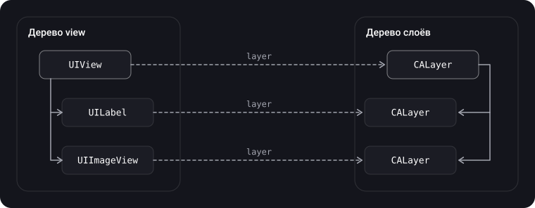
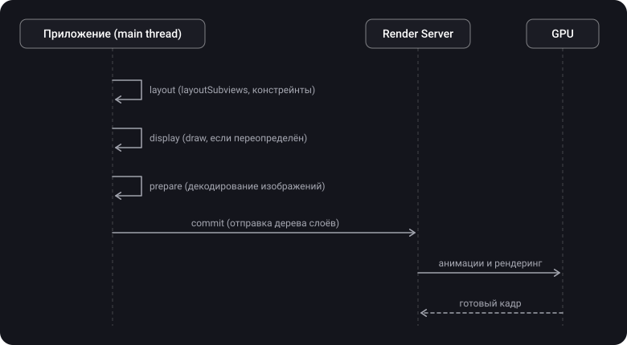

> **Что узнаешь**
>
> - Что такое `CALayer` и как он связан с `UIView`
> - Чем слой отличается от view и почему «слой на GPU, view на CPU» — упрощение
> - Визуальные свойства слоя: углы, рамка, тень; почему тень «пропадает» с обрезкой
> - Неявные и явные анимации; модельный и презентационный слой
> - `CAShapeLayer` и `UIBezierPath`
> - Как работают `draw(_:)` и `setNeedsDisplay()` и когда их лучше не использовать
> - Как кадр попадает на экран (упрощённо) и что такое offscreen pass

> **Нужно знать заранее:** тутор [01](../uiview-window-coordinates/) — `UIView`, иерархия view, `frame` и `bounds`, points и pixels.

## Аналогия: слои прозрачной плёнки

Представь стопку прозрачных плёнок, как в старых мультфильмах. На каждой плёнке нарисован свой элемент, а сверху лежит рамка, через которую смотрит зритель.

- **`CALayer`** — одна плёнка: на ней есть рисунок, положение, прозрачность, тень.
- **`UIView`** — оператор, который ведёт эту плёнку: решает, куда её класть, и слушает, не ткнул ли зритель пальцем в неё. Сама плёнка «не слышит» касаний.
- **Анимация** — вместо того чтобы подменять плёнку, ты просишь сдвинуть её плавно, и стопку движет уже отдельный механизм, а не твой код.
- **`draw(_:)`** — нарисовать рисунок на плёнке вручную. Это дороже, чем положить готовый силуэт (`CAShapeLayer`).

## Шаг 1. Что такое CALayer

> **`CALayer`** — объект Core Animation, который управляет изображением-содержимым и позволяет его анимировать. Слои часто служат хранилищем (backing store) для view, но могут использоваться и без view.

- `CALayer` наследуется **напрямую от `NSObject`**, а не от `UIResponder`. Поэтому у слоя нет интерфейса для обработки касаний и он не участвует в responder chain.
- Слой умеет хранить содержимое (`contents` — обычно картинка), геометрию (`position`, `bounds`, `transform`) и визуальные атрибуты (фон, рамка, тень, прозрачность).
- Изменение свойства слоя — основной способ запустить анимацию.
- Все графические вещи в view в итоге происходят на слоях: view рисует в свой слой, а не сама на экран.

> `UIView` может реагировать на события, а `CALayer` — нет. Слой отвечает за «как выглядит», view — за «как реагирует».

Сравнение view и слоя:

| Возможность | `UIView` | `CALayer` |
| --- | --- | --- |
| Родительский класс | `UIResponder` | `NSObject` |
| Касания и responder chain | Да | Нет |
| Auto Layout | Да | Нет (слои Auto Layout не участвуют) |
| Рисование и визуальные свойства (тень, рамка) | Через слой | Напрямую |
| Анимации | Высокоуровневый API (`UIView.animate`) | Полный набор: неявные и явные, `CAAnimation` |
| Иерархия | subviews | sublayers (проще, без накладных расходов на responder chain) |
| Узкоспециализированные подклассы | Много (UIKit) | `CAShapeLayer`, `CAGradientLayer`, `CATextLayer` и др. |

> У `CALayer` есть метод `hitTest(_:)`: он возвращает самого глубокого потомка слоя, содержащего точку. Но он только находит слой. Доставка касаний, жесты и responder chain — на стороне view.

## Шаг 2. Слой внутри view

У каждой view есть слой-основа (`layer`). View создаёт и настраивает его сама; чаще всего это обычный `CALayer`.



- Иерархия view зеркалируется иерархией слоёв: добавил subview — появился sublayer.
- **View — delegate своего слоя.** Если слой создан view, view назначает себя его delegate, и менять это не следует (по документации Apple). Именно поэтому view может отвечать на запросы слоя вроде `draw(_:)`.
- Геометрия view — это геометрия её слоя: `frame`, `bounds` и `center` view отражают свойства слоя (`position`, `bounds`).
- Изменить тип слоя-основы можно, переопределив `layerClass` у подкласса `UIView`:

```swift
final class GradientView: UIView {
    // UIKit вызовет это один раз при создании view
    override class var layerClass: AnyClass { CAGradientLayer.self }

    // удобный типизированный доступ
    var gradientLayer: CAGradientLayer { layer as! CAGradientLayer }
}

let v = GradientView()
v.gradientLayer.colors = [UIColor.systemBlue.cgColor, UIColor.systemPurple.cgColor]
```

> Способ `layerClass` удобнее, чем добавлять `CAGradientLayer` как sublayer: слой-основа сам следует за размером view и анимациями view, и не нужно руками обновлять его `frame`.

## Шаг 3. Визуальные свойства слоя

Часть оформления view делается не в UIKit, а через слой:

```swift
let layer = cardView.layer

layer.cornerRadius = 12                  // скругление
layer.borderWidth = 1                    // рамка
layer.borderColor = UIColor.separator.cgColor   // цвет слоя — CGColor, не UIColor

layer.shadowColor = UIColor.black.cgColor        // тень
layer.shadowOpacity = 0.2
layer.shadowOffset = CGSize(width: 0, height: 2)
layer.shadowRadius = 8
```

| Свойство | Что делает | Замечание |
| --- | --- | --- |
| `cornerRadius` | Скругляет углы фона и рамки слоя | Содержимое (`contents`) само не обрезается |
| `masksToBounds` | Обрезает sublayers (и содержимое) по границам слоя; у view ему соответствует `clipsToBounds` | Вместе со скруглением обрезает по скруглённому контуру |
| `maskedCorners` | Какие из 4 углов скруглять | `[.layerMinXMinYCorner, .layerMaxXMinYCorner]` — верхние |
| `cornerCurve` | Тип кривой угла; `.continuous` — «iOS-скругление» | iOS 13+ |
| `borderWidth`, `borderColor` | Рамка по контуру слоя | `borderColor` — `CGColor?` |
| `shadowOpacity` / `shadowRadius` / `shadowOffset` / `shadowColor` | Параметры тени | По умолчанию `shadowOpacity = 0`, тени нет |
| `shadowPath` | Заранее заданная форма тени | Резко ускоряет отрисовку, см. шаг 8 и тутор [10](../ui-performance/) |

> Тень и обрезка **конфликтуют**: `masksToBounds = true` обрезает и саму тень, потому что она рисуется за пределами слоя. Поэтому карточка с тенью и скруглённым содержимым делается из **двух** слоёв: внешний рисует тень (без обрезки), внутренний обрезает содержимое.

```swift
final class ShadowCardView: UIView {
    private let contentView = UIView()     // внутренний: скругление и обрезка

    override init(frame: CGRect) {
        super.init(frame: frame)
        // внешняя view: только тень
        layer.shadowColor = UIColor.black.cgColor
        layer.shadowOpacity = 0.2
        layer.shadowRadius = 8
        layer.shadowOffset = CGSize(width: 0, height: 2)

        // внутренняя: скругление и обрезка содержимого
        contentView.layer.cornerRadius = 12
        contentView.layer.masksToBounds = true
        addSubview(contentView)
    }

    required init?(coder: NSCoder) { fatalError("init(coder:) has not been implemented") }

    override func layoutSubviews() {
        super.layoutSubviews()
        contentView.frame = bounds
        // форма тени задана заранее — GPU не нужно считать её по содержимому
        layer.shadowPath = UIBezierPath(roundedRect: bounds, cornerRadius: 12).cgPath
    }
}
```

## Шаг 4. Геометрия слоя и sublayers

У слоя своя геометрия, в терминах которой `frame` у view — производное свойство:

- **`position`** — положение **anchorPoint** слоя в системе координат superlayer.
- **`anchorPoint`** — точка привязки внутри `bounds` в долях от 0 до 1. По умолчанию (0.5, 0.5) — центр. Относительно неё слой вращается и масштабируется.
- **`bounds`** — размер и собственная система координат.
- **`transform`** — `CATransform3D`; у view есть упрощённый `CGAffineTransform`.
- **`zPosition`** — положение по Z для порядка отрисовки.

> У view `center` — это в точности `position` слоя-основы при стандартном anchorPoint (0.5, 0.5). Поэтому `center` и `bounds` — «честные» параметры для позиционирования view с transform, см. тутор [01](../uiview-window-coordinates/).

**Добавленные вручную sublayers не участвуют в Auto Layout.** Если ты создал `CAShapeLayer` и добавил его через `layer.addSublayer`, его `frame` нужно обновлять самому:

```swift
private let shape = CAShapeLayer()

override func layoutSubviews() {
    super.layoutSubviews()
    shape.frame = bounds                                  // слой сам не растянется
    shape.path = UIBezierPath(ovalIn: bounds).cgPath      // и путь — под новый размер
}
```

> В view-контроллере тот же приём — в `viewDidLayoutSubviews()`: bounds view к этому моменту уже финальные (тутор [03](../view-lifecycle/)).

## Шаг 5. Анимации слоя

Слой анимируется через изменение свойств. У каждого animatable-свойства есть связанное **неявное (implicit)** анимирование. Свойства, которые можно анимировать, в документации Apple помечены словом Animatable (`opacity`, `position`, `bounds`, `backgroundColor`, `cornerRadius`, `shadow*`, `transform` и др.).

**Неявная анимация** — достаточно изменить свойство, и Core Animation сама проинтерполирует значение. Для отдельного (standalone) слоя длительность по умолчанию — 0,25 с:

```swift
let standalone = CALayer()              // не слой-основа view
standalone.frame = CGRect(x: 0, y: 0, width: 50, height: 50)
view.layer.addSublayer(standalone)

// позже, когда слой уже в иерархии:
standalone.opacity = 0.2                 // анимируется сам (0,25 с)
```

```swift
view.layer.opacity = 0.5                        // вне блока — без анимации

UIView.animate(withDuration: 0.3) {
    view.layer.opacity = 0.5                    // внутри блока — анимируется
}

CATransaction.begin()
CATransaction.setDisableActions(true)           // для standalone-слоя — без неявной анимации
standalone.opacity = 1
CATransaction.commit()
```

**Явная (explicit) анимация** — ты сам создаёшь `CAAnimation` и добавляешь к слою:

```swift
let fade = CABasicAnimation(keyPath: "opacity")
fade.fromValue = 1
fade.toValue = 0
fade.duration = 0.3

layer.opacity = 0                 // финальное значение ставим сами!
layer.add(fade, forKey: "fade")   // анимация — только визуальная «прокрутка»
```

<details>
<summary>Зачем ставить layer.opacity = 0, если анимация уже есть?</summary>

Явная анимация меняет только то, что видно на экране, а не значение самого свойства. Когда она закончится, слой «вернётся» к своему настоящему значению. Если его не поменять, после анимации слой снова станет непрозрачным. Поэтому сначала задают итоговое значение свойства, а анимацию добавляют только чтобы показать путь к нему.

</details>

Это объясняет, что в Core Animation у слоя два «дерева»:

| Слой | Что хранит | Как получить |
| --- | --- | --- |
| **Model layer** | Целевое, «настоящее» значение свойств; то, что ты читаешь и пишешь | `layer` или `layer.model()` |
| **Presentation layer** | Текущее состояние на экране в каждый момент анимации (копия) | `layer.presentation()` |

Это нужно, например, чтобы определить, куда попал палец на **движущейся** view: у неё `frame` модели уже финальный, а на экране она ещё едет. Позицию на экране даёт `layer.presentation()`.

## Шаг 6. CAShapeLayer и UIBezierPath

> **`CAShapeLayer`** — слой, который рисует кубический сплайн Безье в собственной системе координат. Форму задаёт свойство **`path`** (`CGPath`). **`UIBezierPath`** — UIKit-класс, описывающий 2D-формы и кривые; его `cgPath` подставляется в `path`.

**Преимущества `CAShapeLayer`:**

- **Производительность.** Не нужен `draw(_:)`: форма рисуется при композиции, без создания bitmap содержимого view на CPU. По документации Apple, форма по возможности переводится в экранное пространство перед растеризацией, чтобы сохранить разрешение.
- **Анимации.** Анимируемы `path`, `fillColor`, `strokeColor`, `lineWidth`, `strokeStart`, `strokeEnd` и др.
- **Гибкость.** Заливка, контур, толщина, штриховые линии (`lineDashPattern`), стили концов и стыков линий.

**Создание пути `UIBezierPath`:**

- `move(to:)`, `addLine(to:)`, `addCurve(to:controlPoint1:controlPoint2:)`, `addArc(withCenter:radius:startAngle:endAngle:clockwise:)`, `close()`;
- готовые формы: `UIBezierPath(rect:)`, `UIBezierPath(ovalIn:)`, `UIBezierPath(roundedRect:cornerRadius:)`.

```swift
let shapeLayer = CAShapeLayer()
let bezierPath = UIBezierPath()

// Пример пути: треугольник
bezierPath.move(to: CGPoint(x: 50, y: 0))
bezierPath.addLine(to: CGPoint(x: 100, y: 100))
bezierPath.addLine(to: CGPoint(x: 0, y: 100))
bezierPath.close()

shapeLayer.path = bezierPath.cgPath
shapeLayer.fillColor = UIColor.red.cgColor
shapeLayer.strokeColor = UIColor.black.cgColor
shapeLayer.lineWidth = 2

yourView.layer.addSublayer(shapeLayer)
```

> Основное свойство `CAShapeLayer` — `path`; а `UIBezierPath` нужен, чтобы этот путь удобно описать.

**Анимация прорисовки линии через `strokeEnd`** — типовой приём для индикаторов прогресса и «рисования» галочки:

```swift
let ring = CAShapeLayer()
ring.path = UIBezierPath(ovalIn: bounds.insetBy(dx: 4, dy: 4)).cgPath
ring.fillColor = UIColor.clear.cgColor
ring.strokeColor = UIColor.systemBlue.cgColor
ring.lineWidth = 4
ring.lineCap = .round
ring.strokeEnd = 0
layer.addSublayer(ring)

let draw = CABasicAnimation(keyPath: "strokeEnd")
draw.fromValue = 0
draw.toValue = 1
draw.duration = 1
ring.strokeEnd = 1                      // итоговое значение
ring.add(draw, forKey: "draw")
```

**Форма через маску** — скруглить только верхние углы:

```swift
let path = UIBezierPath(roundedRect: bounds,
                        byRoundingCorners: [.topLeft, .topRight],
                        cornerRadii: CGSize(width: 16, height: 16))
let mask = CAShapeLayer()
mask.path = path.cgPath
view.layer.mask = mask      // альфа-канал слоя mask становится маской view
```

> Маска (`layer.mask`) вызывает offscreen pass на GPU (шаг 8). Для простого скругления углов лучше `cornerRadius` и `maskedCorners`, а маску оставь для сложных форм.

## Шаг 7. Отрисовка через draw(_:) и setNeedsDisplay()

Если стандартных свойств слоя и `CAShapeLayer` не хватает, view можно научить рисовать самой.

> **`draw(_:)`** — метод `UIView`, в котором подкласс рисует содержимое через Core Graphics и UIKit. Реализация по умолчанию ничего не делает.

**Что говорит документация Apple:**

- UIKit создаёт графический контекст и настраивает его так, что его начало совпадает с началом `bounds` view. Получить контекст можно через `UIGraphicsGetCurrentContext()`, но не держи на него strong-ссылку: он может меняться между вызовами.
- Метод вызывается, когда view показывается впервые или когда что-то делает видимую часть недействительной.
- **Никогда не вызывай `draw(_:)` напрямую.** Чтобы перерисовать, вызови `setNeedsDisplay()` или `setNeedsDisplay(_:)`.
- Рисуй только в пределах переданного `rect`. Если `isOpaque == true`, метод обязан полностью залить `rect` непрозрачным содержимым.
- Если view только показывает цвет фона или ты задаёшь содержимое через слой напрямую, переопределять `draw(_:)` не нужно.

> **`setNeedsDisplay()`** — помечает view как требующую перерисовки, запоминает запрос и сразу возвращает управление. Перерисовка произойдёт в следующем цикле отрисовки, когда будут обновлены все помеченные view.

```swift
final class ProgressBarView: UIView {
    var progress: CGFloat = 0 {
        didSet { setNeedsDisplay() }     // изменился контент — просим перерисовку
    }

    override init(frame: CGRect) {
        super.init(frame: frame)
        isOpaque = false                 // углы скруглены, фон не сплошной
        backgroundColor = .clear
    }

    required init?(coder: NSCoder) { fatalError("init(coder:) has not been implemented") }

    override func draw(_ rect: CGRect) {
        let radius = bounds.height / 2
        UIColor.systemGray5.setFill()
        UIBezierPath(roundedRect: bounds, cornerRadius: radius).fill()

        let value = min(max(progress, 0), 1)
        UIColor.systemBlue.setFill()
        let fillRect = CGRect(x: 0, y: 0, width: bounds.width * value, height: bounds.height)
        UIBezierPath(roundedRect: fillRect, cornerRadius: radius).fill()
    }
}
```

**Когда вызывать `setNeedsDisplay()`:**

- Меняется **содержимое или внешний вид**, от которого зависит рисунок в `draw(_:)` (свойства, влияющие на картинку).
- **Не нужен**, если ты просто меняешь геометрию view (`frame`, `bounds`): по документации Apple, при этом view обычно не перерисовывается, её готовое содержимое подгоняется по `contentMode`. Если нужно перерисовывать при смене размера, задай `contentMode = .redraw`.
- **Не нужен**, когда ты добавляешь subview (`UIImageView`, `UIButton`) или меняешь их: они рисуют себя сами.

<details>
<summary>Почему draw(_:) дороже, чем CAShapeLayer?</summary>

При переопределённом `draw(_:)` для view выделяется bitmap-хранилище размером примерно `bounds × scale`, и рисование идёт на CPU через Core Graphics. Результат кэшируется в слое до следующего `setNeedsDisplay()`. Любое изменение требует перерисовать весь bitmap (или его часть) на CPU и заново отправить в систему. `CAShapeLayer` хранит только описание пути и рисуется при композиции, без собственного bitmap, а изменения `strokeEnd`, `fillColor`, `path` можно анимировать силами Core Animation. Поэтому, если форму можно выразить слоем, лучше слой. Подробно о цене кастомного рисования — тутор [10](../ui-performance/).

</details>

| Способ | Когда подходит | Цена |
| --- | --- | --- |
| Свойства слоя (`cornerRadius`, `border`, `shadow`) | Простое оформление | Низкая; тень без `shadowPath` и обрезка со скруглением дают offscreen pass |
| `CAShapeLayer` и `UIBezierPath` | Векторные формы, контуры, прогресс, анимируемые фигуры | Низкая |
| `draw(_:)` и Core Graphics | Сложный кастомный рисунок, которого нет в стандартных слоях | Средняя и выше: bitmap и CPU, перерисовка при каждом `setNeedsDisplay()` |
| Готовое изображение (`UIGraphicsImageRenderer`) | Статичный рисунок, который нужно показать много раз (аватарки, иконки) | Один раз при создании; далее дёшево |

Предварительная отрисовка картинки с круглой формой (чтобы не использовать `cornerRadius` + `masksToBounds` в списках, см. тутор [10](../ui-performance/)):

```swift
func roundedImage(from source: UIImage, size: CGSize) -> UIImage {
    let renderer = UIGraphicsImageRenderer(size: size)
    return renderer.image { _ in
        let rect = CGRect(origin: .zero, size: size)
        UIBezierPath(ovalIn: rect).addClip()     // обрезаем по кругу
        source.draw(in: rect)
    }
}
```

## Шаг 8. Как кадр попадает на экран (упрощённо)

Для понимания, почему одни приёмы быстрые, а другие нет, полезна схема конвейера. Её детали — внутреннее устройство системы, поэтому она дана упрощённо.



- В **приложении** (главный поток) происходят события, layout и подготовка содержимого слоёв, затем дерево слоёв пакетом отправляется в отдельный процесс (Render Server).
- **Render Server** проигрывает анимации и через GPU рендерит кадр. Поэтому неявные и явные анимации слоёв продолжаются плавно, даже если главный поток приложения занят (но замороженный UI на такой анимации — не то же самое, что отзывчивый).
- Экран обновляется 60 или 120 раз в секунду (ProMotion): на кадр у главного потока около 16,7 мс или 8,3 мс (тутор [10](../ui-performance/)).

**Offscreen pass.** Обычно GPU рисует слой сразу в буфер кадра. Но для некоторых эффектов ему нужно сначала отрисовать слой в отдельный буфер, а потом скомпоновать. Это дороже: смена контекста и дополнительная память. К таким эффектам относятся (по материалам Apple WWDC и статьям [objc.io](http://objc.io)):

| Эффект | Как ускорить |
| --- | --- |
| Тень без `shadowPath` | Задать `shadowPath` |
| Маска (`layer.mask`) | Использовать `cornerRadius` или заранее готовую картинку |
| `cornerRadius` вместе с `masksToBounds` (когда есть, что обрезать) | Предварительно отрисованная картинка; не включать `masksToBounds`, если содержимое не выходит за границы |
| `shouldRasterize = true` (кэш слоя в bitmap) | Включать только для редко меняющихся сложных слоёв и задать `rasterizationScale` |
| Визуальные эффекты (блюр, `UIVisualEffectView`) | Использовать осознанно, не в каждой ячейке списка |

Как найти такие слои: в симуляторе Debug → Color Offscreen-Rendered Yellow, а также Instruments (подробнее — тутор [10](../ui-performance/)).

## Шаг 9. Полезные подклассы CALayer

Core Animation даёт специализированные слои, которые часто проще и быстрее, чем своя отрисовка:

| Слой | Для чего |
| --- | --- |
| `CAShapeLayer` | Векторные формы по `path` |
| `CAGradientLayer` | Градиенты (линейный, радиальный, конический) |
| `CATextLayer` | Текст в слое (без ответного view) |
| `CAReplicatorLayer` | Копии слоя с изменениями (индикаторы, эффекты) |
| `CAEmitterLayer` | Частицы (конфетти, снег) |
| `CAScrollLayer` | Прокручиваемый слой |
| `CATiledLayer` | Плитки для очень больших изображений |
| `CAMetalLayer` | Поверхность для рендеринга через Metal |
| `CATransformLayer` | Слой для 3D-иерархий (без плоского преобразования) |

## Типичные ошибки

- Ожидать, что `view.layer.opacity = x` анимируется сам: вне `UIView.animate` слой-основа view меняется мгновенно.
- Добавлять явную анимацию, но не менять итоговое значение свойства: после окончания слой «прыгает» назад.
- Включить `masksToBounds` и удивляться, что тень пропала: нужны два слоя или две view.
- Создать sublayer (`CAShapeLayer`) и не обновлять его `frame` и `path` при смене размера: он не участвует в Auto Layout.
- Вызвать `draw(_:)` напрямую вместо `setNeedsDisplay()`.
- Вызывать `setNeedsDisplay()` при каждом изменении геометрии (это лишняя перерисовка).
- Рисовать в `draw(_:)` всё подряд для простых фигур: `CAShapeLayer` или готовая картинка дешевле.
- Использовать `UIColor` вместо `CGColor` в свойствах слоя (`borderColor`, `shadowColor`, `fillColor`).
- Оставить `isOpaque = true` и не заливать весь `rect` в `draw(_:)`: появятся чёрные области.
- Ставить `shouldRasterize = true` на часто меняющийся слой: кэш будет постоянно пересоздаваться.

<details>
<summary>Почему цвет границы слоя не меняется при смене темы (светлая/тёмная)?</summary>

`CGColor` — статичное значение. Динамический `UIColor` (`.separator`, `.label`) в момент присвоения `.cgColor` «фиксируется» под текущую тему, а при её смене слой сам не обновится. Решение: обновлять такие свойства при смене внешнего вида (например, в `traitCollectionDidChange` или через `registerForTraitChanges` в новых версиях iOS) и брать цвет через `resolvedColor(with: traitCollection)`.

</details>

## Шпаргалка

```swift
// Слой-основа и его тип
view.layer                                         // CALayer view
override class var layerClass: AnyClass { CAGradientLayer.self }

// Оформление
layer.cornerRadius = 12; layer.masksToBounds = true     // обрезка по скруглению
layer.maskedCorners = [.layerMinXMinYCorner]            // какие углы
layer.borderWidth = 1; layer.borderColor = color.cgColor
layer.shadowOpacity = 0.2; layer.shadowPath = path.cgPath
// тень + обрезка = два слоя (внешний - тень, внутренний - обрезка)

// Анимации
UIView.animate(withDuration: 0.3) { view.layer.opacity = 0 }
let a = CABasicAnimation(keyPath: "opacity"); a.toValue = 0; a.duration = 0.3
layer.opacity = 0; layer.add(a, forKey: "fade")         // итоговое значение ставим сами
layer.presentation()                                    // то, что на экране сейчас
CATransaction.setDisableActions(true)                   // выключить неявные

// Фигуры
shape.path = UIBezierPath(ovalIn: rect).cgPath
shape.fillColor = UIColor.red.cgColor
shape.strokeEnd = 1                                     // анимируется

// Рисование
override func draw(_ rect: CGRect) { /* Core Graphics */ }   // не вызывать напрямую
setNeedsDisplay()                                            // контент изменился
contentMode = .redraw                                        // перерисовывать при смене размера

// Вне Auto Layout
override func layoutSubviews() { super.layoutSubviews(); shape.frame = bounds }
```

## Вопросы для самопроверки

<details>
<summary>1. Чем UIView отличается от CALayer?</summary>

`UIView` наследуется от `UIResponder`: реагирует на касания, участвует в responder chain, Auto Layout, имеет высокоуровневый API анимаций. `CALayer` наследуется от `NSObject`: отвечает за содержимое, геометрию и визуальные свойства (тень, рамка), умеет анимироваться, но не обрабатывает события.

</details>

<details>
<summary>2. Правда ли, что view рисуется на CPU, а слой — на GPU?</summary>

Нет, это упрощение. Содержимое слоёв (в том числе `draw(_:)`) готовится на CPU в приложении. Композицию слоёв и анимации выполняет отдельный процесс Render Server с использованием GPU.

</details>

<details>
<summary>3. Почему view.layer.opacity = 0.5 не анимируется, а standaloneLayer.opacity = 0.5 анимируется?</summary>

Для слоя-основы view UIKit отключает неявные анимации и включает их только внутри `UIView.animate`. У отдельных (standalone) слоёв неявные анимации работают по умолчанию, длительность около 0,25 с.

</details>

<details>
<summary>4. Что такое model layer и presentation layer?</summary>

Model layer хранит целевые значения свойств (то, что читаешь и пишешь). Presentation layer — копия, которая отражает состояние на экране в каждый момент анимации (`layer.presentation()`).

</details>

<details>
<summary>5. Почему у view с masksToBounds = true пропадает тень? Как сделать и скругление, и тень?</summary>

`masksToBounds` обрезает всё за границами слоя, в том числе тень. Решение: два слоя или две view — внешний рисует тень, внутренний обрезает содержимое. Для тени задают `shadowPath`.

</details>

<details>
<summary>6. Когда вызывать setNeedsDisplay() и что произойдёт после вызова?</summary>

Когда меняются содержимое или внешний вид, от которых зависит рисунок в `draw(_:)`. Метод только помечает view и возвращается сразу; `draw(_:)` будет вызван системой в ближайшем цикле отрисовки, несколько вызовов схлопываются в одну перерисовку. При смене только геометрии перерисовка не нужна: содержимое подгоняется по `contentMode`.

</details>

<details>
<summary>7. Чем CAShapeLayer лучше отрисовки в draw(_:)?</summary>

Он не требует собственного bitmap и Core Graphics на CPU, рисуется при композиции и хорошо анимируется (`path`, `strokeEnd`, `fillColor`). В `draw(_:)` любое изменение заставляет перерисовать содержимое на CPU.

</details>

## Источники

- [CALayer — Apple Developer Documentation](https://developer.apple.com/documentation/quartzcore/calayer)
- [CAShapeLayer — Apple Developer Documentation](https://developer.apple.com/documentation/quartzcore/cashapelayer)
- [draw(_:) — Apple Developer Documentation](https://developer.apple.com/documentation/uikit/uiview/draw(_:))
- [setNeedsDisplay() — Apple Developer Documentation](https://developer.apple.com/documentation/uikit/uiview/setneedsdisplay())
- [Animating Layer Content — Core Animation Programming Guide (Apple, архив)](https://developer.apple.com/library/archive/documentation/Cocoa/Conceptual/CoreAnimation_guide/CreatingBasicAnimations/CreatingBasicAnimations.html)
- [Changing a Layer’s Default Behavior — Core Animation Programming Guide (Apple, архив)](https://developer.apple.com/library/archive/documentation/Cocoa/Conceptual/CoreAnimation_guide/ReactingtoLayerChanges/ReactingtoLayerChanges.html)
- [Getting Pixels onto the Screen — objc.io](https://www.objc.io/issues/3-views/moving-pixels-onto-the-screen/)
- [Знакомство с CALayer — Habr](https://habr.com/ru/articles/309506/)
- [iOS RSSchool 2020. UIView, CALayer, UIWindow — YouTube](https://www.youtube.com/watch?v=rvTNLQgBfYw&t=806s)
- [View и Layer: в чём разница \| SWIFT — YouTube](https://www.youtube.com/watch?v=kx1vVe7__ec&list=PL6ZiiwR0cAz6zkjJyJLmc928zHUtgABuw&index=10)
