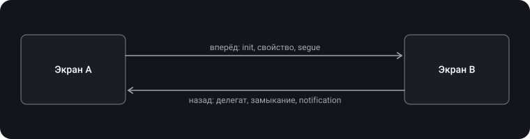

> **Что узнаешь**
>
> - Два направления передачи данных: «вперёд» (A → B) и «назад» (B → A)
> - Вперёд: custom init, свойства, segue и `prepare(for:sender:)`, создание из storyboard через `creator`
> - Назад: делегаты, замыкания, `NotificationCenter` — когда что и какие у них ограничения
> - Почему делегат должен быть `weak`, а в замыканиях нужен `[weak self]`
> - Как работает `UIAppearance`: глобальные и вложенные стили, когда они применяются и что не поддерживают
> - Как стилизовать `UINavigationBar` в современных версиях iOS

> **Нужно знать заранее:** тутор [03](../view-lifecycle/) — жизненный цикл `UIViewController`; тутор [07](../responder-chain-gestures/) — target-action и responder chain; базово — ARC (`strong`, `weak`) и замыкания в Swift.

## Аналогия: поручение и обратная связь

Ты поручаешь другому сотруднику задачу и хочешь, чтобы он сообщил результат.

- **Вперёд.** Вручаешь всё нужное сразу, при выдаче задания (init), или докладываешь позже (свойство).
- **Назад.** Просишь ответить одним из трёх способов:
  - **делегат** — оставляешь номер телефона с правилами (протокол: «звонить туда и говорить такие-то фразы»);
  - **замыкание** — оставляешь запечатанный конверт с инструкцией «прочитать, когда закончишь»;
  - **`NotificationCenter`** — вешаешь объявление на доске: кто уже стоит у доски в этот момент, увидит. Тем, кто подойдёт позже, ничего не достанется.

## Шаг 1. Два направления и обзор способов

Сначала нужно понять направление:



| Способ | Направление | Связь | Когда подходит |
| --- | --- | --- | --- |
| Custom init | Вперёд | Всё нужное обязательно передаётся при создании | Экран без данных не имеет смысла (профиль пользователя) |
| Свойства | Вперёд | Данные можно установить позже создания | Необязательные или обновляемые данные; экран из storyboard |
| Segue и `prepare(for:sender:)` | Вперёд | Переход в storyboard сам создаёт контроллер, ты настраиваешь его до показа | Проекты на storyboard |
| Делегат | Назад | Протокол: один к одному, слабая ссылка | Несколько событий, явный контракт |
| Замыкание | Назад | Локальный обработчик без протокола | Одно или два события, быстрый результат |
| `NotificationCenter` | В любую сторону, один к многим | Нет прямой связи, отправитель не знает получателей | Событие важно многим и не связанным экранам |

## Шаг 2. Вперёд: A → B

**1. Custom init.** Контроллер B создаётся с всем, что ему нужно. Самый надёжный вариант: зависимости — константы (`let`), и без них экран невозможно создать.

```swift
final class ProfileViewController: UIViewController {
    private let user: User

    init(user: User) {
        self.user = user
        super.init(nibName: nil, bundle: nil)
    }

    required init?(coder: NSCoder) {
        fatalError("init(coder:) не поддержан — экран создаётся кодом")
    }
}

// показ
navigationController?.pushViewController(ProfileViewController(user: user), animated: true)
```

**2. Свойства.** Создал контроллер — установил свойство. Просто, но запомнить установку может только ты: компилятор не заставит. Поэтому свойство обычно опциональное (или `var` с разумным значением по умолчанию).

```swift
let details = DetailsViewController()
details.item = item                 // устанавливаем до показа
navigationController?.pushViewController(details, animated: true)
```

**3. Segue.** В storyboard переход создаёт контроллер сам. Передать данные можно в `prepare(for:sender:)`. По документации Apple, метод вызывается, когда segue вот-вот будет выполнен, и в нём настраивают новый контроллер до показа. В `segue` есть ссылки на оба контроллера, в `sender` — объект, который инициировал переход (например, ячейка, на которую нажали).

```swift
override func prepare(for segue: UIStoryboardSegue, sender: Any?) {
    guard segue.identifier == "showDetails",
          let details = segue.destination as? DetailsViewController,
          let cell = sender as? UITableViewCell,
          let indexPath = tableView.indexPath(for: cell) else { return }
    details.item = items[indexPath.row]
}
```

Минусы segue: строковые идентификаторы и приведение типов (опечатка в имени — тихая ошибка), а сам контроллер создаётся без твоего участия, поэтому `let`-зависимости передать нельзя.

**Custom init и storyboard.** С iOS 13 есть способ собрать контроллер из storyboard с собственным инициализатором: `instantiateViewController(identifier:creator:)`. В `creator` ты создаёшь контроллер своим init, принимающим `NSCoder`; по документации Apple, он обязан вызвать `init(coder:)` родителя (иначе это ошибка программиста), а после этого инициализировать свои свойства. Вернёшь `nil` — будет стандартный `init(coder:)`.

```swift
let storyboard = UIStoryboard(name: "Main", bundle: nil)
let profile = storyboard.instantiateViewController(identifier: "Profile") { coder in
    ProfileViewController(coder: coder, user: user)
}

final class ProfileViewController: UIViewController {
    private let user: User

    init?(coder: NSCoder, user: User) {
        self.user = user
        super.init(coder: coder)         // обязательно
    }

    required init?(coder: NSCoder) { fatalError("используй init(coder:user:)") }
}
```

## Шаг 3. Назад: делегат

Делегирование позволяет классу B общаться с A, **не зная его типа**: B знает только протокол. Два класса не связаны между собой жёстко, протокол может реализовать любой класс.

**Четыре ключевых компонента:**

1. протокол делегата;
2. свойство `delegate` в классе, который делегирует;
3. класс, который будет делегатом, соответствует протоколу и себя назначает;
4. класс-делегирующий в нужный момент вызывает метод из протокола.

```swift
// 1) протокол — классовый (AnyObject), чтобы делегата можно было хранить weak
protocol ColorPickerDelegate: AnyObject {
    func colorPicker(_ picker: ColorPickerViewController, didSelect color: UIColor)
}

final class ColorPickerViewController: UIViewController {
    // 2) свойство делегата — weak
    weak var delegate: ColorPickerDelegate?

    @objc private func doneTapped() {
        delegate?.colorPicker(self, didSelect: selectedColor)    // 4) вызываем
        dismiss(animated: true)
    }
}

// 3) экран A соответствует протоколу и назначает себя
extension SettingsViewController: ColorPickerDelegate {
    func colorPicker(_ picker: ColorPickerViewController, didSelect color: UIColor) {
        view.backgroundColor = color
    }
}

let picker = ColorPickerViewController()
picker.delegate = self
present(picker, animated: true)
```

**Почему `weak`.** A держит B (например, как `presentedViewController` или в стеке навигации), а B держит A через `delegate`. Если оба сильные, возникает цикл: ни один не удалится. В Swift циклы должен разрывать программист (`weak` или `unowned`, раздел «Automatic Reference Counting» в The Swift Programming Language). `weak`-ссылка всегда опциональная и допускается только для классов, поэтому протокол делегата объявляют как `AnyObject`.

Соглашение имён (так называют методы делегатов в UIKit): первым параметром передаётся сам отправитель (`colorPicker(_:didSelect:)`), глаголы `will` и `did` обозначают «перед» и «после», `should` — вопрос с ответом. Опциональные методы в Swift-протоколе делаются через `extension` с реализацией по умолчанию.

## Шаг 4. Назад: замыкания (completion handler)

Замыкание заменяет делегат: интерфейс задаётся свойством, хранящим замыкание. Большое преимущество — его легко использовать: оно определяется локально, без отдельного протокола и метода. Замыкание может даже вернуть значение вызывающему коду, поэтому передача возможна в обе стороны.

```swift
final class SecondViewController: UIViewController {
    var onSave: ((String) -> Void)?           // замыкание-обратный вызов

    @objc private func saveTapped() {
        onSave?(textField.text ?? "")         // передаём значение назад
        dismiss(animated: true)
    }
}

// в FirstViewController
let second = SecondViewController()
second.onSave = { [weak self] text in         // [weak self] — чтобы не было retain-цикла
    self?.resultLabel.text = text
}
present(second, animated: true)
```

**Когда замыкания полезны:**

- не нужен подход с протоколом, нужна быстрая возможность передать данные;
- замыкание нужно пробросить через несколько классов: без замыкания пришлось бы строить каскад вызовов функций, а с замыканием можно просто передать блок кода.

**Замыкание или делегат:**

| Критерий | Делегат | Замыкание |
| --- | --- | --- |
| Событий много (`will`, `did`, `should`...) | Удобно: один протокол объединяет их | Нужно много свойств-замыканий |
| Одно событие с результатом | Можно, но много слов | Коротко и локально |
| Возврат значения в ответ | Метод протокола может вернуть значение | Тоже можно, тип замыкания задаёт возврат |
| Риск утечки | `weak var delegate` | `[weak self]` в замыкании |
| Дебаг | Легко найти реализацию по протоколу | Код рядом с местом создания экрана |

> Замыкание, которое хранится в свойстве дочернего экрана и захватывает `self` родителя сильной ссылкой, создаёт retain-цикл, если родитель тоже держит дочерний (показанный модально экран держится родителем). По умолчанию используй `[weak self]` в замыканиях, которые хранятся (escaping).

## Шаг 5. NotificationCenter

> **`NotificationCenter`** — механизм рассылки, который позволяет отправить информацию всем зарегистрированным наблюдателям. Паттерн Observer. В каждом приложении есть центр по умолчанию (`NotificationCenter.default`); один центр доставляет уведомления только внутри одной программы.

**Три части работы:** наблюдение (подписка), отправка, ответ на уведомление.

```swift
extension Notification.Name {
    static let profileDidUpdate = Notification.Name("profileDidUpdate")   // своё имя как константа
}

// отправка (в любом месте)
NotificationCenter.default.post(name: .profileDidUpdate,
                                object: self,
                                userInfo: ["name": "Anna"])

// подписка с селектором
NotificationCenter.default.addObserver(self,
                                       selector: #selector(profileUpdated(_:)),
                                       name: .profileDidUpdate,
                                       object: nil)

@objc private func profileUpdated(_ notification: Notification) {
    let name = notification.userInfo?["name"] as? String     // userInfo — словарь [AnyHashable: Any]
    nameLabel.text = name
}
```

**Блочная подписка и что в ней опасно (по документации Apple):**

- `addObserver(forName:object:queue:using:)` возвращает **токен** (непрозрачный объект-наблюдатель). Центр держит и токен, и блок сильной ссылкой, пока ты не снимешь подписку.
- Подписку нужно снять (`removeObserver`) до того, как система освободит объект, указанный в подписке.
- Если `self` держит токен сильной ссылкой, в блоке нужен `[weak self]` (иначе retain-цикл).
- Параметр `queue`: при `nil` блок выполняется **синхронно в потоке отправителя**. Если обновляешь интерфейс, укажи `OperationQueue.main`.

```swift
private var token: NSObjectProtocol?

override func viewDidLoad() {
    super.viewDidLoad()
    token = NotificationCenter.default.addObserver(
        forName: .profileDidUpdate, object: nil, queue: .main
    ) { [weak self] note in
        self?.nameLabel.text = note.userInfo?["name"] as? String
    }
}

deinit {
    if let token { NotificationCenter.default.removeObserver(token) }
}
```

**Когда подходит:** экраны не связаны между собой; многим экранам нужно ответить на одно уведомление (например, «сменился профиль», «вышел из аккаунта») или одному — на несколько. Не подходит для обычного результата «от B к A»: связь неявная, поток данных трудно проследить.

**Современные варианты получения.** По документации Apple, кроме `addObserver` есть:

- `notifications(named:object:)` — асинхронная последовательность уведомлений (`for await`);
- `publisher(for:object:)` — Combine-публикатор;
- типизированные Swift-сообщения `NotificationCenter.MainActorMessage` и `NotificationCenter.AsyncMessage` (с строгой типизацией и учётом actor isolation).

```swift
// асинхронная последовательность: нет токена, подписка живёт, пока жива задача
let task = Task {
    for await note in NotificationCenter.default.notifications(named: .profileDidUpdate) {
        print(note.userInfo ?? [:])
    }
}
// task.cancel() — прекратить подписку
```

## Шаг 6. Что выбрать

| Задача | Способ |
| --- | --- |
| Экрану нужны данные обязательно | Custom init (в storyboard — `instantiateViewController(identifier:creator:)`) |
| Необязательные данные или настройка после создания | Свойство |
| Переход в storyboard | `prepare(for:sender:)` (или `creator`) |
| Несколько событий назад, явный контракт | Делегат |
| Одно разовое событие назад (выбрал, сохранил) | Замыкание |
| Событие важно многим несвязанным экранам | `NotificationCenter` |
| Общее состояние, которое нужно видеть всем | Отдельный объект данных (модель, сервис), который передают через init и на который подписываются (туторы по архитектуре) |

## Шаг 7. UIAppearance

> **`UIAppearance`** — протокол, который даёт доступ к **appearance proxy** класса. Через прокси можно однажды настроить внешний вид всех экземпляров класса (цвет текста, фон и т.п.).

- Поддерживают это классы, которые соответствуют `UIAppearanceContainer`, а нужные аксессоры помечены `UI_APPEARANCE_SELECTOR` (свойство без этой пометки через proxy настроить нельзя). В списке классов — `UIView`, `UIBarItem`, `UILabel`, `UIButton`, `UINavigationBar`, `UITabBar`, `UITableView`, `UISwitch` и другие подклассы.

**Три вида настройки (по документации Apple):**

1. **Для всех экземпляров** — `appearance()`.
2. **Для экземпляров внутри контейнера** — `appearance(whenContainedInInstancesOf:)`.
3. **Для набора трейтов** — `appearance(for:)` с `UITraitCollection`.

```swift
// все метки в приложении
UILabel.appearance().textColor = .label

// кнопки: Swift возвращает тот же тип, приведение типов не нужно
UIButton.appearance().setTitleColor(.white, for: .normal)
UIButton.appearance().backgroundColor = .systemBlue

// только метки внутри своей карточки
UILabel.appearance(whenContainedInInstancesOf: [CardView.self]).textColor = .secondaryLabel
```

**Когда применяется.** По документации Apple, стили применяются, **когда view попадает в окно**, и не меняют view, которая уже находится в окне. Чтобы обновить уже показанную view, её убирают из иерархии и возвращают обратно. Поэтому стили задают **рано**: при запуске (в `AppDelegate`/`SceneDelegate`, до показа экранов).

**Какая настройка побеждает.** В любой иерархии побеждает «самый внешний» proxy; если равны, решает специфичность (глубина цепочки контейнеров). UIKit берёт первое однозначное совпадение, читая иерархию от окна вниз.

**Навигационная панель в современных iOS.** Для `UINavigationBar` с iOS 13 внешний вид задаётся объектами `UINavigationBarAppearance` в `standardAppearance` и `scrollEdgeAppearance`. По документации Apple, если `scrollEdgeAppearance` — `nil`, UIKit берёт `standardAppearance` с **прозрачным фоном**; в iOS 15 это свойство работает для всех навигационных панелей. Поэтому «пропавший» цвет фона, когда контент прокручен до верха — типичная ошибка: настроили только `standardAppearance`. Нужно задать оба (и при необходимости `compactAppearance`).

```swift
let appearance = UINavigationBarAppearance()
appearance.configureWithOpaqueBackground()
appearance.backgroundColor = .systemBlue
appearance.titleTextAttributes = [.foregroundColor: UIColor.white]

UINavigationBar.appearance().standardAppearance = appearance
UINavigationBar.appearance().scrollEdgeAppearance = appearance     // без этого фон на краю контента будет прозрачным
```

> `UIAppearance` удобен для базовых глобальных стилей (цвет навигационной панели, шрифт меток). Для повторяющихся кастомных элементов (кнопка с скруглением и тенью) часто надёжнее свой подкласс, где вид задаётся прямо в коде класса.

## Типичные ошибки

- Делегат без `weak`: retain-цикл, экраны не удаляются из памяти.
- Протокол делегата без `AnyObject`: `weak` для него не скомпилируется.
- Ссылка на конкретный класс A в B вместо протокола: жёсткая связь и цикл.
- Хранить замыкание с сильным `self` в свойстве экрана: утечка. Нужен `[weak self]`.
- Без нужды передавать всё через `NotificationCenter`: неявная связь, трудно отладить.
- Ждать, что нотификация «дождётся» экрана, который подпишется позже: её никто не получит.
- Не снять блочный observer и не хранить токен: подписка остаётся жить и держит блок.
- Обновлять UI в блочной подписке с `queue: nil`: блок выполняется в потоке отправителя, а он может быть не главным.
- Пытаться передать `let`-зависимость в контроллер, создаваемый segue: создаётся без твоего init (нужен `creator`).
- В `creator` не вызвать `init(coder:)` родителя: ошибка программиста.
- Настраивать свойства через `appearance()` после того, как view уже в окне: на неё не повлияет.
- Ждать от `UIAppearance` свойств без `UI_APPEARANCE_SELECTOR` (например, `layer.cornerRadius`).
- Задать только `standardAppearance` у `UINavigationBar` и удивляться прозрачному фону на краю контента.

<details>
<summary>Почему делегат weak, а в замыкании [weak self]? Всегда ли?</summary>

Речь о цикле сильных ссылок. Если A держит B, а B держит A (через `delegate` или через замыкание, захватившее `self`), оба не удалятся. Всегда `[weak self]` не нужен: для нехранящихся (non-escaping) замыканий цикла нет. Нужен для замыканий, которые хранятся в свойствах или в блочной подписке `NotificationCenter`.

</details>

## Шпаргалка

```swift
// ВПЕРЁД
ProfileVC(user: user)                                  // custom init: let-зависимость
vc.item = item                                         // свойство
override func prepare(for segue: UIStoryboardSegue, sender: Any?) { /* destination */ }
storyboard.instantiateViewController(identifier: "id") { coder in VC(coder: coder, user: u) }  // iOS 13

// НАЗАД
protocol XDelegate: AnyObject { func x(_ x: XVC, didSelect v: V) }
weak var delegate: XDelegate?
var onSave: ((String) -> Void)?                        // в получателе: { [weak self] v in ... }
NotificationCenter.default.post(name: .n, object: self, userInfo: ["k": v])
token = center.addObserver(forName: .n, object: nil, queue: .main) { [weak self] n in ... }   // токен снять в deinit
// нотификация не хранится: поздний подписчик её не получит

// UIAppearance
UILabel.appearance().textColor = .label                // до появления view в окне
UILabel.appearance(whenContainedInInstancesOf: [CardView.self]).textColor = .secondaryLabel
// только UI_APPEARANCE_SELECTOR-свойства; наиболее внешний proxy побеждает
UINavigationBar.appearance().standardAppearance = a; UINavigationBar.appearance().scrollEdgeAppearance = a
```

## Вопросы для самопроверки

<details>
<summary>1. Какие способы передать данные между экранами ты знаешь? Как их разделить по направлению?</summary>

Вперёд (A → B): custom init, свойства, segue с `prepare(for:sender:)`. Назад (B → A): делегат, замыкание, `NotificationCenter`.

</details>

<details>
<summary>2. Чем custom init лучше свойства, и как собрать контроллер из storyboard со своим init?</summary>

Custom init делает зависимость обязательной (`let`): компилятор не даст забыть. Для storyboard — `instantiateViewController(identifier:creator:)` (iOS 13): в `creator` создаётся контроллер со своим init, который обязан вызвать `init(coder:)`.

</details>

<details>
<summary>3. Как устроено делегирование? Почему делегат weak и почему протокол — AnyObject?</summary>

Протокол, свойство `delegate`, класс-делегат, вызов метода протокола. Делегат `weak`, чтобы не было цикла сильных ссылок; `weak` допускается только для классов, поэтому протокол объявляют как `AnyObject`.

</details>

<details>
<summary>4. Когда замыкание лучше делегата, а когда нет?</summary>

Замыкание — для одного-двух событий и быстрого локального результата. Делегат — когда событий много и нужен явный контракт. У обоих риск утечки: `weak var delegate` и `[weak self]`.

</details>

<details>
<summary>5. Что будет, если отправить notification до того, как на неё подписались? На каком потоке выполнится блок?</summary>

Такой подписчик её не получит: центр не хранит историю. Блок при `queue: nil` выполняется синхронно в потоке отправителя; для UI указывают главную очередь.

</details>

<details>
<summary>6. Как отписаться от блочной подписки на NotificationCenter и что будет, если не отписаться?</summary>

Токен, который вернул `addObserver(forName:...)`, нужно передать в `removeObserver(_:)` до освобождения объекта. Иначе центр продолжает держать блок и токен сильными ссылками; без `[weak self]` это утечка.

</details>

<details>
<summary>7. Как работает UIAppearance? Когда он применяется и какие у него ограничения?</summary>

Через appearance proxy класса (для всех экземпляров, внутри контейнера, для трейтов). Применяется, когда view попадает в окно, на уже показанную view не влияет. Работает только со свойствами с `UI_APPEARANCE_SELECTOR`. При конфликте побеждает самый внешний proxy, дальше решает глубина цепочки.

</details>

## Источники

- [UIAppearance — Apple Developer Documentation](https://developer.apple.com/documentation/uikit/uiappearance)
- [scrollEdgeAppearance — Apple Developer Documentation](https://developer.apple.com/documentation/uikit/uinavigationbar/scrolledgeappearance)
- [prepare for segue — Apple Developer Documentation](https://developer.apple.com/documentation/uikit/uiviewcontroller/prepare(for:sender:))
- [instantiateViewController identifier creator — Apple Developer Documentation](https://developer.apple.com/documentation/uikit/uistoryboard/instantiateviewcontroller(identifier:creator:))
- [NotificationCenter — Apple Developer Documentation](https://developer.apple.com/documentation/foundation/notificationcenter)
- [addObserver forName object queue using — Apple Developer Documentation](https://developer.apple.com/documentation/foundation/notificationcenter/addobserver(forname:object:queue:using:))
- [post name object userInfo — Apple Developer Documentation](https://developer.apple.com/documentation/foundation/notificationcenter/post(name:object:userinfo:))
- [Automatic Reference Counting — The Swift Programming Language](https://docs.swift.org/swift-book/documentation/the-swift-programming-language/automaticreferencecounting/)
- [iOS BEST PRACTICES — Базовая реализация методов делегата в UIKit — Mad Brains Техно, YouTube](https://www.youtube.com/watch?v=FpNXqhtdVmI&list=PLw6SJ6q6-1YowmlGVks5a088XrSbihJu-&index=15)
