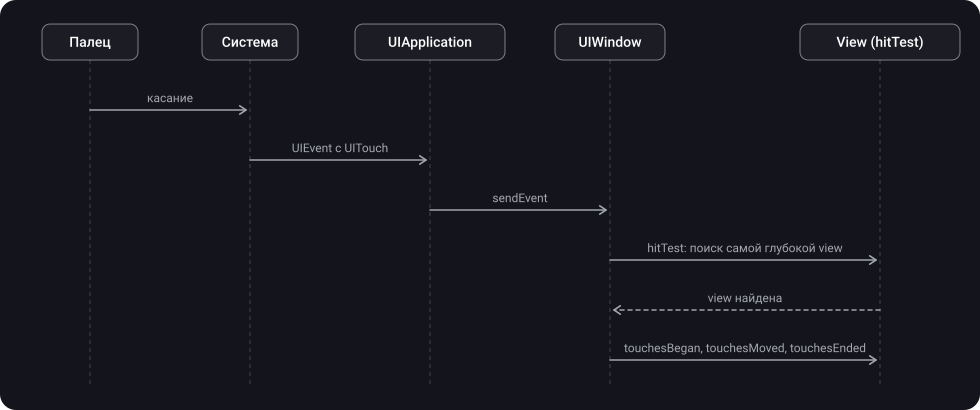

> **Что узнаешь**
>
> - Как касание проходит путь от пальца до view: `UIEvent` → `UIApplication` → `UIWindow` → `hitTest`
> - Что такое `UIEvent` и `UITouch`, их жизнь и фазы касания
> - Как работает `hitTest(_:with:)` и `point(inside:with:)`, и какие view он пропускает
> - Почему view может не получать касания (чек-лист)
> - Как увеличить область нажатия и как пропустить касания «сквозь» view
> - Базовая ручная обработка `touchesBegan`, `touchesMoved`, `touchesEnded`, `touchesCancelled`

> **Нужно знать заранее:** тутор [01](../uiview-window-coordinates/) — `UIView`, `UIWindow`, `frame` и `bounds`, `convert`: без них непонятно, в какой системе координат задана точка касания.

## Аналогия: курьер в офисном здании

Курьер приносит посылку с адресом «точка на фасаде» и не знает, кому она предназначена.

- **Касание (`UITouch`, `UIEvent`)** — посылка с адресом-точкой.
- **`UIApplication` и `UIWindow`** — проходная и рецепция: они принимают посылку и передают вглубь здания.
- **`hitTest`** — сам курьер: заходит в здание и спрашивает у каждого офиса: «эта точка у вас?». Если да, идёт глубже, в комнаты поменьше. Если нет, этот офис и все его комнаты пропускаются.
- **`point(inside:)`** — вопрос на двери: «точка внутри ваших границ?».
- **Адресат** — самая глубокая комната, где точка всё-таки оказалась. Если он посылку не принял, её передают выше (responder chain, тутор [07](../responder-chain-gestures/)).

## Шаг 1. От пальца до view

1. Пользователь касается экрана.
2. Железо и система оповещают о касании приложение.
3. UIKit упаковывает данные в объект **`UIEvent`**: в нём касания (`UITouch`) с координатами, временем, фазой и числом пальцев.
4. `UIApplication` распределяет событие подходящему респондеру через `sendEvent(_:)`; там оно попадает в **`UIWindow`**.
5. Окно запускает **hit-testing** — ищет самую глубокую view, в которую попала точка.
6. Найденная view получает касание (`touchesBegan` и так далее); если она не обрабатывает, касание уходит вверх по responder chain.



`UIApplication.sendEvent(_:)` можно переопределить в подклассе `UIApplication`, чтобы перехватывать все входящие события (например, для логирования или таймера бездействия). Каждое перехваченное событие нужно потом отправить дальше вызовом `super.sendEvent(event)` (требование Apple), иначе интерфейс перестанет реагировать. Доставка события из системы в приложение идёт через run loop главного потока (подробности — в [туторе по RunLoop](../../concurrency/runloop/) из темы «Многопоточность», глава 07).

## Шаг 2. UIEvent

> **`UIEvent`** — объект, описывающий одно взаимодействие пользователя с приложением.

**Типы событий** (по документации Apple):

| Тип | Что это | Куда доставляется |
| --- | --- | --- |
| Touch | Касания пальцем или Apple Pencil | View, в которой касание началось |
| Motion | Тряска устройства (это не данные Core Motion) | Объект, который назначили ты или UIKit |
| Remote-control | Команды гарнитуры или аксессуара (пауза, следующий трек) | Объект, который назначили ты или UIKit |
| Press | Физические кнопки: геймпад, Apple TV Remote | Объект в фокусе |

- У события есть `type` и `subtype`.
- Событие касания содержит один или несколько `UITouch` — по одному на каждый палец на экране. Доступ: `allTouches`, `touches(for: view)`.
- **Во время мультитач-последовательности UIKit повторно использует тот же объект `UIEvent`.** Не храни ссылку на событие и на объекты, которые он возвращает. Если данные нужны вне метода обработки, скопируй их из `UITouch` или `UIEvent` в свои структуры.
- Касания не приходят по одному: методы `UIResponder` получают `Set<UITouch>` и `UIEvent`:

```swift
open func touchesBegan(_ touches: Set<UITouch>, with event: UIEvent?)
open func touchesMoved(_ touches: Set<UITouch>, with event: UIEvent?)
open func touchesEnded(_ touches: Set<UITouch>, with event: UIEvent?)
open func touchesCancelled(_ touches: Set<UITouch>, with event: UIEvent?)
```

- Для touch-событий в view по умолчанию в `touches` лежит только одно касание. Чтобы получать несколько, установи у view `isMultipleTouchEnabled = true`.

## Шаг 3. UITouch

> **`UITouch`** — объект, представляющий место, размер, движение и силу касания на экране. Для каждого пальца, касающегося экрана, существует свой уникальный объект `UITouch`.

**Что хранит UITouch:**

- где оно произошло: `view` и `window`; координаты в нужной системе — `location(in:)`, предыдущее положение — `previousLocation(in:)`;
- фазу (`phase`), время (`timestamp`), число нажатий (`tapCount`);
- примерный радиус касания (`majorRadius`), силу (`force`; на устройствах с 3D Touch или Apple Pencil), тип касания (`type`);
- `gestureRecognizers` — какие распознаватели жестов сейчас обрабатывают это касание.

**Жизнь UITouch (по документации Apple):**

- Когда касание начинается, UIKit создаёт `UITouch` и связывает его с view. По мере движения UIKit обновляет **тот же объект**. Когда касание заканчивается, объект освобождается.
- Единственное, что не меняется, — `view`: даже если палец ушёл за пределы исходной view, `touch.view` остаётся прежним. Поэтому вся последовательность касаний (от `began` до `ended`) идёт к одной view.
- Ссылку на touch можно хранить во время мультитач-последовательности, но нужно освободить её, когда последовательность закончилась. Данные на потом копируй.

**Фазы касания (`UITouch.Phase`):**

| Фаза | Что происходит | Сколько раз |
| --- | --- | --- |
| `.began` | Палец впервые коснулся экрана; `UITouch` только что создан | Всегда первая, один раз |
| `.moved` | Палец двигается по экрану | Много раз |
| `.stationary` | Палец прижат, но не двигался с прошлого события | Много раз |
| `.ended` | Палец оторвался от экрана; `UITouch` больше не появится | Один раз |
| `.cancelled` | Система прекратила отслеживание (например, пользователь поднёс устройство к лицу; также касание могут прервать системные события вроде входящего звонка или уведомления) | Вместо `.ended`, один раз |

У перечисления ещё три позиции для указателя мыши и подобных устройств: `.regionEntered`, `.regionMoved`, `.regionExited` (указатель вошёл в окно, двигается без нажатия, покинул окно). Для касаний пальцем важны первые пять.

Пример: перетаскиваемая view. Переопределяя методы касаний без `super`, переопределяй **все четыре** (требование Apple), даже если некоторые пустые:

```swift
final class DraggableView: UIView {
    override func touchesBegan(_ touches: Set<UITouch>, with event: UIEvent?) {
        // пока ничего: можно подсветить view при нажатии
    }

    override func touchesMoved(_ touches: Set<UITouch>, with event: UIEvent?) {
        guard let touch = touches.first, let parent = superview else { return }
        let current = touch.location(in: parent)              // точка в системе координат superview
        let previous = touch.previousLocation(in: parent)
        center.x += current.x - previous.x                     // сдвигаем view на разницу
        center.y += current.y - previous.y
    }

    override func touchesEnded(_ touches: Set<UITouch>, with event: UIEvent?) {
        // палец отпущен
    }

    override func touchesCancelled(_ touches: Set<UITouch>, with event: UIEvent?) {
        // система прервала касание: вернуть состояние, если нужно
    }
}
```

> Для перетаскивания и подобного на практике чаще берут `UIPanGestureRecognizer` (тутор [07](../responder-chain-gestures/)): он инкапсулирует логику работы с `UITouch`. Ручные `touches...` нужны для нестандартной логики (рисование пальцем, сложные мультитач-сценарии).

## Шаг 4. hitTest — поиск view, в которую попало касание

> **`hitTest(_:with:)`** — метод `UIView`, который возвращает самого «дальнего» потомка текущей view в иерархии (включая её саму), который содержит заданную точку. Возвращает `nil`, если точка полностью вне иерархии этой view.

- `point` — точка в **локальной системе координат** получателя (его `bounds`, тутор [01](../uiview-window-coordinates/)).
- `event` — событие, вызвавшее метод. Если вызываешь вне обработки событий, можно передать `nil`.

**Как работает (по документации Apple):**

- Метод обходит иерархию, вызывая у каждой subview `point(inside:with:)`. Если она вернула `true`, поиск продолжается внутри её subviews, пока не найдётся самая верхняя (frontmost) view с этой точкой.
- Если view точку не содержит, её ветка иерархии **пропускается целиком**.
- Метод **игнорирует** view, которые скрыты (`isHidden`), у которых отключено взаимодействие (`isUserInteractionEnabled = false`) или `alpha` меньше 0.01.
- Метод **не учитывает содержимое** view: он может вернуть view, даже если точка попала в прозрачную часть её картинки.
- **Точки вне `bounds` view не считаются попаданием**, даже если они на самом деле лежат внутри одной из её subviews. Так бывает, когда `clipsToBounds == false` и subview выходит за границы родителя.
- Когда система вызывает метод для маршрутизации событий, ожидается, что view в итоге входит в иерархию окна `UIWindow`.


Упрощённая реализация по описанию Apple (настоящая внутри UIKit сложнее). Помогает понять алгоритм:

```swift
override func hitTest(_ point: CGPoint, with event: UIEvent?) -> UIView? {
    // 1) view не участвует, если скрыта, без взаимодействия или почти прозрачная
    guard isUserInteractionEnabled, !isHidden, alpha >= 0.01 else { return nil }

    // 2) точка должна быть внутри bounds; иначе вся ветка пропускается
    guard self.point(inside: point, with: event) else { return nil }

    // 3) subviews — с верхней (последней в массиве) к нижней
    for subview in subviews.reversed() {
        let converted = subview.convert(point, from: self)   // в систему координат subview
        if let hit = subview.hitTest(converted, with: event) {
            return hit
        }
    }

    // 4) ничего глубже не нашлось — попали в саму view
    return self
}
```

- `point(inside:with:)` — отдельный метод: возвращает `true`, если точка (в локальной системе координат view) лежит внутри `bounds`. Всё, что нужно для изменения «области нажатия» самой view — переопределить его.
- `hitTest` вызывает `point(inside:)` у каждой точки обхода, поэтому обе функции должны быть быстрыми: они вызываются на каждое касание.

> После hit-testing найденная view — первый получатель события. В терминах Apple это «first responder для touch-события» (view, в которой произошло касание). Не путай с view, у которой `isFirstResponder == true` (например, поле ввода с клавиатурой, получающее события с клавиатуры): это разные вещи. Жесты (тутор [07](../responder-chain-gestures/)) получают касания **раньше** самой view: если распознаватели жестов не распознали последовательность, касания доставляются view, а если view их не обработала — передаются вверх по responder chain.

## Шаг 5. Почему view не получает касания: чек-лист

Самая частая проблема — «нажимаю на кнопку, а ничего не происходит». Проверяй по порядку:

| Причина | Пояснение |
| --- | --- |
| `isUserInteractionEnabled == false` | У обычной `UIView` по умолчанию `true`, но у некоторых классов UIKit другое значение (например, у `UILabel` и `UIImageView` оно `false`). Касания игнорируются и удаляются из очереди |
| У родителя `isUserInteractionEnabled == false` | Вся ветка пропускается: до ребёнка hit-testing не дойдёт |
| `isHidden == true` или `alpha` меньше 0.01 | Пропускается при hit-testing (Apple) |
| Точка вне `bounds` родителя | Даже если subview видна (`clipsToBounds == false`), касание до неё не дойдёт, пока родитель точку не содержит |
| Другая view перекрывает её | Поиск идёт от верхней view к нижней; прозрачная, но не скрытая view (`backgroundColor = .clear`) всё равно перехватит касание: hit-test не смотрит на содержимое |
| Идёт анимация | Во время анимации взаимодействие временно отключается у всех участвующих view (Apple). Чтобы оставить его, указывай опцию `.allowUserInteraction` |
| View не в иерархии окна | Для маршрутизации событий view должна входить в иерархию `UIWindow` |
| Касание перехватил распознаватель жеста | Gesture recognizers получают касания раньше view (тутор [07](../responder-chain-gestures/)) |

> View Debugger в Xcode (Debug View Hierarchy) показывает, какие view перекрывают друг друга и где их границы. Удобный тест: поставь в `hitTest` своей view `print`, чтобы увидеть, кто именно получает касание.

## Шаг 6. Увеличить область нажатия

Маленькую кнопку неудобно нажимать. Для простого увеличения области нажатия берут `bounds.insetBy` с отрицательными значениями и переопределяют `point(inside:with:)`:

```swift
class CustomButton: UIButton {
    override func point(inside point: CGPoint, with event: UIEvent?) -> Bool {
        return bounds.insetBy(dx: -10, dy: -10).contains(point)   // область больше на 10 pt со всех сторон
    }
}
```

Apple HIG рекомендует минимум 44 × 44 points для элементов, по которым нажимают. Вариант, который доводит только маленькие view до 44 × 44:

```swift
override func point(inside point: CGPoint, with event: UIEvent?) -> Bool {
    let dx = max(0, 44 - bounds.width) / 2      // сколько добавить с каждой стороны по ширине
    let dy = max(0, 44 - bounds.height) / 2     // и по высоте
    return bounds.insetBy(dx: -dx, dy: -dy).contains(point)
}
```

> Расширенная область работает **только если касание вообще доходит до view**. Если расширенная зона выходит за `bounds` родителя, `hitTest` родителя эту точку отбросит и до view не дойдёт (точки вне `bounds` не считаются попаданием, шаг 4). Поэтому кнопка у самого края родителя не получит дополнительную область снаружи: родителю нужно тоже расширить область (или дать отступы в вёрстке).

| Что нужно | Что переопределять |
| --- | --- |
| Увеличить или уменьшить область нажатия самой view | `point(inside:with:)` |
| Передать касание другой view, скрыть их от subviews, пропустить «сквозь» | `hitTest(_:with:)` |

## Шаг 7. Типовые приёмы с hitTest

**Касания «сквозь» прозрачный оверлей.** Контейнер на весь экран перекрывает нижний слой, но касания по пустому месту должны проходить к view под ним:

```swift
final class PassthroughView: UIView {
    override func hitTest(_ point: CGPoint, with event: UIEvent?) -> UIView? {
        let hit = super.hitTest(point, with: event)
        return hit === self ? nil : hit      // по пустому месту касание «проваливается» сквозь
    }
}
```

Если `hitTest` вернул `nil`, система ищет следующую view под пальцем. Subviews оверлея по-прежнему получают касания, так как `super.hitTest` вернёт их, а не `self`.

**Кнопка, выступающая за границы родителя.** Например, центральная кнопка кастомного tab bar, которая выступает за верхнюю границу. Родитель отбросит точку вне своих `bounds` (шаг 4), поэтому его `hitTest` нужно дополнить:

```swift
final class CustomTabBarContainer: UIView {
    override func hitTest(_ point: CGPoint, with event: UIEvent?) -> UIView? {
        if let hit = super.hitTest(point, with: event) { return hit }   // обычный случай

        // точка вне bounds: вручную спрашиваем subviews
        for subview in subviews.reversed()
        where subview.isUserInteractionEnabled && !subview.isHidden && subview.alpha >= 0.01 {
            let converted = subview.convert(point, from: self)
            if let hit = subview.hitTest(converted, with: event) { return hit }
        }
        return nil
    }
}
```

## Шаг 8. Что дальше: жесты и responder chain

Касания — это только начало. После поиска цели дальше решают два механизма (тутор [07](../responder-chain-gestures/)):

- **Gesture recognizers** получают касания **раньше** view. Если они не распознали последовательность, UIKit отправляет касания view.
- **Responder chain**: если view касания не обработала, их передают вверх: сначала superview, далее view controller корневой view, окно, `UIApplication`. Реализация `touchesBegan` по умолчанию именно пересылает сообщение вверх по цепочке, поэтому `super` вызывается для необработанных касаний.

## Типичные ошибки

- Думать, что subview вне `bounds` родителя получит касание, если `clipsToBounds == false`: видна, но нажать нельзя.
- Переопределять `hitTest` с `return self` для расширения области: сломаются subviews. Нужен `point(inside:with:)`.
- Переопределять `touchesBegan` без `super` и не переопределять остальные три метода.
- Хранить ссылку на `UIEvent` или на `UITouch` после конца последовательности: нужно копировать данные.
- Не обрабатывать `touchesCancelled`: при прерывании системой интерфейс останется в промежуточном состоянии.
- Указывать точку в неправильной системе координат: `hitTest` и `point(inside:)` ждут локальную систему получателя.
- Предполагать, что прозрачная часть картинки не принимает касания: hit-test не смотрит на содержимое.
- Не знать, что у `UILabel` и `UIImageView` `isUserInteractionEnabled` по умолчанию `false`: жест на них не сработает, пока не включишь взаимодействие.
- Думать, что во время анимации view принимает касания: по умолчанию нет, нужен `.allowUserInteraction`.
- Кнопки меньше 44 × 44 pt без расширения области нажатия.

<details>
<summary>Почему touch.view не меняется, когда палец уходит за границы view?</summary>

Так устроено UIKit: hit-testing один раз, в начале касания. Вся последовательность `began` → `moved` → `ended` доставляется той же view, даже если палец уехал за её пределы. Поэтому кнопка у `UIControl` отслеживает «палец ушёл с кнопки» сама, по координатам касания (тутор [07](../responder-chain-gestures/)).

</details>

## Шпаргалка

```swift
// Путь касания
// палец -> UIEvent(UITouch) -> UIApplication.sendEvent -> UIWindow -> hitTest -> view.touchesBegan...
// если view не обработала -> responder chain (вверх)

// Методы
override func touchesBegan/Moved/Ended/Cancelled(_ touches: Set<UITouch>, with event: UIEvent?)
// без super -> переопределить все четыре
touch.location(in: view), touch.previousLocation(in: view), touch.phase, touch.tapCount
view.isMultipleTouchEnabled = true   // несколько пальцев

// Фазы: began -> moved / stationary -> ended | cancelled
// UITouch живёт от began до ended, один на палец; touch.view не меняется

// hitTest
view.hitTest(point, with: event)           // point в локальных координатах
view.point(inside: point, with: event)     // внутри bounds?
// пропускает: isHidden, !isUserInteractionEnabled, alpha < 0.01, точку вне bounds

// Область нажатия
override func point(inside point: CGPoint, with event: UIEvent?) -> Bool {
    bounds.insetBy(dx: -10, dy: -10).contains(point)
}

// Касание «сквозь»
let hit = super.hitTest(point, with: event); return hit === self ? nil : hit
```

## Вопросы для самопроверки

<details>
<summary>1. Как касание попадает от пальца в нужную view?</summary>

Система передаёт событие приложению, UIKit упаковывает его в `UIEvent` с `UITouch`. `UIApplication` распределяет его через `sendEvent`, окно запускает hit-testing — поиск самой глубокой view, содержащей точку. Найденная view получает `touchesBegan` и далее.

</details>

<details>
<summary>2. Что делает hitTest(_:with:) и какие view он пропускает?</summary>

Возвращает самого глубокого потомка (включая себя), содержащего точку, или `nil`. Обходит иерархию через `point(inside:with:)`. Пропускает скрытые view, view с отключённым взаимодействием и `alpha` меньше 0.01; ветку, где точка вне `bounds`. Содержимое view (прозрачные пиксели) не учитывает.

</details>

<details>
<summary>3. Почему subview, выходящая за границы родителя, не получает касания?</summary>

`hitTest` не считает точки вне `bounds` view попаданием и игнорирует такую view вместе со всеми subviews, даже при `clipsToBounds == false`. Чтобы исправить, переопределите `hitTest` родителя и вручную спросите subviews.

</details>

<details>
<summary>4. Чем hitTest отличается от point(inside:with:)? Что переопределить, чтобы увеличить область нажатия?</summary>

`point(inside:with:)` отвечает, есть ли точка внутри `bounds` этой view. `hitTest` находит самую глубокую view в иерархии и вызывает `point(inside:)` у каждой. Чтобы увеличить область нажатия, переопределяют `point(inside:with:)` (`bounds.insetBy(dx: -10, dy: -10).contains(point)`).

</details>

<details>
<summary>5. Сколько фаз у UITouch и что они означают?</summary>

Пять для касаний пальцем: `began` (первое касание, один раз), `moved`, `stationary` (палец прижат, не двигался), `ended` (оторвался, один раз), `cancelled` (система прервала). Плюс три «region»-фазы для указателя мыши.

</details>

<details>
<summary>6. Что такое «первый получатель» touch-события и кто получает касания раньше — view или gesture recognizer?</summary>

Для touch-события это view, в которой произошло касание (результат hit-testing). Gesture recognizers получают касания раньше view; если они не распознали последовательность, касания идут view.

</details>

<details>
<summary>7. Как сделать, чтобы прозрачный оверлей пропускал касания по пустому месту?</summary>

Переопределить `hitTest`: вызвать `super.hitTest`, и если результат — сама view, вернуть `nil`, иначе результат. Subviews останутся нажимаемыми.

</details>

## Источники

- [hitTest — Apple Developer Documentation](https://developer.apple.com/documentation/uikit/uiview/hittest(_:with:))
- [point inside — Apple Developer Documentation](https://developer.apple.com/documentation/uikit/uiview/point(inside:with:))
- [UITouch — Apple Developer Documentation](https://developer.apple.com/documentation/uikit/uitouch)
- [UITouch.Phase — Apple Developer Documentation](https://developer.apple.com/documentation/uikit/uitouch/phase-swift.enum)
- [UIEvent — Apple Developer Documentation](https://developer.apple.com/documentation/uikit/uievent)
- [touchesBegan — Apple Developer Documentation](https://developer.apple.com/documentation/uikit/uiresponder/touchesbegan(_:with:))
- [isUserInteractionEnabled — Apple Developer Documentation](https://developer.apple.com/documentation/uikit/uiview/isuserinteractionenabled)
- [UIApplication sendEvent — Apple Developer Documentation](https://developer.apple.com/documentation/uikit/uiapplication/sendevent(_:))
- [Using responders and the responder chain to handle events — Apple Developer Documentation](https://developer.apple.com/documentation/uikit/using-responders-and-the-responder-chain-to-handle-events)
- [Держим удар с hitTest — Medium (Яндекс Карты)](https://medium.com/yandex-maps-mobile/держим-удар-с-hittest-542653d51a8c)
- [Обработка жестов в iOS — Habr](https://habr.com/ru/articles/584100/)
- [Responder chain and Hit testing \| SWIFT — YouTube](https://www.youtube.com/watch?v=xzzvV1WUfms)
