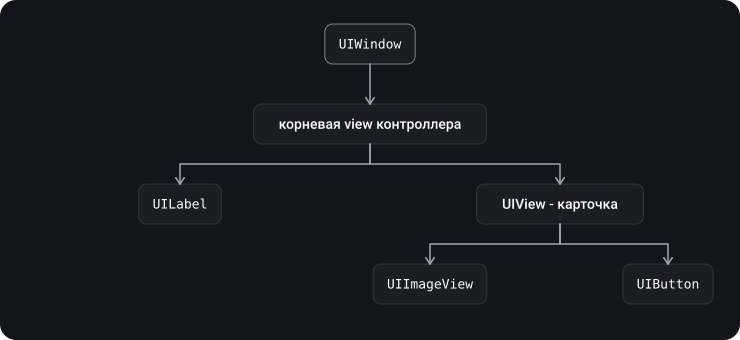
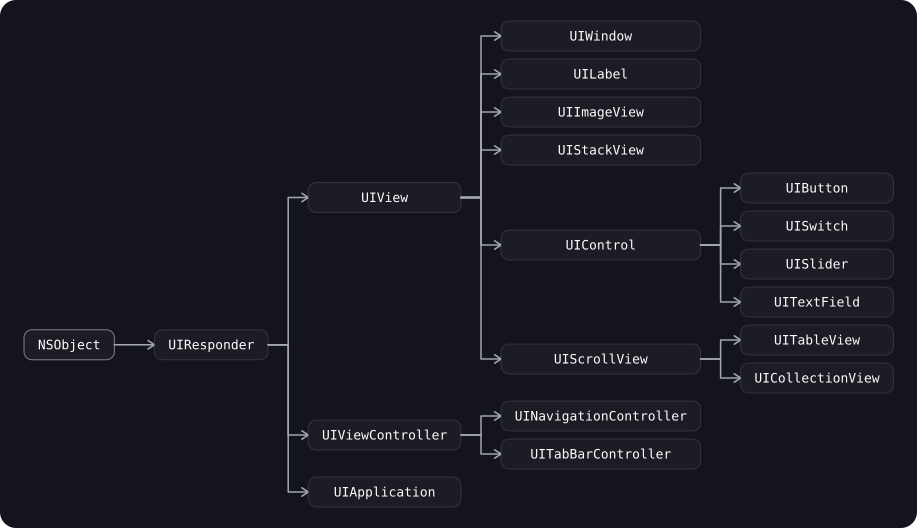
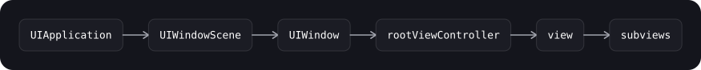
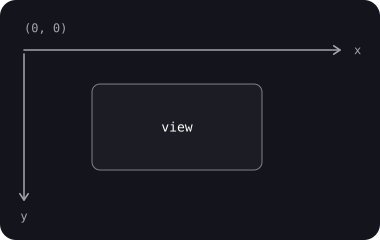
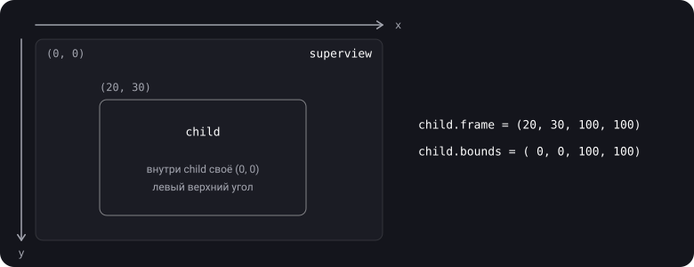
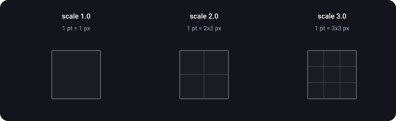

> **Что узнаешь**
>
> - Что такое `UIView` и как из view-ов строится иерархия экрана
> - Откуда `UIView` наследуется и где в этой цепочке `UIWindow`, `UIViewController`, `UIControl`
> - Что делает `UIWindow` и как появляется корневой экран приложения
> - Чем `frame` отличается от `bounds` и при чём тут `center` и `transform`
> - Что такое point и pixel, зачем нужен scale factor
> - Как переводить координаты между view через `convert`

> **Нужно знать заранее:** базовый синтаксис Swift: классы, наследование, структуры (`CGPoint`, `CGSize`, `CGRect` — это структуры).

## Аналогия: стеллажи на стене магазина

Представь стену магазина, на которой висят стеллажи, а на стеллажах стоят полки поменьше.

- **`UIWindow`** — сама стена: на ней всё держится, и именно на стене видно, куда ткнул покупатель.
- **`UIView`** — прямоугольный стеллаж. На нём могут стоять другие стеллажи (subviews), а сам он стоит на чьём-то стеллаже (superview).
- **`frame`** — где стеллаж стоит *на стеллаже-родителе*: отсчёт от левого верхнего угла родителя.
- **`bounds`** — собственная линейка стеллажа: где у него «ноль», если мерить изнутри. Сдвинул ноль линейки — всё содержимое «поехало» (так работает прокрутка).
- **point** — деление на чертеже (размер в макете), **pixel** — точка при печати. Во сколько раз печать подробнее чертежа, говорит scale factor.

## Шаг 1. Что такое UIView

> **`UIView`** — базовый класс для всех видимых элементов интерфейса в UIKit. Это прямоугольная область на экране со своей системой координат, которая умеет отображать содержимое и (как наследник `UIResponder`) реагировать на касания.

- Любая кнопка, надпись, картинка, ячейка таблицы — это `UIView` или его наследник.
- View может содержать другие view (**subviews**) и сама лежит в одной (**superview**). Так получается дерево — иерархия представлений.
- `UIView` наследуется от `UIResponder`, поэтому участвует в обработке событий (touch, responder chain — тутор [06](../touches-hittest/) и [07](../responder-chain-gestures/)).
- Каждая view владеет **слоем** — объектом `CALayer`, который и занимается отображением. Доступ к нему — свойство `layer`.

> `UIView` — это тонкая надстройка над `CALayer`. Она добавляет то, чего у слоя нет: обработку касаний, участие в responder chain, Auto Layout и удобный высокоуровневый API анимаций. За рисование и геометрию отвечает слой (подробно — тутор [02](../calayer-drawing/)).

## Шаг 2. Иерархия представлений

View-ы образуют дерево. Корень — `UIWindow`, у него — корневая view контроллера, а дальше вложенные subviews.



```swift
let card = UIView()
let label = UILabel()

card.addSubview(label)           // label станет subview карточки
view.addSubview(card)            // карточка — subview корневой view

print(label.superview === card)  // true
print(card.subviews.count)       // 1

label.removeFromSuperview()      // убрать из иерархии
```

- **Порядок subviews = порядок отрисовки (z-order).** Последний в массиве `subviews` рисуется поверх предыдущих. Поменять порядок: `bringSubviewToFront(_:)`, `sendSubviewToBack(_:)`, `insertSubview(_:at:)`.
- **Родитель владеет детьми:** `superview.subviews` держит strong-ссылки на subviews, а `superview` у ребёнка — weak-ссылка. Поэтому убранная из иерархии view без других ссылок освобождается.
- По умолчанию subview **не обрезается** границами родителя. Обрезка включается свойством `clipsToBounds = true`.

<details>
<summary>Почему subview может быть видна за пределами родителя, но на неё нельзя нажать?</summary>

Отрисовка и обработка касаний — разные механизмы. Рисовать за границами родителя можно (`clipsToBounds == false`), а при поиске цели касания система сначала проверяет, попадает ли точка в `bounds` родителя, и только потом спускается к его subviews. Точка вне родителя — до ребёнка не дойдёт. Подробно — тутор [06](../touches-hittest/) (`hitTest`).

</details>

## Шаг 3. Иерархия классов UIKit



- `UIResponder` — общий предок всего, что участвует в обработке событий: `UIView`, `UIViewController`, `UIApplication`.
- `UIWindow` — **подкласс `UIView`**, то есть это тоже view, только особая: корень иерархии.
- `UIViewController` — **не** `UIView`. Контроллер владеет корневой view (`view`), но сам не отображается.
- `UITableView` и `UICollectionView` — наследники `UIScrollView` (тутор [08](../lists/)).
- `UIControl` — база для интерактивных элементов с target-action (тутор [07](../responder-chain-gestures/)).

## Шаг 4. UIWindow

> **`UIWindow`** — фон (backdrop) пользовательского интерфейса приложения и объект, который доставляет события вашим view. Сама по себе у окна нет визуального вида: оно содержит view, которыми управляет корневой view controller.

**Что делает окно:**

- Хранит **`rootViewController`** — контроллер, с которого начинается интерфейс (`UINavigationController`, `UITabBarController` или свой).
- Доставляет события: касания идут в то окно, где они произошли; события без координат (например, с клавиатуры) — в **key window**. Key window в каждый момент одно (`isKeyWindow`).
- Задаёт **положение по оси Z** через `windowLevel`: какое окно выше другого.
- Умеет конвертировать координаты в систему окна и обратно (`convert(_:to:)`, `convert(_:from:)`).
- Привязано к сцене (`UIWindowScene`) и экрану.

> Большинству приложений нужно **одно** окно на главном экране. Дополнительные окна нужны редко: например, для внешнего дисплея или оверлеев поверх всего интерфейса. Подклассировать `UIWindow` тоже почти не приходится: поведение удобнее реализовывать в контроллерах.

Как окно создаётся в современном приложении на сценах (iOS 13 и новее):

```swift
final class SceneDelegate: UIResponder, UIWindowSceneDelegate {
    var window: UIWindow?

    func scene(_ scene: UIScene,
               willConnectTo session: UISceneSession,
               options connectionOptions: UIScene.ConnectionOptions) {
        guard let windowScene = scene as? UIWindowScene else { return }

        let window = UIWindow(windowScene: windowScene)
        window.rootViewController = UINavigationController(
            rootViewController: HomeViewController()
        )
        window.makeKeyAndVisible()   // показать и сделать key window
        self.window = window         // держим окно strong-ссылкой!
    }
}
```



Как получить окно из кода сегодня. `UIApplication.shared.keyWindow` помечено как deprecated (с iOS 13), потому что при нескольких сценах «главного окна приложения» больше нет. Используй окно от конкретной view или сцены:

```swift
let window = view.window                       // окно этой view (nil, если view не на экране)
let scene = view.window?.windowScene           // сцена окна
```

## Шаг 5. Система координат UIKit

В UIKit начало координат — **левый верхний угол**, ось X направлена вправо, ось Y — **вниз**. Все значения — в points (шаг 6).



**Два прямоугольника одной view:**

> **`frame`** — положение и размер view в системе координат **superview**. Нужен, чтобы разместить view внутри родителя.
>
> **`bounds`** — положение и размер view в **собственной** системе координат. Нужен, чтобы размещать содержимое и subviews внутри самой view.

| Свойство | Система координат | Что задаёт | При `transform` ≠ identity |
| --- | --- | --- | --- |
| `frame` | superview | Где view стоит в родителе и её размер | Значение **не определено** (по документации Apple его нужно игнорировать) |
| `bounds` | собственная | Размер view и «начало отсчёта» содержимого | Не меняется |
| `center` | superview | Центральная точка view | Не меняется |

**Как они связаны (по документации Apple):**

- По умолчанию `bounds.origin` = (0, 0), а `bounds.size` равен `frame.size`.
- Установка `frame` меняет `center` и размер в `bounds`.
- Изменение размера в `bounds` растягивает или сжимает view **относительно её центра** и меняет размер в `frame`.
- Если `transform` не identity, позиционируй view через `center`, а размер меняй через `bounds`, но не через `frame`.
- Изменение `frame` и `bounds` можно анимировать; `draw(_:)` при этом не вызывается (если не включён `contentMode = .redraw`).



Что напечатается? Проверь себя.

```swift
let parent = UIView(frame: CGRect(x: 50, y: 100, width: 300, height: 300))
let child = UIView(frame: CGRect(x: 20, y: 30, width: 100, height: 100))
parent.addSubview(child)

print(child.frame)    // (20.0, 30.0, 100.0, 100.0)  — в координатах parent
print(child.bounds)   // (0.0, 0.0, 100.0, 100.0)    — в собственных

parent.bounds.origin = CGPoint(x: 0, y: 50)   // сдвигаем «ноль линейки» parent

print(child.frame)    // ???
```

<details>
<summary>Ответ и почему так</summary>

`(20.0, 30.0, 100.0, 100.0)` — `child.frame` не изменился: он задан в системе координат parent, а мы не двигали ни child, ни parent. Изменилась сама система координат parent: её начало теперь в точке y = 50 по отношению к его верхнему краю. Поэтому child на экране **поднялся на 50 pt** относительно верхнего края parent (был на y = 30 от верха, стал на y = –20, то есть частично вышел за верх). На экране (если parent стоит в (50, 100) окна) верх child окажется на y = 100 + 30 – 50 = 80. Именно так работает прокрутка: `UIScrollView` сдвигает `bounds.origin`, а subviews «едут» вместе с содержимым.

</details>

**Transform и `frame`:**

```swift
let v = UIView(frame: CGRect(x: 100, y: 100, width: 100, height: 100))
v.transform = CGAffineTransform(rotationAngle: .pi / 4)   // поворот на 45°

print(v.bounds)   // (0.0, 0.0, 100.0, 100.0) — не изменился
print(v.center)   // (150.0, 150.0)           — не изменился
print(v.frame)    // ≈ (79.29, 79.29, 141.42, 141.42)
```

> После поворота `frame` на практике возвращает **описывающий прямоугольник** (примерно 141,42 × 141,42 вместо 100 × 100). Но Apple документирует это значение как **неопределённое**, поэтому не строй на нём логику и не присваивай `frame` у повёрнутой или масштабированной view. Используй `center` и `bounds`.

**Перевод координат между view:**

```swift
// точка из системы координат child в систему parent
let pointInParent = child.convert(CGPoint(x: 10, y: 10), to: parent)

// то же, но прямоугольником и в обратную сторону
let rectInChild = child.convert(parent.bounds, from: parent)

// to: nil — в координаты окна (если view в окне)
let rectInWindow = child.convert(child.bounds, to: nil)
```

## Шаг 6. Point и Pixel

> **Point (пункт)** — логическая единица измерения в UIKit. Все `frame`, `bounds`, отступы и размеры в коде задаются в points. **Pixel (пиксель)** — физическая точка экрана. Связь между ними — **scale factor** (коэффициент масштаба).

- Система конвертирует points в pixels на этапе рендеринга.
- На обычном дисплее 1 point = 1 pixel (scale 1.0). На Retina-дисплеях scale factor равен 2.0 или 3.0, и один point покрывается 4 или 9 пикселями соответственно.
- Благодаря этому одна и та же разметка в points выглядит одинаково по размеру на устройствах с разной плотностью пикселей, только чётче на более плотных.



Примеры из документации Apple:

| Пример | Размер в points | Scale | Пикселей |
| --- | --- | --- | --- |
| iPhone X | 375 × 812 | 3.0 | 1125 × 2436 |
| View 50 × 50 pt при scale 2.0 | 50 × 50 | 2.0 | 100 × 100 (bitmap view) |

**Native scale.** У части устройств физическое разрешение не кратно UIKit-масштабу. Например, iPhone 8 Plus: в UIKit это 414 × 736 pt при scale 3.0 (то есть внутри рендерится 1242 × 2208), а физический экран — 1080 × 1920 px, `nativeScale` ≈ 2.608. iOS сначала рисует в UIKit-масштабе, потом уменьшает до физических пикселей. Для игр и Metal это важно, для обычного UIKit-интерфейса — нет.

Как узнать scale в коде. `UIScreen.main` deprecated (с iOS 16), лучше брать из окружения view:

```swift
let scale = traitCollection.displayScale      // актуальный scale для этой view
let viewScale = contentScaleFactor            // scale, с которым view рисует своё содержимое

// Выравнивание значения по границе пикселей, чтобы линии не «размазывались»
func pixelAligned(_ value: CGFloat) -> CGFloat {
    (value * scale).rounded() / scale
}
```

- Поэтому тонкие линии в 1 pt на @3x — это 3 пикселя; если координата не кратна размеру пикселя, линия размажется на соседние пиксели.

## Шаг 7. Как правильно писать свою view

Типовой шаблон view-подкласса: два инициализатора (из кода и из Storyboard/Nib), общая настройка в одном месте.

```swift
final class CardView: UIView {
    // из кода
    override init(frame: CGRect) {
        super.init(frame: frame)
        setup()
    }

    // из Storyboard / Nib — обязателен, иначе не скомпилируется
    required init?(coder: NSCoder) {
        super.init(coder: coder)
        setup()
    }

    private func setup() {
        backgroundColor = .secondarySystemBackground
        layer.cornerRadius = 12            // свойство слоя (тутор 02)
        clipsToBounds = true
    }
}
```

> Если размещаешь view через Auto Layout (тутор [04](../autolayout-constraints/)), **не задавай ей `frame` вручную**: положение и размер вычислит система. `frame` руками уместен там, где ты сам рассчитываешь позиции, например в `layoutSubviews()` (тутор [05](../autolayout-layout-pass/)).

## Типичные ошибки

- Путать `frame` и `bounds`: использовать `frame` подвида для расчётов внутри самой view (надо `bounds`).
- Считать `frame` после `transform`: значение не определено, логика ломается при повороте или масштабе.
- Задавать размеры view в пикселях вместо points.
- Вручную ставить `frame` у view, которую позиционирует Auto Layout: layout потом перезапишет значение.
- Забыть держать `window` strong-ссылкой в `SceneDelegate`: окно освободится, экран пропадёт.
- Ожидать, что subview обрежется по границам родителя: для этого нужен `clipsToBounds = true`.
- Использовать `UIApplication.shared.keyWindow` и `UIScreen.main` в новом коде: в многооконных приложениях они дают неверный или устаревший ответ.

<details>
<summary>Чем UIView отличается от UIViewController?</summary>

`UIView` — прямоугольная область интерфейса: рисует содержимое и принимает касания. `UIViewController` управляет view и её жизненным циклом: создаёт корневую view, реагирует на появление и исчезновение экрана, участвует в навигации. Контроллер не отображается сам, он отвечает за свою view и её subviews.

</details>

## Шпаргалка

```swift
// Иерархия
parent.addSubview(child)                 // child поверх остальных
child.removeFromSuperview()
parent.bringSubviewToFront(child)
parent.clipsToBounds = true              // обрезать subviews по границам

// Геометрия (points; начало координат — левый верхний угол, y вниз)
view.frame    // в системе superview   — разместить view
view.bounds   // в собственной системе — разместить содержимое
view.center   // центр в системе superview
// transform != .identity -> frame не использовать, использовать center и bounds

// Перевод координат
view.convert(point, to: otherView)       // to: nil — в окно
view.convert(rect,  from: otherView)

// Window
UIWindow(windowScene: scene)
window.rootViewController = vc
window.makeKeyAndVisible()
view.window                              // окно view

// Points и pixels
pixels = points * scale                  // scale: 1.0 / 2.0 / 3.0
traitCollection.displayScale             // актуальный scale
```

## Вопросы для самопроверки

<details>
<summary>1. Чем frame отличается от bounds?</summary>

`frame` — прямоугольник view в системе координат superview (где она стоит в родителе). `bounds` — прямоугольник в собственной системе координат (размер и начало отсчёта содержимого). По умолчанию `bounds.origin` = (0, 0), размер совпадает с размером `frame`.

</details>

<details>
<summary>2. Что произойдёт с frame и bounds при повороте view через transform?</summary>

`bounds` и `center` не меняются. Значение `frame` по документации Apple становится неопределённым (на практике это описывающий прямоугольник повёрнутой view), поэтому его нужно игнорировать и не присваивать.

</details>

<details>
<summary>3. Что произойдёт с subviews, если изменить bounds.origin родителя?</summary>

Их `frame` не изменится, но они сдвинутся на экране в противоположную сторону относительно новой системы координат родителя. На этом принципе устроена прокрутка в `UIScrollView`.

</details>

<details>
<summary>4. Что такое point и pixel, и как они связаны?</summary>

Point — логическая единица UIKit, в points задаются все размеры и координаты. Pixel — физическая точка экрана. Связывает их scale factor: pixels = points × scale. На Retina scale равен 2.0 или 3.0.

</details>

<details>
<summary>5. Что делает UIWindow и сколько окон обычно нужно приложению?</summary>

Окно — корень иерархии view: хранит `rootViewController`, доставляет события, задаёт уровень по оси Z и переводит координаты. Обычно достаточно одного окна на главном экране.

</details>

<details>
<summary>6. Является ли UIViewController наследником UIView? Кто ещё наследуется от UIResponder?</summary>

Нет. `UIViewController` и `UIView` — оба наследники `UIResponder`, но не друг друга. Также от `UIResponder` наследуется `UIApplication`.

</details>

<details>
<summary>7. Почему UIApplication.shared.keyWindow устарело?</summary>

С появлением сцен (iOS 13) у приложения может быть несколько окон в нескольких сценах, и «одного главного окна» больше нет. Нужное окно берут у view (`view.window`) или у сцены.

</details>

## Источники

- [frame — Apple Developer Documentation](https://developer.apple.com/documentation/uikit/uiview/frame)
- [bounds — Apple Developer Documentation](https://developer.apple.com/documentation/uikit/uiview/bounds)
- [UIWindow — Apple Developer Documentation](https://developer.apple.com/documentation/uikit/uiwindow)
- [contentScaleFactor — Apple Developer Documentation](https://developer.apple.com/documentation/uikit/uiview/contentscalefactor)
- [scale (UIScreen) — Apple Developer Documentation](https://developer.apple.com/documentation/uikit/uiscreen/scale)
- [Displays — iOS Device Compatibility Reference (Apple, архив)](https://developer.apple.com/library/archive/documentation/DeviceInformation/Reference/iOSDeviceCompatibility/Displays/Displays.html)
- [iOS RSSchool 2020. UIView, CALayer, UIWindow — YouTube](https://www.youtube.com/watch?v=rvTNLQgBfYw&t=806s)
- [Frame & Bounds \| SWIFT — YouTube](https://www.youtube.com/watch?v=pLXwrbdU7eI&list=PL6ZiiwR0cAz6zkjJyJLmc928zHUtgABuw&index=11)
- [Swift — Bounds vs. Frame, iOS Interview Question — YouTube](https://www.youtube.com/watch?v=Nfzy1qgxSAg)
- [Frames vs Bounds — Beginning Scroll Views in iOS — YouTube](https://www.youtube.com/watch?v=Bw8BblNmMzw)
