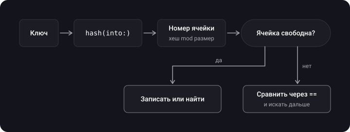
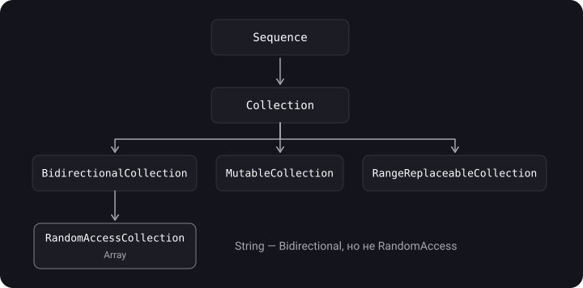

> **Что узнаешь**
>
> - Как устроены `Array`, `Set`, `Dictionary` и какую сложность имеют их операции
> - Что такое hash-таблица, хеш-функция и коллизия
> - `Equatable`, `Hashable`, `Comparable` и правила синтеза
> - Разбор задач с собеседований на `Hashable`
> - `Sequence`, `Collection`, срезы и lazy-коллекции
> - `count` и `capacity`, `ContiguousArray`, массив со слабыми ссылками, безопасный subscript

> **Нужно знать заранее:** тутор 01 (copy-on-write), тутор 07 (протоколы), тутор 06 (`map`, `filter`).

## Аналогия: шкаф с ячейками и адресная книга

- **Array** — ряд пронумерованных ячеек. Достать «третью» — мгновенно. Вставить в середину — сдвинуть всё, что дальше. Найти по содержимому — перебирать ячейки по очереди.
- **Dictionary / Set** — адресная книга с оглавлением: по имени сразу вычисляешь «страницу» и открываешь. Расчёт «страницы» — хеш-функция; если у двух имён одинаковая страница — коллизия.

## Шаг 1. Array

> **Array** — упорядоченная коллекция элементов одного типа. Элементы лежат **непрерывно** в буфере на куче; сам `Array` — структура со ссылкой на этот буфер (поэтому у него copy-on-write, тутор 01).

```swift
var array = Array(repeating: 2.5, count: 3)   // [2.5, 2.5, 2.5]
array += [1.0]                                 // добавить массив
for (index, value) in array.enumerated() {     // индекс и значение
    print(index, value)
}
```

**`count` и `capacity`.** `count` — сколько элементов сейчас, `capacity` — сколько влезет без перевыделения памяти. Когда `count` упирается в `capacity`, массив выделяет больший буфер (обычно в раз больше) и копирует элементы. Если заранее знаешь размер, `reserveCapacity` создаст буфер сразу:

```swift
var numbers = [Int]()
numbers.reserveCapacity(1000)
print(numbers.count)               // 0
print(numbers.capacity >= 1000)    // true
```

Обычно перевыделение не бывает проблемой: рост буфера геометрический, поэтому перевыделений для миллиона `append` всего около двадцати. Резервировать имеет смысл для огромных массивов или путей, где важны задержки (аудиобуфер).

**Срезы (slices).** `ArraySlice` — «окно» в тот же буфер. Создаётся за O(1), без копирования элементов, и **сохраняет исходные индексы**:

```swift
let list = [10, 20, 30, 40, 50]
let slice = list[1..<4]            // ArraySlice<Int>: [20, 30, 40]
print(slice.startIndex)            // 1 — индексы не перенумерованы!
print(slice[1])                    // 20
let copy = Array(slice)            // новый массив, индексы с 0, элементы копируются
```

Срез держит весь исходный буфер живым, пока сам существует — для долгого хранения скопируй в `Array`.

**Сложность операций `Array`:**

| Операция | Сложность | Пояснение |
| --- | --- | --- |
| `array[i]`, `count` | O(1) | прямой доступ по индексу |
| `append` | O(1) amortized | редко удваивается буфер за O(n), но в среднем на одну операцию — O(1) |
| `removeLast` | O(1) | ничего не сдвигается |
| `insert(_:at:)`, `remove(at:)`, `removeFirst` | O(n) | сдвиг элементов |
| `contains`, `firstIndex(of:)` | O(n) | линейный поиск |
| `removeAll` | O(n) | элементы нужно освободить; для простых типов оптимизатор может ускорить |
| `sorted()` | O(n log n) | сортировка |

## Шаг 2. Set и Dictionary

> **Set** — неупорядоченная коллекция **уникальных** значений. **Dictionary** — неупорядоченная коллекция пар «ключ→значение» с уникальными ключами. Элементы `Set` и ключи `Dictionary` должны быть `Hashable`.

```swift
var genres: Set<String> = ["Rock", "Classical", "Hip hop"]
genres.insert("Rock")           // дубликат — ничего не меняется
print(genres.count)             // 3
print(genres.contains("Jazz"))  // false — O(1) в среднем

var ages: [String: Int] = ["Anna": 30]
ages["Boris"] = 25                         // вставка
for (name, age) in ages { print(name, age) }   // порядок не гарантирован
let names = Array(ages.keys)
```

| Операция | Set | Dictionary |
| --- | --- | --- |
| insert / lookup / remove | O(1) в среднем | O(1) в среднем |
| в худшем случае (много коллизий) | O(n) | O(n) |

**`nil` в словаре.** Присваивание `dict[key] = nil` **удаляет** ключ. Чтобы хранить ключ со значением `nil` (когда `Value` — Optional), используй `.some(nil)`:

```swift
var d: [String: Int?] = ["a": 1]
d["a"] = nil          // ключ "a" удалён
d["b"] = .some(nil)   // ключ "b" хранится, значение nil
print(d.count)        // 1
```

**Другие коллекции.** `OrderedSet`, `OrderedDictionary`, `Deque`, `Heap` — в пакете **swift-collections** (отдельный SwiftPM-пакет от Apple, в стандартную библиотеку не входят).

## Шаг 3. Hash-таблица и коллизии

> **Хеш-функция** превращает значение в целое число (хеш). **Hash-таблица** использует хеш, чтобы вычислить место элемента в массиве ячеек. **Коллизия** — когда два разных значения попали в одну ячейку.



## Шаг 4. Equatable, Hashable, Comparable

> **`Equatable`** — есть `==`. **`Hashable`** — расширяет `Equatable`, добавляет `hash(into:)`. **`Comparable`** — расширяет `Equatable`, добавляет `<` (остальные `>`, `<=`, `>=` получаются автоматически).

**Главное правило:** если `a == b`, то у `a` и `b` **должны** быть одинаковые хеши. Обратное неверно: одинаковые хеши не означают равенства (это коллизия).

**Синтез компилятора.** Компилятор сам генерирует `==` и `hash(into:)`, если ты объявил соответствие **в исходном объявлении типа** и:

- `struct` — все хранимые свойства `Hashable`;
- `enum` — все ассоциированные значения `Hashable` (enum без ассоциативных значений соответствует автоматически).

```swift
struct Point: Hashable { var x: Int; var y: Int }       // всё синтезируется
enum Direction: Hashable { case north, south }          // тоже

class Value: Hashable {                                  // класс — руками
    var a = 1
    static func == (lhs: Value, rhs: Value) -> Bool { lhs.a == rhs.a }
    func hash(into hasher: inout Hasher) { hasher.combine(a) }
}
```

Синтез не сработает для классов, для структуры с не-`Hashable` полем и для enum с не-`Hashable` ассоциативным значением. Для `class` для сравнения идентичности `===` реализация `Equatable` не требуется.

**Правило письма вручную:** в `hash(into:)` комбинируй те же поля, по которым сравниваешь в `==` (или часть их), никак не больше.

```swift
struct User: Hashable {
    let id: Int
    let name: String
    static func == (l: User, r: User) -> Bool { l.id == r.id }   // равенство по id
    func hash(into hasher: inout Hasher) { hasher.combine(id) }  // хеш только по id
}
```

**Comparable:**

```swift
struct Version: Comparable {
    let major: Int
    let minor: Int
    static func < (l: Version, r: Version) -> Bool {
        (l.major, l.minor) < (r.major, r.minor)    // сравнение кортежей
    }
}
print(Version(major: 1, minor: 2) < Version(major: 1, minor: 10))   // true
```

## Шаг 5. Задачи на Hashable

**Задача 1.** Все хеши одинаковы, но значения разные. Что выведет?

```swift
class KeyObject: Hashable {
    static func == (lhs: KeyObject, rhs: KeyObject) -> Bool { lhs.a == rhs.a }
    let a: Int
    func hash(into hasher: inout Hasher) { hasher.combine(0) }   // всегда один и тот же вклад
    init(a: Int) { self.a = a }
}

let key1 = KeyObject(a: 1)
let key2 = KeyObject(a: 2)
var dict = [KeyObject: String]()
dict[key1] = "hi"
print(dict[key2], dict[key1])
```

<details>
<summary>Ответ</summary>

`nil Optional("hi")`. Хеши у `key1` и `key2` совпадают, поэтому словарь смотрит в ту же ячейку, но подтверждает совпадение через `==`: `key2 != key1`, значит значение для `key2` не найдено. Корректно, но неэффективно: поиск деградирует до O(n).

</details>

**Задача 2.** Разные объекты с одинаковыми `a`:

```swift
class KeyObject2: Hashable {
    static func == (lhs: KeyObject2, rhs: KeyObject2) -> Bool { lhs.a == rhs.a }
    let a: Int
    func hash(into hasher: inout Hasher) { hasher.combine(a) }
    init(a: Int) { self.a = a }
}

let key1 = KeyObject2(a: 1)
let key2 = KeyObject2(a: 1)       // другой объект, но == даёт true
var dict = [KeyObject2: String]()
dict[key1] = "hi"
print(dict[key2], dict[key1])
```

<details>
<summary>Ответ</summary>

`Optional("hi") Optional("hi")`. С точки зрения `Hashable` это один и тот же ключ: хеш и `==` совпадают, хотя это разные объекты в памяти.

</details>

**Задача 3.** Все ключи совпадают по хешу, но `==` по полю (структура):

```swift
struct KeyObject3: Hashable {
    let a: Int
    func hash(into hasher: inout Hasher) { hasher.combine(0) }
}
let k1 = KeyObject3(a: 1)
let k2 = KeyObject3(a: 3)
var dict = [KeyObject3: String]()
dict[k1] = "Hi"
dict[k2] = "hello"
print(dict[k2] as Any)
```

<details>
<summary>Ответ</summary>

`Optional("hello")`. `==` синтезируется по `a`, значит ключи разные. Всё работает корректно, но поиск — O(n) из-за массовых коллизий.

</details>

**Когда поиск по ключу становится O(n)?** Когда много ключей имеют одинаковый хеш (плохая хеш-функция или набор входных данных, специально подобранный под коллизии).

## Шаг 6. Sequence и Collection

> **`Sequence`** — тип, дающий последовательный доступ к элементам через итератор (`makeIterator()`). Реализация даёт `for-in`, `map`, `filter`, `contains` и другие методы «бесплатно».

```swift
struct Countdown: Sequence, IteratorProtocol {
    var count: Int
    mutating func next() -> Int? {
        if count == 0 { return nil }
        defer { count -= 1 }
        return count
    }
}

for i in Countdown(count: 3) { print(i) }   // 3, 2, 1
print(Countdown(count: 3).map { $0 * 10 })  // [30, 20, 10]
```



`Collection` добавляет индексы и многократный обход; `RandomAccessCollection` — доступ по индексу за O(1) (`Array`). `String` — `BidirectionalCollection`, но не `RandomAccessCollection` (тутор 11).

## Шаг 7. Ленивые коллекции

> **`.lazy`** откладывает вычисления до момента, когда элементы действительно запрашиваются, и выполняет цепочку операций поэлементно.

```swift
let numbers = [1, 2, 3, 6, 9]

let lazyResult = numbers.lazy
    .filter { print("filter \($0)"); return $0 % 2 == 0 }
    .map { print("map \($0)"); return $0 * 2 }

print("цепочка создана")        // ещё ничего не вычислялось
print(lazyResult.first as Any)         // тут запускается ровно столько, сколько нужно
// цепочка создана
// filter 1
// filter 2
// map 2
// Optional(4)
```

## Шаг 8. Массив со слабыми ссылками

Массив держит объекты **сильно**. Чтобы хранить слабые ссылки (например, список наблюдателей), нужна обёртка или специальная коллекция.

| Способ | Плюсы | Минусы |
| --- | --- | --- |
| Своя обёртка `Weak<T>` | типбезопасно, порядок сохраняется | `nil`-элементы нужно удалять вручную |
| `NSPointerArray.weakObjects()` | порядок сохраняется, есть `compact()` | нет типизации (приведение `as?`) |
| `NSHashTable<T>.weakObjects()` | автоматическая очистка, типизирована | нет порядка |

```swift
final class Weak<T: AnyObject> {
    weak var value: T?
    init(_ value: T) { self.value = value }
}

final class Stuff { }

var observers: [Weak<Stuff>] = []
var s: Stuff? = Stuff()
observers.append(Weak(s!))
s = nil                                  // объект освободился
observers.removeAll { $0.value == nil }  // очистка вручную
print(observers.count)                   // 0

let table = NSHashTable<Stuff>.weakObjects()   // Foundation
```

## Шаг 9. Безопасный subscript и ContiguousArray

Выход индекса за границы — краш. Безопасный вариант через `extension`:

```swift
extension Collection {
    subscript(safe index: Index) -> Element? {
        index >= startIndex && index < endIndex ? self[index] : nil
    }
}

extension Array {
    subscript(index: Int, default defaultValue: @autoclosure () -> Element) -> Element {
        indices.contains(index) ? self[index] : defaultValue()
    }
}

let names = ["Anna", "Boris"]
print(names[safe: 5] as Any)                       // nil
print(names[7, default: "Anonymous"])              // Anonymous
```

**`ContiguousArray`** — массив, гарантированно хранящий элементы непрерывно. Важен для элементов-классов и `@objc`-протоколов: обычный `Array` в этом случае может быть мостом к `NSArray`, а `ContiguousArray` — нет и потому быстрее и предсказуемее. Для элементов-структур и enum разница обычно незаметна.

## Типичные ошибки

- Делать `insert(at: 0)`/`removeFirst()` в цикле по массиву → O(n²).
- Искать по массиву `contains` внутри цикла вместо `Set` → O(n²).
- Полагаться на порядок элементов `Set`/`Dictionary`.
- Писать `==` по одним полям, а `hash(into:)` — по другим (равные объекты с разными хешами ломают коллекцию).
- Думать, что `hashValue` уникален или стабилен между запусками.
- Хранить мутабельное поле, входящее в хеш, у ключа словаря: после изменения ключ «пропадёт» в таблице.
- Принимать `Array(slice)` за «срез» и думать, что копирования нет.

<details>
<summary>Каверзный вопрос: почему срез может привести к утечке памяти?</summary>

`ArraySlice` делит буфер с исходным массивом и удерживает его целиком. Если ты взял срез из огромного массива и хранишь его долго, весь исходный буфер остаётся в памяти. Для долгого хранения копируй в `Array(slice)`.

</details>

## Шпаргалка

```text
Array       [i] O(1)  append O(1)* (amortized)  insert/remove(at:) O(n)  contains O(n)
Set         insert/contains/remove O(1) avg, O(n) worst; элементы Hashable
Dictionary  get/set/remove O(1) avg, O(n) worst; ключи Hashable; dict[k] = nil удаляет

Hashable: a == b  =>  a.hash == b.hash   (обратное неверно)
          hash(into:) совместно с ==;  хеш рандомизирован на каждый запуск

arr[1..<4]                 // ArraySlice (общий буфер, O(1), индексы сохраняются)
Array(arr[1..<4])          // копия
arr.lazy.filter{}.map{}    // лениво, поэлементно
reserveCapacity(n)         // заранее выделить буфер
```

## Вопросы для самопроверки

<details>
<summary>1. Какая сложность операций у Array, Set, Dictionary?</summary>

Array: доступ по индексу O(1), `append` amortized O(1), `insert`/`remove` в середине и поиск O(n). Set/Dictionary: O(1) в среднем, O(n) в худшем при множестве коллизий.

</details>

<details>
<summary>2. Чем count отличается от capacity?</summary>

`count` — число элементов, `capacity` — вместимость текущего буфера без перевыделения. `reserveCapacity` выделяет место заранее.

</details>

<details>
<summary>3. Что такое коллизия и как с ней работает Swift?</summary>

Два разных ключа дали один и тот же индекс в таблице. Swift использует открытую адресацию с линейным пробированием, сравнивая кандидатов через `==`; таблица растёт при переполнении.

</details>

<details>
<summary>4. Какие правила у Hashable?</summary>

Равные объекты должны иметь одинаковый хеш; хеш считается в `hash(into:)` через `Hasher`; он не уникален и рандомизируется при каждом запуске.

</details>

<details>
<summary>5. Когда компилятор синтезирует Equatable и Hashable?</summary>

Для struct — если все хранимые свойства Hashable; для enum — если все ассоциативные значения Hashable. Для class — никогда, нужно писать вручную.

</details>

<details>
<summary>6. В чём разница между срезом и копией массива?</summary>

Срез (`ArraySlice`) делит буфер и создаётся за O(1), сохраняя индексы; `Array(slice)` копирует элементы в новый буфер.

</details>

<details>
<summary>7. Как хранить слабые ссылки в массиве?</summary>

Обёртка `Weak<T>` (типбезопасно, очистка вручную), `NSPointerArray.weakObjects()` (порядок, `compact()`), `NSHashTable.weakObjects()` (без порядка, автоочистка).

</details>

## Источники

- [Collection Types — The Swift Programming Language](https://docs.swift.org/swift-book/documentation/the-swift-programming-language/collectiontypes/)
- [Array — Apple Developer Documentation](https://developer.apple.com/documentation/swift/array)
- [Hashable — Apple Developer Documentation](https://developer.apple.com/documentation/swift/hashable)
- [SE-0206: Hashable Enhancements](https://github.com/swiftlang/swift-evolution/blob/main/proposals/0206-hashable-enhancements.md)
- [Swift Collections — swiftlang/swift-collections](https://github.com/apple/swift-collections)
