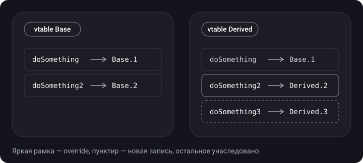
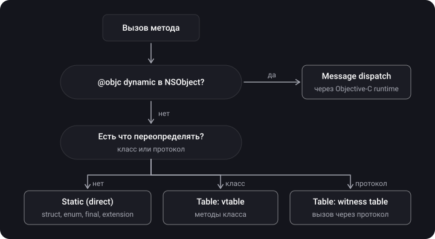

> **Что узнаешь**
>
> - Что такое диспетчеризация методов и зачем она нужна
> - Три вида: static (direct), table (vtable / witness table), message
> - Какая диспетчеризация выбирается для struct, class, протоколов, extension, `final`, `private`, `@objc dynamic`
> - Как проверить диспетчеризацию через SIL
> - Method swizzling, KVC и KVO
> - Разбор задач с собеседований на диспетчеризацию

> **Нужно знать заранее:** [тутор 01](../structs-classes-enums/) (struct/class), [тутор 03](../init-inheritance-access/) (`final`, `override`), [тутор 07](../protocols-extensions-casting/) (протоколы, extension), [тутор 08](../generics-any-some/) (existential container).

## Аналогия: кто ответит на звонок

Ты звонишь в офис и просишь: «получить счёт».

- **Static dispatch** — ты знаешь прямой номер бухгалтера и звонишь ей напрямую. Быстро, но только если ответить может ровно один человек.
- **Table dispatch** — ты звонишь на ресепшн и смотришь в справочнике должностей нужного отдела: у каждого отдела свой справочник, а номер в нём может отличаться.
- **Message dispatch** — ты кричишь в комнату «счёт, пожалуйста!» и ждёшь, пока кто-нибудь отозвётся; всё решается на лету, и даже можно подменить того, кто ответит.

## Шаг 1. Что такое диспетчеризация

> **Диспетчеризация (method dispatch)** — процесс выбора конкретной реализации метода при его вызове: по какому адресу перейти в памяти, чтобы выполнить нужные инструкции.

Вызов метода → **диспетчеризация** → выполнение тела метода.

## Шаг 2. Static (direct) dispatch

Компилятор знает, что у метода есть **ровно одна реализация** — адрес зашивается в вызов. Наиболее быстрый вид; допускает **inlining**: компилятор может подставить тело функции вместо вызова.

**Когда будет static:**

- методы `struct`, `enum` (нет наследования — нечего переопределять);
- `final class` и `final`-члены;
- `private` и `fileprivate` методы — никто не может переопределить в другом файле; а если включена Whole Module Optimization, компилятор может доказать отсутствие переопределений и для `internal`;
- методы, объявленные в `extension` (в том числе в `extension` протокола);
- `static` методы (это `class final`);
- оптимизатор может «девиртуализировать» даже виртуальный вызов, если точно знает конкретный тип.

```swift
final class Fast {                       // final → все методы static
    func doSomething() { print("fast") }
}

class Slow {
    func doSomething() { doPrivate() }   // vtable (если не девиртуализирован)
    private func doPrivate() { }         // static: переопределить нельзя
}

extension Slow {
    func fromExtension() { }             // static: метод в extension
}
```

**Whole Module Optimization (WMO)** — режим сборки, при котором компилятор видит весь модуль сразу: может найти, что у метода нет переопределений, и сделать вызов static или встроить его. В Release-сборках его нужно включать (в Xcode он включён в Release по умолчанию).

**Inlining:**

```swift
func addOne(to num: Int) -> Int { num + 1 }
let twoPlusOne = addOne(to: 2)
// после оптимизации может стать: let twoPlusOne = 2 + 1 — вызова больше нет
```

## Шаг 3. Table dispatch

**Table (dynamic) dispatch** работает в рантайме: вызов идёт через таблицу указателей на реализации. Есть две разновидности.

- **Virtual table (vtable)** — у каждого класса есть таблица своих методов; потомок копирует таблицу родителя и подменяет переопределённые записи. Нужна для наследования и `override`.
- **Protocol witness table (PWT)** — для каждой пары «тип + протокол» таблица, где для каждого требования протокола указана реализация этого типа. Используется при вызовах через протокол (`any P`, неспециализированный дженерик).

```swift
class Base {
    func doSomething()  { print("Base 1") }   // в vtable Base
    func doSomething2() { print("Base 2") }
}
class Derived: Base {
    override func doSomething2() { print("Derived 2") }  // своя запись в vtable Derived
    func doSomething3() { print("Derived 3") }            // новая запись
}

let obj: Base = Derived()
obj.doSomething2()   // Derived 2 — выбрано по vtable реального типа
```



## Шаг 4. Message dispatch

> **Message dispatch** — механизм Objective-C: вызов метода — это отправка **сообщения** (селектора) объекту. Runtime ищет реализацию по селектору в классе объекта, потом вверх по цепочке суперклассов; если не нашла — `unrecognized selector`, краш.

- Работает в рантайме, самый дорогой из трёх, но у него есть **кэш методов**, поэтому повторные вызовы быстрее.
- Позволяет менять поведение в рантайме: **method swizzling**, KVO (isa-swizzling), `UIAppearance`, Core Data.
- В Swift включается для членов, помеченных `@objc dynamic` (`dynamic` требует `@objc`, чтобы работать через Objective-C runtime), а также для членов классов-наследников `NSObject`, которые объявлены как `@objc` в `extension`.

```swift
import Foundation

class Base: NSObject {
    @objc dynamic func hello() -> String { "base" }   // message dispatch
}
class Derived: Base {
    override func hello() -> String { "derived" }
}

let b: Base = Derived()
print(b.hello())   // derived
```

`@objc` и `dynamic` — разные вещи. `@objc` делает член видимым для Objective-C runtime (генерируется селектор), но само по себе не меняет диспетчеризацию Swift-вызовов: обычный вызов такого метода может остаться статическим или table. `dynamic` — это то, что заставляет Swift вызывать метод через отправку сообщения.

## Шаг 5. Что и когда выбирается

На выбор влияют два фактора: (1) какой это тип (struct / class / протокол / NSObject) и (2) где объявлен метод — в исходном объявлении или в `extension`.

| Где объявлен метод | struct / enum | class | протокол (требование) | наследник NSObject |
| --- | --- | --- | --- | --- |
| В основном объявлении | static | vtable | witness table | vtable; с `@objc dynamic` — message |
| В `extension` | static | static | static (реализация по умолчанию и методы, не входящие в требования) | static; с `@objc` в extension — message |
| `final` / `private` | — | static | — | static (для не-`dynamic`) |



> **Как проверить самому.** Вывести промежуточный код SIL: `swiftc -emit-silgen MyFile.swift`. В нём: `function_ref` — static dispatch, `class_method` — vtable, `witness_method` — witness table, `objc_method` — message dispatch. Для оптимизированного кода: `swiftc -O -emit-sil MyFile.swift`.

## Шаг 6. Задачи на диспетчеризацию

**Задача 1.** Что выведет код?

```swift
protocol P { }
extension P {
    func method() { print("from protocol") }
}
struct C: P {
    func method() { print("from struct") }
}

let firstObject = C()
firstObject.method()
let secondObject: P = C()
secondObject.method()
```

<details>
<summary>Ответ</summary>

`from struct`, затем `from protocol`. `method` не входит в требования `P`, поэтому его вызов диспетчеризуется статически по типу переменной: `C` → метод структуры, `P` → метод extension. Добавь `func method()` в протокол — вторая строка станет `from struct`.

</details>

**Задача 2.** Что выведет код? Метод есть в требованиях протокола, а подкласс не переопределяет, а «дублирует» его:

```swift
protocol StaticProto { func foo() }

extension StaticProto {
    func foo() { print("StaticProto") }
}

class ClassA: StaticProto { }           // отдаёт реализацию по умолчанию из extension

class ClassB: ClassA {
    func foo() { print("ClassB") }       // это не override: у ClassA нет своего foo
}

let x: StaticProto = ClassB()
x.foo()
```

<details>
<summary>Ответ</summary>

`StaticProto`. Witness table составлена для `ClassA`, у которого есть только реализация из extension. `ClassB` наследует этот witness table, а его `foo` — новый метод, а не переопределение, и в таблицу не попадает.

</details>

**Задача 3.** То же, но `ClassA` реализует метод сам, а потомки его переопределяют:

```swift
protocol VirtualProto { func foo() }
extension VirtualProto { func foo() { print("VirtualProto") } }

class ClassA: VirtualProto { func foo() { print("ClassA") } }
class ClassB: ClassA { override func foo() { print("ClassB") } }
class ClassC: ClassB { override func foo() { print("ClassC") } }

let x: VirtualProto = ClassC()
x.foo()
```

<details>
<summary>Ответ</summary>

`ClassC`. Запись witness table указывает на `ClassA.foo`, который вызывается через **vtable** — а в vtable реального класса `ClassC` стоит его точка переопределения.

</details>

## Шаг 7. Method swizzling

> **Method swizzling** — подмена реализации метода в рантайме: runtime Objective-C меняет местами указатели на реализации двух селекторов в таблице класса. **isa swizzling** — подмена класса у конкретного объекта.

```swift
import Foundation

final class Greeter: NSObject {
    @objc dynamic func greet() -> String { "hello" }
    @objc dynamic func shout() -> String { "HELLO" }
}

let m1 = class_getInstanceMethod(Greeter.self, #selector(Greeter.greet))!
let m2 = class_getInstanceMethod(Greeter.self, #selector(Greeter.shout))!
method_exchangeImplementations(m1, m2)

print(Greeter().greet())   // HELLO — реализации поменялись местами
```

Плюсы и риски: swizzling позволяет перехватить вызовы в системных классах (логирование, аналитика), но делает код неочевидным: поведение меняется вне места вызова, легко получить конфликты и бесконечную рекурсию.

## Шаг 8. KVC и KVO

> **KVC (Key-Value Coding)** — доступ к свойствам объекта по строковому имени в рантайме. **KVO (Key-Value Observing)** — подписка на изменение свойства объекта (реализация паттерна Observer).

Оба механизма работают через Objective-C runtime — нужен класс-наследник `NSObject` и `@objc dynamic` у свойства.

```swift
import Foundation

final class Person: NSObject {
    @objc dynamic var age = 0
}

let person = Person()

// KVC
person.setValue(30, forKey: "age")
print(person.value(forKey: "age") as Any)   // Optional(30)

// KVO (Swift-friendly API)
let token = person.observe(\.age, options: [.old, .new]) { _, change in
    print("age: \(change.oldValue ?? -1) -> \(change.newValue ?? -1)")
}
person.age = 31      // age: 30 -> 31
token.invalidate()   // отписка
```

**Как это устроено.** KVO реализован через **isa-swizzling**: при первом `observe` runtime динамически создаёт подкласс (`NSKVONotifying_Person`), подменяет у объекта `isa`, а его сеттеры переопределяет так, чтобы они уведомляли наблюдателей. Поэтому нужен `dynamic`: без него вызов сеттера не пройдёт через подменённый класс.

**KVO в Combine:**

```swift
import Combine

let cancellable = person.publisher(for: \.age)
    .sink { print("age changed: \($0)") }
// age changed: 31   <- сразу при подписке (по умолчанию есть .initial)
person.age = 32
// age changed: 32
```

**Правила работы с KVO:**

- храни токен (`NSKeyValueObservation`) — когда он освобождается, подписка снимается; в `deinit` можно вызвать `invalidate()`;
- KVO доступен только для классов-наследников `NSObject` и свойств `@objc dynamic`;
- старый стиль — `addObserver(_:forKeyPath:options:context:)` и `observeValue(forKeyPath:...)` — остаётся доступным, но новый closure-API безопаснее.

Для SwiftUI-кода вместо KVO обычно используют макрос `@Observable` (фреймворк Observation, iOS 17+) или `ObservableObject` — они не зависят от Objective-C runtime (тема «SwiftUI»).

## Типичные ошибки

- Думать, что всё в Swift диспетчеризуется динамически (или всё статически).
- Добавлять метод в `extension` протокола без требования и ждать полиморфизма.
- Переопределять метод, объявленный в `extension` класса без `@objc` (ошибка компиляции).
- Делать свойство KVO-наблюдаемым без `@objc dynamic`.
- Не хранить KVO-токен — подписка сразу исчезнет.
- Свизлить методы «на всякий случай»: скрытые побочные эффекты и бесконечная рекурсия.
- Утверждать на собеседовании, что `final` «защищает» от переопределения, не упомянув оптимизацию диспетчеризации.

<details>
<summary>Каверзный вопрос: какая диспетчеризация у метода в расширении класса?</summary>

Static. Поэтому метод в `extension` нельзя переопределить в наследнике (компилятор не позволит), если не `@objc` в классе-наследнике `NSObject` — тогда message dispatch.

</details>

## Шпаргалка

```text
static   : struct/enum, final, private, extension-методы, static func  (быстро, можно встраивать)
vtable   : методы класса (override)
witness  : требования протокола (вызов через any P)
message  : @objc dynamic в NSObject (swizzling, KVO)

SIL: function_ref=static  class_method=vtable  witness_method=PWT  objc_method=message
WMO в Release помогает компилятору девиртуализировать вызовы

KVO: @objc dynamic var x; obj.observe(\.x) { ... }  // храни токен
KVC: obj.setValue(v, forKey: "x"); obj.value(forKey: "x")
swizzling: class_getInstanceMethod + method_exchangeImplementations
```

## Вопросы для самопроверки

<details>
<summary>1. Что такое диспетчеризация и какие бывают виды?</summary>

Выбор реализации метода при вызове. Static (direct), table (vtable для классов, witness table для протоколов), message (Objective-C).

</details>

<details>
<summary>2. В каких случаях будет static dispatch?</summary>

struct/enum, `final`, `private`, методы в extension, `static` методы; также когда оптимизатор (WMO) доказал отсутствие переопределений.

</details>

<details>
<summary>3. Чем vtable отличается от witness table?</summary>

Vtable — таблица методов класса (наследование, override). Protocol witness table — таблица реализаций требований протокола для конкретного типа.

</details>

<details>
<summary>4. Чем @objc отличается от dynamic?</summary>

`@objc` делает член доступным для Objective-C runtime; `dynamic` заставляет вызывать его через отправку сообщения.

</details>

<details>
<summary>5. Как работает KVO под капотом?</summary>

Isa-swizzling: runtime динамически создаёт подкласс с переопределёнными сеттерами, которые уведомляют наблюдателей, и подменяет класс объекта. Нужны `NSObject` и `@objc dynamic`.

</details>

<details>
<summary>6. Что такое swizzling и работает ли он в Swift?</summary>

Подмена реализаций методов через Objective-C runtime. Работает для `@objc dynamic` методов и методов Objective-C классов; для обычных Swift-методов поведение не гарантируется.

</details>

<details>
<summary>7. Что выведет код из задачи 1 и почему?</summary>

`from struct`, `from protocol`: метод не входит в требования протокола, выбор по статическому типу переменной.

</details>

## Источники

- [Using Key-Value Observing in Swift — Apple Developer](https://developer.apple.com/documentation/swift/using-key-value-observing-in-swift)
- [Key-Value Coding Programming Guide — Apple Developer Archive](https://developer.apple.com/library/archive/documentation/Cocoa/Conceptual/KeyValueCoding/)
- [Swift Intermediate Language (SIL) — swiftlang/swift, docs/SIL](https://github.com/swiftlang/swift/blob/main/docs/SIL/SIL.md)
- [Type Layout — swiftlang/swift, docs/ABI](https://github.com/swiftlang/swift/blob/main/docs/ABI/TypeLayout.rst)
- [Optimization Options — swift.org](https://github.com/swiftlang/swift/blob/main/docs/OptimizationTips.rst)
