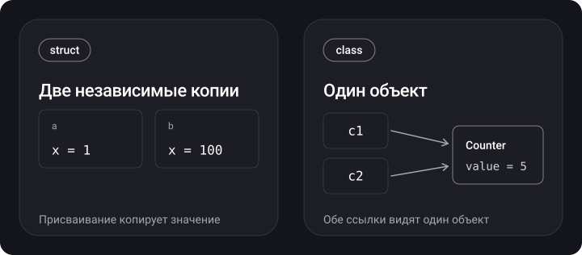

> **Что узнаешь**
>
> - Чем значимый тип отличается от ссылочного и что это значит для копирования и мутации
> - Что действительно хранится в стеке и в куче (и почему «struct = стек» — упрощение)
> - Как работает copy-on-write и как написать его самому
> - Что такое `deinit` и когда он вызывается
> - Enum в Swift: ассоциированные значения, raw values, `indirect`, `CaseIterable`
> - Вложенные типы и `inout`
> - Когда выбирать struct, а когда class

> **Нужно знать заранее:** базовый синтаксис Swift — `let`/`var`, функции, `if`/`switch`, массивы.

## Аналогия: документ в облаке и документ на флешке

Представь, что тебе нужно передать коллеге отчёт.

- **Struct** — ты записал отчёт на флешку и отдал её. У коллеги теперь своя копия: что бы он ни правил, твой оригинал не изменится.
- **Class** — ты отправил ссылку на общий документ в облаке. Ты и коллега смотрите на один и тот же файл: правка одного видна обоим.
- **Deinit** — когда последний человек закрыл доступ к облачному файлу, файл удаляется. Пока хоть кто-то держит ссылку, он живёт.
- **Copy-on-write** — «умная флешка»: пока никто ничего не правит, копия не делается, все читают один файл. Копия создаётся в момент первой правки.

## Шаг 1. Семантика значения и семантика ссылки

> **Значимый тип (value type)** — при присваивании, передаче в функцию и возврате значение копируется. Каждая переменная владеет своей независимой копией. К ним относятся `struct`, `enum`, кортежи, а также `Int`, `String`, `Array`, `Dictionary`, `Set` (все они — структуры).
>
> **Ссылочный тип (reference type)** — при присваивании копируется только ссылка, а объект остаётся один. К ним относятся `class`, замыкания и функции, `actor`.

```swift
struct Point { var x: Int; var y: Int }

var a = Point(x: 1, y: 2)
var b = a          // копия
b.x = 100
print(a.x, b.x)    // 1 100

final class Counter { var value = 0 }

let c1 = Counter()
let c2 = c1        // вторая ссылка на тот же объект
c2.value = 5
print(c1.value)    // 5
print(c1 === c2)   // true — это один и тот же объект
```



> `let` у класса делает константой **ссылку**, а не содержимое объекта: `c1.value = 7` работает, а `c1 = Counter()` — нет. `let` у структуры делает неизменяемым **всё значение**, включая его поля.

## Шаг 2. Сравнение struct и class

| Возможность | struct | class |
| --- | --- | --- |
| Семантика | значение (копируется) | ссылка (копируется ссылка) |
| Наследование | нет | есть |
| Инициализатор | memberwise генерируется автоматически | нужен свой `init`, если у свойств нет значений по умолчанию |
| `deinit` | нет | есть |
| Учёт ссылок (ARC) | нет | да |
| Идентичность (`===`) | нет, только равенство значений (`==`) | есть |
| Приведение типов `as?`/`is` по иерархии | только к протоколам | есть |
| Изменение полей из метода | нужен `mutating` | не нужен |
| Диспетчеризация методов | статическая | по vtable (если класс не `final`) |

```swift
struct Counter2 {
    var value = 0
    mutating func increment() { value += 1 }   // без mutating — ошибка компиляции
}

let fixed = Counter2()
// fixed.increment()   // ошибка: let делает всё значение неизменяемым
```

<details>
<summary>Можно ли не писать структуре инициализатор?</summary>

Да. Компилятор генерирует memberwise-инициализатор по всем хранимым свойствам. Если ты объявишь свой `init` **внутри** тела структуры, memberwise-инициализатор пропадёт. Обход: объяви свой `init` в `extension` — тогда оба останутся (подробнее в [туторе 03](../init-inheritance-access/)).

</details>

<details>
<summary>Почему у структур нет наследования?</summary>

Наследование нужно для подтипов с общей ссылочной идентичностью и динамической диспетчеризацией. У значимых типов нет идентичности и размер фиксирован на этапе компиляции: подкласс мог бы быть больше родителя, и значение стало бы непредсказуемого размера. Поведение переиспользуют через протоколы и композицию ([тутор 07](../protocols-extensions-casting/)).

</details>

## Шаг 3. Где хранятся данные: стек и куча

> **Стек** — быстрая область памяти с дисциплиной LIFO: кадр функции создаётся при вызове и исчезает при возврате. Размер значений известен заранее.
>
> **Куча (heap)** — область для объектов с произвольным временем жизни. Выделение и освобождение дороже: поиск места, синхронизация, учёт ссылок.

Первое, что обычно говорят: «структуры живут в стеке, классы — в куче». Это упрощение, которое ломается в нескольких местах.

**Данные структуры лежат в куче, когда:**

- структура — **свойство класса** (или элемент другого объекта на куче): она вложена в память объекта;
- структура **захвачена** `@escaping`-замыканием (контекст замыкания живёт на куче; [тутор 06](../closures-higher-order/));
- структура хранится в `Any` или в `any Protocol`, и её размер больше буфера контейнера ([тутор 08](../generics-any-some/));
- структура владеет **буфером на куче** — как `Array`, `String`, `Dictionary`: сам заголовок маленький, а элементы лежат в отдельном выделении.

**Экземпляр класса может оказаться в стеке, когда** оптимизатор докажет, что объект не «убегает» из функции (stack promotion). Это оптимизация, а не гарантия языка — полагаться на неё нельзя.

```swift
func work() {
    let p = Point(x: 1, y: 2)   // скорее всего на стеке или в регистрах
    let c = Counter()           // формально куча; при удачной оптимизации может уйти на стек
    _ = (p, c)
}
```

> Правильная формулировка для собеседования: «Семантика значения не гарантирует размещение в стеке, а ссылочная семантика не гарантирует кучу. Размещение определяют компилятор и оптимизатор. По умолчанию структуры дешевле, потому что у них нет подсчёта ссылок и аллокации на куче».

## Шаг 4. Copy-on-write

> **Copy-on-write (COW)** — отложенное копирование: значение копируется только при первой мутации, если буфер делят несколько владельцев.

Коллекции стандартной библиотеки (`Array`, `Dictionary`, `Set`, `String`) — структуры, но под капотом держат ссылку на буфер на куче. При присваивании копируется ссылка на буфер (дёшево), а настоящая копия создаётся только при записи, когда буфер разделяется.

```swift
var original = [1, 2, 3]
var copy = original      // буфер общий, копии ещё нет
copy.append(4)           // здесь буфер дублируется
print(original)          // [1, 2, 3]
print(copy)              // [1, 2, 3, 4]
```

**Собственный COW** строится на `isKnownUniquelyReferenced`: он возвращает `true`, если на объект указывает ровно одна сильная ссылка.

```swift
final class Storage {
    var items: [Int]
    init(items: [Int]) { self.items = items }
}

struct IntBag {
    private var storage = Storage(items: [])

    var items: [Int] { storage.items }

    mutating func append(_ x: Int) {
        if !isKnownUniquelyReferenced(&storage) {
            storage = Storage(items: storage.items)   // буфер делят — копируем
        }
        storage.items.append(x)
    }
}

var a = IntBag(); a.append(1)
var b = a            // оба указывают на один Storage
b.append(2)          // b получает свою копию
print(a.items, b.items)   // [1] [1, 2]
```

<details>
<summary>Почему так?</summary>

После `var b = a` на один `Storage` указывают две структуры, поэтому `isKnownUniquelyReferenced` возвращает `false`, и `b` делает копию. `a` при следующей записи увидит единственную ссылку и копировать ничего не будет. Лишней копии при каждой записи нет — в этом и польза.

</details>

> Сам по себе COW не делает код потокобезопасным: одновременная мутация одной переменной из двух потоков — гонка данных (тутор по многопоточности, глава «Проблемы многопоточности»).

## Шаг 5. Деинициализатор

> **`deinit`** — специальный метод класса, который вызывается автоматически перед освобождением экземпляра, когда счётчик сильных ссылок (ARC) стал равен нулю.

```swift
final class FileHandle2 {
    let name: String
    init(name: String) { self.name = name; print("open \(name)") }
    deinit { print("close \(name)") }   // освободить ресурсы, снять подписки
}

func demo() {
    let h = FileHandle2(name: "a.txt")
    _ = h
}   // на выходе из функции единственная ссылка исчезает
demo()
// open a.txt
// close a.txt
```

Правила:

- есть только у классов (и акторов); у структур и enum — нет, ими управляет компилятор;
- у класса не более одного `deinit`, без параметров и без возвращаемого значения;
- вызвать его напрямую нельзя;
- в иерархии `deinit` потомка вызывается раньше `deinit` родителя, родительский вызывается автоматически;
- если объект удерживается циклом сильных ссылок, `deinit` не будет вызван никогда — это утечка (подробнее в [главе про ARC](../../memory/mrc-to-arc/) в теме «Память»).

## Шаг 6. Enum

Enum в Swift — это **значимый тип** с конечным набором вариантов (`case`). Он мощнее, чем в C: может иметь методы, вычисляемые свойства, инициализаторы и соответствовать протоколам.

```swift
enum CompassPoint: CaseIterable {
    case north, south, east, west

    var opposite: CompassPoint {
        switch self {
        case .north: return .south
        case .south: return .north
        case .east:  return .west
        case .west:  return .east
        }
    }
}

print(CompassPoint.allCases.count)   // 4
print(CompassPoint.east.opposite)    // west
```

**Raw values** — каждому случаю присваивается значение одного типа (`Int`, `String`, `Character`, `Double`):

```swift
enum Planet: Int {
    case mercury = 1, venus, earth, mars   // дальше значения идут +1
}
print(Planet.earth.rawValue)       // 3
print(Planet(rawValue: 4) as Any)  // Optional(Planet.mars)
print(Planet(rawValue: 9) as Any)  // nil — инициализатор по raw value failable
```

**Ассоциированные значения** — каждый случай несёт свои данные:

```swift
enum Barcode {
    case upc(Int, Int, Int, Int)
    case qrCode(String)
}
let code = Barcode.qrCode("https://swift.org")
switch code {
case .upc(let a, let b, let c, let d): print(a, b, c, d)
case .qrCode(let url): print(url)
}
```

- `switch` по enum должен быть **исчерпывающим**: пропустил `case` — ошибка компиляции.
- Raw value и ассоциированные значения нельзя совмещать в одном enum.
- Каждый `case` уникален. Сравнение `==` синтезируется автоматически, если у enum нет ассоциированных значений или все они `Equatable`. Для enum с ассоциированными значениями нужно явно объявить `: Equatable` (или `: Hashable`).

**Рекурсивный enum** требует `indirect`: компилятор выносит значения в кучу, иначе размер типа был бы бесконечным.

```swift
indirect enum Expr {
    case number(Int)
    case add(Expr, Expr)
    case mul(Expr, Expr)
}

func eval(_ e: Expr) -> Int {
    switch e {
    case .number(let n):  return n
    case .add(let l, let r): return eval(l) + eval(r)
    case .mul(let l, let r): return eval(l) * eval(r)
    }
}
print(eval(.add(.number(2), .mul(.number(3), .number(4)))))   // 14
```

**Эволюция enum.** Если enum приходит из библиотеки и может получить новые случаи, добавь в `switch` ветку `@unknown default` — компилятор предупредит, когда появится необработанный случай.

> `Optional` и `Result` — тоже обычные enum стандартной библиотеки. Optional подробно в [туторе 04](../optional/), ошибки в [туторе 05](../errors-defer-control-flow/).

## Шаг 7. Вложенные типы

Тип можно объявить внутри другого типа. Это группирует связанный код, избавляет от конфликтов имён и показывает, что тип нужен только в контексте родителя.

```swift
struct Car {
    enum Kind { case sedan, coupe, convertible }
    var kind: Kind
}

let myCar = Car(kind: .coupe)
let k: Car.Kind = .sedan        // снаружи — через имя родителя
```

Вложенный тип подчиняется своему уровню доступа: он не становится автоматически `public`, если родитель `public` ([тутор 03](../init-inheritance-access/)).

## Шаг 8. inout

> **`inout`** — параметр, который функция может изменить и тем самым изменить переменную в месте вызова. Передаётся с `&`.

```swift
func increment(_ value: inout Int, by amount: Int) {
    value += amount
}

var score = 10
increment(&score, by: 5)
print(score)   // 15
```

**Закон исключительного доступа (exclusive access).** Во время `inout`-доступа к переменной никто другой не может ею пользоваться — компилятор проверяет это статически, а в рантайме — для глобальных переменных и свойств классов.

```swift
func balance(_ x: inout Int, _ y: inout Int) {
    let sum = x + y
    x = sum / 2
    y = sum - x
}

var a = 42
// balance(&a, &a)   // ошибка компиляции: overlapping accesses to 'a'
```

## Шаг 9. Что выбрать: struct или class

**По умолчанию бери `struct`** — так советует Apple в документации и Swift API Design Guidelines. Переходи на `class`, когда тебе нужно:

- **идентичность и общее изменяемое состояние** («один источник правды», например кэш, сессия, view-модель);
- **наследование** от Objective-C/UIKit-классов (`UIViewController`, `NSObject`);
- **`deinit`** для освобождения ресурсов;
- интероп с Objective-C, KVO.

Почему структуры выигрывают по умолчанию:

- копия безопасна: никакая другая часть кода не изменит твои данные неожиданно;
- нет подсчёта ссылок и циклов удержания;
- значения проще передавать между потоками (struct из `Sendable`-полей — `Sendable`);
- проще рассуждать о коде: изменение видно только в месте присваивания.

**Noncopyable-типы (`~Copyable`, Swift 5.9).** Структуру или enum можно сделать «неклонируемыми»: значение нельзя скопировать, его можно только передать (`consuming`) или одолжить (`borrowing`). Это даёт уникальное владение ресурсом (файл, сокет) с `deinit` и без ARC. Для собеседования достаточно знать, что такое возможно и зачем.

## Типичные ошибки

- Мутировать общий объект из нескольких мест и ждать, что это «копия» — так работает класс.
- Написать структуру с большим количеством полей-классов и надеяться на «значимую» семантику: копия структуры копирует ссылки, а не объекты.
- Забыть `mutating` в методе структуры или `indirect` в рекурсивном enum.
- Делать `deinit` с логикой, которая оживляет `self` (сохраняет его куда-то) — объект будет освобождён всё равно.
- Считать, что `let` у класса защищает его поля от изменения.
- Утверждать на собеседовании «структуры всегда на стеке» без оговорок.

<details>
<summary>Каверзный вопрос: что выведет код?</summary>

```swift
struct S { var arr = [1, 2, 3] }
var s1 = S()
var s2 = s1
s2.arr.append(4)
print(s1.arr.count, s2.arr.count)
```

Ответ: `3 4`. Массив — значимый тип с COW, поэтому `s2.arr.append(4)` создаёт копию буфера, и `s1` не затрагивается.

</details>

## Шпаргалка

```swift
// Значение vs ссылка
struct S {}  enum E {}              // копируются
class C {}   actor A {}             // копируется ссылка

// Идентичность / равенство
a === b        // один и тот же объект (только классы)
a == b         // равенство значений (Equatable)

// Мутация
mutating func f() { }               // в struct / enum
func g(_ x: inout Int) { x += 1 }   // вызов: g(&v)

// COW
if !isKnownUniquelyReferenced(&storage) { storage = copy }

// Enum
enum E: CaseIterable { case a, b }  // E.allCases
enum R: Int { case a = 1 }          // R(rawValue: 1)
indirect enum Tree { case leaf, node(Tree, Tree) }

// Деинициализация
deinit { /* только классы, вызывается при refcount == 0 */ }
```

## Вопросы для самопроверки

<details>
<summary>1. Чем значимый тип отличается от ссылочного?</summary>

При присваивании и передаче значимый тип копируется, ссылочный — копируется только ссылка на один объект.

</details>

<details>
<summary>2. Всегда ли структура лежит в стеке, а класс в куче?</summary>

Нет. Данные структуры оказываются в куче, если она свойство класса, захвачена `@escaping`-замыканием, лежит в большом экзистенциальном контейнере или владеет буфером (как `Array`). Экземпляр класса может быть размещён в стеке оптимизатором. Гарантий языка тут нет.

</details>

<details>
<summary>3. Что такое copy-on-write и как проверить, нужна ли копия?</summary>

Копия буфера создаётся только при мутации, если буфер делят несколько владельцев. Проверка — `isKnownUniquelyReferenced(&reference)`.

</details>

<details>
<summary>4. Когда вызывается deinit и может ли он не вызваться?</summary>

Когда счётчик сильных ссылок падает до нуля. Не вызовется, если есть цикл сильных ссылок (утечка) или процесс завершился аварийно.

</details>

<details>
<summary>5. Чем enum с ассоциированными значениями отличается от enum с raw values?</summary>

Associated values — разные данные у каждого случая, задаются при создании. Raw values — фиксированные значения одного типа, заданные при объявлении. Совмещать нельзя.

</details>

<details>
<summary>6. Почему рекурсивному enum нужен indirect?</summary>

Без него размер типа был бы бесконечным: значение содержало бы само себя. `indirect` выносит ассоциированные значения в кучу.

</details>

<details>
<summary>7. Как на самом деле работает inout?</summary>

Семантически copy-in copy-out: значение копируется в параметр и записывается обратно после возврата. Компилятор может передать адрес как оптимизацию. Действует закон исключительного доступа.

</details>

## Источники

- [Structures and Classes — The Swift Programming Language](https://docs.swift.org/swift-book/documentation/the-swift-programming-language/classesandstructures/)
- [Enumerations — The Swift Programming Language](https://docs.swift.org/swift-book/documentation/the-swift-programming-language/enumerations/)
- [Deinitialization — The Swift Programming Language](https://docs.swift.org/swift-book/documentation/the-swift-programming-language/deinitialization/)
- [Memory Safety — The Swift Programming Language](https://docs.swift.org/swift-book/documentation/the-swift-programming-language/memorysafety/)
- [Choosing Between Structures and Classes — Apple Developer](https://developer.apple.com/documentation/swift/choosing-between-structures-and-classes)
- [SE-0390: Noncopyable structs and enums](https://github.com/swiftlang/swift-evolution/blob/main/proposals/0390-noncopyable-structs-and-enums.md)
- [Type Layout — swiftlang/swift, docs/ABI](https://github.com/swiftlang/swift/blob/main/docs/ABI/TypeLayout.rst)
