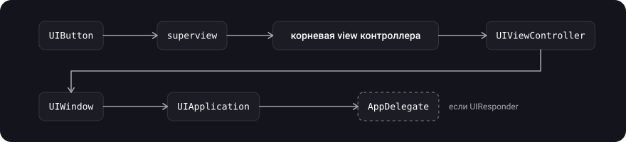
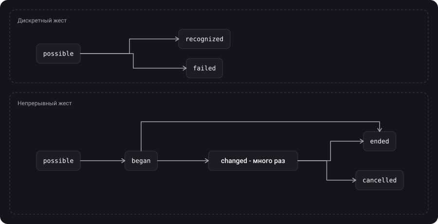
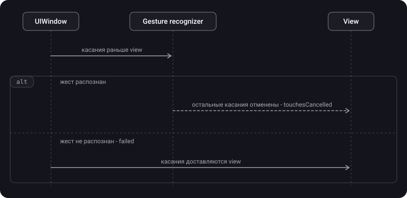

> **Что узнаешь**
>
> - Что такое `UIResponder` и responder chain: кто в ней стоит и в каком порядке
> - Что такое first responder и чем он отличается от «view, в которую попало касание»
> - Как действия (actions) ходят по responder chain и зачем `target: nil`
> - Как устроен `UIControl`: target-action, события, состояния, tracking
> - Как работает `UIGestureRecognizer`: классы, состояния, discrete и continuous
> - Кто получает касания раньше: жест или view, и как разрешать конфликты жестов
> - Когда нужен свой распознаватель жестов

> **Нужно знать заранее:** тутор [06](../touches-hittest/) — `UIEvent`, `UITouch`, `hitTest`; тутор [03](../view-lifecycle/) — `UIViewController` и его view.

## Аналогия: обращение в компании

Ты подаёшь обращение сотруднику. Если он не может его решить, оно идёт к начальнику отдела, потом к директору, потом выше.

- **Responder chain** — эта лестница инстанций: view → её контроллер → окно → приложение.
- **First responder** — тот, к кому обращение пришло первым.
- **`UIControl`** — «окошко с готовой услугой»: ты говоришь, что хочешь (нажатие, изменение значения), а окошко само разбирается с касаниями и зовёт нужного человека.
- **Gesture recognizer** — внимательный секретарь: читает обращение **раньше** сотрудника и решает, его ли это случай (пинч, долгое нажатие). Если секретарь взялся за дело, сотруднику обращение уже не передают.

## Шаг 1. UIResponder и responder chain

> **`UIResponder`** — абстрактный интерфейс для реакции на события и их обработки. Респондеры — основа обработки событий в UIKit-приложении.

Респондеры (по документации Apple): `UIApplication`, `UIViewController`, все `UIView` (включая `UIWindow`), а также `UIScene` и `UIAccessibilityElement`.

**Для каких событий переопределяют методы:**

- касания: `touchesBegan`, `touchesMoved`, `touchesEnded`, `touchesCancelled`;
- нажатия кнопок (press): `pressesBegan`, `pressesChanged`, `pressesEnded`, `pressesCancelled`;
- движения (тряска): `motionBegan`, `motionEnded`, `motionCancelled`;
- remote control: `remoteControlReceived(with:)`.

Если респондер событие не обработал, он пересылает его следующему в **responder chain** — цепочке респондеров. UIKit управляет ею динамически, по заданным правилам. Следующий респондер возвращает свойство `next`.

**Кто за кем стоит (по документации Apple):**

- `UIView`: если это корневая view контроллера, следующий — её контроллер; иначе — её superview.
- `UIViewController`: следующий — superview его view (если контроллер показан модально другим контроллером, то по статье Apple следующим становится presenting view controller).
- `UIWindow`: следующий — `UIApplication`.
- `UIApplication`: следующего нет, но если app delegate — `UIResponder` и ещё не участвовал в обработке, то следующим будет он.



Посмотреть цепочку можно кодом:

```swift
extension UIResponder {
    func printResponderChain() {
        var responder: UIResponder? = self
        while let current = responder {
            print(type(of: current))
            responder = current.next
        }
    }
}

// button.printResponderChain() для экрана, который является rootViewController окна:
// UIButton
// UIView               (корневая view контроллера)
// MyViewController
// UIWindow
// UIApplication
// AppDelegate
```

> Если экран лежит в контейнере (например, `UINavigationController`), между контроллером и окном появятся служебные view и сам контейнер. Точный набор промежуточных типов зависит от версии iOS: опирайся на принцип «цепочка идёт **вверх** по иерархии», а не на конкретные имена служебных классов.

## Шаг 2. First responder

> **First responder** — респондер, который UIKit выбирает первым получателем события. Какой объект им станет, зависит от типа события.

| Тип события | First responder |
| --- | --- |
| Touch (касания) | View, в которой произошло касание (результат hit-testing, тутор [06](../touches-hittest/)) |
| Press (физические кнопки) | Объект в фокусе |
| Shake (тряска), remote control, команды редактирования | Объект, который назначишь ты или UIKit |

**Методы управления first responder (по документации Apple):**

- `canBecomeFirstResponder` — может ли объект им стать.
- `becomeFirstResponder()` — **просит UIKit** сделать объект first responder в его окне.
- `canResignFirstResponder` и `resignFirstResponder()` — готов ли отказаться от этого статуса и уведомление об отказе.
- `isFirstResponder` — является ли он им сейчас.

Классический пример — клавиатура: когда пользователь нажимает на `UITextField` или `UITextView`, view становится first responder и показывает свой input view, то есть системную клавиатуру. Для своей view можно назначить свой `inputView`.

```swift
textField.becomeFirstResponder()      // показать клавиатуру
textField.resignFirstResponder()      // убрать клавиатуру
view.endEditing(true)                 // убрать клавиатуру у любого first responder внутри view
```

## Шаг 3. Действия по responder chain

Responder chain используется не только для событий, но и для **действий (actions)**. Когда у элемента управления цель (target) равна `nil`, UIKit берёт `nil` и идёт вверх по цепочке, пока не найдёт респондера, у которого есть метод с нужным именем. Так, например, работают пункты меню редактирования: `cut`, `copy`, `paste` ищутся по цепочке.

Механика (из заметок и документации Apple):

1. UIKit берёт первого респондера цепочки и спрашивает `canPerformAction(_:withSender:)`: умеет ли он обработать это действие.
2. Если нет, спрашивает следующего через `target(forAction:withSender:)`.
3. Повторяет, пока не найдёт того, кто умеет, или цепочка не закончится. Тогда действие игнорируется.

```swift
open func canPerformAction(_ action: Selector, withSender sender: Any?) -> Bool
open func target(forAction action: Selector, withSender sender: Any?) -> Any?
```

Практический приём — `target: nil`:

```swift
// на кнопке, лежащей где-то внутри контроллера Home или под ним
button.addTarget(nil, action: #selector(HomeViewController.didTapSomething), for: .touchUpInside)

// в HomeViewController
@objc func didTapSomething() {
    // сработает, если HomeViewController есть в responder chain кнопки
}
```

Подписи методов действия: без параметров, с `sender`, или с `sender` и `event` (`UIEvent`). Метод действия должен быть доступен Objective-C runtime (`@objc`).

Отправить своё действие по цепочке из кода:

```swift
UIApplication.shared.sendAction(#selector(HomeViewController.didTapSomething),
                                to: nil, from: self, for: nil)
```

## Шаг 4. UIControl

> **`UIControl`** — базовый класс для элементов управления: визуальных элементов, которые выражают определённое действие или намерение в ответ на взаимодействие пользователя. Кнопки, слайдеры, переключатели — это controls.

- Экземпляры `UIControl` напрямую не создают: это точка расширения для своих controls, а готовые — `UIButton`, `UISwitch`, `UISlider`, `UITextField`, `UISegmentedControl`, `UIStepper` и др.
- `UIControl` наследуется от `UIView`, а значит, и от `UIResponder`.
- Controls сообщают о взаимодействии через механизм **target-action**: вместо того чтобы самому отслеживать касания, ты пишешь метод-действие, а control берёт на себя всю работу по отслеживанию касаний и решает, когда твой метод вызвать.

```swift
button.addTarget(self, action: #selector(saveTapped), for: .touchUpInside)
slider.addTarget(self, action: #selector(valueChanged(_:)), for: .valueChanged)

@objc private func saveTapped() { }
@objc private func valueChanged(_ sender: UISlider) { }
```

С iOS 14 действие можно передать замыканием через `UIAction`:

```swift
let action = UIAction { [weak self] _ in self?.save() }
button.addAction(action, for: .touchUpInside)
```

Цель (target) у `addTarget` обычно — контроллер или его корневая view. `UIControl` не удерживает target сильной ссылкой, а замыкание в `UIAction` удерживает всё, что захватил (`[weak self]`, иначе утечка, тутор [09](../data-passing-appearance/)).

**События `UIControl.Event`:**

| Событие | Когда |
| --- | --- |
| `touchDown` | Пользователь коснулся элемента |
| `touchUpInside` | Палец отпущен внутри границ элемента (обычное «нажатие» кнопки) |
| `touchUpOutside` | Палец отпущен за границами |
| `touchDragInside`, `touchDragOutside`, `touchDragEnter`, `touchDragExit` | Палец перемещается внутри, снаружи, входит или покидает границы |
| `touchCancel` | Система прервала касание |
| `valueChanged` | Изменилось значение (слайдер, переключатель) |
| `primaryActionTriggered` | Сработало основное действие |
| `editingDidBegin`, `editingChanged`, `editingDidEnd`, `editingDidEndOnExit` | События редактирования текстовых полей |

**Состояния (`UIControl.State`).** Состояние определяет внешний вид и то, может ли элемент принимать взаимодействие. Это битовая маска: `normal`, `highlighted`, `disabled`, `selected`, `focused`. Управляют ими свойства `isEnabled`, `isSelected`, `isHighlighted`. Выключил control (`isEnabled = false`) — пользователь не может с ним взаимодействовать.

**Как control ловит касания.** Для своих controls Apple советует всегда использовать методы tracking, а не методы касаний `UIResponder`:

- `beginTracking(_:with:)` — касание вошло в границы control;
- `continueTracking(_:with:)` — касание обновилось;
- `endTracking(_:with:)` — касание закончилось;
- `cancelTracking(with:)` — отслеживание отменено.

Вспомогательные свойства: `isTracking` (идёт ли отслеживание), `isTouchInside` (внутри ли границ сейчас касание). Поэтому кнопка сама понимает «палец ушёл с кнопки» (вспомни тутор [06](../touches-hittest/): `touch.view` не меняется, а control проверяет координаты сам).

```swift
final class RatingControl: UIControl {
    private(set) var rating = 1 {
        didSet {
            sendActions(for: .valueChanged)     // сообщить подписчикам
            setNeedsDisplay()
        }
    }

    override func beginTracking(_ touch: UITouch, with event: UIEvent?) -> Bool {
        updateRating(with: touch)
        return true                              // true — продолжать отслеживание
    }

    override func continueTracking(_ touch: UITouch, with event: UIEvent?) -> Bool {
        updateRating(with: touch)
        return true
    }

    private func updateRating(with touch: UITouch) {
        let x = touch.location(in: self).x
        let value = Int(x / bounds.width * 5) + 1
        rating = min(max(value, 1), 5)           // от 1 до 5
    }
}
```

Если наследуешься от `UIControl` напрямую, внешний вид и состояние нужно поддерживать самому, а действие отправлять при изменении значения (`sendActions(for:)`). Чтобы наблюдать или менять рассылку действий у готового control, переопределяют `sendAction(_:to:for:)`.

## Шаг 5. UIGestureRecognizer

> **Gesture recognizer** отделяет логику распознавания последовательности касаний (или другого ввода) от действия над результатом. Когда он распознаёт распространённый жест (или его изменение), он отправляет сообщение-действие каждому заданному target.

- Распознаватель работает с касаниями, попавшими (hit-test) в конкретную view и все её subviews, поэтому его нужно с ней связать: `view.addGestureRecognizer(_:)`.
- **Распознаватель не участвует в responder chain view.** Он стоит в стороне от обычной цепочки.
- Можно подписать несколько пар target-action; они независимы, а не накапливаются.
- Сигнатуры методов действия: `func handle()` или `func handle(_ sender: UIGestureRecognizer)`. Через `sender` можно спросить детали: `location(in:)`, для pinch — `scale`, для rotation — `rotation`.

**Готовые классы:**

| Класс | Жест | Тип |
| --- | --- | --- |
| `UITapGestureRecognizer` | Тап (в том числе многократный) | Discrete |
| `UISwipeGestureRecognizer` | Свайп в заданном направлении | Discrete |
| `UILongPressGestureRecognizer` | Долгое нажатие | **Continuous** |
| `UIPanGestureRecognizer` | Перетаскивание (скролл в любом направлении) | Continuous |
| `UIScreenEdgePanGestureRecognizer` | Перетаскивание от края экрана (жест «назад») | Continuous |
| `UIPinchGestureRecognizer` | Щипок двумя пальцами (зум) | Continuous |
| `UIRotationGestureRecognizer` | Поворот двумя пальцами | Continuous |

Ещё есть `UIHoverGestureRecognizer` — для указателя, который находится над view.

**Discrete и continuous:**

- **Дискретный** жест случается один раз за последовательность касаний и отправляет одно действие. Работа напоминает кнопку: задал action, он вызовется один раз, когда событие наступило.
- **Непрерывный** жест вызывает action **много раз**, при каждом значимом изменении. `UIPanGestureRecognizer`, например, зовёт action каждый раз, когда палец сдвигается, чтобы ты обновил интерфейс.

```swift
let tap = UITapGestureRecognizer(target: self, action: #selector(handleTap(_:)))
cardView.addGestureRecognizer(tap)

@objc private func handleTap(_ gesture: UITapGestureRecognizer) {
    let point = gesture.location(in: cardView)        // один раз, по факту тапа
}

let pan = UIPanGestureRecognizer(target: self, action: #selector(handlePan(_:)))
cardView.addGestureRecognizer(pan)

private var startCenter = CGPoint.zero

@objc private func handlePan(_ gesture: UIPanGestureRecognizer) {
    switch gesture.state {
    case .began:
        startCenter = cardView.center
    case .changed:                                    // много раз, пока палец двигается
        let t = gesture.translation(in: view)
        cardView.center = CGPoint(x: startCenter.x + t.x, y: startCenter.y + t.y)
    case .ended, .cancelled, .failed:
        break                                         // завершить или откатить
    default:
        break
    }
}
```

**Состояния (`UIGestureRecognizer.State`).** Все распознаватели начинают последовательность касаний в состоянии `possible`.

| Состояние | Что значит |
| --- | --- |
| `possible` | Распознаватель готов к работе, ещё ничего не распознал |
| `began` | Начался непрерывный жест |
| `changed` | Жест изменился (палец сдвинулся); необязательное, может быть много раз |
| `ended` (он же `recognized`) | Жест закончился. Константы `recognized` и `ended` — синонимы |
| `cancelled` | Жест отменён (аналог `touchesCancelled`) |
| `failed` | Жест не распознан (например, ждали два пальца, а коснулся один) |



> Отключить распознаватель можно свойством `isEnabled` (по умолчанию `true`). Если поставить `false`, он перестанет получать события.

## Шаг 6. Жесты и касания: кто получает раньше

Самое важное правило (Apple): **окно доставляет касания распознавателю жестов раньше, чем view, к которой он прикреплён.**

- Если распознаватель проанализировал поток касаний и **не** распознал жест, view получает все касания последовательности целиком.
- Если распознал, остальные касания для view отменяются.

**Связь с hit-testing и responder chain.** Система через `hitTest` находит самую глубокую view под пальцем и собирает все распознаватели в цепочке её superview вплоть до `UIWindow`. Сами распознаватели в responder chain не стоят.



Поведение задают три свойства распознавателя (значения по умолчанию, по Apple, определяют обычный порядок):

| Свойство | Что делает |
| --- | --- |
| `cancelsTouchesInView` | Если жест распознан, оставшиеся касания отвязываются от view; уже доставленные отменяются через `touchesCancelled`. Если не распознан, view получает все касания |
| `delaysTouchesBegan` | Пока распознаватель не провалил распознавание, окно удерживает доставку касаний фазы `began` view. Если он потом распознает жест, view эти касания не получит |
| `delaysTouchesEnded` | То же для фазы `ended`: пока распознаватель не провалился, окно держит эти касания. Если он распознает жест, касания отменяются через `touchesCancelled` |

Кнопка внутри view с `UITapGestureRecognizer`: обычно нажатие на кнопку (одиночный тап) достаётся самой кнопке, а тап-жест на родителе в этот момент не срабатывает. Так описывает архивный Event Handling Guide for UIKit Apps. В текущей документации Apple я этого не нашёл и проверить по ней не смог, поэтому проверь на своём коде.

## Шаг 7. UIGestureRecognizerDelegate: конфликты жестов

Делегат позволяет тонко настроить работу распознавателя и связь между распознавателями. Например, разрешить одновременное распознавание или задать динамическое требование «провала».

| Метод | Когда нужен |
| --- | --- |
| `gestureRecognizerShouldBegin(_:)` | Разрешить или запретить начало распознавания (например, pan только по горизонтали) |
| `gestureRecognizer(_:shouldReceive:)` | Решить, получать ли конкретное касание (например, игнорировать касания по кнопкам) |
| `gestureRecognizer(_:shouldRecognizeSimultaneouslyWith:)` | Разрешить двум распознавателям работать одновременно (pinch и rotation над картинкой) |
| `gestureRecognizer(_:shouldRequireFailureOf:)` и `shouldBeRequiredToFailBy` | Задать «сначала должен провалиться другой» |

**Одиночный и двойной тап на одной view.** Если повесить оба распознавателя, двойной тап сработает как два одиночных. Чтобы этого не было, одиночный должен дождаться провала двойного:

```swift
let singleTap = UITapGestureRecognizer(target: self, action: #selector(handleSingleTap))
let doubleTap = UITapGestureRecognizer(target: self, action: #selector(handleDoubleTap))
doubleTap.numberOfTapsRequired = 2

singleTap.require(toFail: doubleTap)       // одиночный ждёт, что двойной провалится
view.addGestureRecognizer(singleTap)
view.addGestureRecognizer(doubleTap)
```

То же можно сделать через методы делегата; `require(toFail:)` проще, когда зависимость постоянная. Делегат нужен, когда зависимость динамическая.

```swift
extension ViewController: UIGestureRecognizerDelegate {
    func gestureRecognizer(_ gestureRecognizer: UIGestureRecognizer,
                           shouldRecognizeSimultaneouslyWith other: UIGestureRecognizer) -> Bool {
        true                                   // например, pinch и rotation вместе
    }

    func gestureRecognizerShouldBegin(_ gestureRecognizer: UIGestureRecognizer) -> Bool {
        guard let pan = gestureRecognizer as? UIPanGestureRecognizer else { return true }
        let velocity = pan.velocity(in: view)
        return abs(velocity.x) > abs(velocity.y)   // начать, только если движение в основном горизонтальное
    }
}
```

## Шаг 8. Когда нужен свой распознаватель

Когда готовые не справляются с задачей. Например, нужен свой жест («галочка») или свой непрерывный распознаватель для силы нажатия.

- Нужно создать подкласс `UIGestureRecognizer` и импортировать модуль `UIKit.UIGestureRecognizerSubclass`: он делает свойство `state` записываемым и объявляет методы, которые подкласс должен переопределять или вызывать.
- Подкласс **обязан** выставлять `state` при переходах и периодически сбрасывать его, переопределяя `reset()`.

```swift
import UIKit.UIGestureRecognizerSubclass

// распознаёт движение пальцем вниз на 100 pt без сильного отклонения в сторону
final class SwipeDownRecognizer: UIGestureRecognizer {
    private var startPoint = CGPoint.zero

    override func touchesBegan(_ touches: Set<UITouch>, with event: UIEvent) {
        guard touches.count == 1, let touch = touches.first else {
            state = .failed                       // не один палец — не наш жест
            return
        }
        startPoint = touch.location(in: view)
    }

    override func touchesMoved(_ touches: Set<UITouch>, with event: UIEvent) {
        guard let touch = touches.first else { return }
        let point = touch.location(in: view)
        if abs(point.x - startPoint.x) > 50 {
            state = .failed                       // ушли в сторону
        } else if point.y - startPoint.y > 100 {
            state = .recognized                   // дискретный жест распознан
        }
    }

    override func reset() {
        startPoint = .zero                        // подготовиться к следующей попытке
    }
}
```

## Шаг 9. Что выбрать

| Задача | Инструмент |
| --- | --- |
| Нажатие кнопки, изменение значения, ввод текста | `UIControl` с target-action или `UIAction` |
| Тап, свайп, pan, pinch, долгое нажатие по произвольной view | Готовый gesture recognizer |
| Нестандартный жест | Свой подкласс `UIGestureRecognizer` |
| Рисование пальцем, совсем нестандартная обработка касаний | Переопределение `touchesBegan` и остальных (тутор [06](../touches-hittest/)) |
| Передать действие вверх по иерархии | Action с `target: nil` по responder chain |
| Показать или убрать клавиатуру | `becomeFirstResponder`, `resignFirstResponder`, `endEditing(_:)` |

## Типичные ошибки

- Думать, что `becomeFirstResponder` «заставляет» получать все события: это просьба, и для касаний первым получателем остаётся view из hit-testing.
- Пытаться через `target: nil` достучаться до экрана «сбоку» (например, до корневого контроллера навигационного стека): цепочка идёт только вверх.
- Забыть `@objc` у метода-действия для `#selector`.
- Создавать `UIControl` напрямую вместо готового подкласса или своего наследника.
- Использовать методы касаний `UIResponder` в подклассе `UIControl` вместо `beginTracking` и остальных.
- Называть `UILongPressGestureRecognizer` дискретным: он непрерывный, и action вызывается несколько раз.
- Не обработать `cancelled` и `failed` в непрерывном жесте: интерфейс остаётся в промежуточном состоянии.
- Повесить одиночный и двойной тап без `require(toFail:)`: двойной сработает как два одиночных.
- Забыть `view.addGestureRecognizer` (распознаватель нужно связать с view).
- Держать сильную ссылку на контроллер в замыкании `UIAction`: утечка.
- Вешать распознаватель на `UILabel` или `UIImageView` и забыть `isUserInteractionEnabled = true` (тутор [06](../touches-hittest/)).
- Не импортировать `UIKit.UIGestureRecognizerSubclass` в подклассе распознавателя и не переопределять `reset()`.

<details>
<summary>Почему жест на родителе не срабатывает, когда нажимаешь на кнопку внутри?</summary>

Кнопка — `UIControl`, и обычно её действие по умолчанию (одиночное нажатие) имеет приоритет над тап-жестом на родителе (так описывает архивный Event Handling Guide; сверь на практике). Чтобы родитель получил тап, нужно перехватить касание иначе: например, поставить распознавателю делегата и решить через `gestureRecognizer(_:shouldReceive:)`, или сделать тап-зоной не сам родитель.

</details>

## Шпаргалка

```swift
// Responder chain (вверх): view -> superview ... -> VC -> window -> UIApplication -> AppDelegate
responder.next

// First responder
textField.becomeFirstResponder(); textField.resignFirstResponder(); view.endEditing(true)
// touch-события -> view из hit-testing; isFirstResponder -> клавиатура, команды редактирования

// Action по цепочке
button.addTarget(nil, action: #selector(Home.didTap), for: .touchUpInside)   // @objc в Home
// идёт ВВЕРХ: контейнеры, presenting, AppDelegate; не к соседям

// UIControl
control.addTarget(self, action: #selector(tapped), for: .touchUpInside)
control.addAction(UIAction { _ in }, for: .valueChanged)    // iOS 14+
beginTracking / continueTracking / endTracking / cancelTracking
sendActions(for: .valueChanged)
UIControl.State: normal, highlighted, disabled, selected, focused

// Gestures
view.addGestureRecognizer(UITapGestureRecognizer(target: self, action: #selector(tap)))
// discrete: Tap, Swipe   continuous: Pan, ScreenEdgePan, Pinch, Rotation, LongPress
// states: possible -> began -> changed* -> ended | cancelled ; possible -> failed
// discrete: possible -> recognized | failed
singleTap.require(toFail: doubleTap)
delegate: gestureRecognizerShouldBegin / shouldRecognizeSimultaneouslyWith / shouldReceive / shouldRequireFailureOf
// gesture получает касания РАНЬШЕ view; cancelsTouchesInView, delaysTouchesBegan/Ended
```

## Вопросы для самопроверки

<details>
<summary>1. Что такое responder chain и в каком порядке в ней стоят респондеры?</summary>

Цепочка респондеров, по которой необработанное событие передаётся вверх. Порядок задаёт свойство `next`: view → её контроллер (если это корневая view) или superview → контроллер → superview его view → окно → `UIApplication` → `AppDelegate` (если он `UIResponder`).

</details>

<details>
<summary>2. Чем first responder отличается от view, получившей касание?</summary>

Для touch-события first responder — view из hit-testing. Но `isFirstResponder == true` имеет объект, получающий клавиатуру и команды редактирования (например, поле ввода). `becomeFirstResponder` лишь просит UIKit сделать объект таким.

</details>

<details>
<summary>3. Что значит target: nil у action и куда такое действие дойдёт?</summary>

UIKit идёт вверх по responder chain, пока не найдёт респондера с методом нужного имени (через `canPerformAction` и `target(forAction:withSender:)`). Дойдёт только до предков в цепочке: родительских контейнеров, presenting-контроллера, `AppDelegate`. До экранов «сбоку» (например, корня навигационного стека) не дойдёт.

</details>

<details>
<summary>4. Как UIControl сообщает о действиях пользователя?</summary>

Через target-action: `addTarget(_:action:for:)` или `addAction(_:for:)` (iOS 14+) на нужное событие (`touchUpInside`, `valueChanged` и др.). Касания control отслеживает сам через `beginTracking` и остальные методы tracking.

</details>

<details>
<summary>5. Чем discrete жест отличается от continuous? К какому типу относится long press?</summary>

Discrete случается один раз за последовательность касаний и шлёт одно действие (tap, swipe). Continuous шлёт действие при каждом изменении (pan, pinch, rotation). Long press — continuous: `began` после удержания, `changed` при движении, `ended` при отпускании.

</details>

<details>
<summary>6. Кто получает касания раньше — view или gesture recognizer?</summary>

Gesture recognizer. Окно доставляет касания распознавателю до view. Если распознаватель не распознал жест, view получает все касания; если распознал, остальные касания для view отменяются (`cancelsTouchesInView`).

</details>

<details>
<summary>7. Как сделать, чтобы одиночный тап не срабатывал при двойном?</summary>

`singleTap.require(toFail: doubleTap)`. Одиночный распознаватель будет ждать, что двойной провалится, и только тогда сработает. Динамические зависимости задают через `shouldRequireFailureOf` в делегате.

</details>

## Источники

- [UIResponder — Apple Developer Documentation](https://developer.apple.com/documentation/uikit/uiresponder)
- [next — Apple Developer Documentation](https://developer.apple.com/documentation/uikit/uiresponder/next)
- [Using responders and the responder chain to handle events — Apple Developer Documentation](https://developer.apple.com/documentation/uikit/using-responders-and-the-responder-chain-to-handle-events)
- [UIControl — Apple Developer Documentation](https://developer.apple.com/documentation/uikit/uicontrol)
- [UIGestureRecognizer — Apple Developer Documentation](https://developer.apple.com/documentation/uikit/uigesturerecognizer)
- [UIGestureRecognizerDelegate — Apple Developer Documentation](https://developer.apple.com/documentation/uikit/uigesturerecognizerdelegate)
- [UILongPressGestureRecognizer — Apple Developer Documentation](https://developer.apple.com/documentation/uikit/uilongpressgesturerecognizer)
- [Обработка жестов в iOS — Habr](https://habr.com/ru/articles/584100/)
- [Responder Chain, или как правильно передавать действия пользователя между компонентами — Habr](https://habr.com/ru/companies/psb/articles/597759/)
- [iOS Responder Chain или Что спрашивают на собеседовании — temofeev.ru](https://temofeev.ru/info/articles/ios-responder-chain-ili-chto-sprashivayut-na-sobesedovanii/)
- [UIGestureRecognizer теория, практика, кастомизация — Medium (Яндекс Карты)](https://medium.com/yandex-maps-mobile/uigesturerecognizer-tutorial-83f2128e479d)
- [Responder chain and Hit testing \| SWIFT — YouTube](https://www.youtube.com/watch?v=xzzvV1WUfms)
