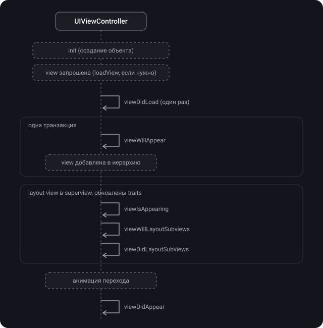
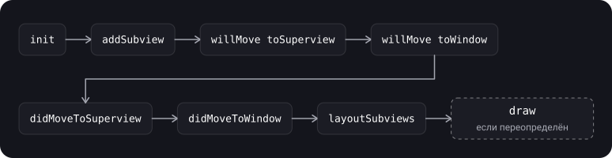

> **Что узнаешь**
>
> - За что отвечает `UIViewController` и как лениво создаётся его view
> - Полный порядок методов жизненного цикла и что в каком из них делать
> - Чем `viewIsAppearing` отличается от `viewWillAppear` и почему это лучшее место для настройки геометрии
> - Когда вызываются `viewWillLayoutSubviews` и `viewDidLayoutSubviews` и почему много раз
> - Что происходит при повороте экрана и смене размера (`viewWillTransition`)
> - Жизненный цикл самой `UIView`: `willMove`, `didMoveToSuperview`, `didMoveToWindow`
> - Как скрыть tab bar правильно

> **Нужно знать заранее:** тутор [01](../uiview-window-coordinates/) — `UIView`, иерархия view, `UIWindow`; тутор [02](../calayer-drawing/) — `CALayer`, `draw(_:)`.

## Аналогия: спектакль в театре

Контроллер — режиссёр, view — декорации на сцене.

- **`loadView`** и **`viewDidLoad`** — привезли и собрали декорации, расставили реквизит. Делается один раз, когда декорации впервые понадобились (лениво).
- **`viewWillAppear`** — актёры стоят у кулис. Сцена ещё пуста.
- **`viewIsAppearing`** — декорации уже стоят на сцене, свет выставлен, размеры известны, но занавес ещё закрыт.
- **`viewDidAppear`** — занавес открыт, зрители смотрят.
- **`viewWillDisappear`** и **`viewDidDisappear`** — актёры уходят со сцены, занавес закрылся.
- **`deinit`** — спектакль снят с репертуара, декорации разобрали.
- Один и тот же спектакль можно играть много раз подряд: декорации собирают один раз, а выходы на сцену повторяются.

## Шаг 1. Что делает UIViewController

> **`UIViewController`** — объект, который управляет иерархией представлений UIKit-приложения. Корневая view лежит в его свойстве `view`.

**Основные обязанности контроллера (по документации Apple):**

- обновлять содержимое view, обычно в ответ на изменения данных;
- реагировать на действия пользователя во view;
- менять размеры view и управлять раскладкой всего интерфейса;
- координироваться с другими объектами, включая другие контроллеры.

- Контроллер — `UIResponder`: он встаёт в responder chain между корневой view и её superview (тутор [07](../responder-chain-gestures/)).
- **Корневая view получает размер от владельца:** это либо родительский контроллер, либо окно (для корневого контроллера окна).
- **Контроллер — единственный владелец своей view и её subviews.** Делить одну view между двумя контроллерами нельзя.
- **View создаётся лениво:** первый доступ к `view` создаёт или загружает её. До этого `view` — `nil`, а `isViewLoaded` возвращает `false`.

> Если нужно обратиться к view, не создавая её, используй `viewIfLoaded` или `isViewLoaded`. Обращение к `view` заставит контроллер загрузить интерфейс.

## Шаг 2. Как создаётся view контроллера

Способов три, результат один: корневая view оказывается в свойстве `view`.

| Способ | Какой инициализатор | Когда |
| --- | --- | --- |
| Storyboard | `init(coder:)` | Контроллер создаётся из storyboard (Apple называет этот способ предпочтительным) |
| Nib (xib) | `init(nibName:bundle:)` | Экран описан в nib-файле, контроллер создаётся из кода |
| Код | свой `init`, view создаётся в `loadView()` или в `viewDidLoad()` | Вся вёрстка в коде |

> **`loadView()`** — метод, который создаёт корневую view контроллера. Его вызывает сам контроллер, когда у него запросили `view`, а она `nil`.

- **Никогда не вызывай `loadView()` напрямую.**
- Переопределяй только если собираешь корневую view **целиком из кода**: создай view и присвой её свойству `view`. **Не вызывай `super.loadView()`** в таком случае.
- Если экран сделан в Interface Builder, `loadView()` переопределять **нельзя**.
- Если `loadView()` не переопределён и нет nib, контроллер создаёт обычную пустую `UIView`.
- Для дополнительной настройки view используй `viewDidLoad()`.

```swift
final class ProfileViewController: UIViewController {
    private let profileView = ProfileView()   // своя UIView-подкласс (тутор 01)

    override func loadView() {
        view = profileView                    // без super.loadView()
    }

    override func viewDidLoad() {
        super.viewDidLoad()
        // дополнительная настройка: делегаты, подписки, данные
        profileView.onTapEdit = { [weak self] in self?.showEditor() }
    }

    private func showEditor() { /* ... */ }
}
```

## Шаг 3. Порядок методов жизненного цикла

Порядок первого показа контроллера (по документации Apple):



| Метод | Когда вызывается | Сколько раз |
| --- | --- | --- |
| `init(coder:)` / `init(nibName:bundle:)` / свой `init` | Создание контроллера | Один раз |
| `loadView()` | View запросили, а её ещё нет | Один раз (после освобождения view — снова) |
| `viewDidLoad()` | После того как view загружена в память | Один раз на загрузку view |
| `viewWillAppear(_:)` | Перед тем как view добавят в иерархию | Каждый показ |
| `viewIsAppearing(_:)` | После добавления в иерархию и layout от superview; traits и геометрия актуальны | Один раз за каждый показ |
| `viewWillLayoutSubviews()` | Перед раскладкой subviews | Много раз (каждый `layoutSubviews`) |
| `viewDidLayoutSubviews()` | После раскладки subviews | Много раз |
| `viewDidAppear(_:)` | После того как view появилась и переход завершился | Каждый показ |
| `viewWillDisappear(_:)` | Перед тем как view уберут из иерархии | Каждое скрытие |
| `viewDidDisappear(_:)` | После того как view убрали | Каждое скрытие |

Что напечатается при **первом** показе, если в каждом методе стоит `print`?

```swift
// loadView (если переопределён)
// viewDidLoad
// viewWillAppear
// viewIsAppearing
// viewWillLayoutSubviews
// viewDidLayoutSubviews
// viewDidAppear
```

<details>
<summary>А при втором показе (вернулись на экран назад)?</summary>

`viewWillAppear`, `viewIsAppearing`, затем при необходимости пара `viewWillLayoutSubviews` и `viewDidLayoutSubviews`, затем `viewDidAppear`. `loadView` и `viewDidLoad` не вызываются повторно: view уже загружена и живёт вместе с контроллером. Пара layout-методов может и не вызваться, если раскладка не менялась, а вот `viewIsAppearing` вызывается в любом случае.

</details>

## Шаг 4. Что делать в каждом методе

| Метод | Что сюда | Чего не делать |
| --- | --- | --- |
| `viewDidLoad` | Разовая настройка: добавить subviews, констрейнты, назначить delegate и dataSource, подписки, первичные данные | Полагаться на финальные размеры и геометрию: их ещё нет |
| `viewWillAppear` | Действия, которые нужно сделать **до** начала перехода: доступ к `transitionCoordinator` для alongside-анимаций; парные подписки (регистрация здесь, отписка в `viewDidDisappear`), не зависящие от геометрии | Настраивать view по размеру или traits: они ещё не актуальны |
| `viewIsAppearing` | Обновление view по traits и геометрии; скролл к нужной ячейке перед показом; расчёты, которым нужен размер | Тяжёлые вычисления: метод в той же транзакции, что и `viewWillAppear` |
| `viewDidAppear` | Запуск анимаций, видео или звука, запуск сбора данных (сеть) | Менять внешний вид, который пользователь уже видит: будет заметный «прыжок» |
| `viewWillDisappear` | Сохранить изменения или состояние | Останавливать то, что ещё нужно пока экран виден |
| `viewDidDisappear` | Остановить задачи, которые не нужны без экрана: подписки на уведомления, наблюдение за датчиками, сетевые вызовы | Выполнять тяжёлую работу: переход уже закончен |

> Во всех переопределениях **вызывай `super`**. Не у каждого `will` есть «парный» `did` (переход может быть отменён, например жестом возврата). Если процесс запущен в `will`, завершай его и в соответствующем `did`, и в противоположном `will` (Apple).

## Шаг 5. viewIsAppearing — лучшее место для настройки view

> **`viewIsAppearing(_:)`** — колбэк, который система вызывает после того, как view контроллера добавлена в иерархию и разложена superview. К этому моменту у контроллера и view актуальные trait collections и корректная геометрия (размер, safe area).

- Вызывается **после** `viewWillAppear` и **до** `viewDidAppear`, в одной транзакции (`CATransaction`) с `viewWillAppear`: изменения в любом из двух методов пользователь увидит одновременно.
- Вызывается **один раз** за появление, даже если layout не требуется. Layout-колбэки (`viewWillLayoutSubviews` и `viewDidLayoutSubviews`) могут срабатывать много раз.
- Apple рекомендует использовать его вместо `viewWillAppear` почти во всех случаях, где нужно обновить view.

| Состояние на момент колбэка | `viewWillAppear` | `viewIsAppearing` |
| --- | --- | --- |
| Доступен transition coordinator для alongside-анимаций | Да | Нет |
| View добавлена в иерархию | Нет | Да |
| Trait collections обновлены | Нет | Да |
| Геометрия (размер, safe area) точна | Нет | Да |

```swift
override func viewIsAppearing(_ animated: Bool) {
    super.viewIsAppearing(animated)

    // размеры collectionView уже актуальны — можно считать позицию скролла
    if let indexPath = selectedIndexPath {
        collectionView.scrollToItem(at: indexPath,
                                    at: .centeredVertically,
                                    animated: false)
    }
}
```

## Шаг 6. Layout-колбэки: viewWillLayoutSubviews и viewDidLayoutSubviews

Система вызывает их **каждый раз**, когда view контроллера выполняет `layoutSubviews()`: при смене размера, повороте, смене констрейнтов. За один показ это может произойти **несколько раз**, а также в любой момент, пока view видна.

- **`viewWillLayoutSubviews()`** — view вот-вот разложит subviews. Bounds корневой view здесь уже окончательные (первый такой момент).
- **`viewDidLayoutSubviews()`** — раскладка закончена; можно донастроить то, что зависит от финальных frame.

```swift
private let gradient = CAGradientLayer()

override func viewDidLayoutSubviews() {
    super.viewDidLayoutSubviews()
    gradient.frame = headerView.bounds          // слой не участвует в Auto Layout (тутор 02)
}
```

> В layout-колбэках делай только лёгкую работу: они вызываются часто. Не вызывай здесь `setNeedsLayout()` на той же view и не меняй констрейнты так, чтобы они снова запускали layout: получится бесконечный цикл (тутор [05](../autolayout-layout-pass/)).

## Шаг 7. Поворот и смена размера: viewWillTransition

Начиная с iOS 8 методы поворота (`willRotate`, `didRotate` и др.) **deprecated**. Поворот — это **изменение размера** view контроллера, о котором сообщает `viewWillTransition(to:with:)`.

- UIKit вызывает метод **до** изменения размера view. UIKit зовёт его у корневого контроллера окна, а тот передаёт вниз по иерархии контроллеров.
- В параметре `coordinator` можно анимировать свои изменения вместе с переходом.
- Всегда вызывай `super`, чтобы UIKit передал сообщение дальше.

```swift
override func viewWillTransition(to size: CGSize,
                                 with coordinator: any UIViewControllerTransitionCoordinator) {
    super.viewWillTransition(to: size, with: coordinator)

    coordinator.animate(alongsideTransition: { _ in
        // анимация вместе с поворотом: подгоняем интерфейс под новый size
        self.headerHeightConstraint.constant = size.width > size.height ? 60 : 120
        self.view.layoutIfNeeded()
    }, completion: { _ in
        // переход завершён
    })
}
```

## Шаг 8. Память: didReceiveMemoryWarning и deinit

> **`didReceiveMemoryWarning()`** — вызывается, когда система определила, что свободной памяти мало. Переопредели его, чтобы освободить лишнюю память, и вызови `super`. Сам метод не вызывай.

```swift
override func didReceiveMemoryWarning() {
    super.didReceiveMemoryWarning()
    imageCache.removeAllObjects()      // освобождаем то, что можно пересоздать
}
```

> **`deinit`** — деинициализатор Swift: вызывается, когда контроллер освобождается (на него не осталось strong-ссылок). Это не метод жизненного цикла view.

- Быстрая проверка утечек: добавь `deinit { print("\(Self.self) deinit") }` и закрой экран. Нет сообщения — контроллер кто-то удерживает (retain cycle через замыкание, delegate со strong-ссылкой и т.п., тутор [09](../data-passing-appearance/)).
- Контроллер, закрытый жестом возврата, но не освободившийся, — типовой симптом утечки.

## Шаг 9. Жизненный цикл UIView

У самой view свои колбэки: они сообщают об изменении иерархии, и их используют в собственных подклассах.

| Метод | Что сообщает | Примечание |
| --- | --- | --- |
| `init(frame:)` / `init(coder:)` | Создание view | Общая настройка в одном месте (тутор [01](../uiview-window-coordinates/)) |
| `willMove(toSuperview:)` | Superview вот-вот изменится; аргумент `nil`, если view убирают | Реализация по умолчанию ничего не делает |
| `willMove(toWindow:)` | Окно view вот-вот изменится | Аргумент `nil`, если view покидает окно |
| `didMoveToSuperview()` | Superview изменился (добавили или убрали) | Удобно для настройки, которой нужен superview |
| `didMoveToWindow()` | Окно view изменилось | `window` может быть `nil`: view убрали или добавили в superview, который не в окне |
| `layoutSubviews()` | Раскладка subviews | Не вызывай напрямую: `setNeedsLayout()` или `layoutIfNeeded()` (тутор [05](../autolayout-layout-pass/)) |
| `draw(_:)` | Рисование содержимого | Не вызывай напрямую: `setNeedsDisplay()` (тутор [02](../calayer-drawing/)) |

Типичный порядок при добавлении view в уже показанный superview (наблюдаемый на практике; Apple его явно не гарантирует):



```swift
final class ClockView: UIView {
    private var timer: Timer?

    override func didMoveToWindow() {
        super.didMoveToWindow()
        if window != nil {
            // view на экране — запускаем обновления
            timer = Timer.scheduledTimer(withTimeInterval: 1, repeats: true) { [weak self] _ in
                self?.setNeedsDisplay()
            }
        } else {
            // view ушла с экрана — останавливаем
            timer?.invalidate()
            timer = nil
        }
    }
}
```

## Шаг 10. Дочерние контроллеры (контейнеры)

Контроллер может держать другие контроллеры как **child** — так устроены `UINavigationController`, `UITabBarController`. Документация Apple требует: связать child с родителем **до** добавления его view в иерархию, а после удаления view — разорвать связь. Так UIKit корректно маршрутизирует события и колбэки появления.

```swift
// добавить child
addChild(child)
view.addSubview(child.view)
child.view.frame = containerView.bounds
child.didMove(toParent: self)

// убрать child
child.willMove(toParent: nil)
child.view.removeFromSuperview()
child.removeFromParent()
```

- По умолчанию колбэки появления и поворота **автоматически пробрасываются** детям.
- Методы `addChild`, `removeFromParent`, `willMove(toParent:)`, `didMove(toParent:)` нужны только реализации контейнера, не клиентам.

## Шаг 11. Почему view исчезла: isBeingPresented и другие

Один и тот же `viewDidDisappear` вызывается и при переходе вперёд, и при закрытии экрана. Чтобы различить, есть флаги:

| Свойство | Когда `true` |
| --- | --- |
| `isBeingPresented` | Контроллер в процессе показа модально |
| `isBeingDismissed` | Контроллер закрывают (dismiss) его предки |
| `isMovingToParent` | Контроллер добавляют в родителя (например, push в navigation) |
| `isMovingFromParent` | Контроллер убирают из родителя (например, pop) |

```swift
override func viewDidDisappear(_ animated: Bool) {
    super.viewDidDisappear(animated)
    if isMovingFromParent || isBeingDismissed {
        // экран закрыт навсегда, а не просто перекрыт другим
        cleanUp()
    }
}
```

<details>
<summary>Почему после закрытия sheet у контроллера не вызывается viewWillAppear?</summary>

Показ поверх контроллера делится по стилю. При `fullScreen` view презентующего контроллера убирается из иерархии после показа, и у него приходят `viewWillDisappear` и `viewDidDisappear`, а при закрытии — `viewWillAppear` и `viewDidAppear`. При `overFullScreen` (и при sheet-стилях вроде `pageSheet`) view презентующего остаётся в иерархии: по документации Apple это сказано для `overFullScreen`, а на практике то же видно у card-стиля sheet, поэтому колбэки появления у нижнего экрана не приходят. Если нужно реагировать на закрытие sheet, используй `presentationControllerDidDismiss` (делегат `UIAdaptivePresentationControllerDelegate`) или замыкание и уведомляй владельца явно.

</details>

## Шаг 12. Скрываем tab bar

```swift
// Способ 1: при push, до показа экрана
let detail = DetailViewController()
detail.hidesBottomBarWhenPushed = true
navigationController?.pushViewController(detail, animated: true)

// Способ 2: iOS 18+, явно скрыть или показать
if #available(iOS 18.0, *) {
    tabBarController?.setTabBarHidden(true, animated: true)
}
```

## Типичные ошибки

- Настраивать view по размерам в `viewDidLoad` или `viewWillAppear`: геометрия ещё не финальная; используй `viewIsAppearing` или layout-колбэки.
- Забыть `super` в переопределениях методов жизненного цикла.
- Вызывать `super.loadView()` при своей реализации `loadView()` или переопределять `loadView()` у экрана из Interface Builder.
- Обращаться к `view` в `init`: это загрузит view раньше времени.
- Запускать подписки или таймеры в `viewDidLoad` и не останавливать: на втором показе задвоятся или будут жить без экрана. Парные действия: старт в `viewWillAppear` и стоп в `viewDidDisappear`.
- Тяжёлая работа в `viewWillLayoutSubviews` и `viewDidLayoutSubviews`: они вызываются много раз.
- Рассчитывать, что `viewDidLoad` вызывается при каждом показе: он вызывается один раз на загрузку view.
- Считать `viewWillTransition` событием «после поворота».
- Анимировать `tabBar.frame` вручную вместо `hidesBottomBarWhenPushed` и `setTabBarHidden`.
- Не проверять `deinit` у закрытого экрана: утечки остаются незамеченными.

<details>
<summary>Почему иногда в viewDidLoad уже есть верные размеры, а иногда нет?</summary>

В `viewDidLoad` размеры и traits только предсказаны системой, у корневой view они могут совпадать с окончательными, а могут нет (зависит от контейнера, safe area, поворота). Гарантия есть только после `viewIsAppearing`: view добавлена в иерархию и разложена. Поэтому всё, что зависит от размера, выносят туда или в layout-колбэки.

</details>

## Шпаргалка

```swift
// Порядок первого показа
// [init] -> loadView* -> viewDidLoad (1 раз)
// -> viewWillAppear -> viewIsAppearing -> viewWillLayoutSubviews -> viewDidLayoutSubviews -> viewDidAppear
// Скрытие: viewWillDisappear -> viewDidDisappear;  затем deinit, если нет ссылок
// * loadView только если создаём корневую view в коде (без super.loadView())

// Куда что
viewDidLoad()        // разовая настройка (subviews, constraints, delegates)
viewWillAppear(_:)   // парные подписки, transitionCoordinator
viewIsAppearing(_:)  // настройка по traits и геометрии, скролл к ячейке
viewDidAppear(_:)    // анимации, видео, сеть
viewWillDisappear(_:)// сохранить состояние
viewDidDisappear(_:) // остановить задачи, подписки

// Размер и поворот
viewWillTransition(to:with:)   // ДО смены размера; вызвать super; анимация в coordinator

// Память
didReceiveMemoryWarning()      // освободить пересоздаваемое; вызвать super
deinit { }                     // проверка, что контроллер освободился

// Причина ухода
isBeingPresented / isBeingDismissed / isMovingToParent / isMovingFromParent

// UIView
willMove(toSuperview:) / willMove(toWindow:) / didMoveToSuperview() / didMoveToWindow()
// removeFromSuperview() — действие, а не колбэк

// Tab bar
vc.hidesBottomBarWhenPushed = true       // до push
tabBarController?.setTabBarHidden(true, animated: true)   // iOS 18+
```

## Вопросы для самопроверки

<details>
<summary>1. В каком порядке вызываются методы жизненного цикла при первом показе контроллера?</summary>

`loadView` (если переопределён) → `viewDidLoad` → `viewWillAppear` → `viewIsAppearing` → `viewWillLayoutSubviews` → `viewDidLayoutSubviews` → `viewDidAppear`. Layout-пара может повторяться.

</details>

<details>
<summary>2. Чем viewDidLoad отличается от viewWillAppear?</summary>

`viewDidLoad` вызывается один раз, когда view загружена в память; геометрия ещё не финальная. `viewWillAppear` вызывается перед каждым показом. Оба не подходят для настройки по размерам: для этого `viewIsAppearing`.

</details>

<details>
<summary>3. Чем viewIsAppearing лучше viewWillAppear для настройки view?</summary>

К моменту `viewIsAppearing` view уже в иерархии и разложена superview; traits и геометрия (размер, safe area) актуальны. Метод в той же транзакции, что и `viewWillAppear`, поэтому изменения видны одновременно. Вызывается один раз за показ. Back-deploys до iOS 13.

</details>

<details>
<summary>4. Почему viewDidLayoutSubviews вызывается много раз?</summary>

Он срабатывает при каждом `layoutSubviews()` корневой view: смена размера, поворот, смена констрейнтов, в любой момент, пока view видна. Поэтому в нём делают только лёгкую работу.

</details>

<details>
<summary>5. Когда вызывается viewWillTransition(to:with:) и что нужно сделать в переопределении?</summary>

Перед изменением размера view контроллера (в частности, при повороте). Нужно вызвать `super`, а анимации, связанные с переходом, выполнять через `coordinator.animate(alongsideTransition:completion:)`.

</details>

<details>
<summary>6. Что не так с вызовом removeFromSuperview как «колбэка жизненного цикла view»?</summary>

Это действие, которое вызываешь ты. View при этом получает колбэки `willMove(toSuperview: nil)`, `willMove(toWindow: nil)`, `didMoveToSuperview()` и `didMoveToWindow()`.

</details>

<details>
<summary>7. Как проверить, что закрытый экран освободился из памяти?</summary>

Добавить `deinit` с `print`. Если после закрытия экрана сообщение не появилось, контроллер кто-то удерживает (retain cycle).

</details>

## Источники

- [UIViewController — Apple Developer Documentation](https://developer.apple.com/documentation/uikit/uiviewcontroller)
- [viewIsAppearing(_:) — Apple Developer Documentation](https://developer.apple.com/documentation/uikit/uiviewcontroller/viewisappearing(_:))
- [loadView() — Apple Developer Documentation](https://developer.apple.com/documentation/uikit/uiviewcontroller/loadview())
- [didReceiveMemoryWarning() — Apple Developer Documentation](https://developer.apple.com/documentation/uikit/uiviewcontroller/didreceivememorywarning())
- [viewWillTransition — Apple Developer Documentation](https://developer.apple.com/documentation/uikit/uicontentcontainer/viewwilltransition(to:with:))
- [layoutSubviews() — Apple Developer Documentation](https://developer.apple.com/documentation/uikit/uiview/layoutsubviews())
- [didMoveToWindow() — Apple Developer Documentation](https://developer.apple.com/documentation/uikit/uiview/didmovetowindow())
- [hidesBottomBarWhenPushed — Apple Developer Documentation](https://developer.apple.com/documentation/uikit/uiviewcontroller/hidesbottombarwhenpushed)
- [setTabBarHidden — Apple Developer Documentation](https://developer.apple.com/documentation/uikit/uitabbarcontroller/settabbarhidden(_:animated:))
- [What’s new in UIKit — WWDC23 (Apple)](https://developer.apple.com/videos/play/wwdc2023/10055/)
- [Жизненный цикл UIViewController — Habr](https://habr.com/ru/articles/654517/)
- [Жизненный цикл UIViewController в 2025 году: что изменилось и что устарело — Habr](https://habr.com/ru/articles/943778/)
- [UIViewController lifecycle — sparrowcode.io](https://sparrowcode.io/ru/tutorials/uiviewcontroller-lifecycle)
- [Вопросы с собеседований: жизненный цикл UIViewController — apptractor](https://apptractor.ru/info/techhype/voprosy-s-sobesedovaniy-zhiznennyy-tsikl-uiviewcontroller.html?ysclid=m1dqwmrc9p527680475)
